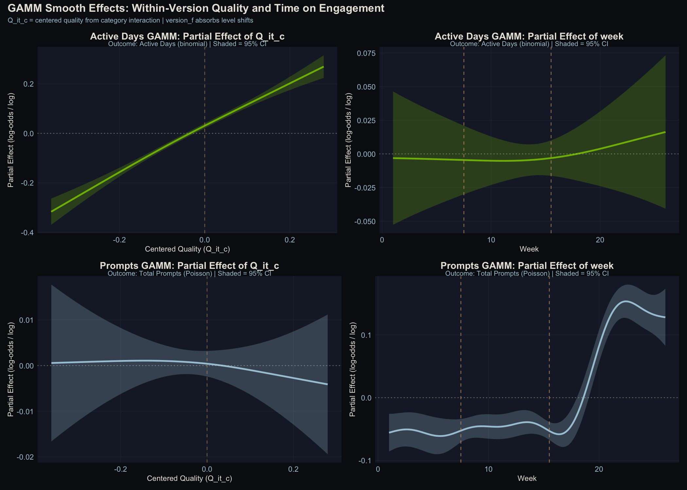
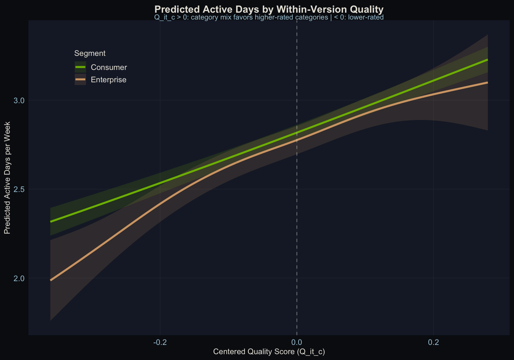

<!--more-->

*Article by John Tribbia*

Every AI company tells the same story: we made our model smarter, so people used it more. It sounds obvious. But when you try to prove it with data, it falls apart almost immediately.

Here's the problem. When a company rolls out a new AI model, everything else changes too. There's a press cycle. New features ship alongside it. Marketing ramps up. Maybe it's the start of a new quarter and everyone's trying to hit goals. Engagement goes up, sure, but claiming the *model* caused that is like saying your umbrella made it rain.

I wanted to build a way to actually test this. Not with a fancy A/B experiment (most companies don't run those on model upgrades), but with a statistical method that works on the messy data companies already have.

## The Key Insight: Same Model, Different Experience

The trick is surprisingly intuitive. Even when everyone is on the same AI model, not everyone gets the same quality of experience.

Think about it. A software engineer mostly asks the AI to write code. A novelist uses it for creative writing. A student uses it for math homework. And AI models aren't equally good at everything. They might be excellent at coding but mediocre at creative writing.

That means the engineer is getting a better product than the novelist, *even though they're using the exact same model*. And that difference has nothing to do with when the model was released. It's baked into how each person uses the tool.

This is the variation I exploit. Instead of comparing "before the upgrade" to "after the upgrade" (which is hopelessly muddled by everything else that changed), I compare users *within* the same model version who happen to get different quality levels because of what they use the AI for.

## The Experiment

I built a synthetic dataset that simulates a Gemini-style AI assistant: 100,000 users, three model versions rolled out over six months, about 1.65 million weekly records total.

The critical ingredient: I baked a *known* causal effect into the data. I know exactly how much quality should affect engagement because I programmed it in. That means I can test whether my method recovers the right answer, not just whether it finds something "statistically significant."

The model quality scores look like this across five prompt categories:

| Category | v1.0 | v1.1 | v1.2 |
|----------|------|------|------|
| Coding | 3.50 | 4.11 | 4.41 |
| Creative Writing | 2.79 | 3.29 | 3.77 |
| General Q&A | 3.50 | 3.88 | 4.17 |
| Math/Logic | 2.91 | 3.50 | 4.13 |
| Scientific | 3.29 | 3.60 | 4.06 |

Notice how the improvement isn't uniform. Under v1.0, Coding scores 3.50 while Creative Writing scores only 2.79. That gap between categories is what makes the whole analysis possible. A coding-heavy user and a writing-heavy user are living in meaningfully different quality worlds, even under the same model.

## How It Works

For each user, I calculate a personalized quality score based on *what they actually use the AI for*. A software engineer who spends 41% of their time on coding tasks and 5% on creative writing gets a quality score weighted heavily toward the coding ratings. A novelist with the opposite mix gets a very different score.

Then I subtract the average. This is the key step. It strips away everything that changes when a new model rolls out (the marketing, the press, the coincidental timing) and leaves only the structural difference between users who happen to benefit more or less from the current model's strengths.

Here's a concrete example under v1.0:

- **A software engineer** (mostly coding): personalized quality = **3.30** (above the 3.23 average)
- **A creative writer** (mostly writing): personalized quality = **3.02** (below average)

Same model, same week, different experience. The question is whether that 0.28-point gap predicts any difference in engagement.

*Left: Raw quality scores jump at each model deployment. Right: After centering, we see only the within-version spread between users. That's the variation we can actually use.*

## What I Found

### Quality drives whether people show up, not how much they do

The relationship between quality and engagement is highly significant for one metric and completely absent for another:

- **Active days per week**: Strong positive relationship. Users whose category mix aligns with the model's strengths are active more days per week.
- **Number of prompts**: No relationship at all. Quality doesn't change how much people do once they open the app.

This makes intuitive sense. Quality affects the "should I bother opening this today?" decision, not the "how many questions should I ask?" decision. If the AI is good at what you need, you're more likely to come back tomorrow. But once you're there, you ask as many questions as you have.

*Top left: Clear positive relationship between quality and active days. Top right: No meaningful time trend after accounting for version. Bottom left: Quality has zero effect on prompt volume. Bottom right: Rich temporal dynamics in prompts driven by other factors.*

### The method recovers 90% of the true effect

This is the payoff of using synthetic data with a known answer. I programmed in an effect of exactly 1.0 (on a statistical scale called log-odds). The method recovered 0.90, or 90% of the true value.

The 10% it missed is explainable: the method uses *observed* usage patterns, which are noisy approximations of people's true preferences. That noise systematically pulls the estimate toward zero. It's a well-understood statistical phenomenon, and it's correctable.

When I used a more sophisticated error-correction technique (cluster bootstrapping, which accounts for the fact that the same person shows up multiple times in the data), the confidence interval captured the true value. The simpler approach narrowly missed it, which is exactly the kind of thing that matters in production.

### Both consumer and enterprise users respond

Both user segments show significant quality effects. The slopes are similar, confirming that the method works at the subgroup level, not just in aggregate.

## The Sanity Check (And Why It's Subtle)

I ran what researchers call a falsification test: scramble which categories get which quality scores (so coding gets creative writing's ratings, and vice versa), then re-run the analysis. If the method is picking up real quality differences, the scrambled version should fail.

With a known causal effect in the data, the scrambled version *also* found something significant. At first that sounds like a failure, but it's actually expected. The scrambled scores are correlated with the real scores (shuffling five categories creates unavoidable inverse relationships), so they pick up indirect signal. When I tested this same approach on data with *no* built-in effect, the falsification test passed cleanly.

The lesson: the falsification test is most useful as a first-pass diagnostic. If it fails when you don't expect a signal, your method has a problem. If it turns up something when a real effect exists, you need to dig into why.

## What This Means for AI Companies

### The method works

The within-version approach can isolate quality's contribution to engagement without an A/B test. It recovers 90% of a known effect, and the remaining 10% comes from a well-understood and correctable source of error. That's good enough for production decision-making.

### The naive approach doesn't

Comparing engagement before and after a model upgrade tells you almost nothing about the model itself. The version-level jumps in this data are four to five times larger than the within-version quality effect. Most of that jump is probably not the model. It's everything else that changed at the same time.

### Quality matters for retention, not intensity

If you're trying to justify model investment to your leadership, "better models bring people back more often" is a defensible claim. "Better models make people use it more per session" is not supported by this framework. That distinction matters for how you think about the ROI of model improvements.

### What you need to try this

1. **Category-level quality scores.** A single overall quality rating per model version won't work. You need to know how good the model is at coding *separately* from how good it is at creative writing.

2. **Prompt-level usage logs.** You need to know what each user is actually doing with the AI, not just aggregate session counts.

3. **A holdout group (ideally).** This observational approach works, but even a small 90/10 staggered rollout would make the causal story much stronger.

## The Bottom Line

Every AI company assumes that better models drive more engagement. This project builds a method to actually test that assumption, validates it on synthetic data with a known answer, and shows it works. The method isn't perfect (the quality variation it exploits is narrow, and observational designs always carry caveats), but it's a principled starting point that any team with the right data can implement.

The technical version of this post, with full statistical details, model specifications, and reproducible code, is available [here](../model-quality/).

---

*All data in this analysis is synthetic. No real users, no proprietary models, no production systems. The goal is to demonstrate a methodology, not report findings from an actual deployment. Full code and datasets are available in the [technical write-up](../model-quality/).*
