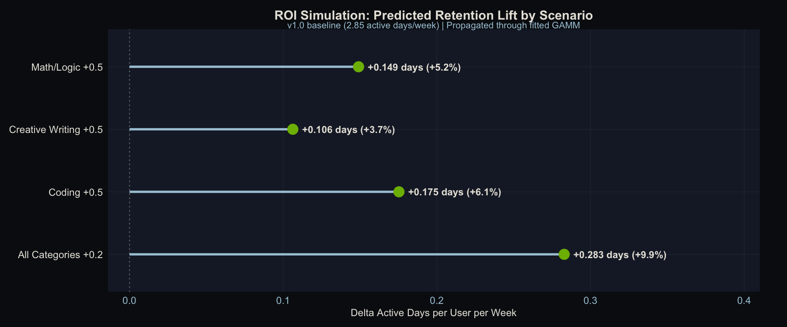

<!--more-->

*Article by John Tribbia*

> The technical version of this post, with full statistical details, model specifications, and reproducible code, is available [here](../model-quality/).

## Every AI company tells the same story: we made our model smarter, so people used it more. 

It sounds obvious. But when you try to prove it with data, it can fall apart pretty quickly.

Here's the problem. When a company rolls out a new AI model, everything else changes too. There's a press cycle. New features ship alongside it. Marketing ramps up. Maybe it's the start of a new quarter and everyone's trying to hit goals. Engagement goes up, sure, but claiming the *model* caused that is like saying your umbrella made it rain.

I wanted to build a way to actually test this. Not with an A/B experiment (sometimes the landscape moves so fast that experimentation is an afterthought), but with a statistical method that works on the messy data companies already have.

More importantly, I wanted to answer the question that comes right after: **if quality does drive retention, where should you invest next?** Because if you can measure quality's effect at the category level - coding, creative writing, math - you can build a quality investment map that tells you exactly which improvement will buy the most retention per dollar spent.

## The Key Insight: Same Model, Different Experience

The trick is surprisingly intuitive. Even when every user is on the same AI model, not everyone gets the same quality of experience.

Think about it. A software engineer mostly asks the AI to write code. A novelist uses it for creative writing. A student uses it for math homework. And AI models aren't equally good at everything. They might be excellent at coding but mediocre at creative writing.

That means the engineer is getting a better product experience than the novelist, *even though they're using the exact same model*. And that difference has nothing to do with when the model was released. It's baked into how each person uses the tool.

This is the variation I exploit. Instead of comparing "before the upgrade" to "after the upgrade" (which is still valuable, but can be muddled by everything else that changed), I compare users *within* the same model version who happen to get different quality levels because of what they use the AI for.

## The Set-up

I built a synthetic dataset that simulates a Gemini-style AI assistant: 100,000 users, three model versions rolled out over six months, about 1.65 million weekly records total.

The critical ingredient: I baked a *known* causal effect into the data. I know exactly how much quality should affect engagement because I programmed it in. That means I can test whether my method recovers the right answer, not just whether it finds something "statistically significant."

The model quality scores look like this across five prompt categories:

| Category | v1.0 | v1.1 | v1.2 |
|----------|------|------|------|
| Coding | 3.50 | 4.11 | 4.41 |
| Creative Writing | 2.79 | 3.29 | 3.77 |
| General Q&A | 3.50 | 3.88 | 4.17 |
| Math/Logic | 2.91 | 3.50 | 4.13 |
| Scientific | 3.29 | 3.60 | 4.06 |

Notice how the improvement isn't uniform. Under v1.0, Coding scores 3.50 while Creative Writing scores only 2.79. That gap between categories is what makes the whole analysis possible. A coding-heavy user and a writing-heavy user are living in meaningfully different quality worlds, even under the same model.

But this table also contains something else: a roadmap for where to invest. If you're deciding where to spend your next round of model fine-tuning, you need to know which of these categories would move the most users if improved. That requires combining this quality data with the usage data - which is exactly what this framework does.

## How It Works

For each user, I calculate a personalized quality score based on *what they actually use the AI for*. A software engineer who spends 41% of their time on coding tasks and 5% on creative writing gets a quality score weighted heavily toward the coding ratings. A novelist with the opposite mix gets a very different score. I call this a *user's quality of AI experience*.

Then I subtract the average. This is the key step. It strips away everything that changes when a new model rolls out (the marketing, the press, the coincidental timing) and leaves only the structural difference between users who happen to benefit more or less from the current model's strengths.

Here's a concrete example under v1.0:

- **A software engineer** (mostly coding): quality experience = **3.30** (above the 3.23 average)
- **A creative writer** (mostly writing): quality experience = **3.02** (below average)

Same model, same week, different experience. The question is whether that 0.28-point gap predicts any difference in engagement.

*How user-level quality experience is constructed. Top: pre-period category weights for two example users. Middle: quality scores by category for v1.0. Bottom: stacked weighted contributions. Same model version, different experienced quality. The dashed line is the population mean.*

## What I Found

Before getting into the model results, it's worth seeing the raw data. The chart below shows what quality exposure looks like over time: first the raw scores (which jump at each deployment boundary), then the centered scores that strip away those jumps and reveal the within-version spread we actually use.

*Top: Raw quality scores show obvious step-function jumps at deployment boundaries, the variation we can't use. Bottom: Centered scores show only the within-version spread between users. That's the variation that drives the analysis.*

### Quality drives whether people show up, not how much they do

The relationship between centered quality and engagement is highly significant for one metric and completely absent for another:

- **Active days per week**: Strong positive relationship. Users whose category mix aligns with the model's strengths are active more days per week.
- **Number of prompts**: No relationship at all. Quality doesn't change how much people do once they open the app.

This makes intuitive sense. Quality affects the "should I bother opening this today?" decision, not the "how many questions should I ask?" decision. If the AI is good at what you need, you're more likely to come back tomorrow. But once you're there, you ask as many questions as you have. (Other performance dimensions like latency and punt rate could be folded into the same framework as additional predictors. That's a natural extension, but this analysis isolates quality alone.)

*Top left: Clear positive relationship between quality and active days. Top right: No meaningful time trend after accounting for version. Bottom left: Quality has zero effect on prompt volume. Bottom right: Rich temporal dynamics in prompts driven by other factors.*

### The method recovers 90% of the true effect

This is the payoff of using synthetic data with a known answer. I programmed in an effect of exactly 1.0 (on a statistical scale called log-odds). The method recovered 0.90, or 90% of the true value.

The 10% it missed is explainable: the method uses *observed* usage patterns, which are noisy approximations of people's true preferences. That noise systematically pulls the estimate toward zero. It's a well-understood statistical phenomenon, and it's correctable.

When I used a more sophisticated error-correction technique (cluster bootstrapping, which accounts for the fact that the same person shows up multiple times in the data), the confidence interval captured the true value. The simpler approach narrowly missed it, which is exactly the kind of thing that matters in production.

### The effect holds across user types

Both consumer and enterprise users show significant quality effects, with similar slopes. This matters for two reasons. First, it confirms the method works at the subgroup level, not just in aggregate. Second, it means you can run segment-specific investment maps, and because enterprise users tend to concentrate on different categories than consumers, the optimal investment could differ by segment.

## The Sanity Check (And Why It's Subtle)

The most important result from this analysis might be the one that *didn't* find anything. In an earlier iteration of the project, before I injected the known causal effect, the falsification test came back clean: no signal detected. That's what gives me confidence the method isn't just picking up noise or artifacts when it does find something.

The test works like this: scramble which categories get which quality scores (so coding gets creative writing's ratings, and vice versa), then re-run the analysis. If the method is working correctly, the scrambled version should fail.

There's a subtlety, though. When a real causal effect *does* exist in the data, the scrambled scores still pick up some signal, because shuffling five categories creates unavoidable inverse correlations with the real scores. That's not a flaw; it's expected. The test is most informative as a first-pass diagnostic on data where you don't yet know whether an effect exists.

## What This Means for Companies Deploying AI

### The method works

The within-version approach can isolate quality's contribution to engagement without an A/B test. It recovers 90% of a known effect, and the remaining 10% comes from a well-understood and correctable source of error. That's good enough for production decision-making.

### The naive approach doesn't

Comparing engagement before and after a model upgrade tells you almost nothing about the model itself. The version-level jumps in this data are four to five times larger than the within-version quality effect. Most of that jump is more than just the model. It's also everything else that changed at the same time.

### Quality matters for retention, not intensity

If you're trying to justify model investment to your leadership, "better models bring people back more often" is a defensible claim. "Better models make people use it more per session" is not supported by this framework. That distinction matters for how you think about the ROI of model improvements.

### So what do you actually do with this?

The real power of this framework isn't just knowing that quality affects retention. It's knowing *where to invest next*.

Because the quality score is built from category-level ratings weighted by each user's usage mix, you can decompose the overall effect into category-level contributions. That gives you a quality investment map: which categories have the highest marginal return on quality improvement for retention?

Here's a concrete example. Take the v1.0 quality scores and the average usage weights from the data:

| Category | Quality (v1.0) | Avg. User Weight | Gap to Best |
|----------|---------------|-----------------|-------------|
| Coding | 3.50 | 24.6% | — |
| General Q&A | 3.50 | 20.4% | — |
| Math/Logic | 2.91 | 21.4% | 0.59 |
| Scientific | 3.29 | 18.4% | 0.21 |
| Creative Writing | 2.79 | 15.1% | 0.71 |

Creative Writing has the largest quality gap (0.71 points below the best categories), but only 15.1% of usage falls there. Math/Logic has a smaller gap (0.59) but 40% more usage (21.4%). If you could improve only one category, Math/Logic buys you more retention because more people rely on it.

That's the quality investment map. It tells a product team: *don't just fix what's worst; fix what's worst among the categories people actually use the most.* You can run this analysis by segment too. If Enterprise users skew heavily toward Coding while Consumer users spread across categories, the optimal investment differs by segment.

### Putting real numbers on it

The gap table tells you *which direction* to invest, but not *how much retention you'd actually gain*. So I ran proper counterfactual simulations: pick a hypothetical improvement, recompute every user's quality score, run it through the fitted model (using the recovered coefficient of 0.90 log-odds), and get predicted retention deltas in real units.

Four scenarios, starting from the v1.0 baseline (2.85 active days/week):

| Scenario | Delta Active Days/User/Week | % Change | Per 100K Users |
|----------|---------------------------|----------|----------------|
| Coding +0.5 | +0.175 | +6.1% | +17,533 days/wk |
| Math/Logic +0.5 | +0.149 | +5.2% | +14,905 days/wk |
| Creative Writing +0.5 | +0.106 | +3.7% | +10,626 days/wk |
| All Categories +0.2 | +0.283 | +9.9% | +28,285 days/wk |

*Predicted retention lift by improvement scenario. The "All Categories +0.2" scenario uses a smaller per-category improvement but lifts every user, producing the largest aggregate gain.*

The ranking of scenarios is predictable from the usage weights alone, but the magnitudes are not, and the magnitudes are what make this actionable. Coding +0.5 beats Math/Logic +0.5 because more users rely on Coding (24.6% vs. 21.4%), even though Math/Logic has a larger quality gap. Creative Writing +0.5 finishes last despite having the biggest gap because only 15.1% of usage falls there. You could have guessed that ordering from the gap table, but you couldn't have known that the difference between Coding and Creative Writing is worth roughly 7,000 extra active-user-days per week at scale.

**The most strategically interesting result is the last row.** The uniform improvement ("All Categories +0.2") dominates every targeted scenario even though each category gets only 0.2 points instead of 0.5. It lifts every user, not just those who happen to rely on the improved category. Most product teams instinctively prioritize fixing the worst thing, but this argues for broad quality investment over targeted fixes.

The per-user effects are modest (0.1 to 0.3 extra active days/week) because the within-version quality spread is narrow. In production data with wider category gaps, these deltas would be larger.

This is the kind of table a product team can take to a planning meeting: "Improving Coding quality by half a point is worth roughly 17,500 extra active-user-days per week across our 100K user base." That's a quantified outcome, not just a directional claim.

**One thing this framework can't tell you** is whether a quality improvement drives retention because it's genuinely better, or because it feels novel. A big jump in Creative Writing quality might bring users back for a few weeks simply because it's new and surprising, not because the sustained level matters. Distinguishing novelty effects from durable quality gains would require cohort-based analysis: tracking whether users who first experience an improvement show a different retention trajectory than users who arrive after it's the new normal. That's a natural next step, but it's a different analysis.

### What you need to try this

1. **Category-level quality scores.** A single overall quality rating per model version won't work. You need to know how good the model is at coding *separately* from how good it is at creative writing. 

2. **Prompt-level usage logs.** You need to know what each user is actually doing with the AI, not just aggregate session counts. Having a category-level taxonomy is key here and can help with privacy protocol when handling user-level prompts.

3. **A holdout group (ideally).** This observational approach works, but even a small 90/10 staggered rollout would make the causal story much stronger.

## The Bottom Line

A lot of AI companies assume that better models drive more engagement. This project builds a method to test that assumption, validates it on synthetic data with a known answer, and shows it works. The method isn't perfect (the quality variation it exploits is narrow, and observational designs always carry caveats), but it's a principled starting point that any team with the right data can implement.

---

*All data in this analysis is synthetic. No real users, no proprietary models, no production systems. The goal is to demonstrate a methodology, not report findings from an actual deployment. Full code and datasets are available in the [technical write-up](../model-quality/).*
