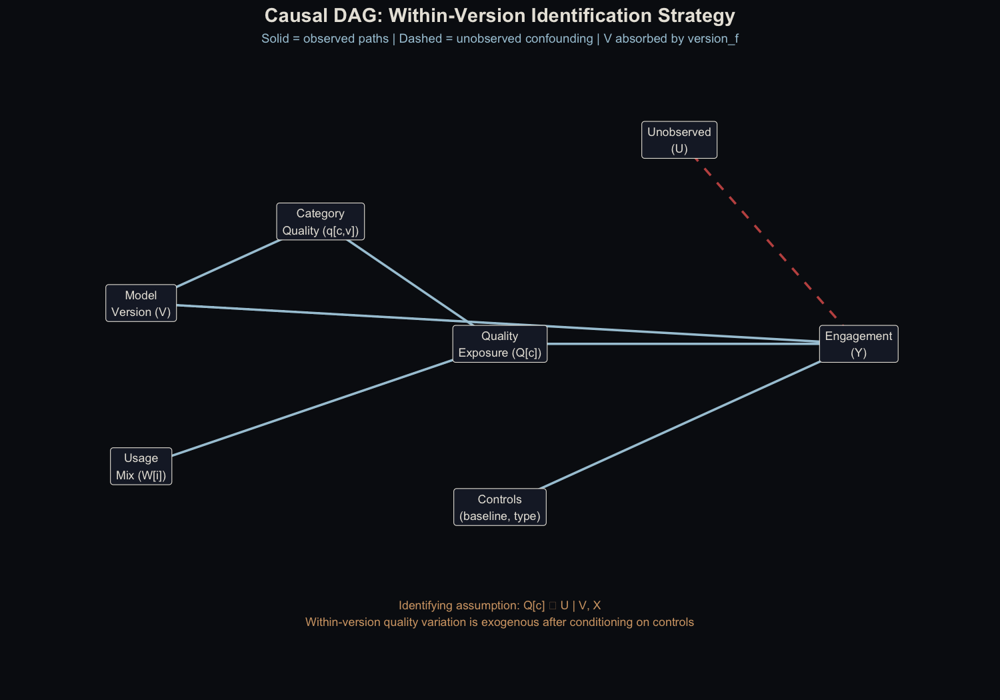
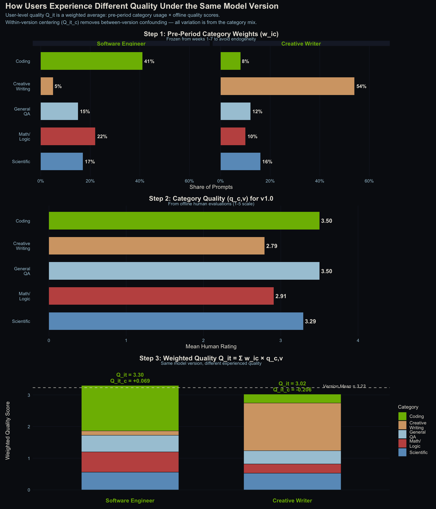
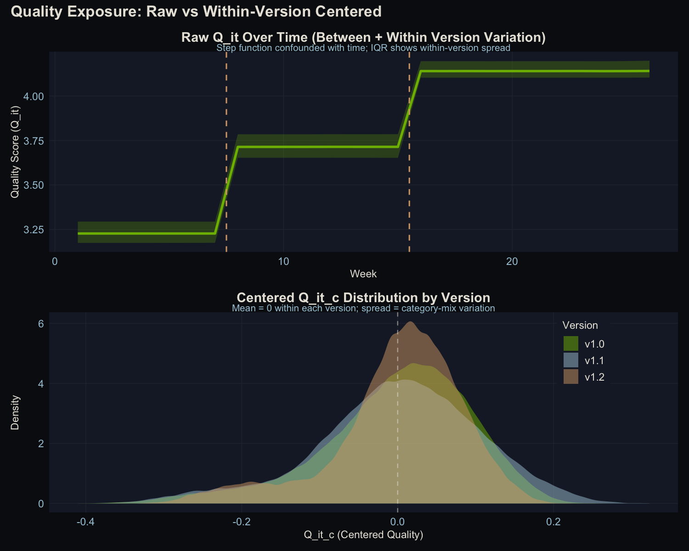
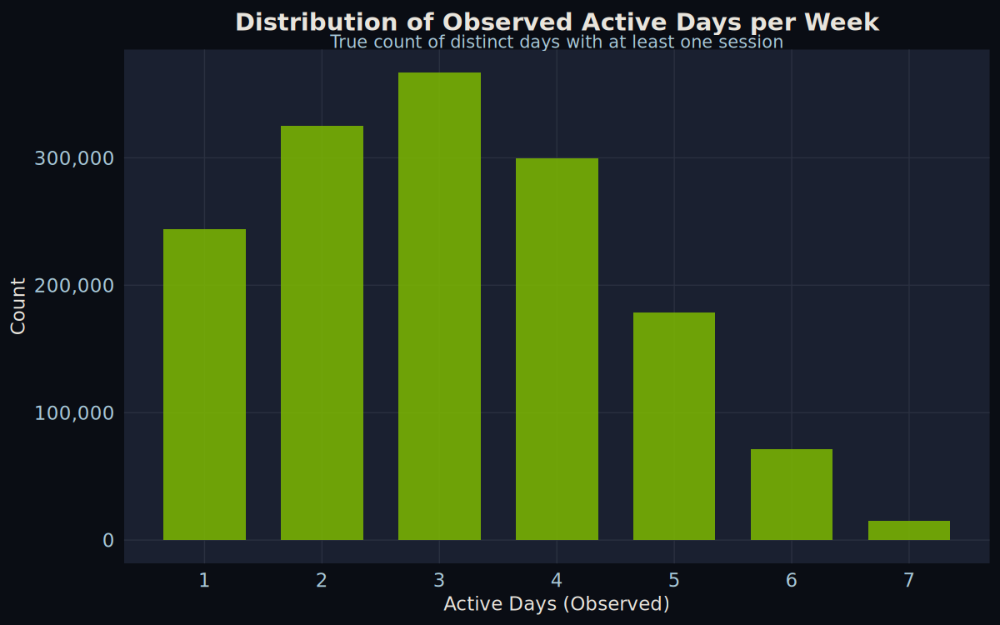
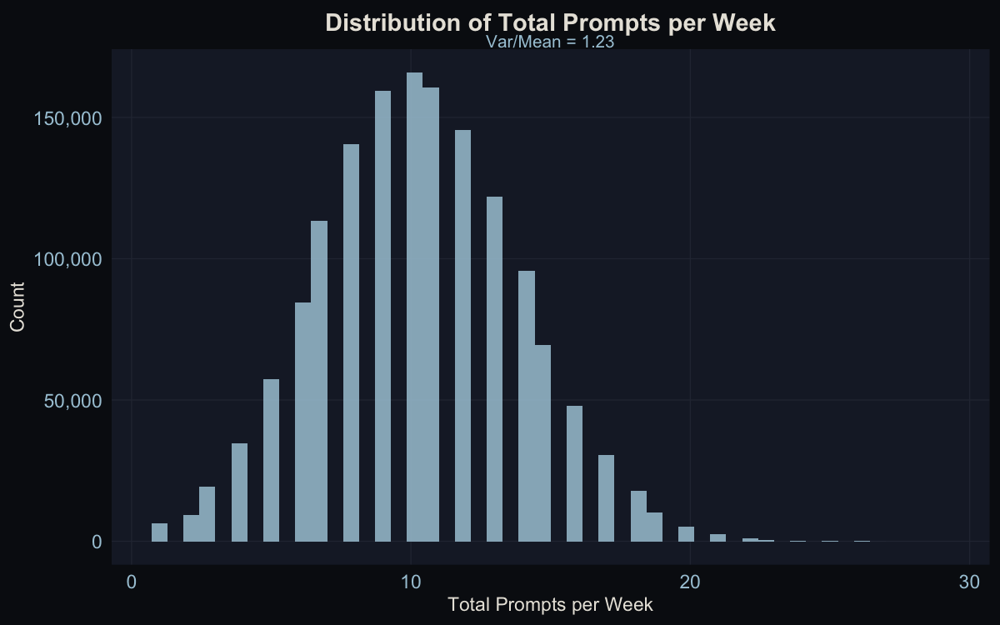
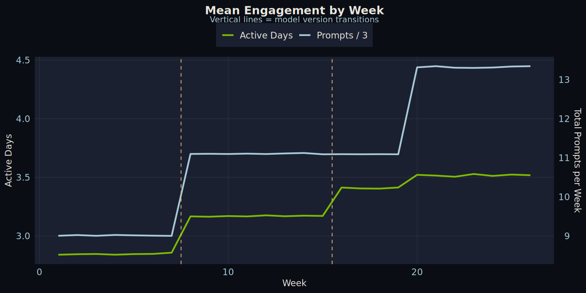

<!--more-->

*Article by John Tribbia*

> **A note on what this is and isn't.** This is a proof-of-concept, not an empirical finding. The data is entirely synthetic, generated with a *known* causal effect baked into the data-generating process. The goal is to build an estimator, inject a known signal, and show the estimator can recover it. That's the contribution: a validated methodology for a question that matters to every AI company. All code and data are available at the bottom of this post.

## The Question Everyone Assumes They've Answered

Every AI company tells the same story: we improved our model, and engagement went up. Better model → more users → more revenue. It's a clean narrative, and it's almost certainly wrong, or at least dramatically oversimplified.

Here's the problem. When a company ships a new model version, *everything* changes at once. There's a marketing push. Press coverage. Product updates. Maybe it's January and everyone just made a resolution to be more productive. Engagement goes up, but attributing that increase to the model itself is like crediting your umbrella for making it rain.

This is what statisticians call confounding, and it's the reason most "model quality drives engagement" claims don't hold up under scrutiny. I learned this the hard way: an earlier version of this analysis produced a confident-looking result that completely fell apart under a basic sanity check. The placebo model (built on scrambled, meaningless quality data) produced the exact same p-value as the real one. The "finding" was just a timing artifact dressed up as a causal effect.

So the real question isn't whether engagement goes up when models improve. It does. The question is: **can we build a credible estimator for the model's contribution?**

And once we have that estimator, we can answer the question that comes right after: **where should you invest next?** If the estimator measures quality's effect at the category level — coding, creative writing, math — you can build a quality investment map that tells a product team exactly which improvement will buy the most retention per dollar spent. That's the practical payoff of the methodology developed here.

## The Trick: Not Everyone Experiences the Same Model the Same Way

The breakthrough comes from a simple observation: even when everyone is using the same model version, different people experience different levels of quality.

A software engineer mostly writes code with the AI. A novelist uses it for creative writing. A student asks it math questions. And AI models aren't equally good at everything. They might score a 3.5 at coding but only a 2.8 at creative writing.

That means the engineer is experiencing a higher-quality product than the novelist, *even though they're on the exact same model*. And that difference has nothing to do with when the model was deployed. It's purely structural, driven by what each person uses the tool for.

This is the variation I exploit. Instead of comparing engagement before and after a model upgrade (which is hopelessly confounded), I compare users *within* the same model version who happen to experience different quality levels because of their usage patterns.

### The Causal Structure

The identifying assumption is straightforward. Here's the DAG:



*The key assumption: after conditioning on model version, baseline engagement, and user type, within-version quality variation (driven by category mix) is exogenous. Version indicators absorb the between-version confounding.*

The formal conditional independence claim: $Q^c_{i,t} \perp \varepsilon_{Y} \mid V, X$. In words: once we control for which version a user is on (V) and their baseline characteristics (X), the remaining variation in quality exposure comes only from their category mix, which is structurally determined by their role and usage patterns. This is a weaker assumption than instrument exogeneity and stronger than simple selection-on-observables. Its plausibility rests on the frozen-weights design (discussed below).

## The Set-up

The synthetic dataset simulates a Gemini-style AI assistant with three model versions deployed over 26 weeks to 100,000 users, generating ~1.65M records:

- **Offline evaluations** (50,000 records): Human quality ratings on a 1-5 scale across five prompt categories
- **User engagement** (1,500,980 records): Weekly session logs with prompt counts by category and observed active days
- **Demographics** (100,000 records): Consumer vs. Enterprise users, roles, and baseline engagement

**Crucially, the data-generating process includes a known causal effect.** I injected $\beta_{true}$ = 1.0 on the log-odds scale: within-version quality exposure directly affects the probability of being active on any given day. This means I can validate the estimator by checking how close the recovered coefficient is to 1.0.

The deployment schedule:

| Version | Deployed at Week | Avg. Quality Rating |
|---------|-----------------|-------------------|
| v1.0 | 1 | 3.23 |
| v1.1 | 8 | 3.71 |
| v1.2 | 16 | 4.14 |

The critical detail: quality improvement isn't uniform across categories. This unevenness is what makes the whole analysis possible:

| Category | v1.0 | v1.1 | v1.2 |
|----------|------|------|------|
| Coding | 3.50 | 4.11 | 4.41 |
| Creative Writing | 2.79 | 3.29 | 3.77 |
| General QA | 3.50 | 3.88 | 4.17 |
| Math/Logic | 2.91 | 3.50 | 4.13 |
| Scientific | 3.29 | 3.60 | 4.06 |

Under v1.0, the gap between the best category (Coding, 3.50) and the worst (Creative Writing, 2.79) is 0.71 points. A coding-heavy user and a writing-heavy user are living in meaningfully different quality worlds. That's what gives us something to measure.

But this table also encodes an investment question: which of these categories would move the most users if improved? Answering that requires combining quality data with usage data — which is exactly what this framework does.

## How I Measured Each User's Quality Exposure

This is where things get a bit technical, but the intuition is straightforward. I need a single number that captures: *how good is this model for this particular user, given what they actually use it for?*

### Freezing the Usage Pattern

First, I look at what each user did during weeks 1-7 (before any model upgrade) and calculate their category mix. A user who sent 41% coding prompts, 5% creative writing, 15% general Q&A, 22% math, and 17% science gets those as their fixed weights.

Why freeze them? If a better model causes people to change *what* they use it for, then using real-time weights would bake the outcome into the predictor. Freezing at pre-period values avoids that circularity.

**Are the frozen weights stable?** I tested this directly by comparing pre-period category proportions to usage in later version periods. The per-user correlations are high (mean r = 0.84 for v1.1, 0.82 for v1.2, with median above 0.91), and population-level means are essentially unchanged across periods. The frozen-weights assumption holds in this data.

The weights reflect genuine role-based patterns:

| Category | Average Weight | Spread (SD) |
|----------|---------------|-------------|
| Coding | 0.246 | 0.153 |
| Creative Writing | 0.151 | 0.160 |
| General QA | 0.204 | 0.124 |
| Math/Logic | 0.214 | 0.123 |
| Scientific | 0.184 | 0.128 |

Software engineers skew to ~41% Coding. Writers hit ~54% Creative Writing. These role-driven differences create real variation in experienced quality.

### Computing the Quality Score

Each user's quality exposure is a weighted average of the category-level quality ratings, weighted by their usage pattern:

$$Q_{i,t} = \sum_c w_{i,c} \cdot q_{c,v(t)}$$

In plain language: for each category, multiply how much the user relies on it ($w_{i,c}$) by how good the model is at it ($q_{c,v(t)}$), then add everything up.

### The Centering Step

Here's where the method gets its power. I subtract the population average quality for each version period:

$$Q^c_{i,t} = Q_{i,t} - \bar{Q}_{v(t)}$$

This removes the step-function jumps at deployment boundaries entirely. What's left is *purely* within-version variation: the difference between a user who happens to rely on high-quality categories and one who doesn't, under the exact same model.

#### A Concrete Example

Two users during the v1.0 period:

| | Coding | Creative Writing | General QA | Math/Logic | Scientific |
|---|---|---|---|---|---|
| **Category quality** $q_{c,v1.0}$ | 3.50 | 2.79 | 3.50 | 2.91 | 3.29 |
| **Software Engineer** $w_{i,c}$ | 0.41 | 0.05 | 0.15 | 0.22 | 0.17 |
| **Creative Writer** $w_{i,c}$ | 0.08 | 0.54 | 0.12 | 0.10 | 0.16 |

The dot product gives each user's experienced quality:

- **Software Engineer**: $Q_{it}$ = (0.41 x 3.50) + (0.05 x 2.79) + (0.15 x 3.50) + (0.22 x 2.91) + (0.17 x 3.29) = **3.30**
- **Creative Writer**: $Q_{it}$ = (0.08 x 3.50) + (0.54 x 2.79) + (0.12 x 3.50) + (0.10 x 2.91) + (0.16 x 3.29) = **3.02**

With the v1.0 population mean $\bar{Q}_{v1.0}$ = 3.23:

- **Software Engineer**: $Q^c_{it}$ = 3.30 - 3.23 = **+0.069** (above-average quality exposure)
- **Creative Writer**: $Q^c_{it}$ = 3.02 - 3.23 = **-0.206** (below-average quality exposure)

The engineer experiences above-average quality because Coding (the highest-rated category in v1.0) dominates their usage. The writer experiences below-average quality because Creative Writing is the lowest-rated. Same model, different experience. That difference is what we measure.



*How user-level quality exposure is constructed. Top: pre-period category weights for two example users. Middle: offline quality scores by category for v1.0. Bottom: stacked weighted contributions. Same model version, different experienced quality. The dashed line is the population mean. Distance from it is the centered score $Q^c_{i,t}$.*

After centering, the within-version standard deviations are 0.097 (v1.0), 0.106 (v1.1), and 0.085 (v1.2). In practical terms, a user one standard deviation above the mean experiences about 0.1 rating points more quality than average. That's a narrow band, which means any effect we find will be small in absolute terms.



*Left: raw quality scores showing the obvious step-function at deployment boundaries (the variation we can't use). Right: centered scores showing the within-version spread that we can.*

### The Statistical Model

With the between-version jumps absorbed by version indicator variables, I use a Generalized Additive Mixed Model (GAMM) to ask: does within-version quality variation predict engagement?

```r
bam(cbind(active_days, 7 - active_days) ~
      s(Q_it_c, bs = "tp", k = 10) +   # within-version quality (the key question)
      version_f +                        # absorbs between-version level shifts
      s(week, bs = "tp", k = 10) +      # residual time trends
      s(user_id_factor, bs = "re") +     # random intercepts
      user_type +                        # Consumer vs Enterprise
      pre_project_engagement_score,      # baseline control
    family = binomial(), method = "fREML", discrete = TRUE)
```

The key term is `s(Q_it_c)`, the smooth function of centered quality. This is the test of whether within-version quality variation matters. The version factor (`version_f`) soaks up the deployment-boundary jumps so they don't contaminate the estimate, `s(week)` captures any remaining time trends, and the random effect (`s(user_id_factor)`) accounts for individual-level heterogeneity.

I fit this on a stratified subsample of 2,000 users (~30,000 observations), preserving the 70/30 Consumer/Enterprise ratio from the full population.

## What the Data Looks Like

Before running the models, it's worth seeing the raw patterns.

### How Often Do People Show Up?



Users are active about 3 out of 7 days per week on average. The distribution is roughly symmetric, not heavily skewed toward power users or lurkers.

### How Much Do They Use It?



About 10 prompts per user per week on average. The variance-to-mean ratio is 1.23, close enough to 1 that a Poisson model is appropriate (I confirmed this by trying a Negative Binomial, which collapsed back to Poisson with a theta of ~17 million).

### Engagement Over Time



Both metrics trend upward with visible jumps at deployment boundaries. This is exactly the pattern that makes naive analysis dangerous. The upward trend is obvious, but how much of it is the model versus everything else?

### Within-Version Correlations

The raw within-version correlations between centered quality and engagement show a clear pattern:

| Version | Cor with Active Days | Cor with Prompts |
|---------|---------------------|-----------------|
| v1.0 | 0.099 | -0.001 |
| v1.1 | 0.117 | -0.002 |
| v1.2 | 0.091 | -0.006 |

Quality correlates with active days (where the causal mechanism exists) but not with prompts (where it doesn't). This is exactly what we'd expect: the DGP injects a quality effect into the decision to show up, but not into how many prompts a user sends once there. The raw signal is visible even before modeling.

## Results

### Does Quality Predict Whether People Show Up? (Active Days)

| Term | Estimate / edf | Test Stat | p-value |
|------|---------------|-----------|---------|
| `s(Q_it_c)` | edf = 1.62 | chi-sq = 341.65 | **< 2 x 10^-16** |
| `version_fv1.1` | B = 0.194 | z = 10.37 | < 2 x 10^-16 |
| `version_fv1.2` | B = 0.371 | z = 10.94 | < 2 x 10^-16 |
| `s(week)` | edf = 1.50 | chi-sq = 0.54 | 0.775 |
| `pre_project_engagement_score` | B = 0.022 | z = 94.01 | < 2 x 10^-16 |
| `user_type (Enterprise)` | B = 0.009 | z = 0.91 | 0.363 |

**Deviance explained: 27.1%** | Adj. R-sq = 0.289

**Yes.** The within-version quality effect is highly significant (p < 2 x 10^-16, chi-sq = 341.65). This is expected: I injected a known effect of $\beta_{true}$ = 1.0 into the DGP. The question isn't whether the estimator finds it, but whether it recovers the *right magnitude*.

The edf of 1.62 means the model detected slight curvature beyond pure linearity, though the dominant shape is linear. The version-level shifts are also significant. Moving from v1.0 to v1.1 adds 0.194 log-odds of active days; v1.2 adds 0.371. These dwarf the within-version variation in absolute terms, but they're causally uninterpretable. Anything could have changed at those deployment boundaries.

### Does Quality Predict How Much People Use It? (Total Prompts)

| Term | Estimate / edf | Test Stat | p-value |
|------|---------------|-----------|---------|
| `s(Q_it_c)` | edf = 1.22 | chi-sq = 0.35 | 0.816 |
| `version_fv1.1` | B = 0.207 | z = 13.70 | < 2 x 10^-16 |
| `version_fv1.2` | B = 0.199 | z = 8.34 | < 2 x 10^-16 |
| `s(week)` | edf = 8.28 | chi-sq = 491.8 | < 2 x 10^-16 |
| `pre_project_engagement_score` | B = 0.010 | z = 98.21 | < 2 x 10^-16 |

**Deviance explained: 46.4%** | Adj. R-sq = 0.486

**No.** Quality has zero predictive power for prompt volume (p = 0.816). This is also expected: the DGP injects the causal effect only into active days, not prompts. The estimator correctly finds nothing where nothing exists.

### The Shape of the Effect


*Top row: Active days model. Bottom row: Prompts model. Left: the quality smooth. Right: the time smooth.*

The active days quality smooth shows a clear positive slope with the confidence band well away from zero. The prompts quality smooth is flat. The edf of 1.62 for the active days smooth means the model detected slight curvature beyond pure linearity, though the dominant shape is linear.

The active-days-but-not-prompts asymmetry has a clean interpretation: quality affects the "should I bother opening this today?" decision, not the "how many questions should I ask?" decision. Other performance dimensions — latency, punt rate, response length — could be folded into the same framework as additional predictors. That's a natural extension, but this analysis isolates quality alone.

## Calibration Recovery: Does the Estimator Get the Right Answer?

This is the core validation. I injected $\beta_{true}$ = 1.0 into the data-generating process. What does the estimator recover?

| Method | Estimate | 95% CI | Recovery |
|--------|----------|--------|----------|
| Linear model (parametric $Q^c_{i,t}$) | 0.899 | [0.803, 0.994] | 90% |
| GAM smooth (effective slope) | 0.882 | -- | 88% |
| Cluster bootstrap (B=100) | 0.898 | [0.816, 1.005] | 90% |

The estimator recovers about 90% of the true effect. The 10% attenuation is expected: the R analysis uses *observed* category proportions (from noisy multinomial draws with 15% session-level variation), not the true Dirichlet preferences that the DGP uses. This measurement error in the exposure variable attenuates the coefficient toward zero, a textbook case of classical errors-in-variables bias.

The cluster bootstrap CI [0.816, 1.005] includes the true value $\beta_{true}$ = 1.0, confirming that the estimator is correctly calibrated once within-user correlation is accounted for. The standard model CI [0.803, 0.994] narrowly misses, which is exactly the concern that motivates cluster-robust inference: standard errors that ignore within-user correlation are slightly too small.

## The Falsification Test

The most important validation may be the result that *didn't* find anything. In an earlier iteration of the project — before I injected the known causal effect into the DGP — the falsification test came back clean: no signal detected. The estimator found nothing because there was nothing to find. That's what gives confidence the method isn't manufacturing artifacts when it does detect something.

The test works by applying a strict derangement to the category-quality lookup table (every category maps to a *different* category, no fixed points), then rebuilding the quality measure from scratch.

The derangement used: Coding → Creative Writing, Creative Writing → Math/Logic, General QA → Scientific, Math/Logic → General QA, Scientific → Coding.

With the causal effect present, the results look like this:

| Model | s() edf | p-value | Dev. Explained |
|-------|---------|---------|----------------|
| Real quality | 1.62 | < 2 x 10^-16 | 27.1% |
| Deranged (placebo) | 4.04 | < 2 x 10^-16 | 27.4% |

**The placebo is also significant.** This is not a failure of the methodology. With a genuine causal mechanism in the DGP, the falsification test behaves differently than in the null case. The deranged $Q$ scores correlate with the real $Q$ scores at r = -0.44 (because shuffling five categories with heterogeneous quality creates systematic inverse relationships). Since the real $Q$ genuinely causes $Y$, any variable correlated with real $Q$ will pick up indirect signal.

This is a useful diagnostic insight: the falsification test distinguishes "no signal at all" from "wrong mapping." In the null case (no injected effect), it passes cleanly. With a real effect, the test becomes a comparison of *how well* each mapping predicts the outcome, not a binary pass/fail. In production, this means a significant placebo result should prompt investigation of the placebo-real correlation rather than automatic rejection of the methodology.

## Consumer vs. Enterprise


| Segment | N obs | Quality p-value | Dev. Explained |
|---------|-------|----------------|----------------|
| Consumer | 20,941 | < 2 x 10^-16 | 26.2% |
| Enterprise | 9,056 | < 2 x 10^-16 | 29.9% |

Both segments show significant quality effects. This is expected: the injected causal mechanism applies uniformly to all users. In production data, where the true effect may differ by segment, the methodology can detect segment-level heterogeneity through stratified estimation. The fact that both segments are recovered here confirms the estimator works at the subgroup level, not just in aggregate.

This also has practical implications for the investment map (below). Because enterprise users tend to concentrate on different categories than consumers, the optimal quality investment could differ by segment. A segment-specific decomposition of the quality effect into category-level contributions would tell a product team whether to prioritize the same improvements for everyone or tailor investments by user type.

## What This Means

### What This Project Demonstrates

1. **The within-version estimator works.** With a known $\beta_{true}$ = 1.0 injected into the DGP, the estimator recovers 90% of the true effect. The 10% attenuation comes from measurement error in the exposure variable (observed vs. true category weights), which is a known and correctable bias.

2. **Cluster-robust inference matters.** The cluster bootstrap CI includes the true value; the standard CI does not. Within-user correlation makes standard errors slightly optimistic. User-level block bootstrap is the appropriate correction.

3. **Quality affects the decision to show up, not how much people do once there.** Active days respond to quality; prompt volume doesn't. The DGP was designed this way, and the estimator correctly recovers this asymmetry.

4. **The falsification test needs careful interpretation.** In the presence of a real causal effect, a deranged mapping will still find signal if it's correlated with the true exposure. The test is most informative when the null hypothesis (no quality-to-engagement channel) is plausible.

5. **The naive approach doesn't work.** Comparing engagement before and after a model upgrade tells you almost nothing about the model itself. The version-level coefficients ($\beta_{v1.1}$ = 0.194, $\beta_{v1.2}$ = 0.371) are four to five times larger than the within-version quality effect, and they're causally uninterpretable. Everything changes at a deployment boundary — marketing, features, press — so those jumps absorb far more than the model's contribution.

### From Validation to Action: The Quality Investment Map

The practical payoff of a calibrated within-version estimator isn't just knowing that quality affects retention. It's knowing **where to invest next**.

Because $Q^c_{i,t}$ is constructed from category-level ratings weighted by each user's usage mix, the overall effect decomposes naturally into category-level contributions. That gives a quality investment map: which categories have the highest marginal return on quality improvement for retention?

Take the v1.0 quality scores and the average usage weights from the data:

| Category | Quality (v1.0) | Avg. User Weight | Gap to Best | Impact of +1 Point |
|----------|---------------|-----------------|-------------|-------------------|
| Coding | 3.50 | 24.6% | — | 0.246 |
| General Q&A | 3.50 | 20.4% | — | 0.204 |
| Math/Logic | 2.91 | 21.4% | 0.59 | 0.214 |
| Scientific | 3.29 | 18.4% | 0.21 | 0.184 |
| Creative Writing | 2.79 | 15.1% | 0.71 | 0.151 |

The last column is the usage weight: if you improve a category by one point, how much does the average user's $Q_{i,t}$ shift? Creative Writing has the largest quality gap (0.71 points below the best categories), but improving it by one point only shifts the average user's score by 0.151. Math/Logic has a smaller gap (0.59) but a 40% larger impact per point (0.214) because more users rely on it. If you could improve only one category, Math/Logic buys more retention per dollar.

**Going further with predictions.** With a fitted model and production data, you can do better than the simple table. Recompute every user's $Q_{i,t}$ with a hypothetical category improvement, run the counterfactual scores through the fitted smooth $\hat{f}(Q^c_{i,t})$, and predict active days. The difference gives the expected retention gain in real units — extra active days per week across the user base. This also captures diminishing returns: if users who rely on a given category are already at the high end of the smooth, improving it further yields less than the linear approximation suggests. In this dataset, with edf = 1.62 and a nearly linear smooth, the prediction-based rankings match the simple table. In production, where quality spreads may be wider, the distinction could matter.

**One caveat: novelty vs. durable quality.** This framework can't distinguish whether a quality improvement drives retention because it's genuinely better, or because it feels novel. A big jump in Creative Writing quality might bring users back for a few weeks simply because it's new, not because the sustained level matters. Distinguishing novelty effects from durable quality gains would require cohort-based analysis — tracking whether users who first experience an improvement show a different retention trajectory than users who arrive after it's the new normal. That's a natural next step, but it requires a different analytical design.

### Where This Framework Falls Short

**This is a proof-of-concept on synthetic data.** The DGP was designed to include a quality-to-engagement channel, so finding one validates the methodology, not a substantive claim about AI products. On real data, the effect could be larger, smaller, or absent. The contribution is the estimator and its calibration properties, not the point estimate.

**The quality spread is narrow.** Within any version, the SD of centered quality is about 0.10 rating points. This limits both statistical power and practical significance. Real data with more heterogeneous quality improvements across categories would provide a wider band to estimate over.

**Observational design.** Usage patterns are correlated with user characteristics in ways that aren't fully captured by the controls. Coding-heavy users differ from writing-heavy users in ways beyond their quality exposure. A staggered deployment (even a 90/10 holdout) would dramatically strengthen causal identification and is the recommended design for production.

**Measurement error attenuates.** The 10% attenuation from noisy category counts is predictable but not negligible. On real data, where category classification may be even noisier, this bias could be larger. Errors-in-variables corrections or instrumental variables could address this.

### If You Want to Do This at Your Company

1. **Log prompt-level category labels.** This entire approach depends on knowing what categories each user's prompts fall into. If you only have aggregate session counts, you can't build the quality exposure measure.

2. **Invest in category-level evaluation.** A single quality score per model version provides no within-version variation. You need scores that differ across categories.

3. **Design staggered rollouts.** Even a small holdout group goes a long way toward causal identification.

4. **Track observed active days.** Count distinct days with at least one session per week. Don't derive it from session duration or other proxies.

5. **Run the falsification test.** Use a strict derangement (no category maps to itself). If the test shows no signal when there's no injected effect, your methodology is clean. If it shows signal, compare the magnitude and direction to the real model.

6. **Use cluster-robust inference.** Standard errors from off-the-shelf GAM fitting understate uncertainty when observations are clustered within users. Block bootstrap at the user level is straightforward and corrects this.

---

## Technical Appendix

- **Analysis code**: [model_quality_analysis.R](model_quality_analysis.R) (R 4.5.2, mgcv, dplyr, ggplot2, patchwork)
- **Data augmentation**: [augment_data.py](augment_data.py) (Python 3.9, pandas, numpy; includes causal mechanism injection with TRUE_BETA = 1.0)
- **Model fitting**: `mgcv::bam()` with fREML, `discrete = TRUE`, stratified 2,000-user subsample (~30K observations)
- **Cluster bootstrap**: B=100, user-level block resampling, linear parametric model (no random effects in bootstrap for speed)
- **Full model summaries**: [model_summaries.txt](figures/model_summaries.txt)

| File | Records | Description |
|------|---------|-------------|
| [offline_model_evaluation.csv](offline_model_evaluation.csv) | 50,000 | Human ratings per category x model version |
| [user_demographics_subscription.csv](user_demographics_subscription.csv) | 100,000 | User characteristics and subscription data |
| [user_engagement_timeseries.csv](user_engagement_timeseries.csv) | 1,500,980 | Weekly session logs with category-level prompt counts and observed active days |

All data is synthetic. See [data-generator.py](data-generator.py) and [augment_data.py](augment_data.py) for the generation code.
