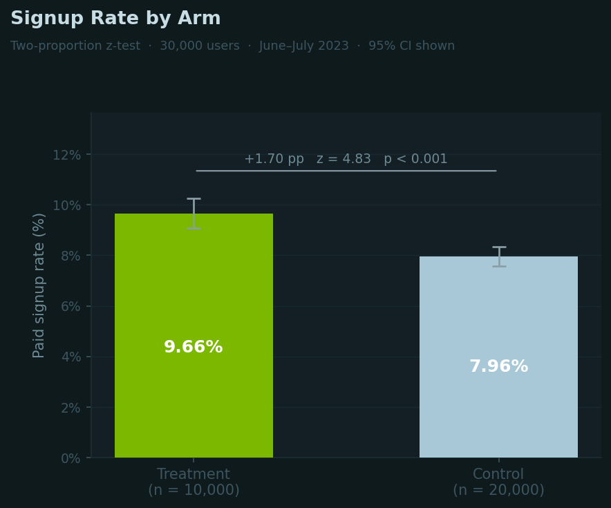
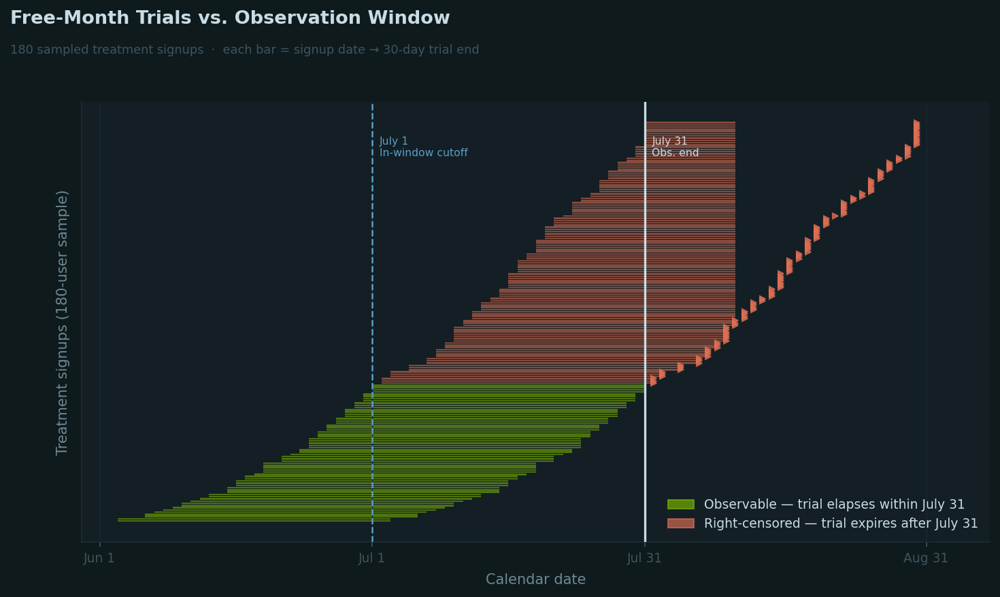
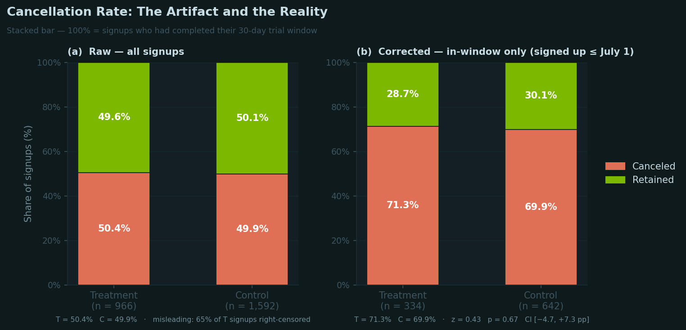
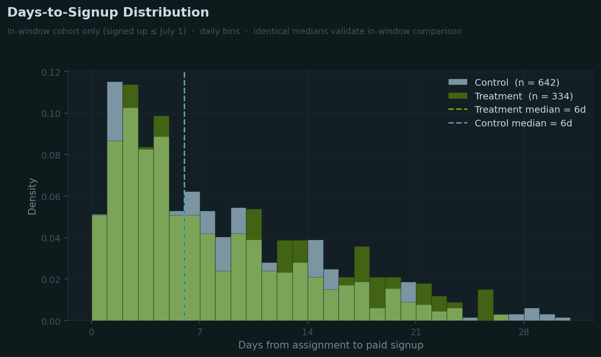
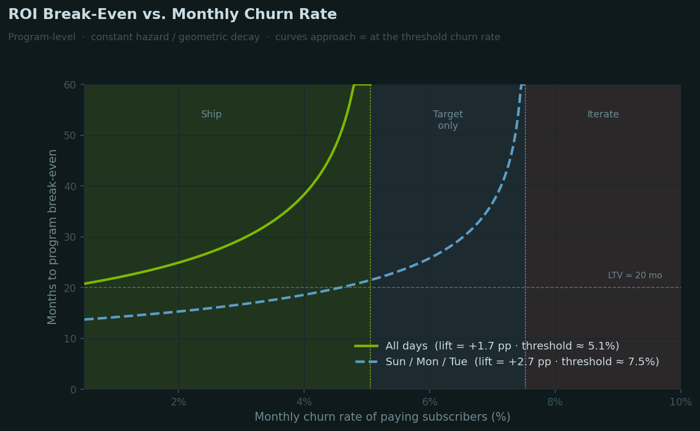
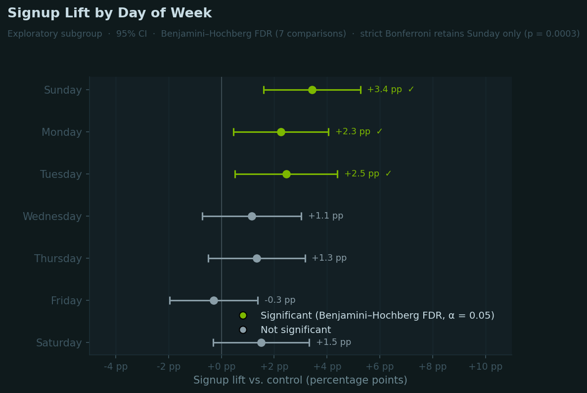

<!--more-->

  Simulated A/B test dataset · 30,000 users (10k treatment / 20k control) · June–July 2023 · ChatGPT paid plan conversion experiment

*Article by John Tribbia*

---

The offer is a free first month of ChatGPT Plus, targeted at users who hadn't converted after three months on the free plan. The signup result is clean. The retention result nearly wasn't. The experiment's own calendar created a trap that made the cancellation data look better than it was.

But signups are a means, not the goal. The goal is profit. The offer costs $20 per convert, and most of those converts would have paid without it. The effective cost per subscriber who wouldn't have signed up otherwise runs closer to $114. Recovering that outlay requires incremental subscribers to stay and pay. How long depends on churn, and that is the one number this experiment cannot directly produce.

---

<h2 class="oa-h2">The Lift Is Definitive</h2>

The free month offer moved signups by <strong>1.70 percentage points</strong>: from 7.96% in the control group to 9.66% in the treatment group. That is a 21% relative lift. The two-proportion z-test returns z = 4.83, p &lt; 0.001, with a 95% confidence interval of [+1.01, +2.39 pp]. At 30,000 users, the experiment has no shortage of statistical power for this question. The finding holds.

  
Figure 0 · Primary outcome

  
Signup Rate by Arm

  
Two-proportion z-test · 95% CI shown · n = 30,000

  
  
Error bars show 95% CI on each arm's proportion. The lift and its confidence interval are the primary deliverable from this experiment.

Not all 966 treatment signups per 10,000 users are new revenue. Roughly 796 would have converted without the offer. They took a free month they didn't need to be convinced. Only about 170 are incremental: subscribers who exist because of the treatment, not in spite of it. That deadweight majority is what makes the profit math worth scrutinizing.

---

<h2 class="oa-h2">The Cancellation Number That Lies</h2>

The raw retention numbers look nearly identical: 50.4% of treatment signups canceled versus 49.9% of control signups. A one-line summary would say retention is unaffected. That summary is wrong, and the reason why is more important than the actual retention result.

The experiment ran through July 31, 2023. The treatment is a free first month. A user who signs up on July 15 has their trial clock running through August 14, past the observation window close. The data cannot record whether they canceled. They appear in the dataset as active subscribers. They are not canceled. They are <em>unresolved</em>.

<strong>65% of treatment signups are right-censored</strong> in this way. Their free month had not yet elapsed when the data cut off. Control signups, who paid from day one, have no equivalent distortion. Comparing raw cancellation rates between the two groups is comparing apples to an apple-shaped hole.

  
Figure 2 · Censoring mechanism

  
Free-Month Trials vs. Observation Window

  
180 sampled treatment signups · each bar = signup date → 30-day trial end

  
  
Green bars: trial window closes within July 31 — cancellation is observable. Rust bars: trial extends past observation end — cancellation status unknown.

The fix is to restrict the retention comparison to users whose trial window fully elapsed before observation closed. That means signups on or before July 1, giving 334 treatment and 642 control in-window signups.

  
Figure 1 · Retention

  
Cancellation Rate: The Artifact and the Reality

  
Left: all signups (misleading). Right: in-window only — trial elapsed within observation window.

  
  
The corrected comparison: T = 71.3% canceled, C = 69.9% canceled. z = 0.43, p = 0.67, CI [−4.7, +7.3 pp]. Not significant.

The corrected cancellation rates are 71.3% for treatment and 69.9% for control. A 1.4 pp gap, nowhere near statistical significance (p = 0.67). The free month did not meaningfully change whether subscribers stuck around once they started paying. That is not bad news. It is neutral news. Users who convert under the treatment are not lower-quality subscribers. They cancel at roughly the same rate as users who paid from the start.

  <strong>On sample size:</strong> The in-window cohort is small enough (n = 976 total) that a meaningful retention difference could exist and not be detected at conventional thresholds. The 95% confidence interval on the difference spans −4.7 to +7.3 percentage points. This is an absence of strong evidence, not strong evidence of absence.

---

<h2 class="oa-h2">Same Median, Both Arms</h2>

If treatment and control users who converted early behave differently from those who converted later, the in-window restriction could introduce its own bias. The days-to-signup distributions offer the diagnostic.

  
Figure 3 · Timing

  
Days-to-Signup Distribution

  
In-window cohort only · daily bins · treatment alpha reduced to show control overlap

  
  
Both distributions peak in the first week and are right-skewed. Medians are identical at 6 days. No evidence of systematic timing differences that would bias the in-window comparison.

The medians are identical at 6 days and the overall shapes are close. Nothing in the timing distribution suggests the in-window restriction is pulling from a behaviorally distinct slice of converters. The corrected retention comparison is defensible.

---

<h2 class="oa-h2">$114 Per Incremental Subscriber</h2>

The cost of the treatment is concrete: every user shown the offer who converts gets a free month. At $20/month, each treatment signup costs $20 upfront. The revenue side depends on how long incremental subscribers stay.

Only 170 of the ~966 treatment signups per 10,000 treated users are incremental. They would not have signed up without the offer. The other 796 are deadweight: they would have converted anyway, but they still collected the free month. The effective cost per incremental subscriber is therefore not $20 but closer to $114 (966 free months × $20 ÷ 170 incremental subscribers).

To recover that cost through subscription revenue, those incremental subscribers need to stay and pay. At the in-window retention rate (28.7% of treatment subscribers did not cancel) and assuming constant monthly churn, the break-even circles around one number this experiment cannot directly measure: ongoing monthly churn.

  
Figure 5 · ROI sensitivity

  
Break-Even vs. Monthly Churn Rate

  
Program-level · geometric decay model · each curve assumes constant monthly churn

  
  
Curves approach infinity at the threshold churn rate — above that value, the program never recoups its cost. All-days threshold: ~5.1% monthly churn. The dashed curve shows that a targeted Sun/Mon/Tue deployment has a higher threshold (~7.5%), but this is an exploratory finding, not a deployment plan.

The all-days program breaks even in roughly 25 months at 2% monthly churn. At 3% it takes about 30 months. At 4%, 38 months. The program never breaks even above <strong>5.1%</strong> monthly churn. Beyond that threshold, subscribers churn out before generating enough revenue to recover the acquisition cost.

For context: SaaS subscription churn benchmarks for consumer products vary widely. Monthly churn in the 2–5% range is typical for mid-market consumer subscriptions. ChatGPT Plus, as a premium productivity tool, sits in a category where lower churn is plausible. This experiment produces no direct measurement of it post-trial. The break-even timeline is a sensitivity analysis, not a projection.

Break-even timeline by monthly churn rate · geometric decay model · $20/mo price

  <table class="oa-table">
    <thead>
      <tr>
        <th>Monthly churn</th>
        <th>All-days (mo)</th>
        <th>Sun–Mon–Tue (mo)</th>
      </tr>
    </thead>
    <tbody>
      <tr><td>1%</td><td>~22</td><td>~14</td></tr>
      <tr><td>2%</td><td>~25</td><td>~15</td></tr>
      <tr><td>3%</td><td>~30</td><td>~17</td></tr>
      <tr><td>4%</td><td>~38</td><td>~19</td></tr>
      <tr><td>≥ 5.1%</td><td>never</td><td>~22</td></tr>
      <tr><td>≥ 7.5%</td><td>never</td><td>never</td></tr>
    </tbody>
  </table>

---

<h2 class="oa-h2">Sun–Mon–Tue: An Opening, Not a Strategy</h2>

  
Figure 4 · Subgroup

  
Signup Lift by Day of Week

  
Exploratory · 95% CI · Benjamini–Hochberg FDR correction for 7 comparisons

  
  
Three days survive Benjamini–Hochberg FDR at α = 0.05: Sunday (+3.4 pp, p = 0.0003), Tuesday (+2.5 pp, p = 0.013), Monday (+2.3 pp, p = 0.014). Only Sunday survives strict Bonferroni. The effect on weekdays mid-week is indistinguishable from zero.

Sunday through Tuesday show meaningfully higher lift than the rest of the week. One plausible story: weekend and early-week users are browsing more casually, more receptive to a "try it free" proposition than someone working through a task at 2pm on Thursday. That story is coherent. It may also not be the right one.

This analysis was not pre-specified. We ran seven tests and found three winners. Benjamini–Hochberg controls the expected proportion of false discoveries, but it does not eliminate them — and in an exploratory context, the risk of over-interpreting a pattern is high. The day-of-week effect is a hypothesis to take into a follow-up experiment, not a deployment decision to make from this one.

Signup lift by day of week · two-proportion z-test · BH FDR correction at α = 0.05

  <table class="oa-table">
    <thead>
      <tr>
        <th>Day</th>
        <th>n (T / C)</th>
        <th>Lift</th>
        <th>95% CI</th>
        <th>p</th>
        <th>BH sig</th>
      </tr>
    </thead>
    <tbody>
      <tr><td>Sunday</td><td>1,451 / 2,896</td><td>+3.43 pp</td><td>[+1.6, +5.3]</td><td>0.0003</td><td>✓</td></tr>
      <tr><td>Monday</td><td>1,521 / 2,985</td><td>+2.25 pp</td><td>[+0.4, +4.1]</td><td>0.0144</td><td>✓</td></tr>
      <tr><td>Tuesday</td><td>1,330 / 2,639</td><td>+2.46 pp</td><td>[+0.5, +4.4]</td><td>0.0129</td><td>✓</td></tr>
      <tr><td>Wednesday</td><td>1,262 / 2,589</td><td>+1.15 pp</td><td>[−0.7, +3.0]</td><td>0.2296</td><td>—</td></tr>
      <tr><td>Thursday</td><td>1,514 / 2,909</td><td>+1.34 pp</td><td>[−0.5, +3.2]</td><td>0.1521</td><td>—</td></tr>
      <tr><td>Friday</td><td>1,450 / 3,008</td><td>−0.29 pp</td><td>[−2.0, +1.4]</td><td>0.7309</td><td>—</td></tr>
      <tr><td>Saturday</td><td>1,472 / 2,974</td><td>+1.51 pp</td><td>[−0.3, +3.3]</td><td>0.1032</td><td>—</td></tr>
    </tbody>
  </table>

---

Primary outcomes summary · two-proportion z-test

  <table class="oa-table">
    <thead>
      <tr>
        <th>Metric</th>
        <th>Treatment</th>
        <th>Control</th>
        <th>Diff</th>
        <th>z</th>
        <th>p</th>
        <th>95% CI</th>
      </tr>
    </thead>
    <tbody>
      <tr><td>Signup rate</td><td>9.66%</td><td>7.96%</td><td>+1.70 pp</td><td>4.83</td><td>&lt;0.001</td><td>[+1.01, +2.39 pp]</td></tr>
      <tr><td>Cancel rate (in-window)</td><td>71.3%</td><td>69.9%</td><td>+1.4 pp</td><td>0.43</td><td>0.67</td><td>[−4.7, +7.3 pp]</td></tr>
    </tbody>
  </table>

<h2 class="oa-h2">Deploy, Then Measure</h2>

On its primary objective, the treatment delivered: a 1.70 pp conversion lift at z = 4.83, from a targeted audience of users who'd had three months to convert and hadn't. The offer reached people who were convertible.

Retention is neutral. Corrected for the censoring problem, treatment and control cancel at nearly the same rate. That matters for the profit case. The incremental subscribers are not discount shoppers who churn the moment billing starts. They stick at the same rate as users who paid from day one.

Profitability is a function of churn. Below 5.1% monthly churn, the program breaks even and turns positive. At 2% churn, that takes roughly 25 months. Above that threshold, the deadweight subsidy never gets recovered. Measuring post-trial churn directly is not optional. It is the number that determines whether this program scales or gets cut.

  <strong>Recommendation:</strong> Ship to the current eligible audience. The conversion lift justifies deployment while you measure the thing that actually determines profitability: post-trial churn. If churn stays under 5%, the program makes money. That needs to be confirmed, not assumed.

<h2 class="oa-h2">Tighten the Targeting</h2>

The current experiment treats all three-month free users as equivalent. They aren't.

Engagement signals — session frequency, feature depth, recency — are available at targeting time and almost certainly correlated with conversion probability. Heavy users who haven't paid are latent revenue. Casual monthly check-ins are a different population with a different conversion profile. Running the treatment against an engagement-segmented audience would shrink the deadweight class and improve per-user ROI. Fewer free months get absorbed by users who'd have converted regardless.

Platform is a dimension the current design treats as uniform. iOS users convert at 4.52% in control, versus 8.39% on web — barely half the rate. The treatment lifts both at nearly identical magnitude (+1.99 pp iOS, +1.66 pp web; interaction p = 0.73), which means the gap is structural, not motivational. iOS users aren't harder to convince. They're harder to convert once convinced: Apple's in-app purchase flow adds a payment step that doesn't exist on web, and the free month offer doesn't remove it. Targeting iOS users at the same rate as web users means absorbing that friction cost on both sides without any compensating lift. A web-first rollout, or a separate iOS experiment testing a native offer mechanism, would have cleaner economics.

Timing is a lever the current design doesn't use. The day-of-week effect, if it holds, suggests the offer converts better at moments of lower task pressure: weekend browsing, Monday onboarding. A follow-up with Sunday/Monday delivery versus uniform delivery as the control arm would settle it cleanly, and the hypothesis is pre-specifiable now.

None of this is a reason to delay the current ship. All of it is an argument for a tighter second experiment rather than simply scaling the first one.

---

  <strong>Data:</strong> Simulated A/B test dataset provided as a take-home exercise. 30,000 users: 10,000 treatment (free first month offer), 20,000 control. Assignment period June–July 2023, observation window through July 31, 2023.  
  <strong>Methods:</strong> Two-proportion z-test for primary signup comparison. In-window retention restricted to signups on or before July 1 (n = 976), ensuring full 30-day trial window elapsed before observation close. Days-to-signup distributions use in-window cohort only. Break-even model assumes geometric (constant-hazard) monthly decay of subscriber base. Day-of-week subgroup analysis uses Benjamini–Hochberg FDR correction across 7 simultaneous tests at α = 0.05. All analysis in Python; code available in the companion notebook.  
  <strong>Assumptions:</strong> Break-even calculation uses $20/month price, observed in-window retention rate (28.7%), and program-level incremental signup rate. Deadweight assumption: control signup rate applied to treatment volume estimates the non-incremental base. Constant churn hazard is a simplification; actual subscriber decay curves likely show higher early churn followed by a retained core.

