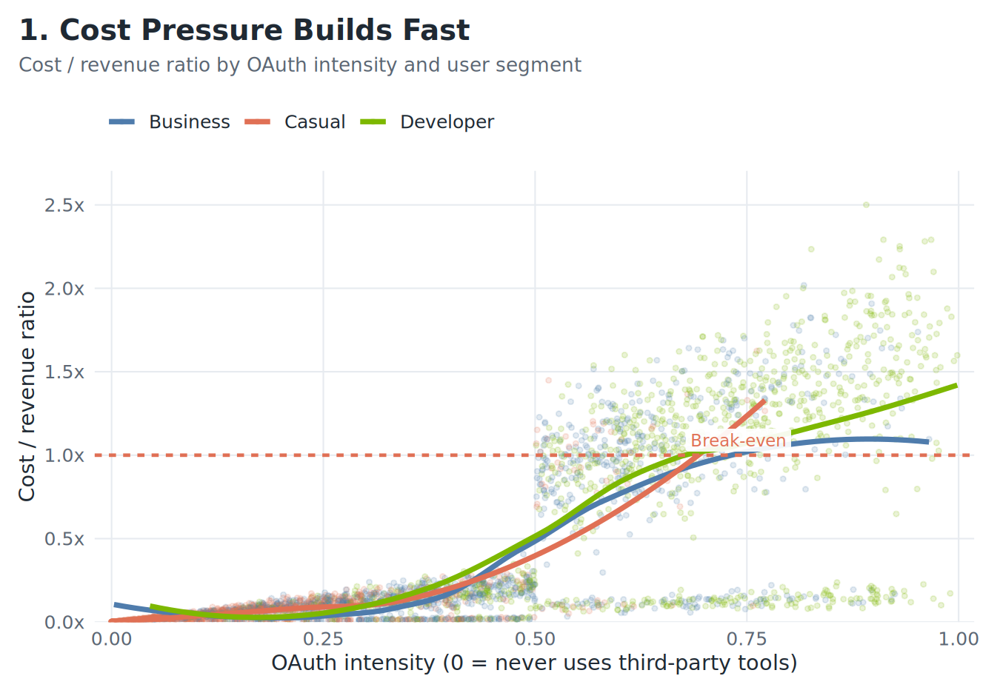
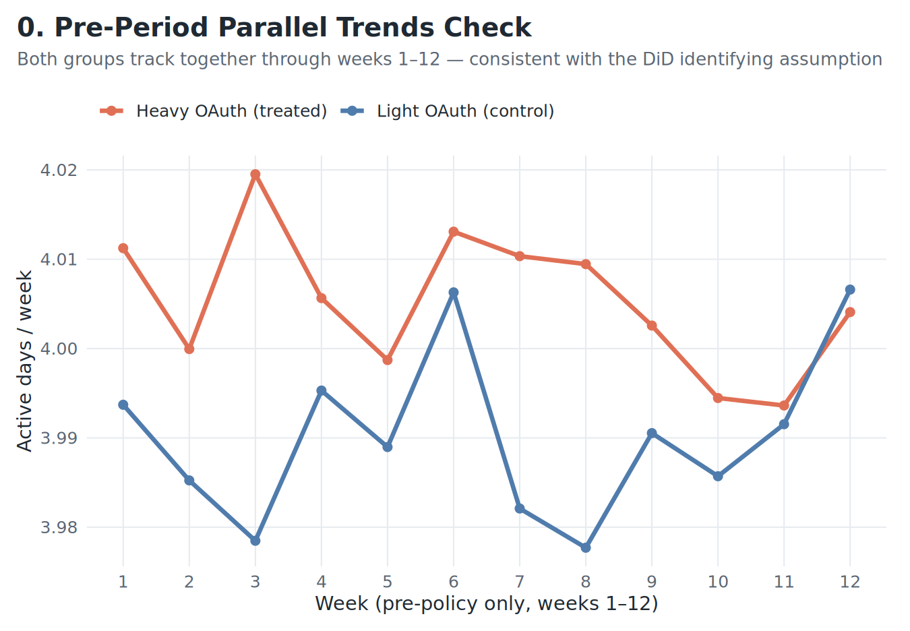
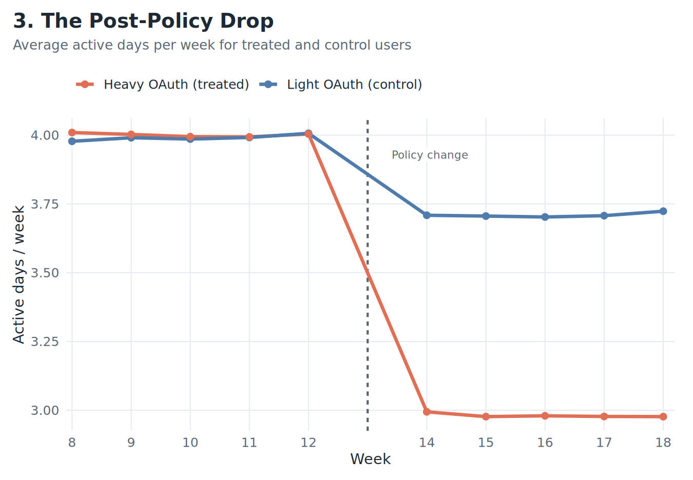
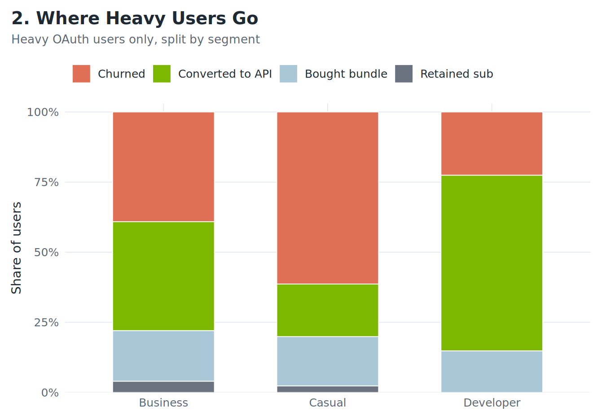
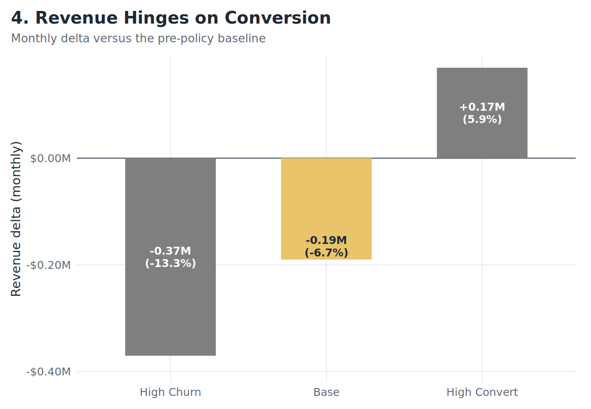

<!--more-->

*Article by John Tribbia*

> **A note on scope.** The numbers here come from synthetic data with known effects baked in from the start. This is not an attempt to backsolve Anthropic's revenue model. It is a demonstration of how a data team could study a policy change like this without fooling themselves.
>
> **A note on measurement.** When I say `OAuth intensity`, think of the pre-policy share of a user's prompts or tokens that were routed through OAuth-connected third-party tools. In a real product setting, that is the practical version I would want in the logs, frozen before the rule change.

Anthropic's April 2026 decision to stop covering third-party OAuth usage under Claude subscriptions looked abrupt. From a unit economics perspective, it was also pretty easy to understand. If a relatively small slice of power users was routing API-like workloads through a flat-rate plan, the problem was never really about optics. It was arithmetic.

This piece borrows the logic from my earlier [model-quality analysis](../model-quality-overview/). Instead of asking whether better answers make people come back more often, it asks whether **pre-policy OAuth intensity predicts who takes the hit when the rule changes**.

## Same plan, completely different cost world

Two users can both pay for `Pro` and be nothing alike economically. One opens Claude a few times a week. The other runs a big chunk of a development workflow through an OAuth-connected coding tool. The subscription line is the same. The compute bill is not.

| Segment | OAuth Heavy? | Avg Monthly Rev | Avg Monthly Cost* | Cost/Rev Ratio* | % Unprofitable* |
|---------|-------------|----------------|-------------------|-----------------|-----------------|
| Developer | Yes | $55.77 | $25.79 | **1.06** | ~40% |
| Business | Yes | $54.89 | $22.61 | 0.93 | ~28% |
| Casual | Yes | $54.80 | $20.84 | 0.87 | ~22% |
| Developer | No | $56.45 | $3.25 | 0.13 | ~0% |
| Business | No | $57.31 | $2.54 | 0.10 | ~0% |
| Casual | No | $56.26 | $1.16 | 0.05 | ~0% |

*\* Synthetic data only. Cost figures are modeled, not sourced from Anthropic.*

In the synthetic data, heavy-OAuth developers are where the stress shows up first. That is the whole point. The plan tier does not tell you where the margin problem lives. The usage pattern does.

*As OAuth intensity rises, the cost/revenue ratio climbs quickly for developer-type users and crosses break-even first.*

## Why a simple before-and-after read fails

The obvious way to study the policy is to compare churn before and after April 4. That kind of read tells you almost nothing. The announcement arrived with press coverage, social chatter, competitor responses, and a rush of user reactions all at once. A raw before-and-after comparison would credit the whole weather system to one umbrella.

This is the same confounding trap that shows up in model rollout analysis. Deployment boundaries are noisy. Policy boundaries are even worse. If the goal is causal measurement, you need variation that existed before the announcement and only determines exposure to the change.

## Freeze the exposure before the announcement

That variation is pre-policy OAuth intensity: in practical terms, the share of prompts or tokens a user was already routing through OAuth-connected tools before Anthropic changed the rules. Some users were structurally dependent on that workflow long before the announcement. Others were barely touched. Measure that behavior early, freeze it, and compare users within the same plan tier.

| Plan | Mean Centered* | SD of Centered Score* |
|------|---------------|----------------------|
| Pro | 0.000 | 0.276 |
| Max | 0.000 | 0.272 |

*\* Synthetic data. Mean of zero within each plan confirms the centering is clean.*

In the synthetic data, the frozen seven-week estimate is almost perfectly aligned with the full pre-period mean (`r = 0.996`). That matters because the exposure is not random week-to-week noise. It is a stable feature of how the user works.

Before using that frozen exposure in the DiD estimator, it is worth checking that the two groups were not already on diverging trajectories in the pre-period. If they were, the DiD estimate would be picking up pre-existing drift rather than the policy's effect.

*Both groups track together through the full 12-week pre-period. A regression test of the week × OAuth interaction in the pre-period returns a coefficient indistinct from zero, consistent with the parallel trends assumption.*

*For readability, the chart uses a simple heavy-versus-light split. The tighter specification keeps the exposure continuous within each plan tier.*

Once you have that exposure measure, the rest is fairly clean: center it within `Pro` and `Max`, build a pre/post panel, and estimate a difference-in-differences model. For the simple chart and binary DiD, the control group is light-OAuth users. That is a practical choice, not a perfect one, because some of those users are still a little exposed. The higher-fidelity version is the continuous within-plan estimator, which keeps each user's frozen pre-policy OAuth share instead of forcing everyone into hard buckets. In the synthetic data, that estimator returns a large negative effect. Users who relied more heavily on OAuth tools lose materially more active days per week after the block lands.

| Model | Coeff.* | 95% CI* | Std. Error | p-value | Interpretation |
|-------|--------|---------|-----------|---------|----------------|
| Binary DiD (Heavy vs Light) | -0.762 | [-0.81, -0.72] | 0.023 | < 0.001 | Heavy OAuth users lose ~0.76 active days/week post-policy |
| Continuous (Within-Plan) | -1.038 | [-1.12, -0.96] | 0.040 | < 0.001 | 1-unit increase in OAuth intensity = 1.04 fewer active days/week |

*\* Synthetic data. These coefficients recover an injected effect, not an observed one.*

## What happens next depends on who the user is

Not every affected user does the same thing after the wall goes up.

| Destination | Revenue Impact | Key Driver | Implication |
|-------------|---------------|------------|-----------------|
| Churn | -$20 to -$200/mo | Casual users; no API need | Retention risk |
| Convert to API | +$65/mo avg | Developers; power users | Expansion opportunity |
| Buy Bundle | +$50/mo | Business; moderate need | Upsell motion |

| Segment | Churned* | Converted to API* | Bought Bundle* | Retained Sub* |
|---------|---------|-------------------|----------------|---------------|
| Developer | 22.6% | **62.6%** | 14.8% | N/A |
| Business | 39.1% | 38.8% | 18.1% | 4.0% |
| Casual | **61.3%** | 18.8% | 17.6% | 2.3% |

*\* Synthetic data only. These are injected probabilities, not observed Anthropic figures.*

Developers are the conversion story. Casual users are the churn story. Business users sit in the middle. A go-to-market team needs that view early — the playbook for a developer is nothing like the one for a casual user.

*Heavy users do not all disappear. Developers convert at much higher rates than casual users, while casual users are far more likely to walk.*

A user who genuinely needs API access and can wire it up in an afternoon is a very different problem from a user who only wanted a convenient flat-rate tool. The first group is an expansion opportunity. The second is a retention risk.

There is also a PLG read here. The developer who self-migrates to direct API access after the OAuth block is the canonical PLG conversion event: demonstrated value → friction introduced → willingness to pay for direct access confirmed. That user was already running production-adjacent workloads through Claude. They are now on a usage-indexed plan where spending scales with the value they extract, and they got there without a sales motion. If API conversion rates for that cohort hold up, the policy did not just solve an economics problem — it moved a segment of power users onto the right commercial trajectory.

## The policy is a customer-journey decision

This is the part most pricing commentary tends to miss. Anthropic did not just change what usage is covered. It changed the path users have to take to keep doing the same job.

If the API migration is smooth, the policy can work. If it is clumsy, it becomes a revenue leak and a gift to competitors. In the synthetic scenario model, the policy only turns clearly positive when API conversion gets high enough to offset churn.

| Scenario | P(Churn) | P(Convert to API) | P(Bundle) | Monthly Rev Delta* | % Change* |
|----------|---------|-------------------|-----------|-------------------|-----------|
| High Churn | 55% | 25% | 20% | **-$0.38M** | -13.5% |
| Base | 42% | 40% | 18% | **-$0.19M** | -6.7% |
| High Convert | 20% | 60% | 20% | **+$0.14M** | +5.0% |

*\* Synthetic data, illustrative only.*

*The outcome turns on conversion execution, not just the price sheet.*

The decision is made. This is an execution problem now. Documentation, migration flow, credits, bundling, and onboarding matter more than the announcement copy once the decision has been made.

## What this means for a data team right now

The measurement framework here is only useful if the right data exists when you need it. In practice, that requires three things done before the policy lands.

First, instrument the exposure before the shock. OAuth intensity as an identification variable only works if it is in the logs before the rules change. The right schema: `user_id`, `session_id`, `oauth_app_id`, `token_count`, `plan_tier`, `timestamp` — frozen at the end of the pre-period. A data team that builds this column retroactively, after the announcement, is already too late for clean identification.

Second, watch two numbers, not one. With churn held at the base-case 42%, even converting every remaining non-bundle user to API (~40%) still does not reach breakeven — the API average ($85/mo) is not high enough to fully offset the cost from churned users at base-case rates. The policy turns net-positive when both conversion rises (~50%) and churn falls simultaneously (~30%). Those are the two leading indicators a GTM team needs on a live dashboard in the 30 days after launch: API conversion rate and churn rate, tracked separately for the heavy-OAuth cohort, not the full user base.

Third, segment the migration support before day one. Developers and casual users need completely different responses. Developers need clean API onboarding docs, a credit bridge, and minimal friction between "my OAuth tool stopped working" and "my API key is wired up." Casual users need a clear explanation of what changed and an honest look at whether a bundle covers their actual use case. One generic migration email to the entire affected cohort is the most expensive mistake available.

## The logic transfers

Nothing about this framework is specific to Anthropic or OAuth. The same logic works whenever a product or pricing change hits users differently based on how they actually use the product: tier migrations, feature sunsets, pricing shifts, even model rollouts with uneven value across tasks.

The regression is the easy part. Logging the right behavioral data before the decision lands is the hard part. If you have that, you can tell who actually took the hit and who was just standing nearby when the news cycle exploded. You can also be honest about the tradeoff between a readable heavy-versus-light comparison and the higher-fidelity continuous exposure model underneath it.

## The read

You do not learn much by staring at the date the policy landed. You learn more by finding the user-level exposure that was already there before the shock, freezing it, and letting that carry the identification.

That is what this synthetic exercise shows. If heavy third-party OAuth users were the group breaking flat-rate subscription economics, Anthropic's move was not arbitrary. It was arithmetic.

---

*All data in this post is synthetic. The [analysis notebook](rate_limit.ipynb) that generated the figures live alongside this post in the site repo.*
