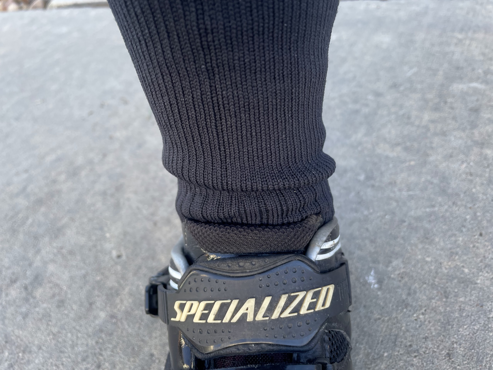
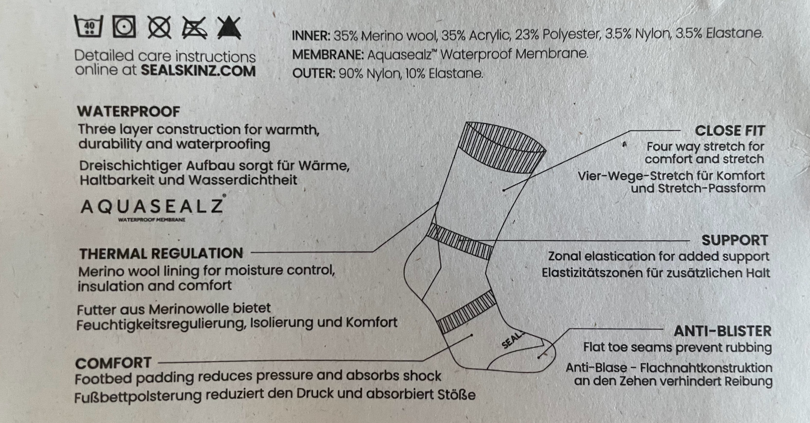
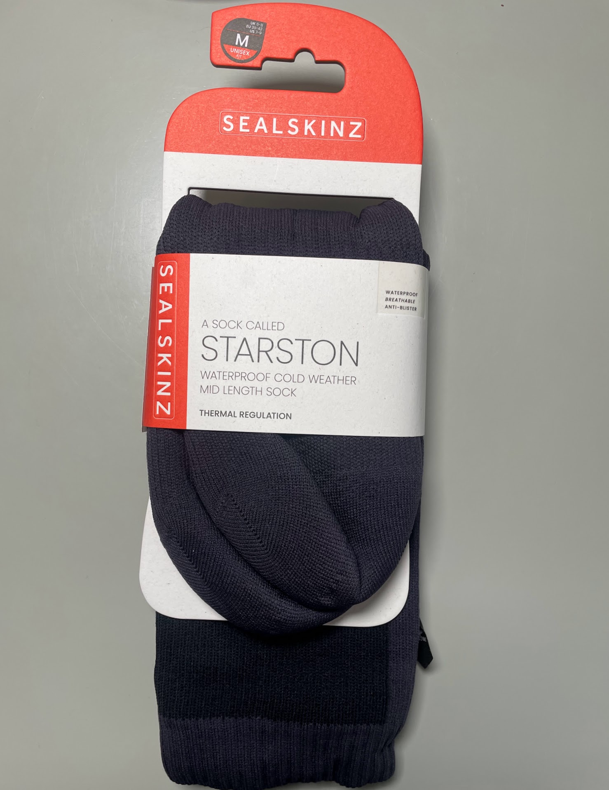

<!--more-->

For two hours, I battled the elements – a relentless wind, a biting
20-degree chill, and the ever-present threat of numb toes. But my feet
remained blissfully warm and dry, thanks to the remarkable technology
woven into the [Sealskinz Starston Cold Weather Waterproof
Socks](https://www.sealskinzusa.com/products/starston-waterproof-cold-weather-mid-length-sock?variant=36556990939302)
($55).

These socks are more than just a layer of warmth; they're a fortress
against the harshest winter conditions. At the core of their brilliance
lies a highly sophisticated three-layer construction:

- **Inner layer:** The hero here is the luxurious merino wool lining,
  naturally wicking away moisture while providing exceptional thermal
  insulation. This natural wonder material keeps your feet warm and dry,
  even during intense activity.

- **Middle layer:** A 100% waterproof, breathable membrane forms the
  heart of the Starston socks. It acts as an impenetrable barrier
  against external elements, preventing rain, snow, and puddle splashes
  from soaking your feet.

- **Outer layer:** A robust nylon blend on the exterior offers
  durability and four-way stretch, ensuring the socks conform
  comfortably to your feet. This layer also boasts zonal elastication,
  providing a snug yet flexible fit that won't bunch or restrict
  movement.

The seamless toe box eliminates any potential rubbing or discomfort,
even during long rides. And speaking of long rides, I put the Starston
socks to the ultimate test with a two-hour cycling adventure in the
teeth of a 20-degree winter morning.

Despite the long duration and frigid temperatures, my feet remained
comfortably dry and warm throughout the entire ride. The merino wool
worked its magic, wicking away any sweat while the waterproof membrane
kept external moisture out. It was a true testament to the technical
prowess of these socks.

I selected the Medium size, despite my shoe size falling at the upper
end of the recommended range. The fit was without issue – snug,
comfortable, and flexible, with no major bunching that caused
discomfort. I was worried the thickness would cause problems with my
cycling shoes, but the fit is snug enough that the sock conforms to the
foot quite well and caused no issues.

However, the Starston socks come with some caveats. Firstly, their
bulkiness might not be ideal for some tight-fitting cycling shoes, even
though I didn’t have any problems. Although the four-way stretch helps
with flexibility, the additional layers contribute to a thicker build
than standard cycling socks.

Secondly, while the merino wool effectively regulates temperature, it
can sometimes feel a little too warm in milder winter conditions. On
days when the temperature hovers above freezing, the socks might feel
slightly uncomfortable, almost like having a plastic bag over your foot,
which could potentially leading to sweaty feet.

Finally, at $55 per pair, the price point might be a deterrent for some
riders.

Notwithstanding, the Sealskinz Starston socks aren’t just a pair of
socks; they're a winter cycling essential and I think are well worth the
price. Their exceptional warmth, waterproof protection, and impressive
moisture wicking make them a game-changer for conquering cold-weather
rides, runs, or hikes. If you're after warm, dry feet on even the most
brutal winter days, look no further than the Starston. They'll keep you
comfortable and protected, letting you focus on the recreation, not the
elements.

Thanks for reading Boulder Gear Lab! Subscribe for free to receive new
posts and support my work.
