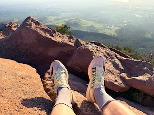
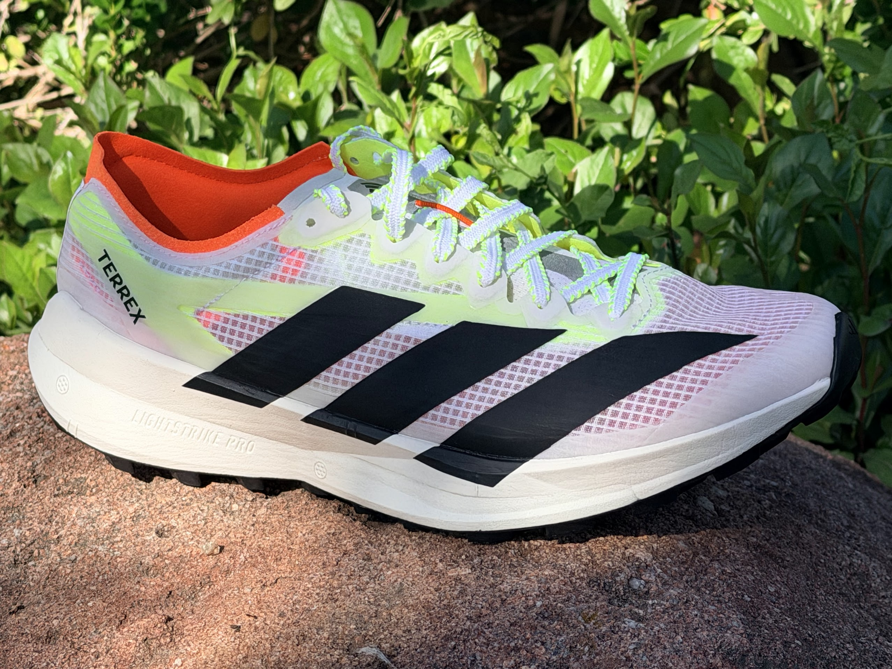
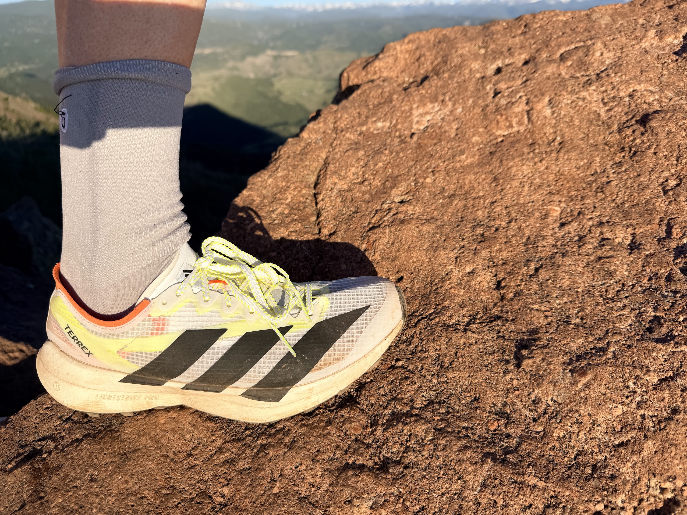
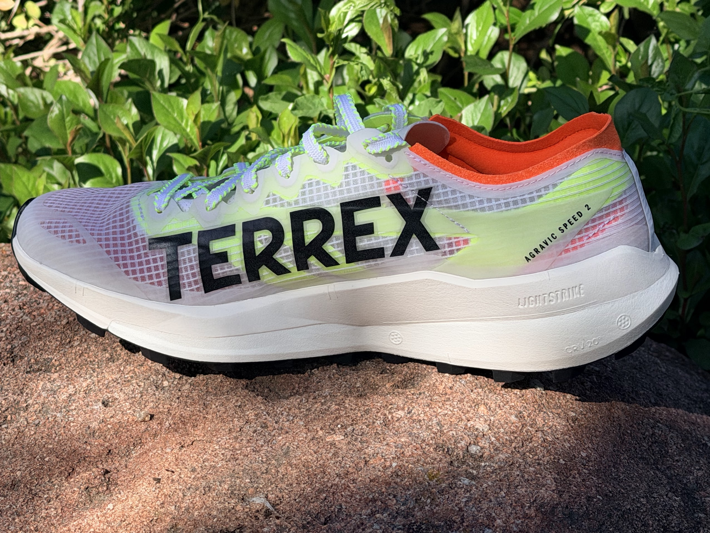
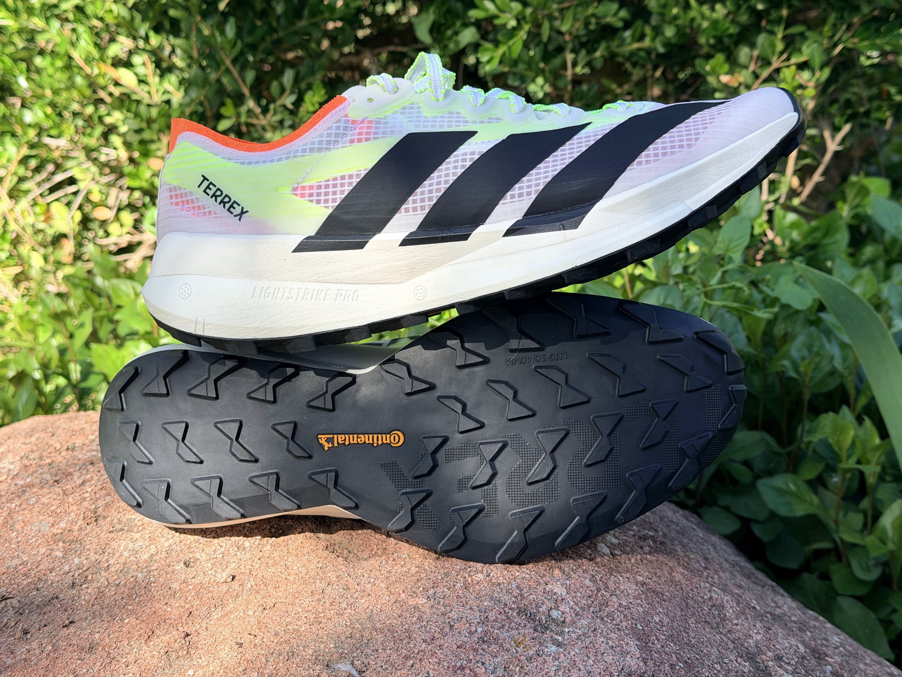
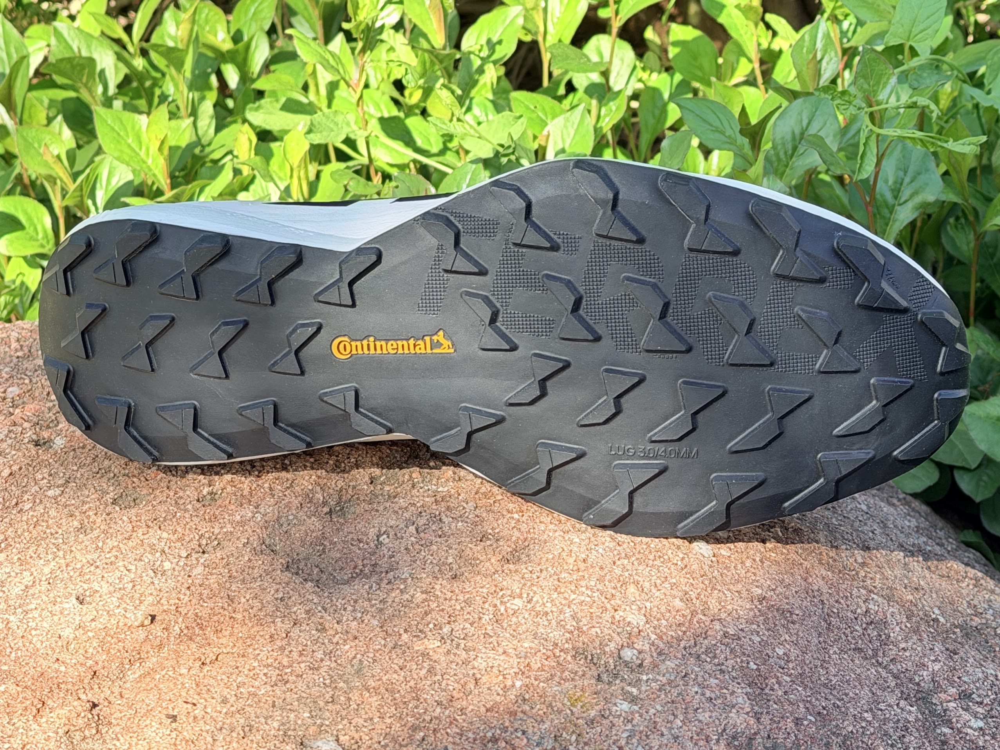

<!--more-->



	
Road Trail Run

	
Boulder Gear Lab | Est. 2020 | Boulder, Colorado

Gear Review | Trail Running | Footwear

	
adidas Terrex Agravic Speed 2 | Field Test

	<h1>adidas Terrex Agravic Speed 2 Review</h1>

	
Dual-density Lightstrike cushioning and a nimble, non-plated platform, tested across the technical blocks of the Mt Sanitas Trail Climb to the smooth singletrack of Lions Lair.

	

		
By John Tribbia

		
Test Terrain Mount Sanitas, Boulder CO

		
Original Post <a href="https://www.roadtrailrun.com/2026/06/adidas-terrex-agravic-speed-2-review-3.html?m=1#google_vignette">RoadTrailRun</a>

	

	

		
adidas Terrex Agravic Speed 2

		
$165

	

	Mount Sanitas | 6,820 ft
	~1,264 ft gain
	Sanitas Valley Trailhead
	Multiple ascents | Mixed conditions

	
Originally published on <a href="https://www.roadtrailrun.com/2026/06/adidas-terrex-agravic-speed-2-review-3.html?m=1#google_vignette">RoadTrailRun</a>. Read all RoadTrailRun reviews <a href="https://www.roadtrailrun.com">here</a>.

	

		
I tested the Agravic Speed 2 across the classic Mount Sanitas loop, a route that demands immediate transitions between drastically different terrain types. The outing begins with a short valley connector before hitting the Mt Sanitas Trail Climb, a relentless 1.17-mile technical staircase of jagged sandstone blocks, log steps, and steep, off-camber scrambles. After the summit ridge, the route drops down the back side via the Lions Lair Trail, transitioning into smooth, flowing singletrack. The loop finishes with a high-speed blast down the gravel of the Sunshine Canyon Trail back to the trailhead. That sequence puts a lightweight, non-plated race shoe through a definitive test of agility, climbing efficiency, and descending protection.

		

		

			<h4>Specifications</h4>
			

				
Weight (Men's US 8.5)8.1 oz / 232g

				
Stack Height35mm heel / 27mm forefoot

				
Drop8mm

				
Platform Width75mm heel / 65mm midfoot / 110mm forefoot

				
Lug Depth3-4mm

				
MidsoleDual-density Lightstrike Pro and Lightstrike 3.0 carrier

				
OutsoleContinental Rubber

				
Price$165

			

		

		

		<h2>Fit and Upper</h2>

		<h3>On the Valley Approach</h3>

		
Lower valley terrain out of the Sanitas trailhead gives a brief window to evaluate fit before the steep climbing begins. The surface is wide hardpack and gravel, smooth enough that you can settle into a rhythm and notice how the foot sits inside the shoe before it gets asked to handle bigger lateral forces.

		
Out of the box, the Agravic Speed 2 looks and feels like a road racing flat. Step-in comfort is low-volume and streamlined, standing in stark contrast to heavily padded daily trainers. I tested a half-size up from my usual US 9, which provided excellent lengthwise fit, though the streamlined engineered mesh upper leaves some volume in the toe box that requires mindful, tight lacing to secure.

		
Midfoot and heel lockdown are where this version shines over its predecessor. Using the yellow slingshot overlays adapted from adidas' road racing line, the heel collar firmly anchors the rearfoot. On early flat sprints and quick directional changes off the ditch trail, my foot stayed perfectly centered over the footbed with zero heel slippage. Breathability is excellent. In warm, dry Colorado conditions, ventilation is strong, though it achieves this by stripping away excess luxury padding.

		

		<h2>Midsole and Platform</h2>

		<h3>Through the Mt Sanitas Trail Climb</h3>

		
Mt Sanitas Trail Climb is a brutal arena for a trail shoe. Gaining 1,264 feet in just over a mile, the trail is a continuous sequence of steep sandstone steps, mandatory high-step ups, and uneven rock platforms. A shoe here has to provide efficient power transfer on the way up and lateral stability when stepping onto angled rock faces.

		

			<strong>Mt Sanitas climb split analysis</strong>
			<dl>
				<dt>1st Half (0.60 mi, 637 ft gain)</dt>
				<dd>8:56 (14:48/mi) - High cadence, nimble stepping.</dd>
				<dt>2nd Half (0.62 mi, 665 ft gain)</dt>
				<dd>9:51 (15:50/mi) - Chunky terrain, power-tempo scaling.</dd>
			</dl>
		

		
Underfoot characteristics define this shoe's performance on a pitch like Sanitas. The midsole uses a dual-density configuration: a soft, responsive layer of Lightstrike Pro on the bottom for rebound, caged by a firmer Lightstrike 3.0 carrier on top for stability. Without a rigid carbon plate or energy rods, the shoe retains a natural, predictable flex underfoot. On the first half of the climb, that flexibility allowed my foot to mold naturally over changing rock shapes, keeping the stride efficient and yielding an 8:56 split for the first 637 feet of vert.

		
As the climb turns chunkier and steeper in the second half, the aggressive rocker profile, characterized by a deep heel bevel and an early forefoot rocker, comes to life. On the 15% grade bursts of the Sanitas power-tempo segment, the geometry forces a rapid forward transition, loading the calves and quads effectively for steep climbing.

		
Tradeoff here is stability versus platform width. Midfoot platform is narrow at 65mm, though 5mm wider than v1. Lower overall stack height keeps your center of gravity close to the ground, and neutral runners will find it incredibly nimble, but runners who overpronate may feel some medial roll when stepping heavily onto the off-camber sandstone blocks near the summit ridge.

		

		

			"No plate, no rods, no forced lever effect. On Sanitas, that freedom lets the shoe move with the terrain instead of arguing with it."
		

		<h2>Outsole and Traction</h2>

		<h3>Lions Lair Descent and Summit Ridge</h3>

		
Dropping off the 6,820-foot summit onto Lions Lair changes the assignment completely. Terrain shifts from rugged rock steps to a smooth, winding singletrack ribbon that cuts through the pines. Descent here demands a shoe that can corner confidently at high speed while shedding loose grit.

		
Continental rubber continues to be the gold standard for dry, variable Colorado singletrack. Featuring multi-directional lugs measuring 3mm to 4mm, the outsole bit flawlessly into loose gravel over hardpack along the upper switchbacks of the descent. Lug spacing ensures that loose debris sheds instantly on every stride.

		

		
On the Lions Lair/Swoop descent, I was able to open up the stride into an 11:15/mi sustained descending pace over 2.39 miles. On fast, banked corners, the rubber compound holds onto dry rock and dirt with absolute authority.

		

			<strong>Terrain-by-terrain traction - Sanitas loop</strong>
			<dl>
				<dt>Valley Connector (gravel / hardpack)</dt>
				<dd>Smooth, quiet, road-flat feel.</dd>
				<dt>Sanitas Climb (sandstone blocks)</dt>
				<dd>High friction on dry rock, stable edging.</dd>
				<dt>Lions Lair Descent (singletrack)</dt>
				<dd>Confident cornering, bites into loose dirt.</dd>
				<dt>Sunshine Canyon (fireroad)</dt>
				<dd>Fast rolling, transitions smoothly.</dd>
			</dl>
		

		
Limitation of this outsole is depth-dependent. At 3-4mm, the lugs lack the sheer bite required for deep, sloppy mud or heavy clay. For fast, dry singletrack and slabby rock, though, it delivers maximum traction with minimal rolling resistance.

		<h2>The Descent</h2>

		<h3>Sunshine Canyon Finish</h3>

		
Final leg of the loop joins Sunshine Canyon Trail, a wide descending gravel path back to the base. It is a pure test of rolling efficiency and raw impact absorption when the legs are already fatigued from the technical climbing.

		
Coming off the smooth singletrack and hitting the wide gravel, the Agravic Speed 2 feels remarkably like a road shoe. On the 1.18-mile Sunshine Canyon descent, I hit my fastest sustained pace of the loop at 10:00 flat (8:25/mi). Lightstrike Pro does an admirable job of taking the harshness out of high-cadence gravel pounding, and the rocker geometry continuously rolls you forward onto your toes.

		
Primary vulnerability shows up here: rock protection. Agravic Speed 2 lacks a traditional rock plate to maintain its featherweight 8.1 oz build. While the dual-density foam absorbs general impact, sharp embedded stones can push through the forefoot. Because the aggressive rocker encourages a fast, forward-leaning foot strike, your quads will also absorb extra braking forces on steep downhills. This is a ride that rewards precise foot placement and nimble running rather than mindless heel-smashing.

		

		

			

				<h5>Works Well</h5>
				<ul>
					<li>8.1 oz weight feels incredibly light and agile on steep, sustained climbing</li>
					<li>Lightstrike Pro layer delivers crisp energy return when pushing the pace on flat and downhill segments</li>
					<li>Non-plated construction preserves a natural, flexible stride through the foot roll</li>
					<li>Continental rubber provides flawless traction on dry rock, gravel, and singletrack</li>
					<li>Greatly improved heel lockdown via the rear slingshot overlays</li>
					<li>Outsole transitions beautifully onto road or smooth gravel connectors without clunkiness</li>
				</ul>
			

			

				<h5>Limitations</h5>
				<ul>
					<li>Missing a rock plate; sharp stones can be felt underfoot on highly technical descents</li>
					<li>Narrow 65mm midfoot platform can feel twitchy for runners requiring medial support on uneven ground</li>
					<li>Streamlined upper may require extra tensioning if you have a lower-volume forefoot</li>
				</ul>
			

		

		

			
9.2Ride

			
8.5Fit

			
9.0Traction

			
8.5Protection

			
9.0Overall

		

		

		<h2>Summary</h2>

		
adidas Terrex Agravic Speed 2 strips away the massive stack heights, carbon plates, and steep price tags of modern ultra-distance super shoes to deliver a nimble, highly connected racing option. On a diverse loop like Mount Sanitas, its split personality holds: it provides a flexible, featherweight tool to scale the steep, technical steps of the climb, then transitions instantly into a fast, rolling flat for the singletrack and gravel descent.

		
At $165, the price is right for trail runners who want a fast, nimble shoe for short-to-middle-distance efforts where ground feel and agility trump maximal cushioning.

		

			
Bottom Line

			
A lightweight trail racer with real grip, a secure heel, and a much more natural flex pattern than plated trail shoes aimed at the same fast-day use case. On Sanitas, it climbed efficiently, cornered hard, and rolled smoother on gravel than a shoe this light has any right to.

			
Best for short-to-middle-distance trail races and mountain workouts where agility matters more than maximal cushioning or full rock-plate protection.

		

		

	



