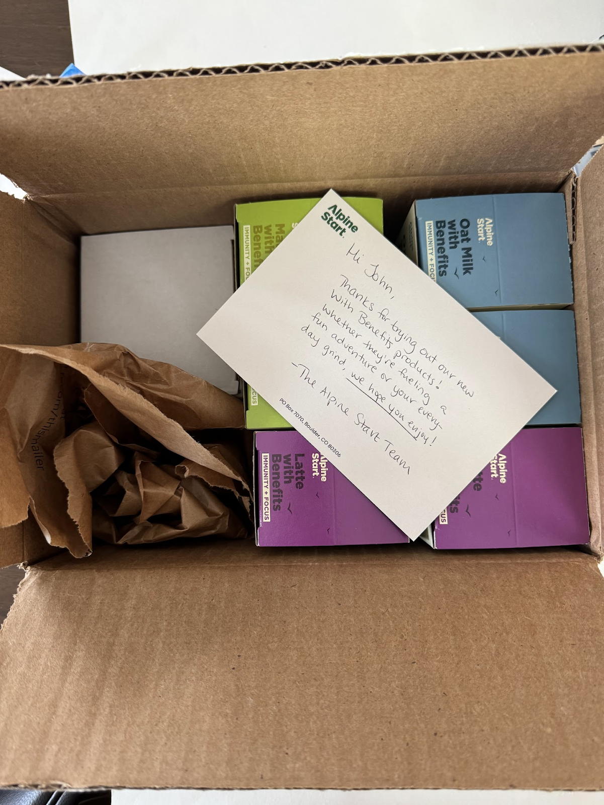
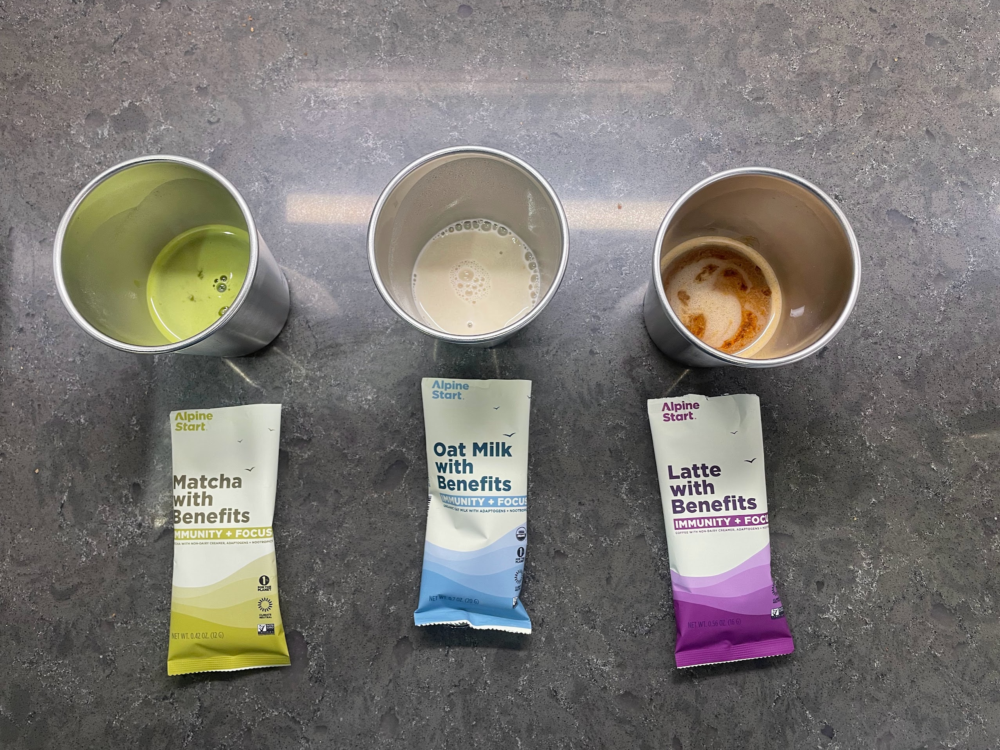
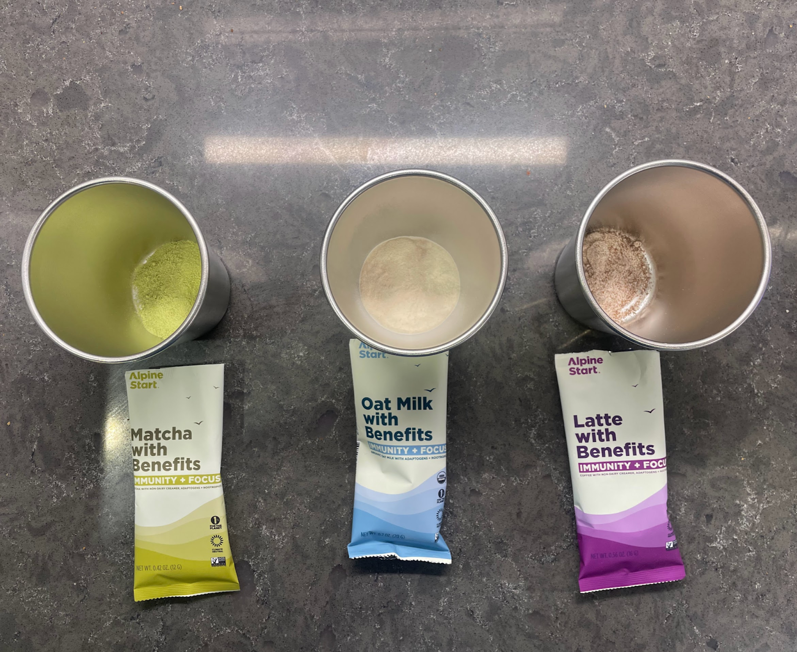

<!--more-->

Forget the days of instant coffee being synonymous with lukewarm
disappointment. [Alpine Start](https://alpinestartfoods.com/), a company
dedicated to fueling active lifestyles, has rolled into town boasting
instant coffee that, well, actually tastes good. They even claim it
surpasses the likes of Starbucks (gasp!).

Intrigued? Absolutely. So, when a care package containing Matcha with
Benefits, Oat Milk with Benefits, and Latte with Benefits, along with a
sleek metal mug, landed on my doorstep, my taste buds did a little happy
dance. Buckle up, because I'm diving headfirst into the world of Alpine
Start instant beverages, ready to report back on the taste, the
experience, and the overall "benefits" these little packets hold.

Thanks for reading Boulder Gear Lab! Subscribe for free to receive new
posts and support my work.

Beverages “with Benefits”

Forget bulky oat milk cartons and say goodbye to lackluster instant
coffee – Alpine Start has entered the chat with a line of "With
Benefits" beverages that redefine convenience and functionality. Their
"[Oat Milk with
Benefits](https://alpinestartfoods.com/products/oatmilk-with-benefits-single-serve)"
is a revelation for on-the-go oat milk lovers. Preparation is a breeze,
and within seconds, you're greeted by a smooth, creamy beverage that's
surprisingly free of grit or aftertaste. You can even adjust the
creaminess to your heart's content, making it perfect for any occasion.
But the real magic lies in the "Benefits" part. This dairy-free, vegan
blend boasts an "Immunity+Focus" punch with organic adaptogens, making
it a functional upgrade to your regular oat milk.

Craving a coffee kick? The "[Latte with
Benefits](https://alpinestartfoods.com/products/coffee-with-benefits-single-serve)"
is your answer. It's like a convenient, upgraded version of the oat
milk, offering a rich, satisfying latte with a bold, slightly chocolatey
coffee flavor. Just like the oat milk, this latte is infused with the
same "Benefits" blend, potentially boosting your immunity, focus, and
energy.

And for matcha enthusiasts, Alpine Start offers "[Matcha with
Benefits](https://alpinestartfoods.com/products/matcha-with-benefits-single-serve),"
taking the classic matcha experience to a new level. Think of it as
matcha with superpowers – organic ingredients work together to provide
mental clarity, immune support, and focus, making it the perfect
pick-me-up with a sustained energy boost.

Sure, there might be slight taste differences compared to freshly brewed
coffee or prepared oat milk, and the single-serve packets have a slight
cost premium. But when it comes to convenience, health benefits, and
portability, Alpine Start shines. So, ditch the bulk and embrace the
future – your taste buds (and your immune system) will thank you.

Thanks for reading Boulder Gear Lab! Subscribe for free to receive new
posts and support my work.
