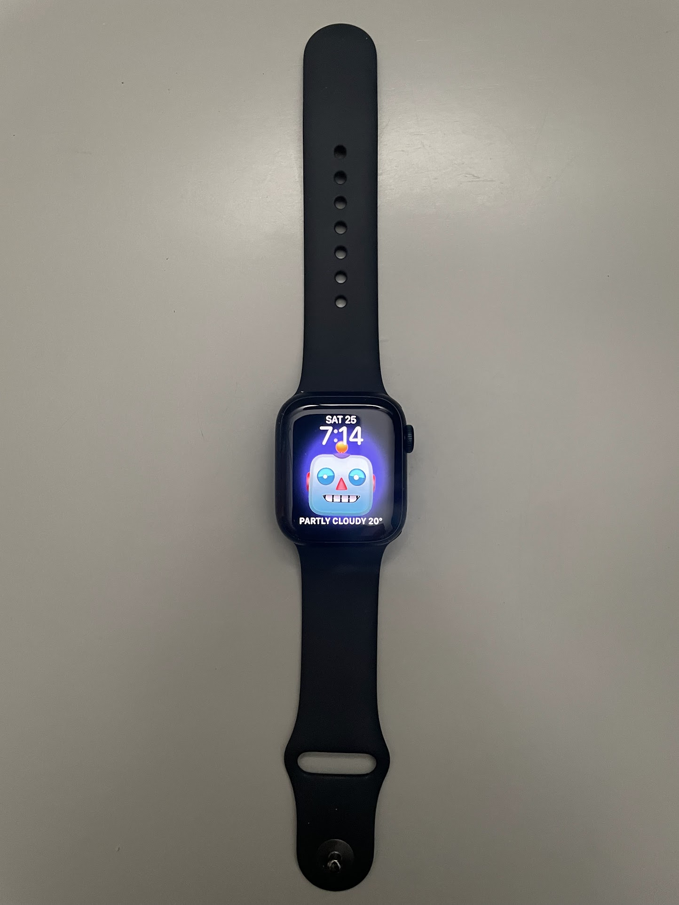
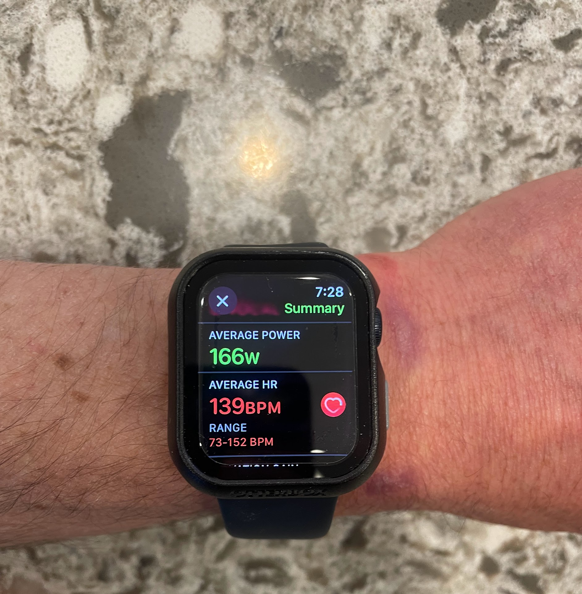
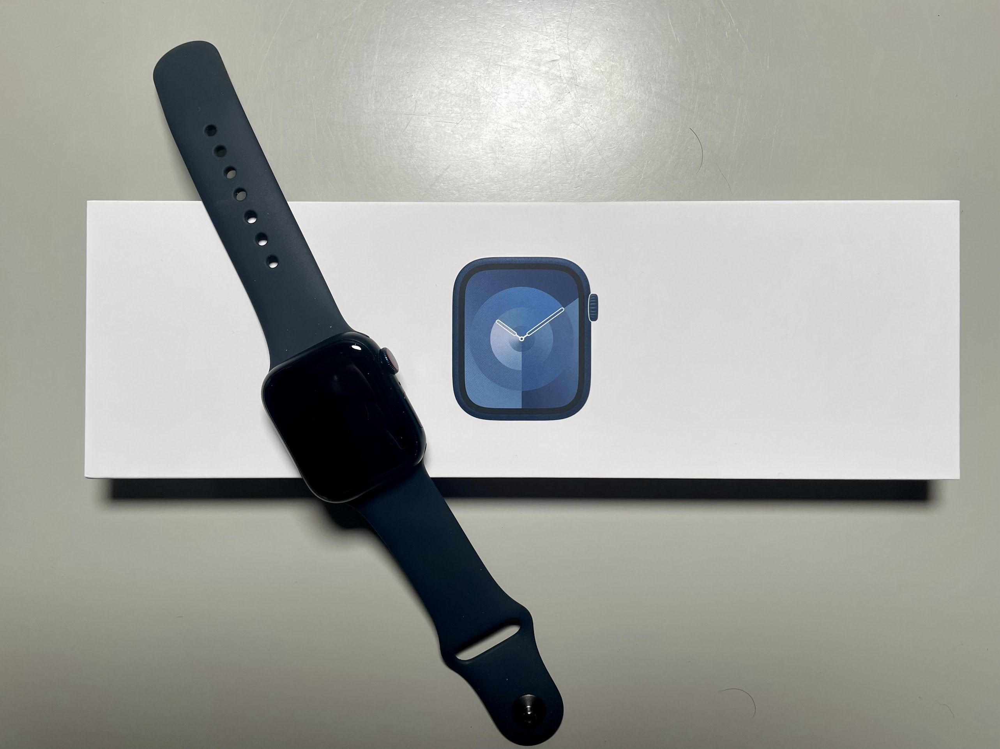
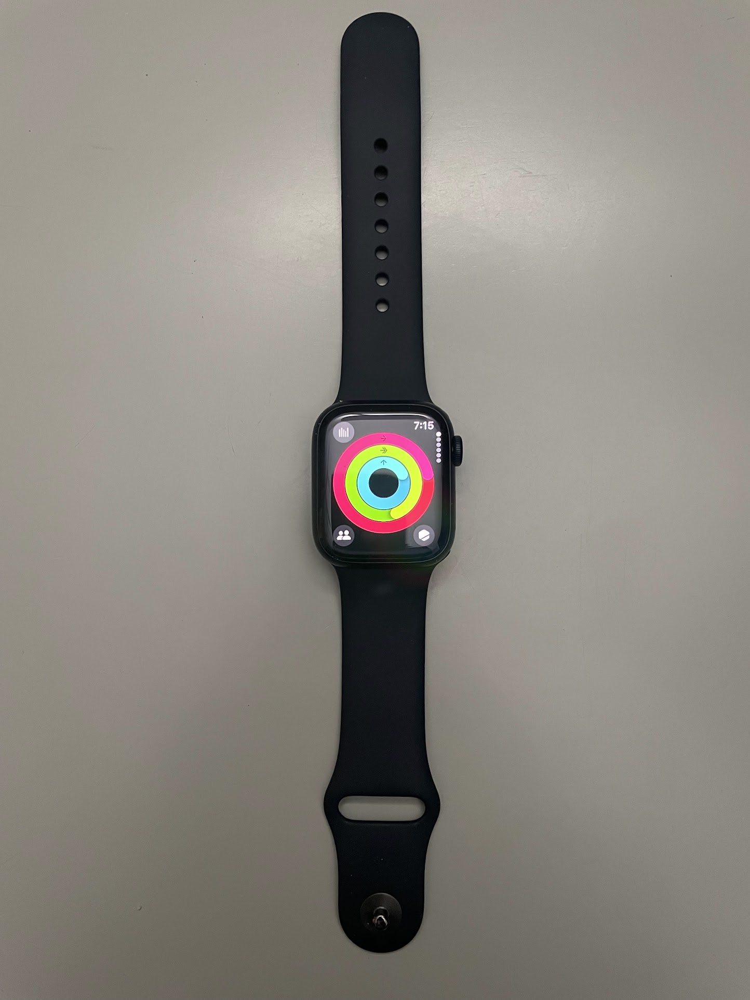

<!--more-->

For the last few weeks, the [Apple Watch Series
9](https://www.apple.com/shop/buy-watch/apple-watch) (starting at $399)
has been my daily companion on countless runs and cycling adventures.
I've put it through its paces, scrutinizing its strengths and weaknesses
for the dedicated runner and cyclist.

## Running with a Watchful Eye

The Apple Watch Series 9 caters to runners with an impressive array of
features:

- **Metrics at Your Fingertips**: Pace, distance, heart rate, elevation
  gain – all displayed with crisp clarity on the always-on display. The
  new Running Power metric adds a fascinating dimension, allowing you to
  fine-tune your effort for optimal pacing.

  

  

- **GPS Built for Performance**: Whether weaving through dense forests
  or pounding the pavement, the GPS impressed with its unwavering
  accuracy. Route tracking mirrored actual paths, ensuring reliable
  post-run analysis.

  

  

- **Motivation in Every Stride**: The Activity Rings proved surprisingly
  effective in keeping me interested in my daily metrics. Seeing the
  rings close, fueled by the potential for healthy competition with
  friends, can instill a sense of accomplishment and will spur many to
  push further.

  

  

## Gearing Up for Cycling

The Apple Watch Series 9 doesn't just run, it rolls with cyclists too:

- **Embrace the Data**: Essential cycling metrics like speed, distance,
  and cadence are readily available. WatchOS 10 unlocks compatibility
  with power meters and sensors, offering advanced data for the
  enthusiast.

  

  

- **Navigation Never Lost**: Built-in compass and offline topo maps make
  exploring new routes a breeze. Pre-planned routes integrate
  seamlessly, keeping you on track even when venturing far from cell
  service.

- **Safety First**: Whether tackling remote trails or bustling city
  streets, Emergency SOS and fall detection features offer paramount
  peace of mind. Knowing help is just a button press away is reassuring,
  especially for solo cycling. Moreover, I love not having to carry a
  phone in case I need to answer any urgent messages from home, work, or
  friends.

## **Beyond the Finish Line**

While the Apple Watch Series 9 shines in the realm of fitness, there are
a few considerations for dedicated athletes:

- **Limited Battery Life**: While sufficient for most activities and
  advertised to last 18 hours, extended endeavors with GPS will drain
  the battery quicker and may necessitate mid-day charging.

- **Small Screen Dilemma**: Viewing several metrics simultaneously can
  feel cramped on the watch face. The mirroring app helps by displaying
  data on your iPhone, offering a more expansive view.

- **Simplicity vs. Depth**: The lack of dedicated sport profiles and
  in-depth data analysis might leave hardcore athletes wanting more.
  Third-party apps can bridge the gap, but require additional
  investment.

## The Final Lap

The Apple Watch Series 9 is a compelling proposition for runners and
cyclists seeking a stylish, versatile, and accurate fitness companion.
Its intuitive interface, top-notch GPS, insightful metrics, and safety
features make it a valuable running and cycling partner. However,
acknowledging the limitations of battery life and data depth is
essential for athletes with demanding requirements. Ultimately, the
watch shines as a multi-faceted fitness tracker, offering a seamless
blend of practicality and motivation to help you hit your stride,
whether on two feet or on two wheels.

Thanks for reading Boulder Gear Lab! Subscribe for free to receive new
posts and support my work.
