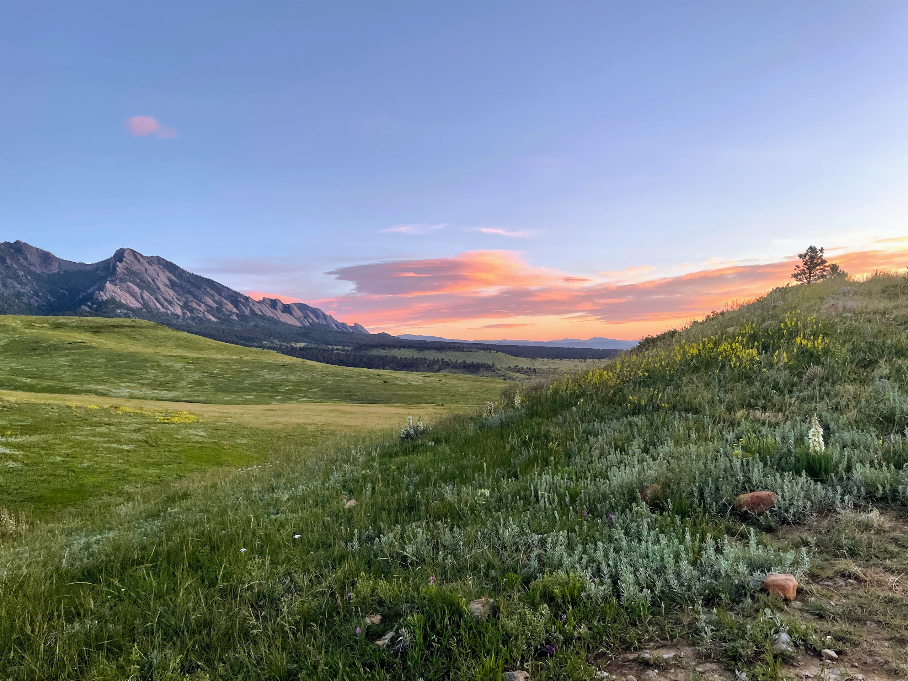

<!--more-->

<a href="https://bouldergearlab.substack.com/subscribe?"
class="button primary">Subscribe now</a>

## John Tribbia

John was born and raised in Boulder, CO and has been a regular technical
reviewer for running-oriented product testing website
[RoadTrailRun](http://www.roadtrailrun.com) with a large readership
domestically and internationally. He has other writing about NAAWK
[Sunscreen](https://naawkblog.wordpress.com/2017/01/03/dont-stow-away-the-sunscreen/)
and Yuba Cargo E-Bike ([Part
I](https://yubabikes.com/how-to-adopt-the-cargo-bike-lifestyle-step-1/),
[Part
II](https://yubabikes.com/how-to-adopt-the-cargo-bike-lifestyle-step-2/),
[Part
III](https://yubabikes.com/how-to-adopt-the-cargo-bike-lifestyle-step-3/),
[Part
IV](https://yubabikes.com/how-to-adopt-the-cargo-bike-lifestyle-step-4/)). 

John dabbled in bike racing both mountain and road as a junior Cat 5 and
eventually upgraded to Expert on the mountain bike. After his brief
stint of cycling racing and once in college, he crossed over to running
and found success as a sponsored mountain/trail runner by placing atop
the podium in domestic and international races. But he always kept his
bikes nearby for cross training while injured, supplemental training,
and commuting. Given that cross-over experience as well as 6+ years of
working at [University Bikes](https://www.ubikes.com/) in Boulder, CO
and over 20 years of competitive running, John loves the opportunity to
test the latest and greatest in both sports. 

------------------------------------------------------------------------

**Boulder Gear Lab** is an authority on bikes, cycling, running shoes,
and gear. With more than several hundred thousand miles run and biked
and millions of vertical feet gained in the U.S. and around the world,
**Boulder Gear Lab** provides knowledgeable and accessible product
reviews for the diverse backgrounds and interests of the running,
cycling, and outdoor gear community as a whole.

Please email [john@bouldergearlab.com](http://john@bouldergearlab.com)
for review requests.

------------------------------------------------------------------------

Thanks for reading the Boulder Gear Lab Substack! Subscribe for free to
receive new posts and support my work.
