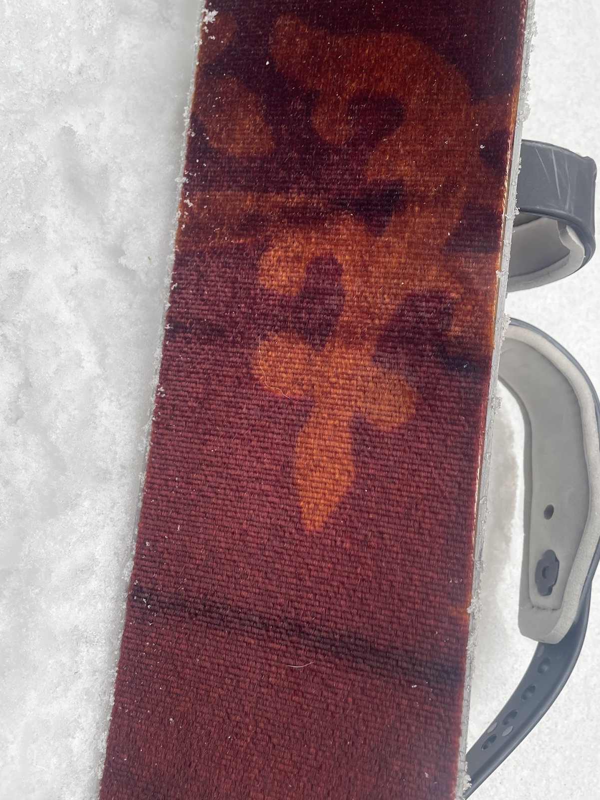
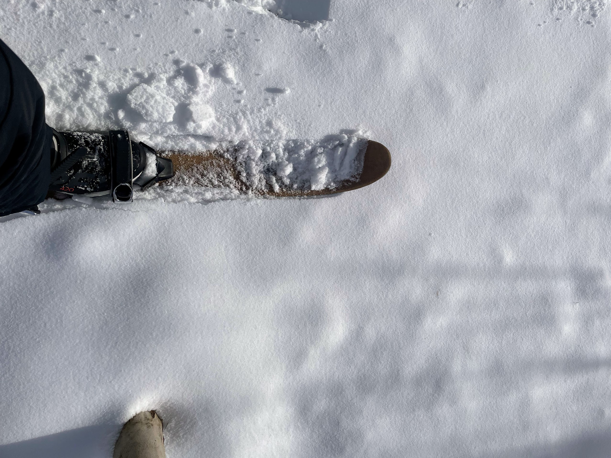
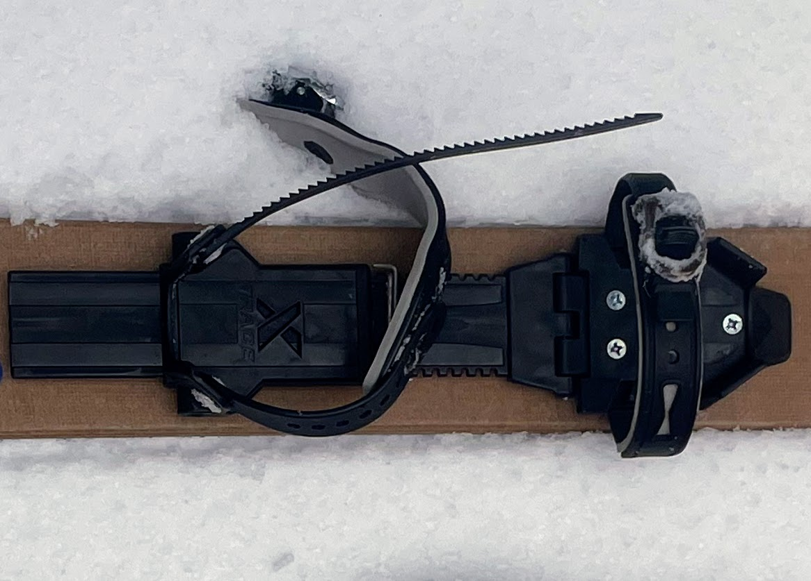
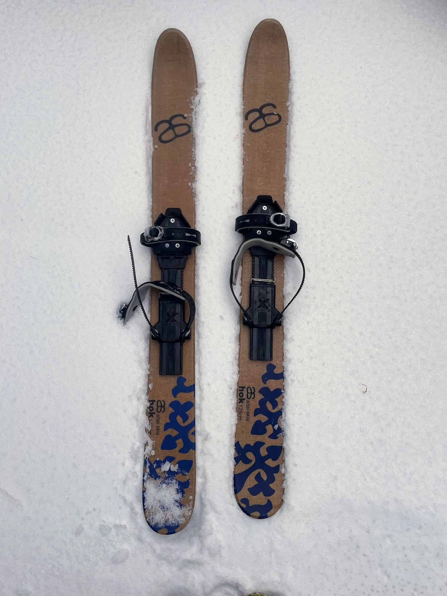

<!--more-->

## Inspired by Tradition, Refined for Modern Exploration

Deep in the Altai Mountains of North Asia, skis remain a vital tool for
traversing challenging landscapes and navigating deep snow. With this
heritage in mind, the founders of Altai Skis created the
[Hok](https://us-store.altaiskis.com/product/hok-universal-binding-package/)
($398 for the Universal Binding Package), a modern hybrid that combines
the capabilities of snowshoes with the glide of skis, giving birth to a
new category: skishoeing. This innovative approach offers outdoor
enthusiasts a versatile and efficient way to explore the winter
backcountry.

## First Impressions & Design

Upon unboxing the Hok Skis, the minimalist design and robust
construction immediately inspire confidence. The short length (125 cm)
and wide platform are all about stability, ideal for venturing
off-piste, while the lack of intricate bindings highlights the
user-friendliness of the universal binding system.

## Beyond first glance, the Hok reveals thoughtful design elements

**Integrated Climbing Skin**: A synthetic climbing skin seamlessly
integrated into the base provides exceptional uphill grip, eliminating
the need for additional skins and simplifying backcountry travel.

**Steel Edges & Lightweight Construction**: Durable steel edges offer
confidence on uneven terrain, while the lightweight cap construction and
paulownia wood core ensure effortless maneuverability.

**Sustainable Materials & Cultural Significance**: The sustainably
sourced paulownia wood core and incorporation of organic natural fibers
demonstrate the Hok's commitment to minimizing environmental impact. The
name "Hok," meaning "ski" in the Tuwa language and pronounced like the
English “hawk”, pays homage to skilled skiers of the Altai Mountains,
where the inspiration for skishoeing originated.

## Performance in the Backcountry

My testing journey through diverse winter landscapes showcased the Hok's
exceptional capabilities. The wide platform offered unmatched flotation
in deeper powder (best in 6” or deeper), while the base and integrated
climbing skin provided superior grip on steep inclines, even surpassing
the limitations of traditional snowshoes.

The shorter length and wider stance enabled good maneuverability in
tight spaces and dense woods, outperforming lengthy touring skis in
these situations. Although the glide couldn’t match dedicated touring
skis on groomed trails, the Hok delivered a smooth and enjoyable
experience on flat terrain and packed snow.

## Universal Binding & Diverse Options

The highlight remains the universal binding, compatible with a wide
range of footwear, eliminating the need for specialized ski boots. The
simple toe and heel straps allow for effortless strapping in and out,
even with gloves on. I used my La Sportiva Blizzard GTX and my only
complaint was about the placement of the BOA dial on my shoe overlapped
with the ankle portion of the binding. Notwithstanding, the shoe fit
well after adjusting the binding to fit and I felt confident on both
steep uphills and downhills. I don’t think every shoe is going to work,
so I would opt for a waterproof shoe with a little stiffness.

For those looking for a more traditional setup, the Hok includes inserts
for 75mm 3pin bindings. Additionally, an adapter plate available
separately offers compatibility with Rottefella NNN BC and Solomon BC
bindings, further enhancing the ski's versatility for various skiing
styles.

**Comparisons & Final Verdict**

The Hok occupies a unique niche between snowshoes and touring skis.
Compared to Snowshoes, it offers superior maneuverability, glide, and
grip on inclines. While both have limitations on icy surfaces, the Hok's
design provides greater control.

When compared to touring skis, the Hok excels in off-piste exploration
and deeper snow travel, providing superior stability and ease-of-use for
beginners. The lack of specialized footwear requirements and diverse
binding options make it a more accessible and affordable choice.
However, touring skis outshine the Hok on groomed trails and in downhill
skiing scenarios.

Ultimately, the Altai Hok Ski with Universal Binding redefines winter
exploration. Its exceptional performance in deep snow, ease-of-use, and
compatibility with various footwear make it an ideal choice for
off-piste adventures, casual outings, and backcountry expeditions. The
thoughtful design elements, commitment to sustainability, and diverse
binding options further solidify its appeal among outdoor enthusiasts of
all skill levels.

While not intended for high-speed downhill skiing or racing, the Hok
opens doors to a new realm of winter experiences, offering a unique
blend of control, efficiency, and adaptability for exploring the
untracked landscapes beyond the groomed trails.

Thanks for reading Boulder Gear Lab! Subscribe for free to receive new
posts and support my work.
