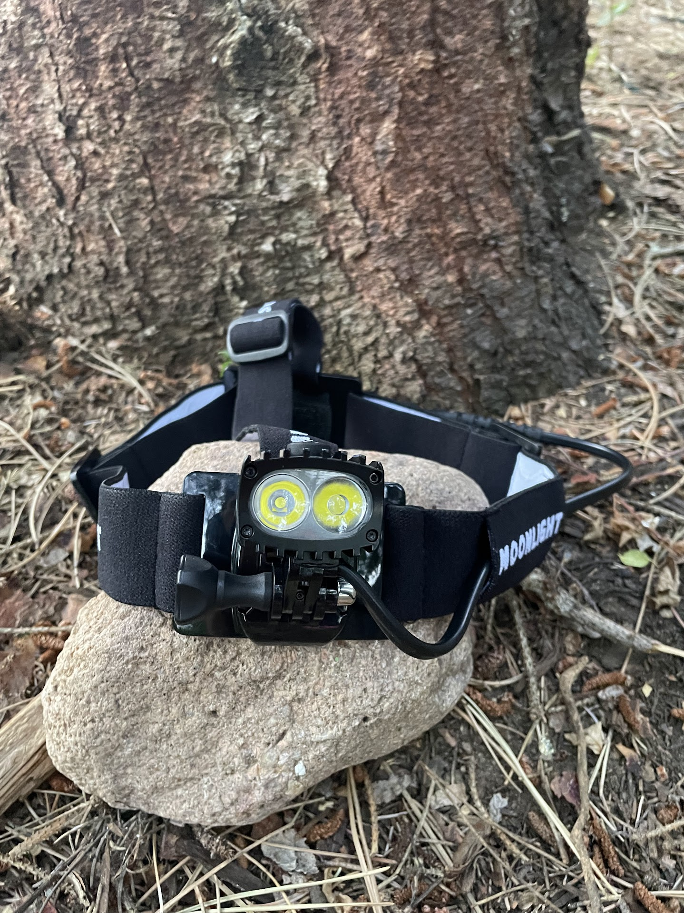
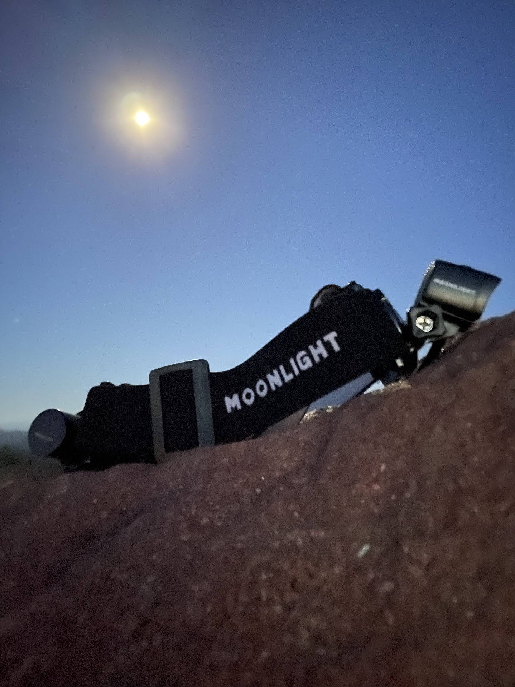
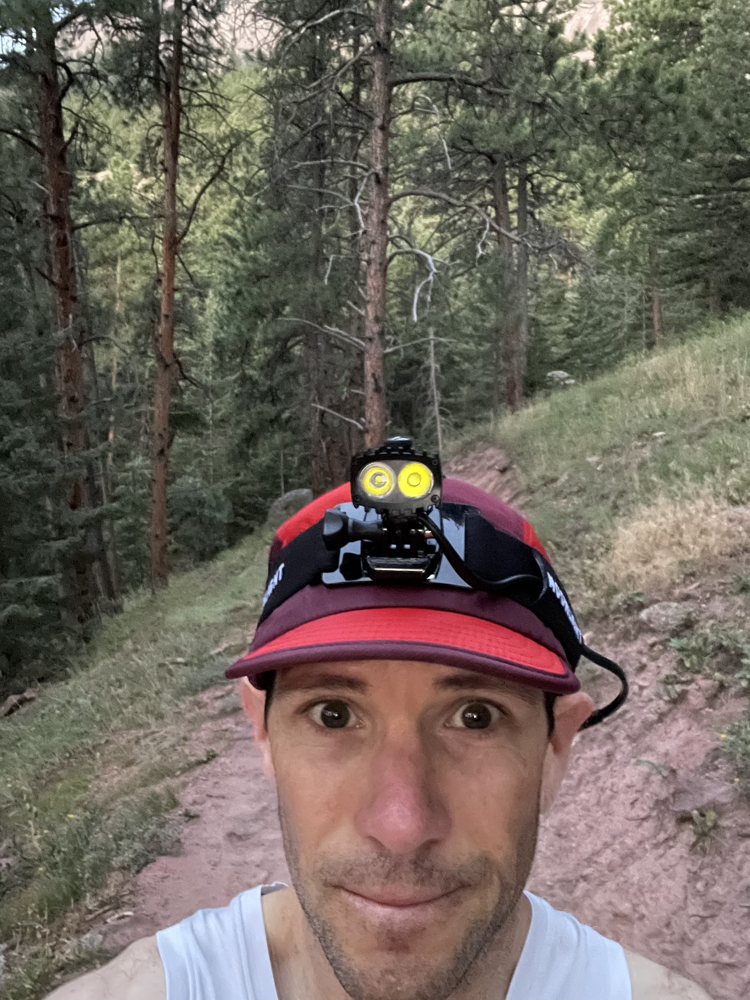
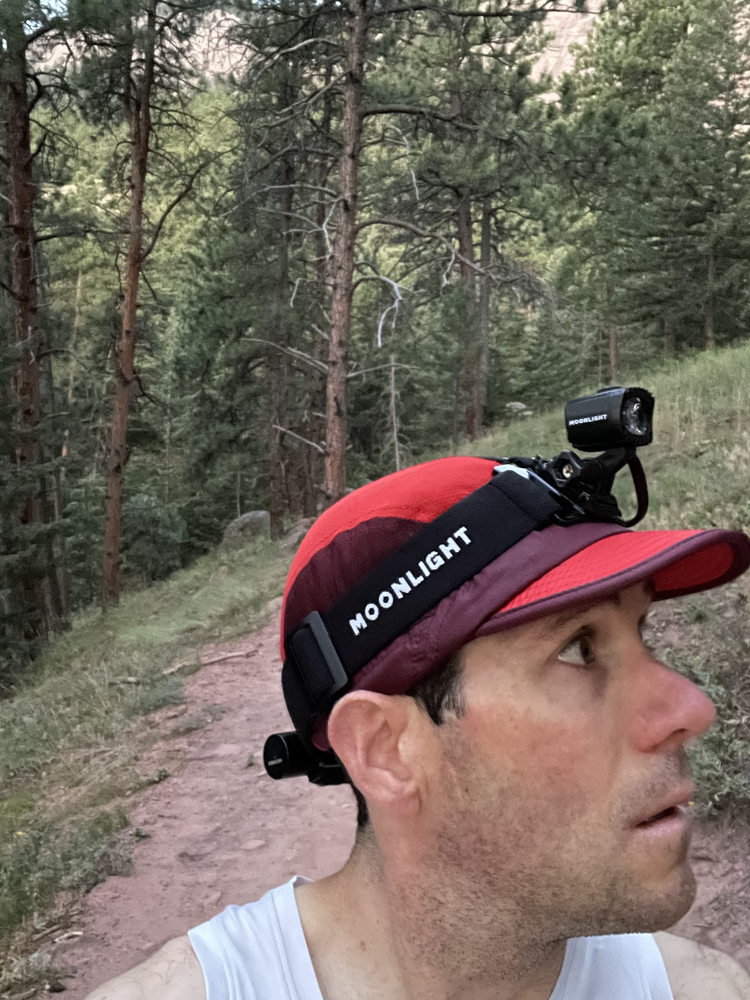
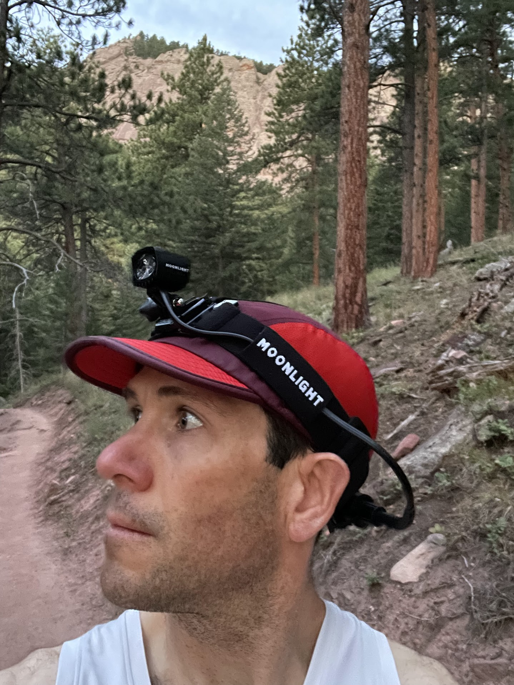
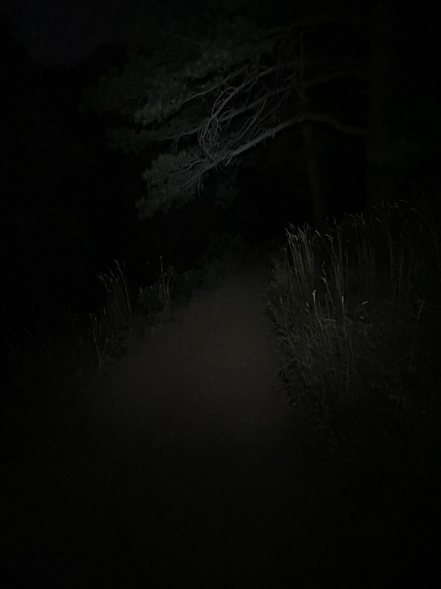
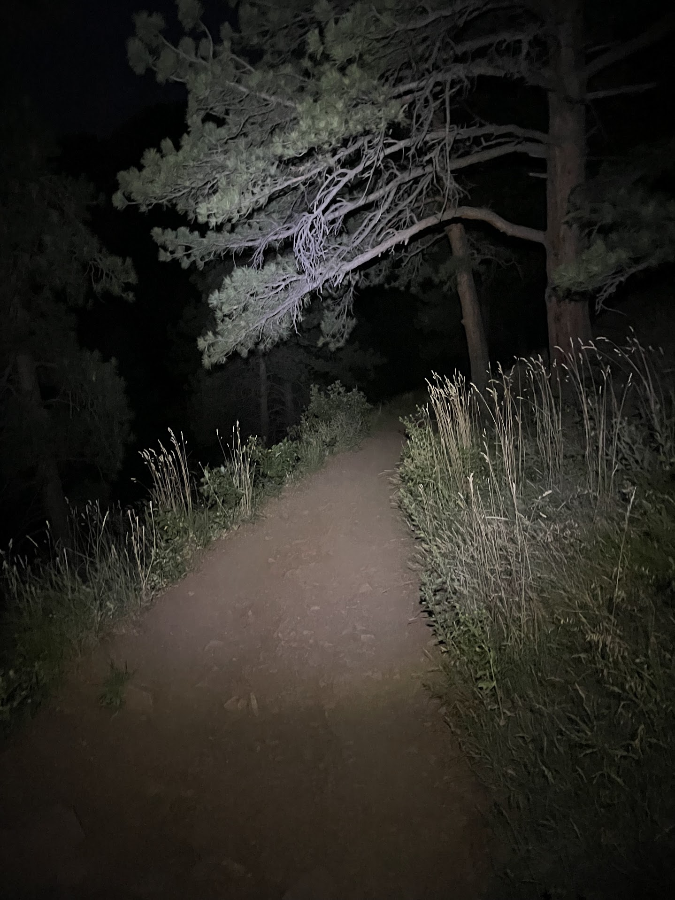
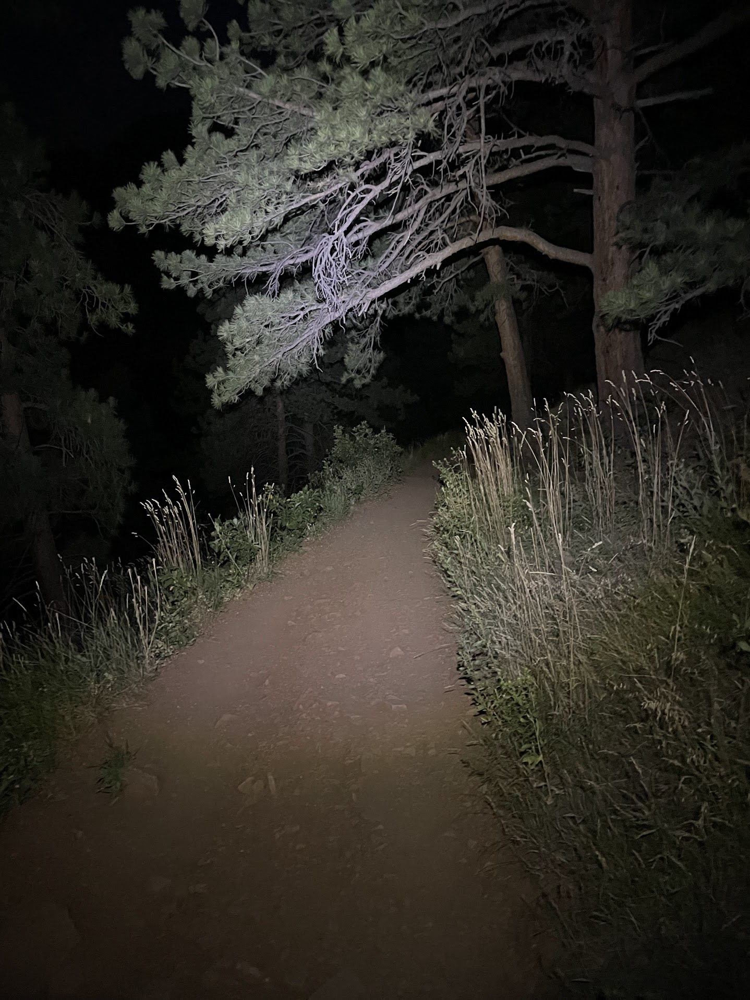
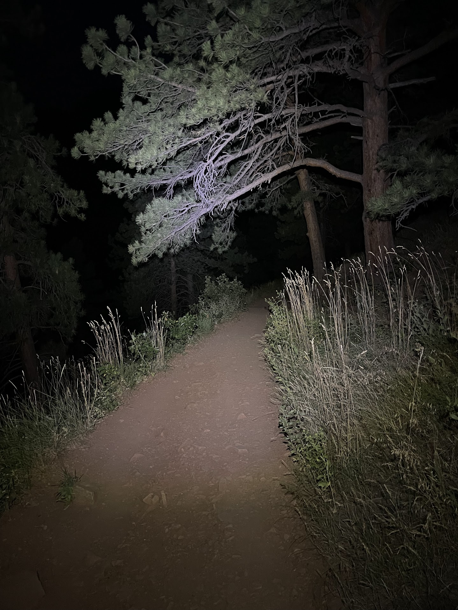

<!--more-->

*Article by John Tribbia*

Original Post from RoadTrailRun
([link](https://www.roadtrailrun.com/2025/08/moonlight-mountain-gear-bright-as-day.html))

<a href="https://www.roadtrailrun.com"
class="button primary button-wrapper">Read All RoadTrailRun
Reviews Here</a>

Article by John Tribbia

### Moonlight Mountain Gear Bright as Day 800 Headlamp ($199)

248 grams/8.7 oz (Head unit 55g/1.9 oz, Battery pack 100g/3.5 oz, Headband/cable 93g/3.3 oz)
800 Max Lumens
The Bright as Day 800 is available directly from

As someone who's out running between 4-5am virtually every morning, rain or shine, summer or winter, I depend on my headlamp like most people depend on their morning coffee. Though, I also need a cup of coffee before heading out too :) Over the years, I've burned through countless lights and have even been left stumbling in the dark when I needed them most.
After a few weeks of pre-dawn adventures with this Norwegian-engineered beast, I can say definitively: this thing has completely changed how I approach my early morning runs. Yes, it's heavier than the ultralight crowd prefers. Yes, it costs more than budget options. But when you're navigating technical singletrack at 4:30am, those concerns fade fast.

### Design

The head unit's ribbed aluminum construction feels like it belongs on a piece of high-end camera equipment, not a running accessory. Distinctive aluminum "blades" are an active cooling system that lets this light maintain full brightness without the frustrating step-down I've experienced with other high-output headlamps.

At 55 grams, the head unit itself is surprisingly compact considering it houses dual LEDs in a bombproof aluminum shell. The single large button on top controls everything - a design choice I love.

The most innovative aspect is the 100-gram battery pack. This pack, featuring a 4,700mAh lithium-ion cell with USB-C charging, fastens securely to the back headband with Velcro. A one-meter extension cable allows for convenient relocation of the battery to a vest or jacket pocket. For extremely cold winter runs, especially in sub-zero Colorado mornings, I plan to keep the battery inside my base layer to ensure it stays warm and maintains optimal capacity.

The headband system is well-thought-out, with a grippy silicone strip that prevents slippage even during my sweatiest summer climbs. I can configure it with or without the over-the-head stabilizer strap, though I typically run the full setup for maximum stability. It can also adjust to fit over a helmet for climbers and cyclists.

### Comfort and Ergonomics

At 248 grams, this isn't a featherlight device. However, its exceptional weight distribution makes it feel significantly lighter than it is. The rear battery perfectly offsets the front unit, ensuring comfort even during extended use. I've comfortably worn it for typical 60-90 minute morning runs, barely noticing its presence, and have even completed two 2+ hour trail adventures without experiencing significant fatigue.

For longer efforts, I do relocate the battery to my vest using the extension cable. This drops the head weight to just 148 grams while maintaining full functionality - a great solution that gives me options based on the day’s demands.

My one complaint is the headband adjustment system. Once I have it dialed for my preferred hat/buff combination, it's rock solid. But making adjustments on-the-go. It's not a dealbreaker, but it's less convenient than some quick-adjust systems I've used.
That said, the silicone grip strip works exceptionally well. Even during those warm summer mornings when I'm dripping sweat by mile 3, this light stays exactly where I put it.

### Light Output

This is where the Bright as Day 800 has completely spoiled me for other headlamps. The dual-beam system creates what I can only describe as the perfect running light pattern - broad enough to see my footing clearly, yet with enough throw to pick out trail markers and obstacles well ahead.

200 Lumens
I typically start my runs on the 200-lumen setting from the neighborhood, which provides excellent visibility while conserving battery. Once I hit the trail, I bump up to 400, 600, or 800 lumens. The 800-lumen max setting is genuinely stunning - I used it sparingly for route-finding or when I need to scan across a field for trail markers.

400 Lumens
What sets this apart from every other headlamp I've used is the thermal management. During my summer testing - including recent brutal August mornings that were still 70°F at 4am - I never once experienced the brightness reduction that's plagued other high-output lights I've owned. Those aluminum cooling fins actually work, maintaining consistent output throughout my entire run.

600 Lumens
The light color is a clean, neutral white that makes trail features pop naturally. Unlike some lights that create harsh shadows or weird color casts, the 800's beam feels comfortable and natural, even during extended use.

800 Lumens

### Battery Life

Moonlight's claimed battery life has proven remarkably accurate in my real-world testing:
40 hours at 40 lumens (emergency mode)
8 hours at 200 lumens (my standard setting)
4 hours at 400 lumens (technical terrain)
2 hours at 800 lumens (maximum output)
For my typical morning runs, I charge the light daily, since I'm using it 75-120+ minutes daily. The USB-C charging is fast and convenient - about 3 hours for a full charge.
The battery indicator is invaluable for someone like me who depends on this light daily. I get clear feedback on remaining capacity, and when the battery does get low, the light steps down gracefully rather than dying abruptly - a crucial safety feature when you're miles from home in the dark.
I haven’t tested cold weather performance, but I like the added extension cord to be able to stash the battery into a pocket or vest underneath a layer when that time comes.

### Summary

### 

After a few weeks of daily pre-dawn use, the Moonlight Mountain Gear Bright as Day 800 has become indispensable to my routine. This isn't a light for casual users or gram-counting runners. Zach Miller used it in Hardrock 100 this year, so that’s a sure tell sign it's engineered for people who depend on their headlamp day in, day out, in conditions that would make other lights underperform.

The aluminum construction, IP67 waterproofing, extreme temperature rating, and innovative cooling system create a headlamp that simply refuses to quit. Yes, it's heavier than ultralight alternatives. Yes, it costs more than budget options. But when safety and enjoyment depend on consistent, reliable illumination in the pre-dawn darkness, those concerns become secondary. This light has yet to let me down, never dimmed when I needed it most, and never left me questioning whether I have enough juice to get home safely.
For runners like me who live in that pre-dawn world, the 800 represents the kind of no-compromise reliability that's worth every gram and every dollar. It's become as essential to my morning routine as my running shoes.

### Comparisons

### BioLite HeadLamp 800

I've spent considerable time with the BioLite 800, and while it offers similar maximum brightness in a lighter package (165g vs 248g), the differences are the output during extended use. The BioLite's fabric construction feels less durable than the 800's aluminum build, and I've experienced thermal step-down during longer summer runs that I never see with the Moonlight. The BioLite's rotating light design is clever, but I prefer the 800's dual-beam system for running. Battery life strongly favors the Moonlight - the BioLite's 3,200mAh vs 4,700mAh means more frequent charging in my daily routine.

### Ledlenser NEO9R

The NEO9R offers excellent build quality and a beautiful warm light color that I genuinely love for trail running. At 240 grams, it's nearly identical in weight to the Bright as Day 800. However, the NEO9R's 900-lumen output comes with significantly shorter battery life - about 2 hours on high versus the 800's more conservative but longer-lasting approach. The Ledlenser's magnetic charging is convenient, but I prefer USB-C for travel compatibility. Both are bombproof lights, but the Bright as Day 800's superior battery life wins for my daily 4am routine where I need predictable, long-lasting performance.