<!--more-->

Original Review Posted on RoadTrailRun
([link](https://www.roadtrailrun.com/2022/12/brooks-catamount-2-multi-tester-review.html))

<a href="https://www.roadtrailrun.com"
class="button primary button-wrapper">Read All RoadTrailRun
Reviews Here</a>

*Article by Mike Postaski, John Tribbia, Jeff Valliere, Jana
Herzgova, and Sam Winebaum*

### **Brooks Catamount 2** ($170)

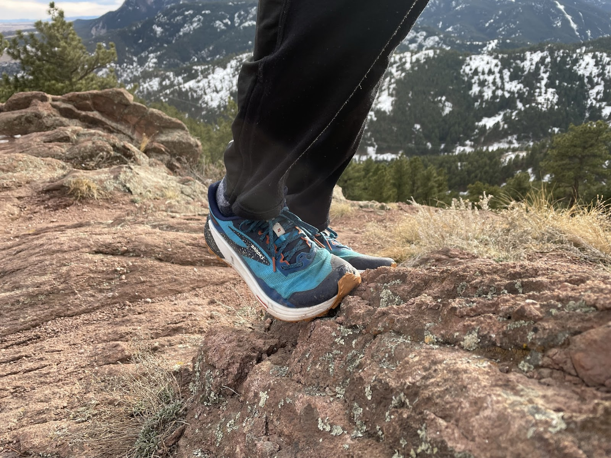

### **Introduction**

**Mike P:** I really wanted to like the first version of the Catamount.
I even tried it out several times in some pre-race testing, but
ultimately never felt comfortable in them and never ran anything of
substance in them. The DNA Flash midsole was quite responsive, but
ultimately for me it was held back by a somewhat basic, insecure upper
as well as the overly stiff feeling “ballistic rock shield”. I didn’t
feel comfortable in them aside from running in a straight line. Enter
the Catamount V2, with a completely revamped upper and a new SkyVault
Propulsion plate in place of the aforementioned ballistic rock shield.
Do the new updates improve the deficiencies of V1, or do they transform
V2 into a different shoe altogether? Well.. perhaps a bit of both..

Jana's women's color way

> ### **Pros**
>
> **Jeff V: ** Light, fast/responsive, improved traction, improved fit
> and security, well cushioned
>
> Moderate distances, stable and secure, dynamic running, protective and
> propulsive all arounder: **Sam/Jana/John/Mike P**
>
> Responsive midsole feel does not change-everything else does: more
> supportive, more Flexibility/agility/propulsion up front, more
> stability, deeper traction: **Sam/Mike P**
>
> Forefoot is suitably wide and very stable feeling **Mike P**
>
> SkyVault plate gives a quick forward-propulsive impulse **Mike P/Sam**
>
> Stability is greatly enhanced - evidenced by the feeling of being much
> lower to the ground although stack height is the same **Mike P**
>
> Nice, low, yet secure ankle/achilles collar **Mike P**
>
> Besides what’s mentioned above, I find them very comfy and stable
> shoes to hit the gym in. **Jana**

> ### **Cons  **
>
> Perhaps a touch narrow in the forefoot which could be limiting for
> those with wider feet and want extra room for longer distances. 
> **Jeff V/Sam/Jana**
>
> Small outsole cutouts under forefoot may hold onto mud but help with
> flex **Mike P**

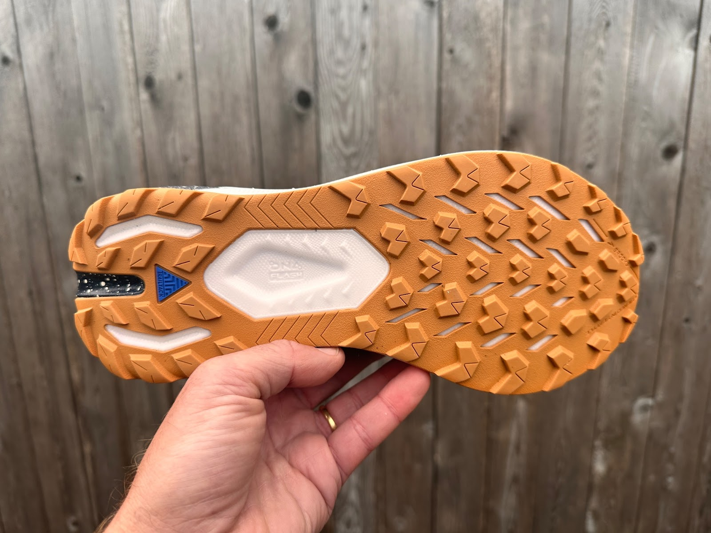

### **Stats**

Official Weight: men's 9.7 oz  / 275g (US9)  /  women's 8.6 oz / 244g
(US8)

  Samples: men’s  9.58 oz / 270g US8.5 , 9.75 oz / 278g US10

Stack Height: men’s approx. 30 mm heel / 24mm forefoot 6mm drop::
women’s  mm heel / mm forefoot

Available  Feb 2023. $170. 

### **First Impressions, Fit and Upper**

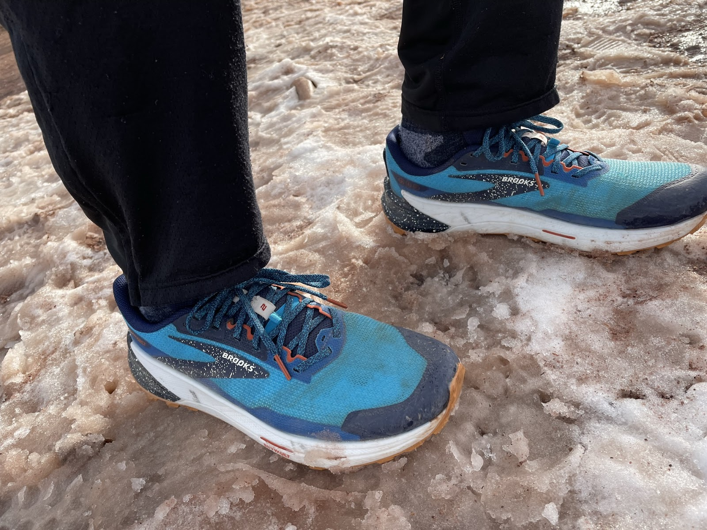

**Jeff V:**  I really enjoyed the Catamount 1, but over the long term I
only revisited them once or twice, as I found the foothold to be
limiting, traction to be a bit scarce for the more technical terrain
that I prefer and also a bit stiff.  I have been anticipating an update
in hopes that at the very least Brooks would dial in the upper and
perhaps even beef up the outsole, perhaps add some flex and they have
delivered on all counts!  

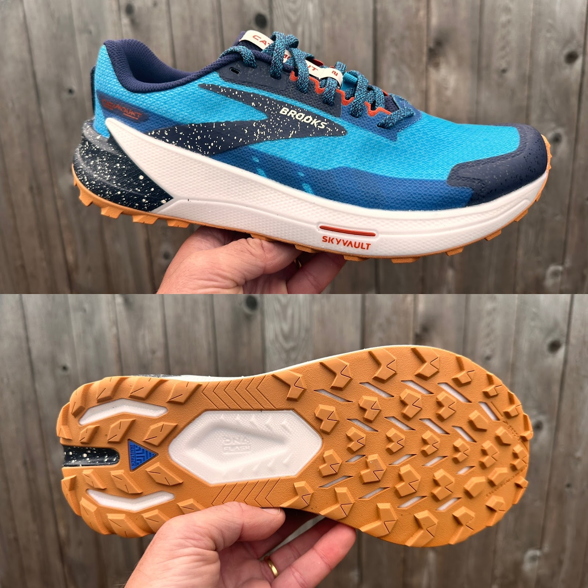

As I had hoped, the upper has been refined to provide a better
foothold.  Brooks has not only dialed in the fit, the upper materials
are more substantial than the original version, with better structure
and denser weave for more support.  This is a huge advantage when
running fast downhill, fast cornering and in technical terrain, where
the previous version was a bit loose.  Now, I can run with confidence on
more technical terrain without any foot movement inside the shoe. 
Basically security is excellent.

While some have reported a slight increase in weight, the Catamount 1
and 2, I am measuring version 2 at 3 grams lighter.

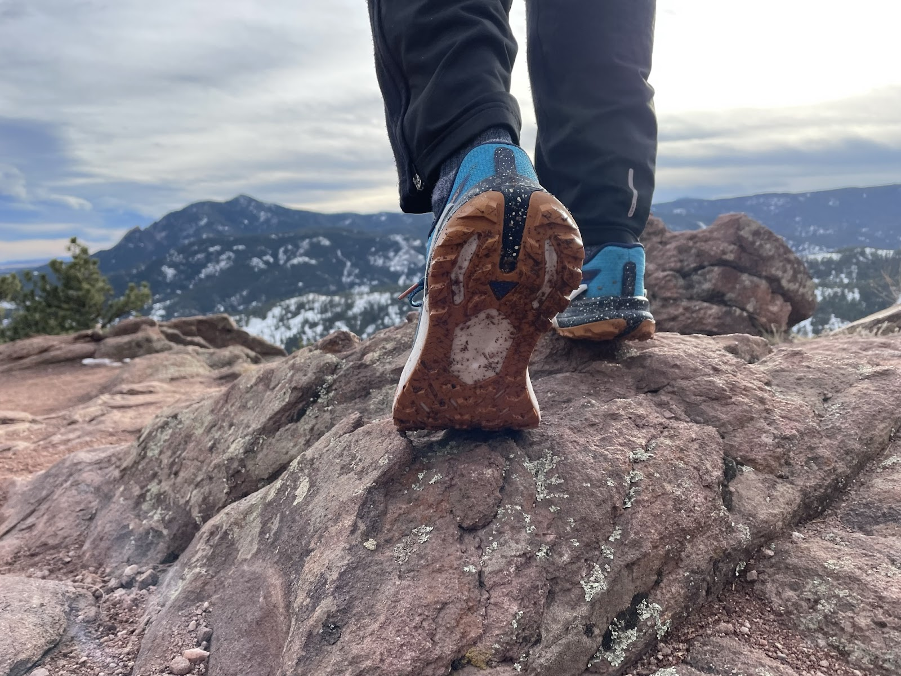

The toe bumper is protective and substantial, integrating into an almost
360 degree rand.

The gusseted tongue is of medium thickness, but I have experienced a bit
of lace pressure over the top if I am not careful with my lacing. 
Nothing severe, but something to keep in mind when snugging up the
laces.  I have a tendency to over tighten laces since I run technical
terrain almost exclusively, but have noticed with the Catamount 2, I do
not have to over tighten for my foot to be held well.

The laces have also been improved over the previous, instead of the soft
stretchy cloth laces, Brooks is now using the more substantial woven
laces that I like so much in the Cascadia.  These move substantial laces
I believe also contribute to the over security and fit of the upper.

The counter is semi flexible and well structured, providing great heel
hold, security and stability.  Padding around the collar is a little
more substantial than the previous version and quite comfortable.

The Catamount 2 is also gaiter compatible, now with a small loop forward
of the laces and a velcro strip over the heel counter like on the
Catamount 1. 

Overall fit is true to size, with a secure heel, secure midfoot and toe
box with a more race like, performance feel.  This would not be ideal
for longer distances and especially if you have a wider foot, but for my
narrow, low volume foot, combined with preference for running fast
through steep, technical terrain, I am very appreciative here for the
increased performance for faster running and being able to run steep
downhills, technical terrain and overall run faster with more confidence
(which is what this shoe is designed for).

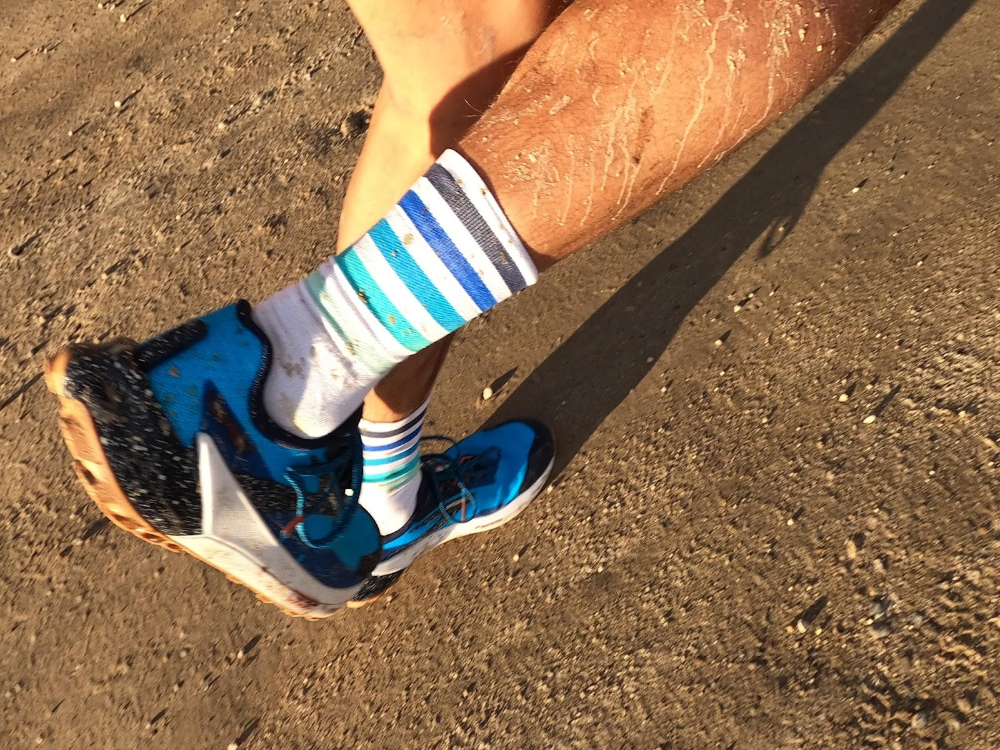

**John**: Simply due to a change in work schedule, I have had to take
less frequent trips to my staple technical mountain runs in the last two
years. In my initial tests of the first Brooks Catamount, I wasn’t blown
away by the shoe, primarily because I felt like I was mentally forcing
it to be a big mountain technical shoe. Over time, however, the shoe
really grew on me and I loved it as an everyday and fast trainer that
excelled in the road-to-trail mix I have closer to my home. Like Jeff, I
was eagerly waiting for it to be updated with a more secure upper that
would allow for improved technical running. 

Although it has been 2+ years in the making, I’m really pleased to see
the Catamount 2 with a more refined and engineered upper. It is still
light and breathable, but the denser engineered mesh material along with
a well protected TPU toe bumper provides security and good protection.
For my slightly narrow foot, the fit is excellent and very comfortable.
The upper is now reasonably substantial, but not over-built. In my
opinion, the new upper now adds improved security to the already superb
balance of weight, performance, comfort, and breathability.

In the Catamount 2, I find the upper to be very secure overall,
especially in the heel and midfoot. Where the Catamount 1 struggled with
forefoot fit, making running corners/switchbacks at high speeds or fast
and steep downhills a struggle and possible blister-fest, the Catamount
2 has a much more secure fit that inspires confidence over harsh
terrain.

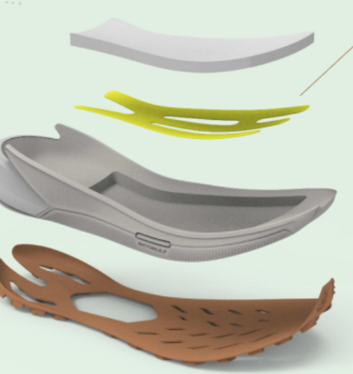

**Jana:** Catamount 2 is the very first shoe from Brooks family I have
ever run in and it has been a pleasant ride for me. It is a light and
nimble shoe for speedy and firm ground technical terrain. Fit is true to
size, with a great foothold over all - aiding speedy runners. Th heel
feels secure, and with the counter being well structured, it all adds to
the great stability of the shoe. 

The upper feels substantial, but not overbuilt. It breathes well, and is
light and comfortable. Also dries fast, and stay light while wet. 

The downside - a bit narrow toe box. 

**Mike P:** Jeff V describes the new upper very well. As mentioned in my
intro, I had similar feelings about the upper and reservations about
running them in any type of technical, or even non-straight terrain. I
do have to note that I had V1 in US 9.5, and my V2 test pair is US 10.
I’m very happy to have the V2 as the fit feels so dialed in compared to
V1 - I believe a 9.5 would have been a bit snug. But just to
re-emphasize - my US 10 V2 feels much more secure and dialed in than my
smaller, US 9.5 V1. 

Others have mentioned the fit feeling a bit narrow, but I have to
disagree here. I feel the forefoot width is excellent. Perhaps a bit
shallow, and since the material is definitely denser, that may give the
feeling of being tighter in the forefoot. But it works great for me -
I’m able to get a solid lockdown up front, with very little lace
tension. It reminds me somewhat of the S/LAB Pulsar (white), a shoe
where I pretty much don’t tighten the lower laces at all, and only
tighten the upper 2 or 3 rows of the quicklace. It’s a dramatic
difference from V1, where even in a smaller 9.5, I had to over-tension
the lacing to get even the smallest semblance of security. 

Another point to mention is the heel cup. I found V1 to be too vertical,
essentially not much of a “cup” to hold the heel down. In combination
with the stiff rock shield, I had a lot of trouble securing my heel. The
new V2 has a lower collar all around, and more contoured heel area -
which solidly holds down the heel with no fuss. Great enhancement here
for me. 

Final note- as with Jeff V, I find my V2’s to actually be lighter than
V1, even with the difference in size. My V1’s (US 9.5) were 280g, and my
V2’s (US 10) are 278g. 

### **Midsole**

**Sam:** The midsole foam and stack height of approximately 30mm heel /
24 mm forefoot remain the same as v1. The foam is Brooks’s DNA Flast
nitrogen infused supercritical EVA, the same foam and at the same
relative firmness as in their road Hyperion Elite and Hyperion Max. The
feel cannot be said to be plush but it is plenty vibration absorbing and
notably reactive with a quick spring back. It is not as soft as say
Salomon Energy Surge or Saucony’s PWRRUN PG in the Xodus Ultra’s central
core sitting closer in feel but with a quicker reaction than Saucony’s
latest PWRRUN EVA/TPU blend foam in the Peregrine 12. I find the midsole
foam totally appropriate and effective for both more technical trails
and even road, with distances in moderation for me say up to 25K on
pretty much any trail but for faster runners assuming fit is OK up to
ultra distances. 

What changes is the addition of effective rear stabilizing “wings” and
especially the new Sky Vault propulsion and protection plate which
combines mid foot stability with front propulsion and protection. It is
highly effective. 

Along with the new more segmented open outsole, this new overall design
gives the Catamount flex for climbing and spring off the front for speed
and with increased midfoot stability from the plate and upper support.
The Catamount 1 was a notably rigid shoe up front and not a particularly
stable shoe on off camber not so at all here. 

**Jeff V:** Sam sums up the technical details of the midsole quite
well.  While the midsole foam is the same as the previous, the Catamount
2 is more flexible and friendly.  Cushioning is soft and compliant
enough to provide a nice, well cushioned landing, though simultaneously
firm enough, with an energetic response for fast, high performance
running.  The Catamount 2 is fast uphill and I notice an advantage with
the greater flexibility, adding not just performance, but also is more
stable, precise and agile.  

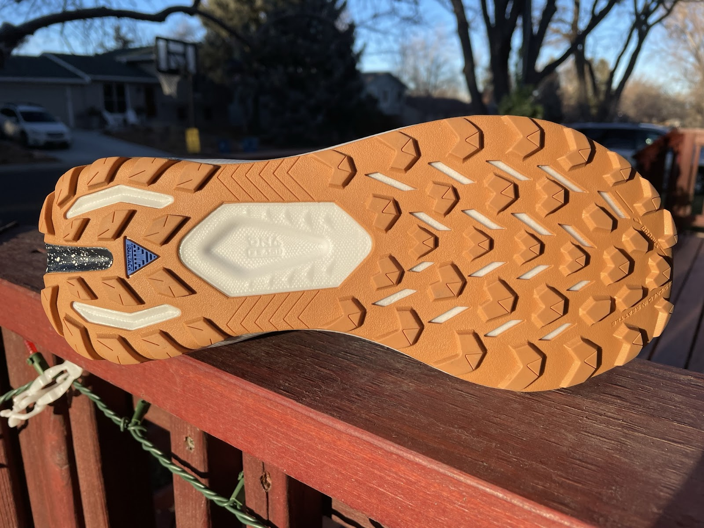

The plate provides good rock protection, along with some propulsion and
still allows for enough flex to not feel overly rigid (where the 1st
version felt a bit too rigid on the trails).

**John**: Sam and Jeff call out the most important details of the
midsole, so I’m here to affirm that the Catamount 2 is springy,
energetic, and well cushioned for short and longer distances. In the
Catamount 1, I was underwhelmed with the midsole performance on steep
and/or sustained uphills. On the uphill, I felt like the stiffness was
too exaggerated and my foot was losing connection to the shoe on push
off. In the Catamount 2, I (like Jeff) felt the improved flexibility and
reduced stiffness that promoted a really efficient uphill experience as
well.

**Mike P:** Agree mostly on all points with everyone above. I don’t
believe Brooks has provided official stack height numbers, only the
drop - which is 6mm. After my first run or two, I actually thought that
they must have dropped the stack height a bit. They felt more low-slung
with much more ground feel and a touch firmer than V1. I went back and
manually measured the heel stack and got the same value as V1. So it
seems as if the enhancements to stability and overall feel of the ride
give the feeling of a closer to the trail ride, while still maintaining
the same stack level.

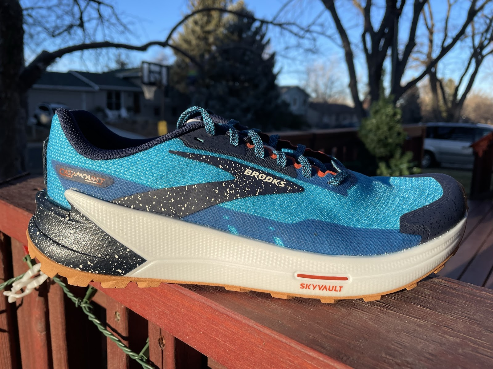

I agree 100% with John about the stiffness - that and the seemingly
vertical heel cup of V1 - I also felt my heel slipping out a bit in V1
in any kind of steep terrain. The flex point of the SkyVault plate feels
much more forward to me, essentially under the ball of the foot and
flexing nicely along with the toes on inclines. It’s a much more
responsive feel that the plate that was in V1 which felt a bit more
centered under the foot and definitely less flex-y. 

**Jana:** This is definitely not a shoe for long distances for me.
Cushioning is in the mid to low mark (at least for me), giving a ground
feel like feeling which I prefer for fast downhills, and overall for
faster trail runs.

### **Outsole**

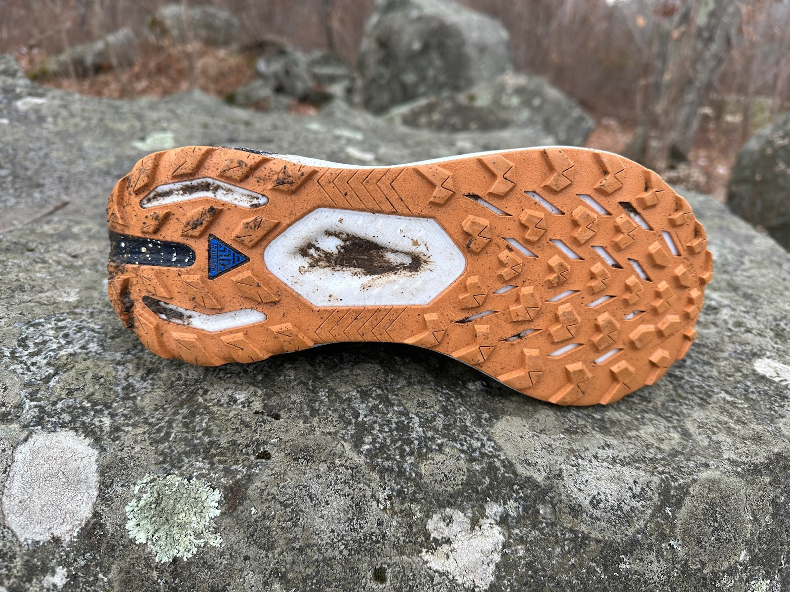

**Jeff V:**  With slightly deeper lugs at 4mm and a more aggressive lug
design/pattern, the Trail Tack outsole of the Catamount 2 provides
better grip overall than the Catamount 1.  The rubber compound feels the
same as the previous and is sticky, yet durable. 

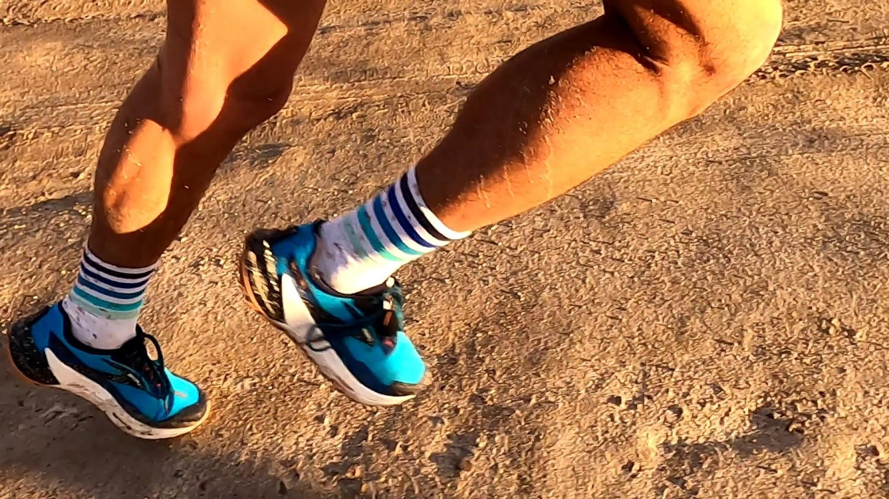

I have run on dry trails, wet trails, wet slabby rock, off trail, snow,
mud, ice, slush, wet and dry roads, dirt roads, etc…. And always feel
confident with my footing.  For dedicated steep, loose, off trail or
more snowy runs, I would prefer a shoe with deeper, sharper lugs, but
for most people for most running, most of the time, the Catamount 2
outsole delivers very good overall performance.  Door to trail
performance is also very good, with the lugs being refined enough to go
essentially unnoticed on the roads.

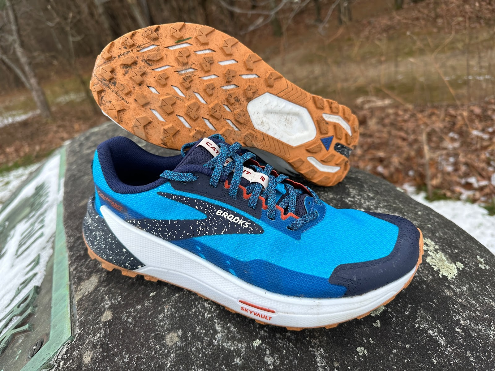

**John:** The newly designed outsole lug pattern as well as slightly
deeper lugs bring even more grip to the Catamount 2 compared to the
first version. It is impressively grippy on a wide variety of terrain in
varied temperatures. I ran on road, hard pack gravel, off camber grassy
sections, rocky trail, snow, ice, and some slab. The sticky rubber
compound adheres well to rocks and slab, both dry + wet and cold + warm;
the outsole also has an outstanding grip for steeper trails, mud, snow,
and semi loose conditions. Even with the deeper and more aggressive
lugs, I still found the Catamount 2 to be an excellent door to trail
shoes. In fact, I prefer the more aggressive design for winter road
running, since most of the time the dry roads will still have loose sand
and salt residue.  

**Mike P:** The triangular-esque all-around lugs of V1 have been
replaced by more trail-oriented and deeper arrow shaped-lugs. Grip and
traction in dry and mixed sand/slush/dirty snow & ice is excellent.
Brooks’ TrailTack rubber is really good, and I’ve had great experience
in particular with my Divide 3’s. Due to the winter weather, I haven’t
had the opportunity to test grip on wet rock, but again, I’ve had no
issues with my Divide 3’s over the summer in wet terrain. 

Note the swallow-tail cutout in the outsole under the heel - similarly
seen in the Caldera 6. With the Caldera 6 it was necessary to somewhat
mitigate the sheer heft of the midsole, but in the Catamount it’s just
another feature to enhance the flexibility and agility of the shoe. 

**Sam:** The others have described the outsole and its performance well.
I agree. I will highlight that I find the new outsole design with both a
more decoupled heel area, less midfoot coverage (stability there made up
for by the internal plate)  and slots through to the midsole upfront
play a big role in making the Cat more agile, smoother running, more
flexible and even as not so rigid overall more stable. 

Shown above the Cat 1 outsole with its fuller, more continuous shallower
and more rigid coverage.

**Jana:** I don't have anything else to add, the others have summed up
the outsole well.

### **Ride**

**Jeff V: ** The ride is quick, smooth, energetic and spirited, an
excellent choice for up tempo training or racing, with much improved
flexibility over the first version.  The Catamount 2 is also well
balanced, stable, predictable and well cushioned enough for me for hours
with great comfort.

**Mike P:** In comparison to V1 especially, I’d sum up the ride with
three words: quick, balanced, and agile. While the original version had
a slightly softer and slightly bouncier feel, V2 is a bit firmer with
more of a snappy feel. Overall in V1 I felt as if I was riding on top of
the shoe, whereas with V2 I feel more connected to the shoe and in turn
the trail itself. 

I find myself feeling quicker on the run in the new Catamount, and even
objectively (via TrainingPeaks Efficiency Factor scoring) - I’ve noticed
higher efficiency ratings on my test runs. This bodes well for using the
shoe as a racer. 

Out of the box, I initially had Tecton X vibes, based mainly on the
dialed in upper and the bit of propulsive yet flexible feeling from the
Sky Vault plate. But after further testing, it’s become apparent that in
the realm of racing, the new Catamount seems more suited to shorter-mid
distance ultras for me. It does have a firmer feel underfoot than a true
100M shoe such as the Tecton X, but on the other hand it does feel
quicker and more stable at faster speeds than most if not all 100M
shoes. I’d peg it as a great race option anywhere in the 50K to 50M
range. Perhaps more if you’re efficient and prefer a firmer ride.  

**John**: Jeff and Mike P summarize the ride really well. Like Mike, I
feel quicker on the run in the Catamount 2. It has a fast ride that is
balanced well in response, snap-back, cushion, spring, and stability.
Whether you are a heel striker, midfoot striker, or forefoot striker I
think this shoe is designed for you! The cushioned and performant
midsole provides a perfect platform for a stable and energetic
transitioning ride. The Catamount 2 does not lose much energy on the
return and I could envision this shoe for race day or recovery day. For
me, it is a shoe that inspires fast fun on moderate terrain at speed and
for distance.

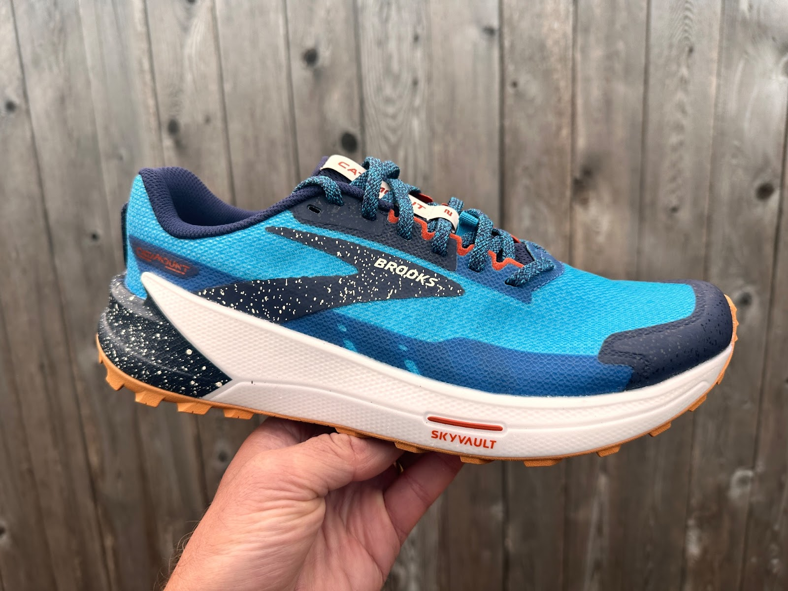

**Sam:** The Cat 2 has what I could call an “all round” ride. I took it
on non technical forest path trails, moderately rocky and rooty New
England single tracks with plenty of leaves and some hard icy snow, and
on the road. 

Everywhere it was consistent, very stable (unlike rigid v1) well enough
cushioned, agile and arrow-like in feel always tracking straight and
fast.

The increased flexibility and front propulsion were clearly noted as I
got close to some Strava segment PR’s on shorter uphills. They were
great on the road if a bit firm, but the DNA Flash foam clearly had a
snappy decisive energy return. 

**Jana:** The Catamount 2 is a fun, fast, and durable shoe for me, on
technical firm ground trails. Although the majority of miles I ran in
these were on groomed and firm snow covered road/trail (47 miles out of
62 respectively), they provided a comfortable and stable feel. And as I
mentioned above, I liked them even at the gym, which is a first for me
for a shoe that is not a barefoot type (Vivobarefoot are my absolute
favorite). So for anyone who prefers a slightly cushioned shoe for gym
workouts, this might be a solution as well. 

### **Conclusions and Recommendations**

**Mike P:** The Catamount 2 is one of my highest scoring shoes - I’m
very impressed with this shoe. They’ve specifically addressed the two
main issues I (and others) had with V1 which I laid out in my intro. In
doing so, they probably have shifted the shoe for most from an
“advertised” 100M shoe to a much more versatile short to mid distance
trainer and racer. There’s a lot to like with the new Catamount, and
I’ll surely be taking it out for races this season. Brooks as a brand is
really coming on strong in the trail scene - Cascadia 16, Caldera 6,
Divide 3, Catamount 2 - a pretty stout lineup.

**Mike P’s Score:** ** 9.73 / 10**

Ride: 10 - Love it - quick, balanced, and agile… & lightweight!  
Fit: 10 - Much improvement here - secure, with great forefoot width  
Value: 9 - Highly versatile for both training and racing. Expect high
durability  
Style: 10 - The blue pops, and the paint splatter look is cool  
Traction: 9.5 - Excellent in most trail conditions you’d expect to run
these in  
Rock Protection: 9 - Good, but with the firmness you may feel something
here or there  
**Smiles 😊😊😊😊😊**

**Jeff V: ** The Catamount 2 is a huge improvement over the first
version, addressing my most major concern, the less than secure upper,
as well as adding some flexibility and improved traction.  These changes
have made for a lively, quick, energetic and capable shoe for a wider
range of terrain.  Moving forward, I will reach for the Catamount 2 for
up tempo training runs on any terrain short of the most steep, loose,
technical terrain.  I would also not hesitate to pick them for racing up
to marathon in distance, as they are great for really opening up the
stride and going fast uphill, downhill or anything in between.  I would
also gladly take them along on a trip as a do it all shoe, ready for
anything that comes along (AND they look very sharp and classy IMHO).

**Jeff V’s Score:** ** 9.6 / 10**

Ride: 9.75 - The ride is fast, fun and energetic  
Fit: 9.75 - Brooks has really dialed in the fit here, a massive
improvement  
Value: 9 - $170 is getting up there in price, but performance,
durability and versatility are all great  
Style: 10 - I think the blue colorway is super sharp and classy  
Traction: 9.5 - excellent for intended purpose, versatile and great for
all but the most extreme terrain.  
Rock Protection: 9.5 - very good, I have yet to feel an unpleasant jab
or any sort of abuse under foot.  
**Smiles 😊😊😊😊😊**

**John**: I would not be surprised if the Catamount 2 is a shoe worn by
a podium finisher at a major ultra marathon this year. I think the
Catamount 2 is my 2022 shoe of the year. It checks all of the boxes for
a stable and fast shoe. Moreover, the upper improvements compared to the
Catamount 1 make this shoe a go-to for the on- and off-beaten path. That
is, this shoe is not just great for the podium finishers, it is a high
performing cushioned choice on the full spectrum of terrain. Without a
doubt, this is my shoe choice for an everyday long or short run.

**John’s Score: 9.7 / 10**

Ride: 9.75 (stable, smooth, snappy, and great at uphills)  
Fit: 9.75 (nearly no break in period for me and my average width foot
fits perfectly)  
Value: 9.5 (I haven’t tested durability, but this is a do everything
shoe in my collection)  
Style: 10 (great contrasting color choices by Brooks!)  
Traction: 9.5 (high performing on a variety of terrain)  
Rock Protection: 9.5 (solid protection that isn’t too stiff and
cumbersome)  
**Smiles 😊😊😊😊😊**

**Jana:** My very first Brooks shoe and I am impressed. It is a fun and
fast shoe, for shorter distances. It will definitely stay in my rotation
for a while.

**Jana’s Score: 9.25 /10**

Ride: 9.5 - very pleasant  
Fit: 9 - it fits well for me, however it may be on a narrow side for
women with wider feet  
Value: 9 - considering the multi use for me (running and gym), i find
$170 price tag a decent trade-off  
Style: 10 - I have received quite a few compliments. I am not much of a
fan of the hot pink color although I do like this design a lot.  
Traction: 9 - very stable and versatile  
Rock protection: 9.5 - I had zero issues on technical terrain in them -
not a single jab felt during my runs.  
Smiles 😊😊😊😊😊

**Sam:** The Catamount 2 is clearly the product of carefully “listening”
and extensive testing by Brooks. Improved in all respects from upper to
ride to traction the Cat now sits high high on list of all around trail
shoes with a fun stable and fast ride on just about any terrain, even
road. It is difficult to pull off such a shoe without compromises and
here there are very few with only maybe its capabilities for long ultra
cush and softness and high mountain runs suffering a bit. For that and
for long slogs Brooks has the Caldera and Cascadia respectively.

**Sam’s Score: 9.6 /10 **

Ride: 9.8 I do wish for a touch softer foam  
Fit: 9.8 about as good as it gets for a shoe focused on non ultra
distances for most and agility  
Value: 9 up there at $170  
Style: 9.4 Cheerful!  
Traction: 9.5 all around solid  
Rock Protection: 9.2 more than adequate  
**😊😊😊😊**

**Watch Sam's Initial Video Review of the Catamount 2** (13:12)

# An error occurred.

Unable to execute JavaScript.

### **14 Comparisons**

**Brooks Catamount 1** ([RTR
Review](https://www.roadtrailrun.com/2020/07/brooks-catamount-multi-tester-review.html))

**Mike P (9.5):** Comparisons throughout the review above. Mainly - V2
features a much better upper and more secure fit. A touch firmer
underfoot, but much better ground feel, more agile feeling, and overall
a much more versatile ride. Don’t look for discounts on V1 unless it
specifically worked for you. V2 is a much better shoe. May have to go up
½ size if the new upper feels too snug over the top of the foot.

**Jeff V:** Agreed with Mike and compared throughout review above.

**John**: The Catamount 2 is everything I enjoyed about the first
version and offers an improved upper and more dialed ride that enhances
the uphill running experience. 

**Brooks Divide 3 ** ([RTR
Review](https://www.roadtrailrun.com/2022/04/brooks-running-divide-3-multi-tester.html))

**Mike (9.5):** Vague feelings of similarity, but the Divide 3 is
obviously the budget and less performance oriented shoe. I really like
the Divide 3 for training as the upper is comfortable and you get nice
ground feel, and it makes your feet do the work. But for racing, the
Catamount 2’s plate gives that propulsion you want, and the upper is
more dialed in which gives you more confidence at speed. Both are great
shoes for different scenarios.

**Jeff V:**  Agreed with Mike, the Catamount 2 is lighter and much more
performance oriented, nimble, agile and quick, while the Divide 3 is a
better shoe for slower paces and longer distances.  At $100, the Divide
3 is a steal, so good that I bought a pair for my wife.

**Salomon Pulsar Trail** ([RTR
Review](https://www.roadtrailrun.com/2022/05/salomon-pulsar-trail-initial-review-new.html))

John: The Salomon Pulsar Trail feels wider and more stable, while the
Catamount 2 offers a more precise fit and agility. While I was impressed
with the outsole of the Trail and felt like it navigated mud and loose
terrain quite well, I think the Catamount 2 is just as effective in
varied terrain. The Pulsar Trail has an exaggerated rocker that I like
for shuffling and heel striking long distances. The Catamount 2, by
contrast, is leaner and more refined that has a more race feel to it and
is definitely lighter on-foot. 

**Salomon Pulsar Trail Pro ** ([RTR
Review](https://www.roadtrailrun.com/2022/08/salomon-pulsar-trail-pro-review.html))

**John**: The Pulsar Trail Pro is lighter, equally responsive on
runnable and paced efforts, and has more cushion. On the other hand, I
find the Catamount 2 (especially with the improved upper) to be more
secure and stable, which equates to better control and confidence at
speed on trails and particularly steep and technical trails.  Both are
great choices for longer, less technical runs and especially mixed
running where any extended sections of pavement might be involved.

**Salomon Sense Pro 4 ** ([RTR
Review](https://www.roadtrailrun.com/2020/02/salomon-sense-pro-4-multi-tester-review.html))

**Jeff V:**  Perhaps some overlap in use, as both are quite versatile,
but the SP4 is not as light, responsive, quick, agile or as protected
underfoot.  I would look to the Cat 2 for more uptempo or race
scenarios, where I pick the SP4 for more casual affairs.  In fact, the
SP4 is one of my most frequently worn shoes over the long term, as they
are exceptionally comfortable and so easy to just walk into on the way
out the door for a quick getaway, with enough performance for whatever I
decide along the way.

**John**: The Catamount 2 outperforms the SP4 on a rolling smooth trail
or in road-to-trail situations. On the other hand, the SP4 climbs and
descends steep technical terrain better, has a more secure and
customizable fit, and is more nimble in the technical stuff. Both shoes
are well protected in the forefoot and feel extremely light on the foot.
I would choose the SP4 for those technical days and the Catamount 2 for
anything else. 

**Saucony Peregrine 12 ** ([RTR
Review](https://www.roadtrailrun.com/2022/01/saucony-peregrine-12-multi-tester.html))

**Mike P (9.5):** The Saucony upper is just as dialed in as the
Catamount, but I find just a touch more width across the forefoot of the
Brooks - which feels better for me for longer distances. The Saucony’s
woven plate is more substantial than the SkyVault plate and offers a bit
more protection-wise. The Brooks plate feels and likely is more
propulsion oriented, so the shoe rides quicker, although the P12 is nice
and quick in rough terrain too. I like both shoes - the Saucony for
rougher outings, and the Brooks for faster, less rough stuff and racing.

Jeff V:  Mike touches on all the points and I will reiterate that the
P12 is a better choice for more technical terrain, with a lower to the
ground, more stable feel and more aggressive tread.

**John**: I agree with Mike and Jeff. Catamount 2 is best for all things
runnable and the Peregrine would be the optimal choice when the terrain
gets technical or messy. 

**Scarpa Spin 2.0 ** ([RTR
Review](https://www.roadtrailrun.com/2021/11/scarpa-spin-20-review-peba-and-megagrip.html))

**John**: Both are light and perform well on a variety of terrain. I
would choose the Catamount 2 for most runs that are short or long,
especially if there were variations in terrain from road, buffed trail,
to technical. Where the Spin 2.0 is beneficial is for longer days on
technical terrain where protection and weight will help your feet + body
endure the longer effort. Moreover, the Spin 2.0 outsole is much
stickier on rock surfaces and would be a good option for light
scrambling. 

**VJ Ultra 2 ** ([RTR
Review](https://www.roadtrailrun.com/2022/07/vj-ultra-2-multi-tester-review-11.html))

**Mike P (10.5):** Note the difference in sizing here - VJ runs smaller
than every other brand for me. Like the Catamount, the VJ Ultra was
improved quite a bit from V1 to V2. I really enjoyed running the Ultra 2
in rugged, mountainous terrain this past summer, but now having the
Catamounts, I’m not sure if they may give the Ultra 2’s a run for their
money even in that rugged terrain. The C2 upper now feels much more
refined and dialed in - in comparison to the VJ. The C2 plate is not as
burly and protective as the Ultra 2’s, but it may be a more stable shoe
and the enhanced agility may make up for the difference in protection.
The VJ has an obvious advantage in traction and grip, so that would
definitely be an overriding factor depending on target terrain.

**Jeff V:**  Mike makes some great points, though I personally favor the
VJ when the terrain gets really technical and/or when maximum grip is
necessary.  Aside from that, both shoes are fast, agile and protective
for fast running on most terrain with great performance and good
cushion/protection.

**Hoka Torrent  2** ([RTR
Review](https://www.roadtrailrun.com/2020/06/hoka-one-one-torrent-multi-tester.html))

**Jeff V:**  I much prefer the Cat 2, as it has a more dialed upper, a
more responsive midsole with better protection and overall better
protection as well.

**John:** Similar to Jeff, I prefer the Catamount 2 over the Hoka
Torrent 2. In addition to being more responsive, I find the Torrent 2
has a more “flat footed” fit and feel, while the Catamount 2 has midfoot
support that promotes an efficient and bouncy ride. 

**Hoka Zinal** ** **([RTR
Review](https://www.roadtrailrun.com/2021/06/hoka-one-one-zinal-multi-tester-review.html))

**Jeff V:**  This is actually a really close comparison, with similar
stats and overall feel, though I find the Zinal to feel a little bit
less substantial under foot and thus better suited for going fast on
less technical terrain, where the Cat 2 can handle everything the Zinal
can do at the same speeds, plus go beyond.

**NIke Pegasus Trail 4 ** ([RTR
Review](https://www.roadtrailrun.com/2022/08/nike-react-pegasus-trail-4-multi-tester.html))

Jeff V:  The Cat 2 is lighter and more quick, responsive, agile,
protective and performance oriented, with better grip.  The Peg Trail 4
however is THE most comfortable shoe of any type (including OOFOs
recovery slippers) that I have ever put on my foot and is exceptionally
great for more casual runs, day to day use, door to trail, travel, etc…

**Mike P (9.5):** Agree with Jeff’s first sentence above. I’ll add that
the Cat 2’s much more balanced feel works much better for me than the
back-weighted Peg Trail 4. I tested the GTX version of the Peg Trail 4,
and it’s a great shoe in those conditions, but generally I don’t favor
such high drop (9mm) shoes for any trails of substance. For me
personally, the Peg Trail 4 is great for training, but I wouldn’t
consider them for racing. (Although based on Sam’s reporting from the
Golden Trail Series - they’re a great racer for some)

**Naked T/r** ([RTR
Review](https://www.roadtrailrun.com/2022/09/naked-tr-trail-racing-shoe-multi-tester.html))

**Mike P (9.0):** When initially trying on the Catamount 2, I had Tecton
X vibes, but after further testing, it kind of transitioned to Naked T/r
vibes. The Catamount 2 feels like somewhat of a beefed up version of the
Naked shoe. They have a similar quick feeling via flexible plates, both
shoes feel very agile, with excellent traction. Both shoes have a firmer
leaning ride, but the Naked is much thinner underfoot, so I’d say it’s
better for shorter stuff. The Naked upper was surprisingly secure, but
the Brooks upper is just as secure and I do prefer the ability to adjust
lace tension. The Naked’s plasticky upper also runs pretty warm. Obvious
big price difference between the shoes.

**John**: Mike says it best - “the Catamount 2 feels like somewhat of a
beefed up version of the Naked shoe”. I get more shorter distance race
vibes from the Naked T/R and the ability to push the envelope in speed
and distance with the Catamount 2. Given the price difference and
challenging options to customize fit with the Naked T/R, I will pick the
Catamount 2 every time. 

**Adidas Terrex Speed Ultra** ([RTR
Review](https://www.roadtrailrun.com/2021/05/adidas-terrex-speed-ultra-multi-tester.html))

**Mike P (9.5/10.0):** For me, I’d have to say that this is the closest
comp - my beloved Speed Ultras. One of my favorite trail shoes of all
time - I must admit the Catamount 2 gives very similar feelings. The
Speed Ultra is a bit lighter - 10g in an equal size US 10. They feel
more bouncy on the run, with more impulse felt around the middle of the
foot - likely from the torsion plate embedded there. The Brooks plate
feels more forward-oriented and gives a slightly smoother ride and
quicker at toe-off. Both shoes feel very agile to me - perhaps an edge
to the Speed Ultra, but on the other hand, and edge to the Catamount 2
in stability. Both have great uppers - secure with nice and roomy
toeboxes. The Speed Ultra upper has a bit more give to it, so again,
likely a bit more comfortable, but on the other hand perhaps a slight
edge to the Catamount 2 in stability.  Thus far, pending more long term
testing of the Catamount 2, it’s a toss-up for me.  

**Brooks Hyperion Max** ([RTR
Review](https://www.roadtrailrun.com/2022/11/brooks-running-hyperion-max-multi.html))

**Sam:** I constantly thought about Brooks Hyperion Max on the road, a
light up tempo trainer. It has the same DNA Flash midsole foam as the
Cat. The Max has a blocky awkward overly broad feeling heel at anything
other than fast paces while the Cat flowed forward smoothly no matter
the pace and had the impulse from its plate. Hey, Brooks just give the
Max the plate and midsole geometry of the Cat and a road outsole and you
would have a clear winner.

### **Tester Profiles**

**Mike Postaski** currently focuses on long mountainous ultras -
anywhere from 50K up to his favorite - 100M. 5'10", 138 lbs,
midfoot/forefoot striker - he typically averages 70 mpw (mostly on
trails), ramping up to nearly 100 mpw during race buildups. A recent
2:39 road marathoner, his easy running pace ranges from 7:30 - 9:00/mi.
In 2022 Mike won both the Standhope 100M and IMTUF 100M trail ultras
within a 7 week period - both extremely rugged Idaho mountain races.
Mike's shoe preferences lean towards firmer, dense cushioning, and shoes
with narrower profiles. He prefers extra forefoot space, especially for
long ultras, and he strongly dislikes pointy toe boxes.

**John Tribbia (5' 6", 130lbs)** is a former sponsored mountain/trail
runner who has run with La Sportiva, Brooks/Fleet Feet, Pearl Izumi, and
Salomon. Even though he competes less frequently these days, you can
still find John enjoying the daily grind of running on any surface,
though his favorite terrain is 30-40% grade climbs. He has won races
such as America's Uphill, Imogene Pass Run, and the US Skyrunner
Vertical Kilometer Series; and he's held several FKTs on several iconic
mountains in Boulder, Colorado and Salt Lake City, Utah. If you follow
him on [Strava](https://www.strava.com/athletes/1044838), you'll notice
he runs at varying paces between 5 minutes/mile to 12 minutes/mile
before the break of dawn almost every day.

**Jeff Valliere** loves to run and explore the mountains of Colorado,
the steeper and more technical the better.  He has summited all of the
14ers in the state and can be found on mountain trails daily, no matter
the weather, season, conditions or whether there is daylight or not.  On
the side he loves to bike and hike, often with his family, as he
introduces his 12 year old daughters to the outdoors.  Jeff was born and
raised in New Hampshire, but has called Colorado home for over 25 years.
He is 5’9” and 145 lbs.

**Jana Herzgova** took up running in 2016, after a back injury. Prior to
that she was a speed skater, but due to back pain and doctor's
recommendation, she transitioned into running. Since then, starting with
shorter ultra distance races she quickly evolved into an avid long
distance and unsupported mountain runner. She also loves to take on
challenges/races in arctic and subarctic climates, mainly in unsupported
and semi-self supported style. She currently lives in Utah/Wyoming.

**Sam** is the Editor and Founder of Road Trail Run. He is 65 with a
2018 3:40 Boston qualifier. 2022 will be Sam’s 50th year of running. He
has a decades old 2:28 marathon PR. These days he runs halves in the
just sub 1:40 range if he is very lucky, training 30-40 miles per week
mostly at moderate paces on the roads and trails of New Hampshire and
Utah. He is 5’9” tall and weighs about 164 lbs, if he is not enjoying
too many fine New England IPA’s.
