<!--more-->

Original Post from RoadTrailRun
([link](https://www.roadtrailrun.com/2026/01/diadora-vigore-v-multi-tester-review-4.html))

<a href="https://www.roadtrailrun.com"
class="button primary button-wrapper">Read All RoadTrailRun
Reviews Here</a>

Article by Eva Wiehe and John Tribbia

### Diadora Vigore V ($185)

Eva: The Diadora Vigore V is a road-focused daily trainer designed with comfort, stability, and consistency in mind. With its high stack height, stable platform, and traditional 10 mm drop, it targets runners looking for a reliable shoe for easy and long runs rather than speed-focused sessions. Given its clear focus on protection and a controlled ride, I was curious to see how the Vigore V would perform in daily training and was looking forward to putting it to the test.

### 

### Pros:

- High comfort over long distances (Eva / John)
- Stable platform despite substantial cushioning (Eva)
- Solid, traditional 10 mm drop (Eva)
- Well-designed upper and high-quality construction (Eva / John / Courtney)
- Ride feels more natural after 15 mile break-in (Courtney)

### Cons:

- Limited dynamism for faster workouts (Eva / John)
- High stack height (Eva)
- Stiff and clunky (Courtney)
- Guidance is not as natural and gentle as competitors (Courtney)
- Some heel slippage (Courtney)

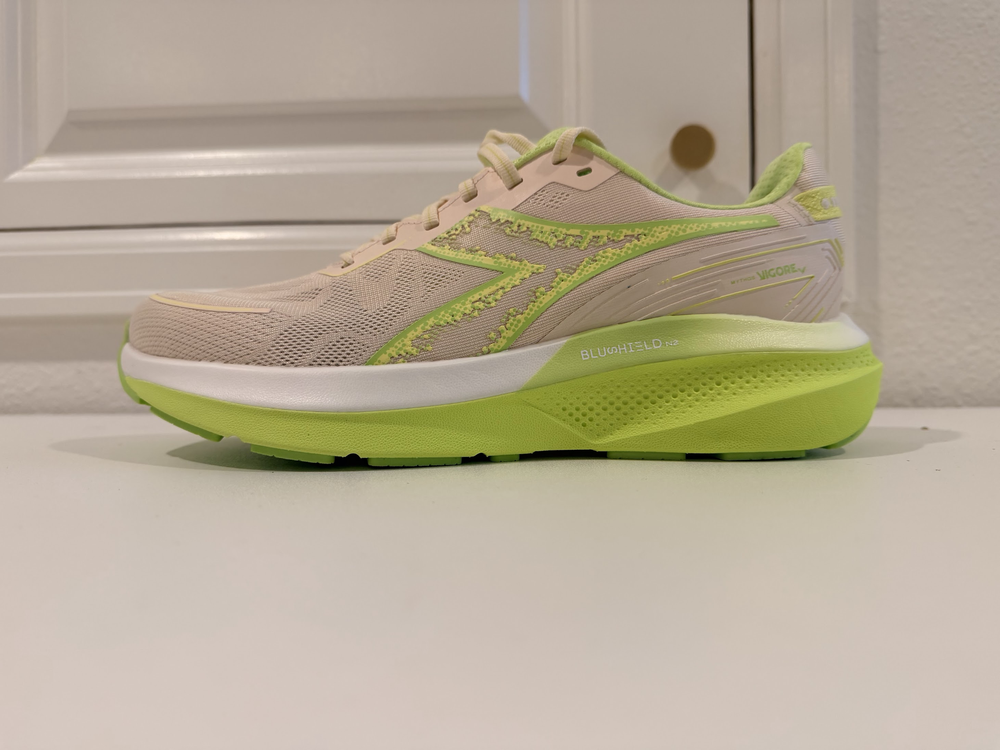

### Stats

- Spec Weight: men's  11.1 oz / 315g US9 :: women’s 9.31 oz / 263 g (US 8 sample)
- Sample Weights:
    - men’s  10.2oz / 290g US 9
    - women’’s 9,31 oz / 263,8 g US 8
- Stack Height: 39 mm heel / 28 mm forefoot
- Platform Width:  95mm heel /  76mm midfoot  / 114mm forefoot

### First Impressions, Fit and Upper

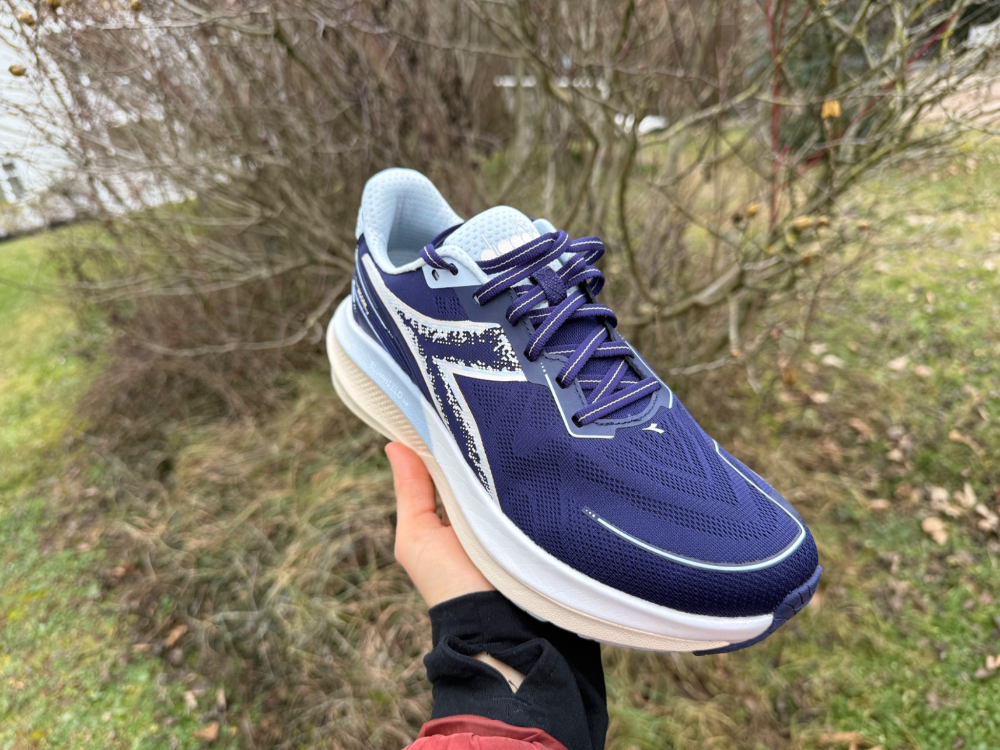

Eva: Right out of the box, the Diadora Vigore V presents with a premium, well-built first impression. The shoe feels protective and substantial without coming across as sloppy or overly soft. On foot, the initial step-in comfort is high, clearly pointing toward a cushioned daily trainer designed for longer, relaxed miles.

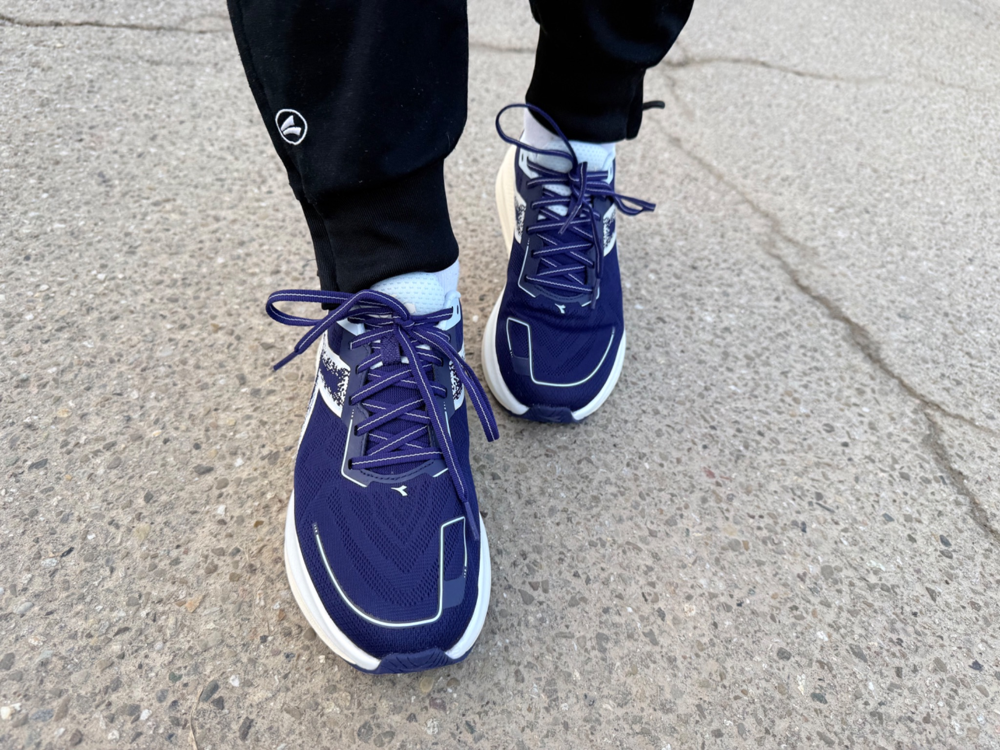

The fit is secure and true to size. The toe box offers a balanced shape: not overly wide, but with enough room for natural toe splay on longer runs.

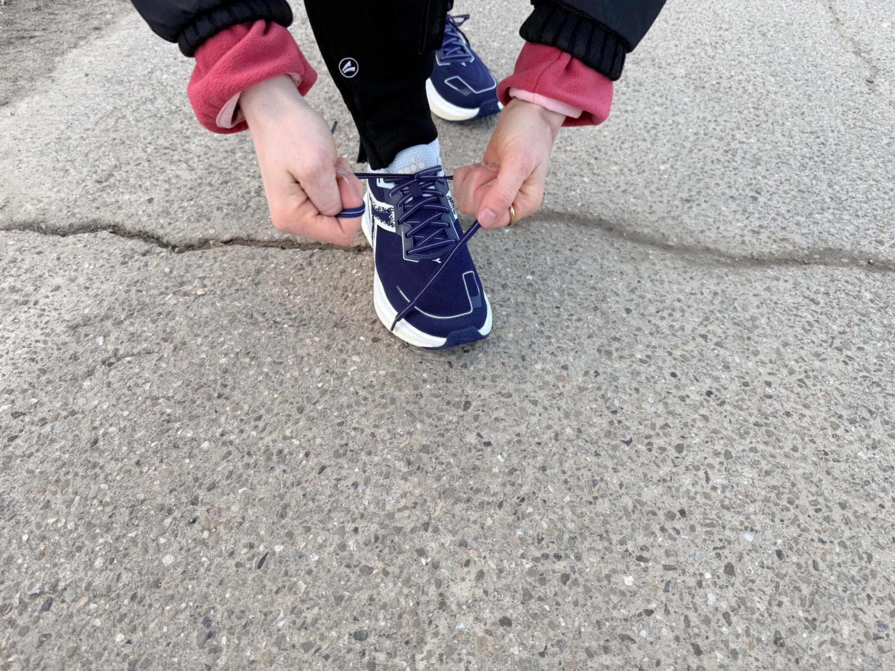

Heel and midfoot lockdown are excellent, supported by the structured upper and the integrated tongue construction, which prevents pressure points and unwanted movement.

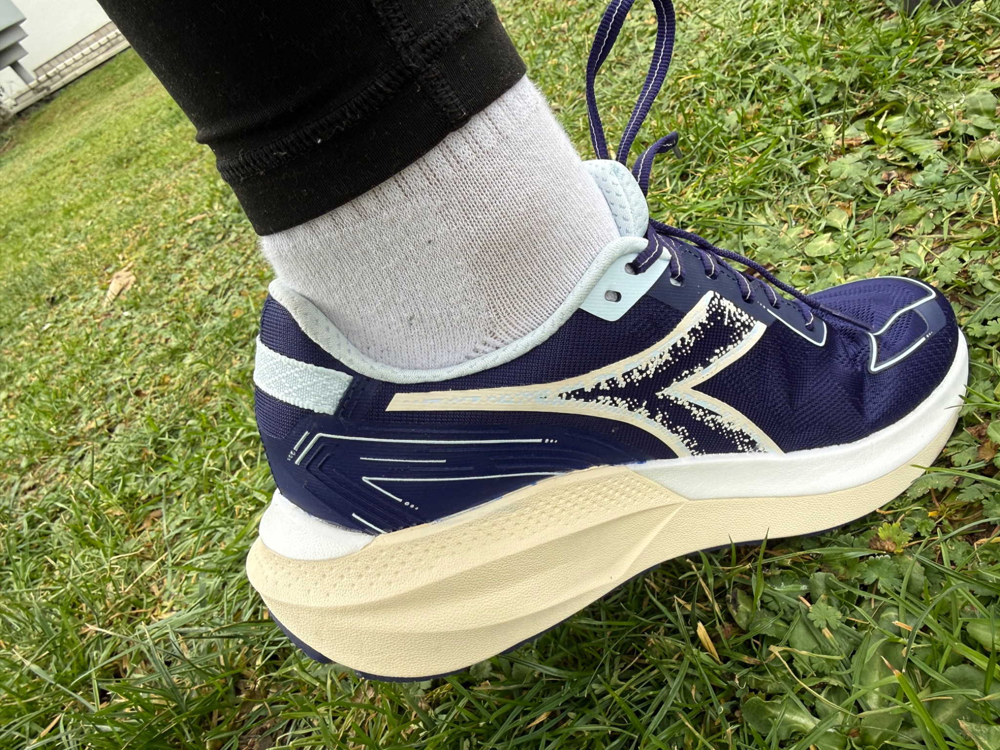

The engineered mesh upper feels durable yet comfortable, with enough flexibility in the forefoot and solid support through the midfoot. ‘

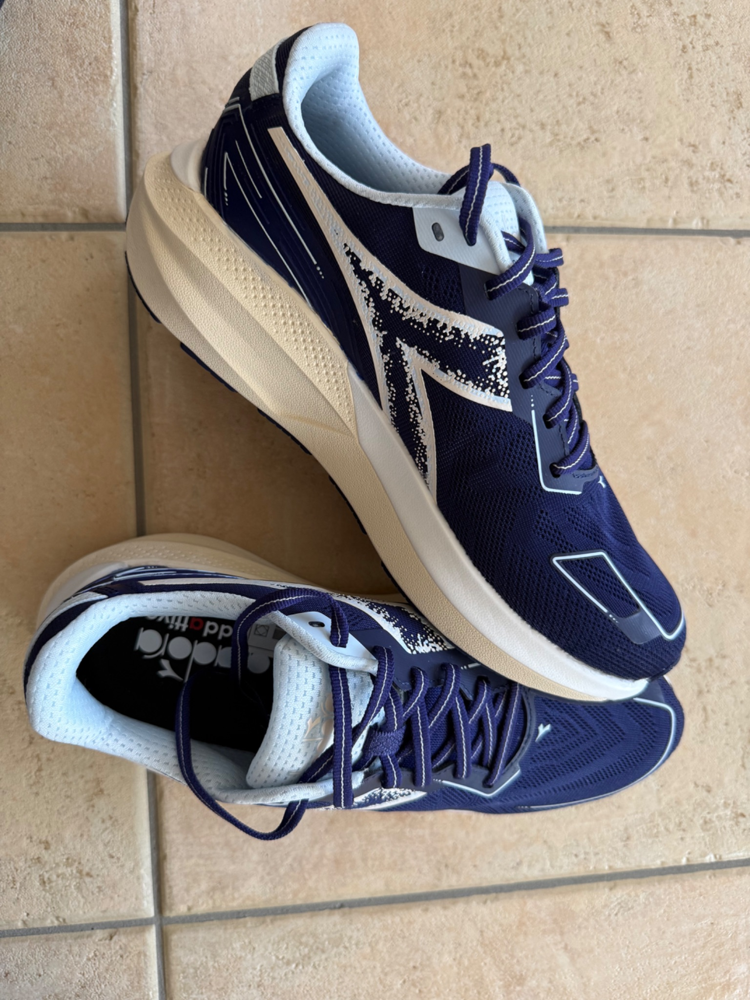

Breathability is adequate for daily training, and the overall construction reinforces the Vigore V’s focus on comfort, stability, and long-term durability rather than lightweight minimalism.

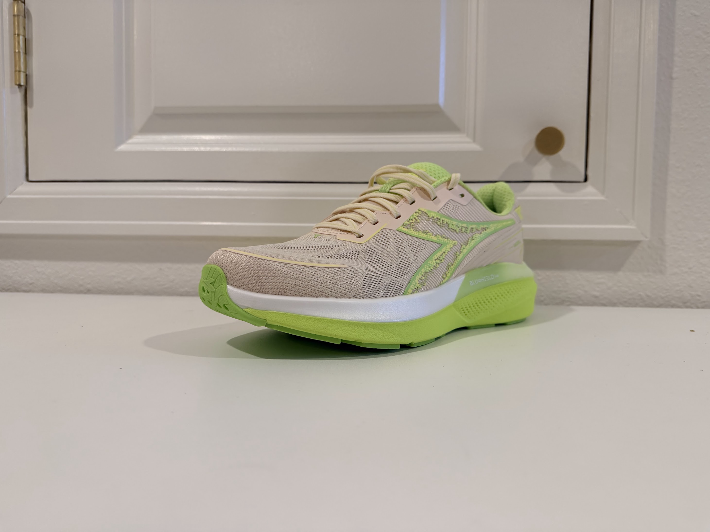

John: Like Eva, my first impression was of a premium, substantial shoe with exceptional step-in comfort. The unitongue construction and engineered mesh create a secure, hot-spot-free fit that feels durable yet breathable enough for daily training.
While Eva found the toebox balanced, I found it surprisingly generous for a stability shoe, offering more room than expected for my slightly narrower feet.
A standout feature is the PU-coated midfoot insert, which provides effective structure without the rigidity of traditional overlays. I will say that the lacing system, while effective, required a slight mid-run adjustment to dial in the lockdown. Once set, however, the upper delivers exactly what you want in a daily trainer: security and comfort without unnecessary bells and whistles.

### 

Courtney: Just as Eva and John have described, the Diadora Vigore V is designed with premium materials and is clearly engineered to bring you superior comfort and durability. The dual layer engineered mesh is not thick, but tightly woven and highly protective.
All around I was very comfortable and dry on my cold weather runs. The upper material is somewhat repellent, as it has stayed incredibly clean despite the ice, snow and mud that we New Englanders have had to work with recently.

### 

The fit was just about true to size on me, perhaps running slightly long as I did notice some heel slippage especially on my first runs. After the break-in period of about 15 miles, there was better hold as it formed to my foot.
The tongue of the Vigore provides plenty of padding to achieve comfort and protection from the laces. On my treadmill testing days, I found it to be too warm with the additional gusseting and wrap around padding at the heel.

### 

The toe box is more tapered compared to competitors and I noted my fifth MPT protruding out slightly on the lateral side, but luckily there is additional length in the shoe that prevents irritation. At the toe, the medial overlays and protective interior toe bumper enhance the forefoot support on the Vigore making it a sound choice for my recovery runs.

### Midsole & Platform

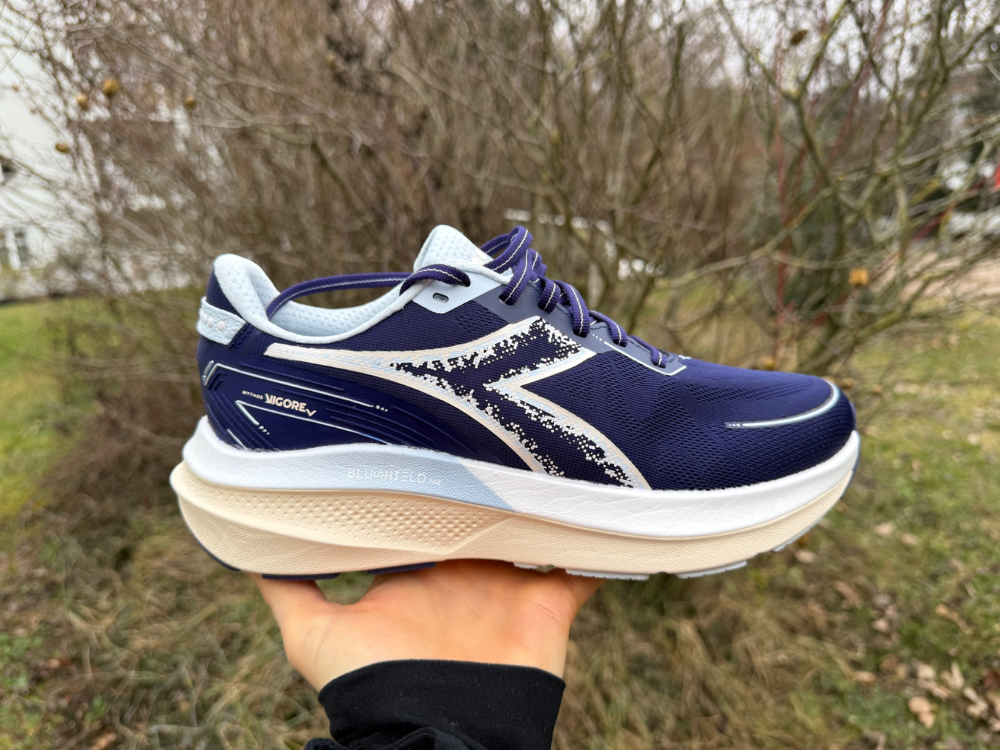

Eva: The midsole of the Diadora Vigore V is clearly built with comfort and stability in mind. The dual-density setup combines a soft, lightweight Anima foam with Diadora’s Blushield technology, resulting in a well-cushioned ride that feels controlled rather than mushy. Impact absorption is excellent, especially at slower to moderate paces, making the shoe well suited for daily mileage and longer runs.

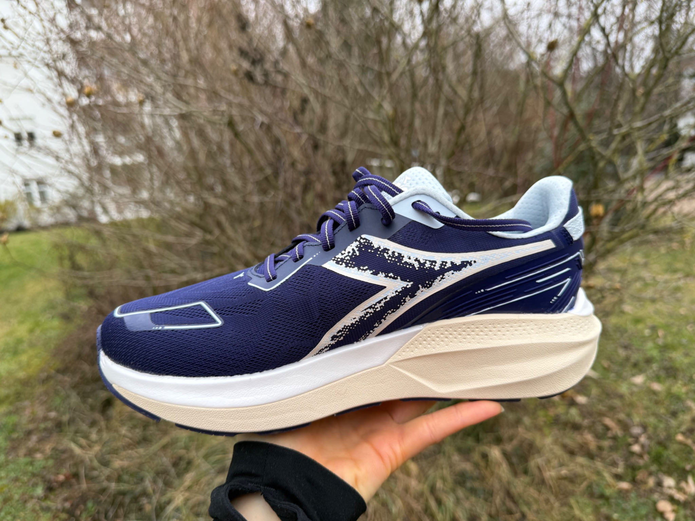

With its high stack height and a broad, stable base, the Vigore V offers a very confidence-inspiring platform. The shoe sits planted on the ground, providing inherent stability without relying on intrusive guidance elements. Transitions feel smooth and predictable, and the platform geometry supports a natural heel-to-toe flow, particularly for heel and midfoot strikers. Overall, the midsole and platform prioritize protection, consistency, and long-run comfort over speed or aggressiveness.

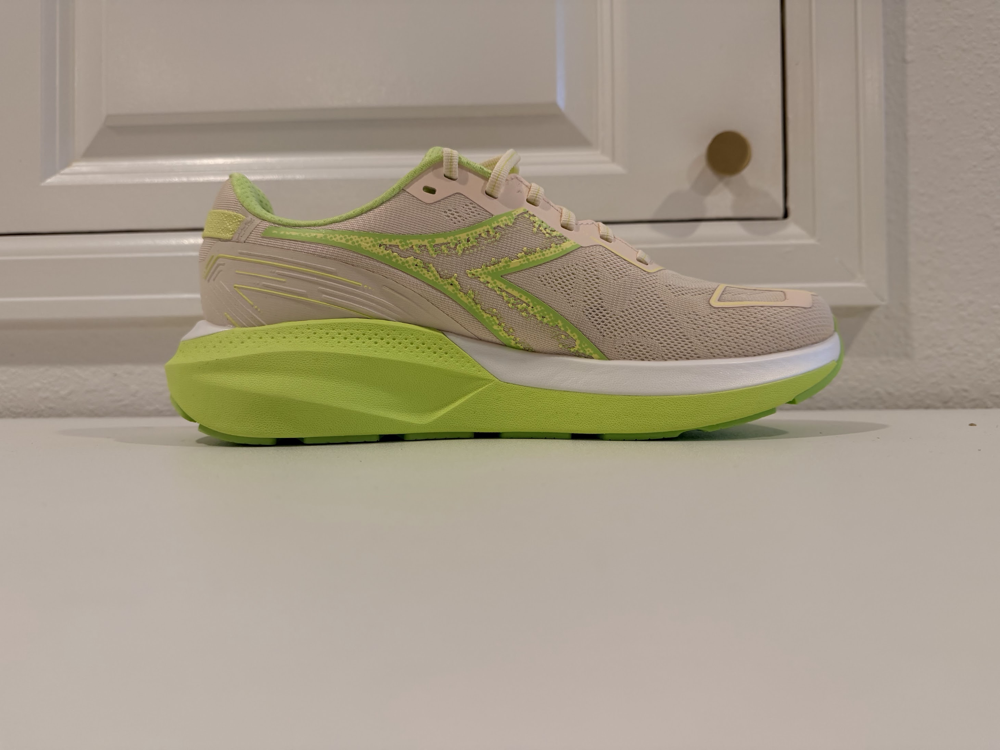

John: The dual-density midsole, combining Anima foam and Blushield technology, produces a ride that is plush yet controlled. I agree with Eva that the impact absorption is excellent and the platform feels very stable and planted without the use of intrusive guidance elements. The 10mm drop feels natural for heel strikers, and the repositioned rocker effectively offloads pressure from the ball of the foot during long efforts.
Interestingly, I noticed the midsole seemed to firm up slightly after an initial 15-mile break-in period. While it remains protective, that soft out-of-the-box feel moderates into a more consistent ride that I suspect will offer better long-term durability. It is a nuanced stability system that stays out of the way for neutral runners but provides a clear benefit when legs get tired.

### 

Courtney: The insole plays a large part in the overall feel of the Vigore V.

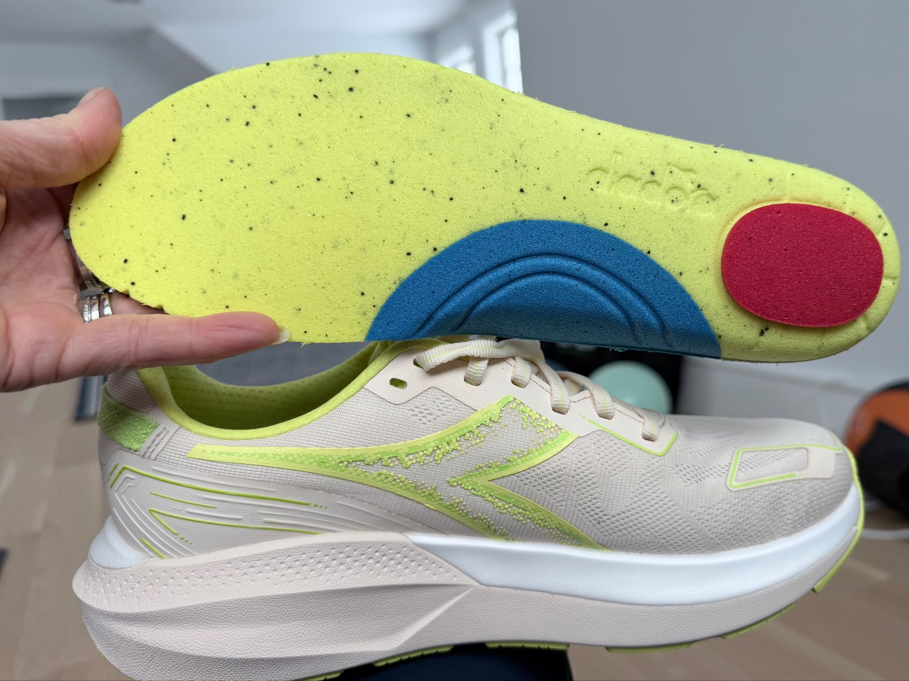

The medial edge has a firmer foam crescent designed for the arch. This was something I felt underfoot especially in the first few runs and it definitely felt more medial post-like at first. You have to give this shoe time to break in! The heel of the insole also provides a significant additional cushioning. For slower runs this is where I land and I truly appreciated the impact absorption. Overall the ride is smooth but not snappy. Diadora’s Dual Density Anima Foam/Blushield is a super critical EVA that provides motion control and absorption. There is no way I can take this shoe into more than a recovery pace, and I suppose that is fine with me. Sometimes you need a speed limit pair of shoes. TRX support system adapts to the runners needs personalized dynamic stability

### Outsole

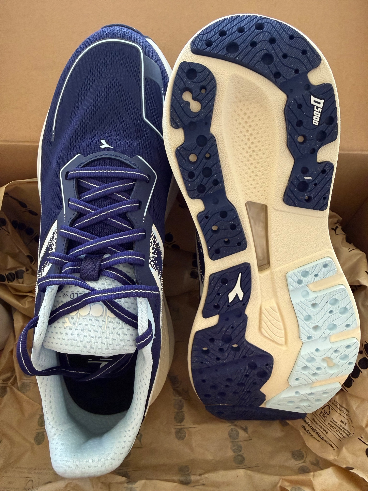

Eva: The outsole of the Diadora Vigore V underlines the shoe’s focus on durability and stability. Diadora uses a combination of abrasion-resistant rubber in high-wear areas and a slightly softer compound in the forefoot to balance longevity with grip.
Coverage is generous, especially in the heel, which should appeal to runners who log a lot of easy and long miles on asphalt.
In terms of ride, the outsole clearly plays an active role. The firm rubber and broad contact area add a subtle stabilizing effect, reinforcing the planted, controlled feel of the midsole. At the same time, the forefoot remains sufficiently flexible to allow for smooth toe-off, preventing the shoe from feeling overly stiff. Rather than adding bounce or speed, the outsole contributes to a consistent, predictable ride that favors comfort and confidence over agility.

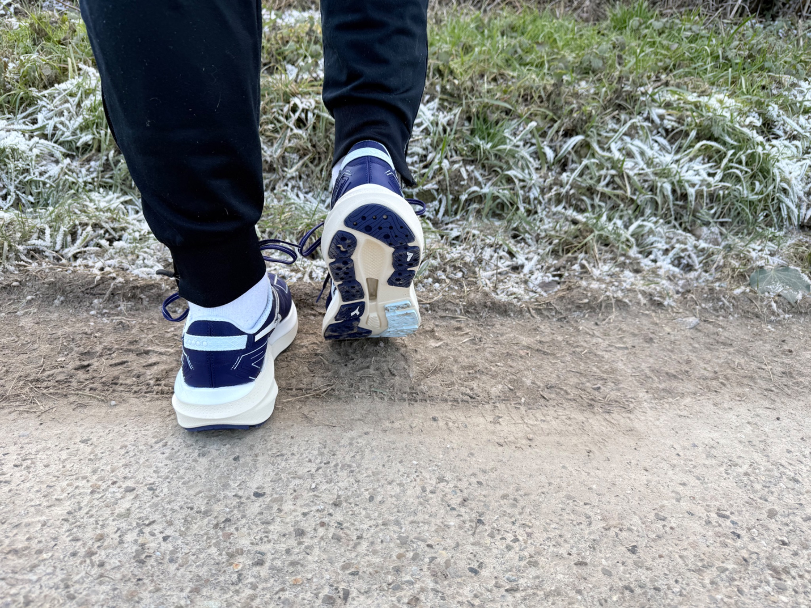

John: While Eva focused on the outsole’s durability on asphalt, my trail running roots found its versatility to be a major highlight. The combination of Flexoft and Duratech 5000 rubber is extensive and provides a subtle stabilizing effect. However, the real value here is the 4mm lugs, giving the Vigore V legitimate capability on hard-packed gravel paths, which is a significant plus for runners who frequent mixed surfaces.
The traction on wet pavement is pretty good too, and the rubber coverage seems like it would last awhile. While the extensive rubber does not add snap or agility to the shoe, it reinforces the consistent, predictable ride that Eva and I both appreciated. It bends where it should at toe-off, but it prioritizes a planted feel over pure flexibility.

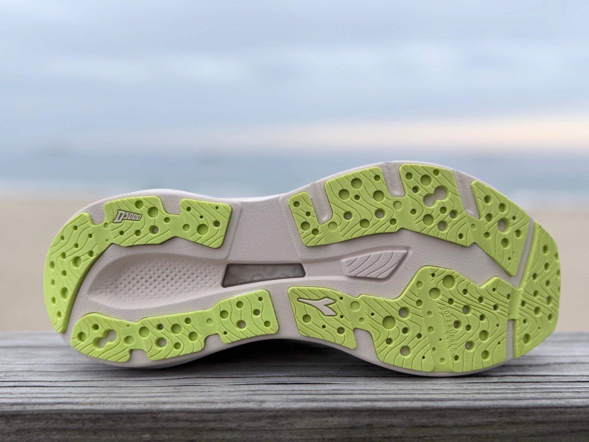

Courtney: The outsole of the Vigore V is quite firm offering support and targeted grip rather than a natural flexing ride. The Flexoft rubber Duratech 5000 provides excellent grip and I felt confident taking it on snowy dirt roads. The clear window in the center of the outsole shows the bubble Blushield foam tech within the shoe. It also reduces the weight, while preventing rocks and debris from getting stuck in the cutout.
After 20 miles of running and a few neighborhood walks with the dog, I am certain this shoe will exceed typical daily trainer miles, as the outsole shows no signs of wear.

### Ride, Conclusions and Recommendations

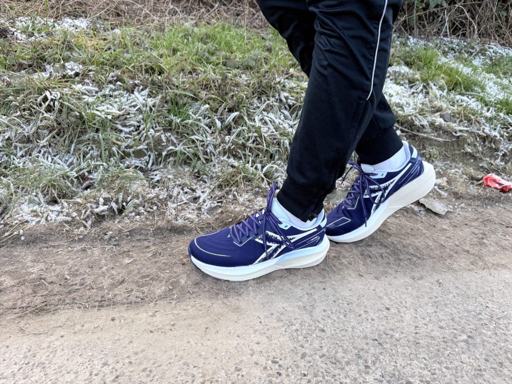

Eva: The ride of the Diadora Vigore V is clearly shaped by its design priorities: protection, stability, and comfort over long distances. On the run, the shoe feels very controlled and planted, with a smooth but rather firm transition from heel to toe. For my personal preferences, the Vigore V comes across as a bit too stiff, and the high stack height reduces ground feel more than I typically like. Runners who enjoy a softer, more flexible, or more responsive ride may miss a bit of feedback from the road.
That said, taken in the context of its intended purpose, the Vigore V performs exactly as designed. On asphalt, it shines during easy and relaxed runs, where cushioning and stability matter more than agility or speed. The structured platform and consistent ride make it a reliable option for daily mileage, recovery runs, and longer outings at comfortable paces. While it may not become my personal go-to shoe, I can easily see it working very well for runners who prioritize protection, support, and a calm, predictable ride.
Eva's Recommendation: Best suited for runners looking for a stable, highly cushioned road shoe for easy runs and long distances on pavement. Less ideal for those seeking a dynamic, flexible feel or strong ground contact.
- Points off for:
    - Ride feels too stiff for my taste
    - Limited ground feel due to the thick midsole
    - Not particularly dynamic or playful at faster paces
- What could be improved:
    - A slightly more flexible forefoot or a touch more midsole responsiveness would help balance the strong cushioning with a more engaging ride.

### Eva’s Score: 7.83/10

### Fun Score! Out of 5 😊😊😊😊

Ride (50%): 7.5/10. Fit (30%): 8.5/10 .Value (15%): 7.5/10. Style (5%): 8.0/10

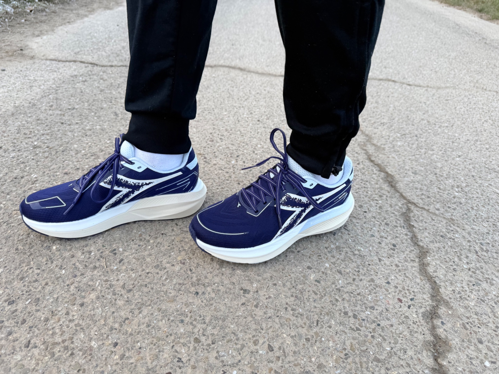

John: The Vigore V is a well-executed trainer that shines on easy days and long runs where comfort is the priority. As Eva noted, it lacks the dynamism for faster sessions, and the 11.6 oz weight becomes noticeable if you try to pick up the pace. At $185, it is a premium-priced investment, but it delivers a confidence-inspiring ride that is ideal for those who want maximum protection without the clunky feel of traditional stability shoes.

### Overall Score 8.4 / 10

- Ride: 8.0 - Stable and predictable
- Fit: 9.0 - Accommodating and true to size with good lockdown
- Value: 8.5 - Solid construction and versatile on gravel
- Style: 9.0 - Love the colorway
- Smiles: 😊😊😊😊

Courtney: Overall, the Vigore is an excellent choice for protective and supportive recovery runs. It is a great shoe for runners of all levels. The Vigore works well as a walking shoe, ensuring alignment after a hard morning session. It's a little one dimensional in its usage, and with a $190 price tag I feel there are shoes out there that offer a little more for less money.

### Courtney’s overall score: 7.83 /10

- Ride (50%): 7.5 deductions for lack of liveliness/ one dimensionality
- Fit (30%): 8.25 Heel slippage but still comfortable. It also may be too narrow in the toe box for some.
- Value (15%): 8 premium materials, but maybe not premium ride
- Style (5%): 8 I like Eva’s colorway (more contrast), but the overall look is nice.
- Smiles: 😊😊😊

Eva: Diadora Vigore V (US 8 / EU 39) vs. Nike Pegasus Trail 5 (US 8 / EU 39)
Eva: Both shoes offer good cushioning in a similar weight class, but their focus differs. The Vigore V is clearly road-oriented, delivering a stable, controlled ride with a firm platform. The Pegasus Trail 5 feels more dynamic and versatile, especially when surfaces change. Fit is true to size in both, though the Pegasus Trail 5 has a roomier toe box, while the Vigore V feels more structured and secure through the midfoot. 

Diadora Vigore V (US 8 / EU 39) vs. Craft XPLOR II (US 8 / EU 39.5)
Eva: Both favor comfort over speed, but the XPLOR II is softer and more flexible underfoot. The Vigore V feels firmer and more planted, especially on asphalt. In terms of fit, the XPLOR II runs wider and feels less precise for my narrow foot, whereas the Vigore V provides a more supportive and controlled fit. ()
Diadora Vigore V (US 8 / EU 39) vs. Topo Athletic Phantom 4 (US 8 / EU 39)
Eva: The Phantom 4 offers a lighter, more natural ride with better ground feel and forefoot flexibility. The Vigore V counters with more protection and stability but less road feedback. Both fit true to size, though the Phantom 4’s anatomical toe box feels significantly roomier, while the Vigore V has a more traditional, secure fit.

### Brooks Adrenaline GTS 25

John: both are excellent stability trainers, but the Adrenaline is the more versatile choice for most runners. The Adrenaline’s DNA Loft v3 midsole feels livelier and more responsive, making it capable of handling everything from easy runs to tempo work, while the Vigore V's softer XFlow nitro EVA is more specialized for comfortable, easy-paced miles. The Vigore V offers a roomier fit, more plush cushioning, and better mixed-surface capability thanks to its lugged outsole, but at $45 more and a full ounce heavier, it's harder to justify unless maximum comfort at easy paces is your priority. For most runners seeking an all-around daily stability trainer, the Adrenaline GTS 25 offers better value and versatility, while the Vigore V excels as a specialized long run and recovery day shoe for those who prioritize plush comfort above all else.

### Saucony Guide 19

Courtney: The Guide 19 is a similar shoe in its emphasis on cushion as well as support. They both sacrifice weight in favor of cushion, support and stability. I found the Guide 19 sinks in at the heel where the foam compresses to what almost feels like a negative drop. The Diadora is positioned higher at the heel and thus rolls you nicely forward onto the forefoot. This being said, the Diadora still remains an easy pace shoe and I struggled to even find mid 7:00’s in it.

### Brooks Glycerin 23 GTS

Courtney: The Glycerin is a highly cushioned support shoe, but in my testing I found it provides more gentle guidance than the Vigore. The Glycerin features a bouncy and responsive ride with its strategically placed DNA tuned foam. I did not attempt to do tempo runs in the Glycerin, but doing strides at the end of an easy run were doable. The Vigore feels clunkier, but has the benefit of good structure and cushion. The Glycerin comes in at $180, so a similar price point.