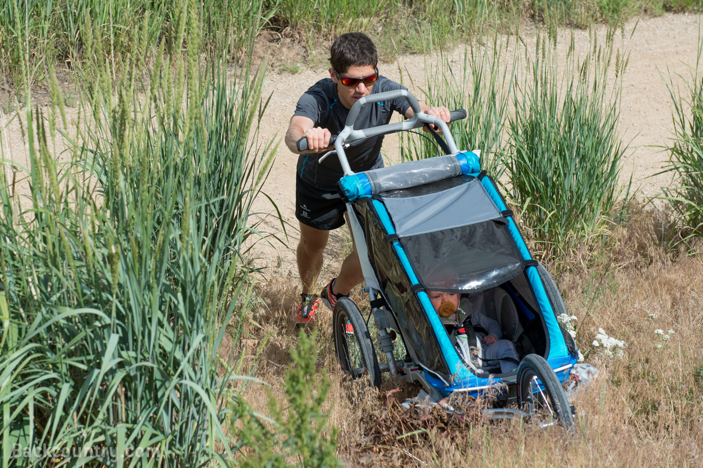
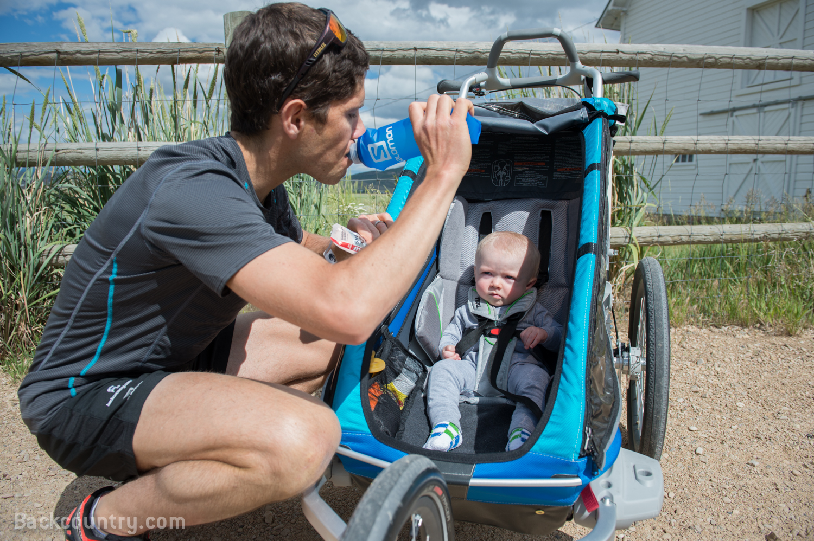

<!--more-->

The day my Thule Chariot CX1 jogging stroller was delivered to the door,
the first thought that came to my head was “freedom.” No, not the kind
of freedom you feel when you are wearing nothing but a bathrobe. I’m
speaking about the kind of freedom John Steinbeck writes about in his
travelogue *Travels with Charley: In Search of America,* his account of
a 1960 road trip around the United States with his French standard
poodle, Charley. In it, he describes the freedom to explore and learn
about your surroundings, the freedom to travel the open road and choose
your own path, and the freedom to share this journey with a faithful
companion.  My newfound freedom with the CX1 jogging stroller wasn’t a
do-before-you-die voyage across the U.S. in a van with a furry friend,
but it did mean I could explore Salt Lake City--on or off the beaten
path--with Lou, my son and trusty companion. 

And it’s not just about getting out of the house--I’ll be the first to
admit (and my wife will be the first to complain!) that I can get antsy
and cabin fever-ish when I don’t run or exercise. As a competitive
athlete, full-time Marketing Analyst, and father, being able to
multi-task is not only helpful, it’s imperative. In addition, the
ability to share time with my boy, get running miles in my legs, and
give my wife a break has helped me in countless ways. Not to mention, it
can be fun!  

If you already own a jogging stroller or if you are thinking about
purchasing one, I’d like to share with you a few “Dos” and “Don’ts” so
that you too can enjoy the pleasures of baby jogging, and pass along a
few tips for getting in a good workout.

​​

**THE BASICS**

**Errands**

**Do** use your baby jogger as a way to combine exercise and doing
errands

**Don’t** forget you have to bring whatever you purchase home with you
in the stroller  
  

While a baby jogger can be used for exercise of nearly any intensity, I
also like to use my CX1 to do errands by foot. I take my son and jogger
to the grocery store, farmers’ market, hardware store, and post office.
One of the key features of Thule’s Chariot CX1 is that it doubles as a
shopping cart with adequate storage capacity, boasting one cargo bag on
the lower back, one large mesh pocket on the upper back, one small
pocket inside large mesh pocket, and two small mesh pockets inside the
carrier at the front. (Note that the maximum load capacity of the larger
cargo bag is 8.8 pounds.) For reference, a gallon of 2% milk weighs just
about that. So be sure to monitor the weight and size of your purchases,
and don’t forget you have to tow home whatever you buy. Your baby may
not be too excited about sharing space with a lot of produce!

> 

<a
> href="https://substackcdn.com/image/fetch/$s_!6G75!,f_auto,q_auto:good,fl_progressive:steep/https%3A%2F%2Fsubstack-post-media.s3.amazonaws.com%2Fpublic%2Fimages%2F390090bc-0b21-41b6-aacc-9e561046935b_1500x998.png"
> class="image-link image2 is-viewable-img" target="_blank"
> data-component-name="Image2ToDOM"></a>
> 

**Fuel**  
**Do** bring snacks and hydration

**Don’t** bring snacks and hydration only for you  
  
Before I started sharing my training time with Lou, going out for a long
run or interval session was simple and, dare I say, selfishly focused on
my needs. When I go out for a long run, for instance, I always make sure
to carry a water bottle with Lemon-Lime Skratch Labs and, though I don’t
like the texture of energy gels, I take an emergency Clif Shot, in case
I need supplemental calories to make the run less of a slog and more
enjoyable. Similarly, when out baby jogging with your child, a happy
baby makes a happy passenger, which translates to an enjoyable ride for
the baby and an enjoyable run for you. In case you forgot, babies
require a lot of attention. As in, they can’t change their own diapers
and they certainly can’t remember to bring their own provisions on an
outing with Mom or Dad.  I bring along emergency snacks as well as toys
for my son, in case he gets hungry or bored.  So, if you head out for a
long run in the Thule Chariot CX1, do remember to bring snacks and
hydration. But remember, baby jogging requires greater attention to all
things baby related and it’s no longer just about you, so don’t bring
provisions *just* for you to make it through the long run. Trust me.

> 

<a
> href="https://substackcdn.com/image/fetch/$s_!XBAo!,f_auto,q_auto:good,fl_progressive:steep/https%3A%2F%2Fsubstack-post-media.s3.amazonaws.com%2Fpublic%2Fimages%2Fbd2c9155-5f68-49c5-a9eb-ba8e725d6ff8_1500x998.png"
> class="image-link image2 is-viewable-img" target="_blank"
> data-component-name="Image2ToDOM"></a>
> 

 **GETTING A WORKOUT **

Excursions with a baby jogger can be more than just getting out and
about. Now that we have some of the basics covered, here are some tips
for getting a serious workout with your jogger. 

**Expect to go slower**

When I first took the stroller out for a run, I immediately noticed the
level of effort to run while pushing was more difficult. My typical
five-mile loop took me about 20 percent longer to finish than without a
stroller. Although your strength and expertise with running while
pushing a stroller will improve over time, babies keep getting bigger
and gaining more weight (making the stroller heavier to push), so it’s
sometimes frustrating to look at the numbers. Two things to keep in mind
are you're burning more calories with your effort and doing some
resistance training, so don't worry about the slower pace.

**Foot plant**  
When running uphill while pushing the stroller, I sometimes catch myself
planting my foot with toes outward, as if I am doing the fishbone while
skiing uphill. I make an effort to keep my toes forward so that I plant
my foot as I would without a stroller. It is hard enough on your body to
run while pushing extra weight (my arms were sore the first few weeks!),
so be mindful of foot positioning so that you don’t find yourself
injured on the sidelines.

**Running hands-free is unsafe**

It’s not a good idea, even if it helps you achieve a more natural arm
swing. The stroller could easily lose control and get away from you,
which is unsafe for your child and anyone else around you.

**Push with one hand instead**

Pushing a jogging stroller impedes your natural arm swing, which makes
it much tougher on your lungs, heart, and legs. So try pushing the
stroller with one arm and swinging with the other. Keep switching arms
so you get to work both sides. If you do opt for the one-handed push,
make certain the leash is around the pushing arm so that you minimize
the risk of inadvertently losing control of the stroller.

**Patience makes progress**

I run with Lou almost every day – taking him on recovery jogs, interval
sessions (I call them “strollervals”), and long runs. But, because of
the increased effort required to run while pushing a jogging stroller, I
didn’t start out running that frequently or intensely. For instance, I
built up my long run over several weeks’ time by adding five minutes to
my run every Sunday. My first long run was approximately an hour and
I’ve built up to 1 hour 45 minutes, comfortably, over the course of
three months. 

​

