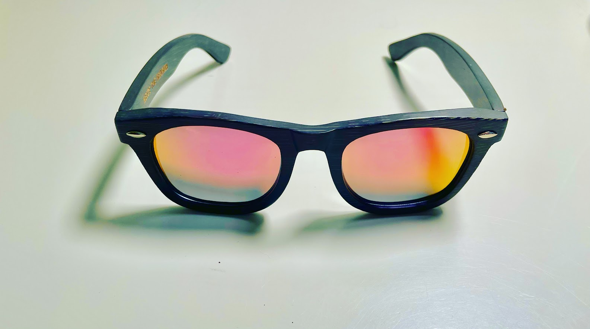
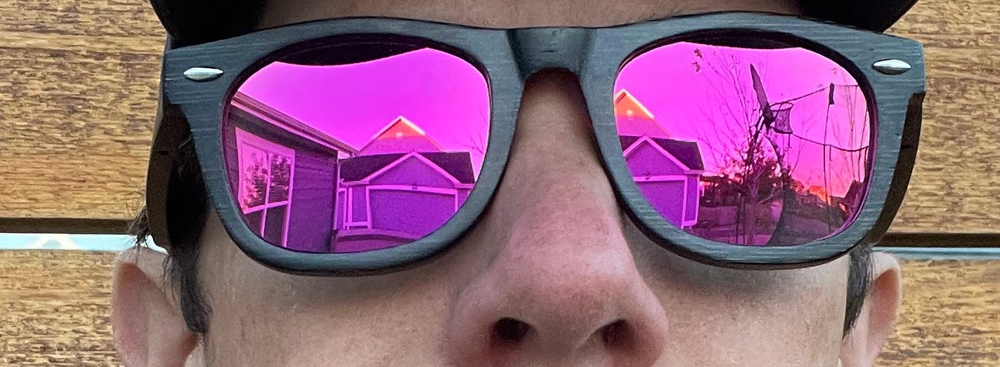
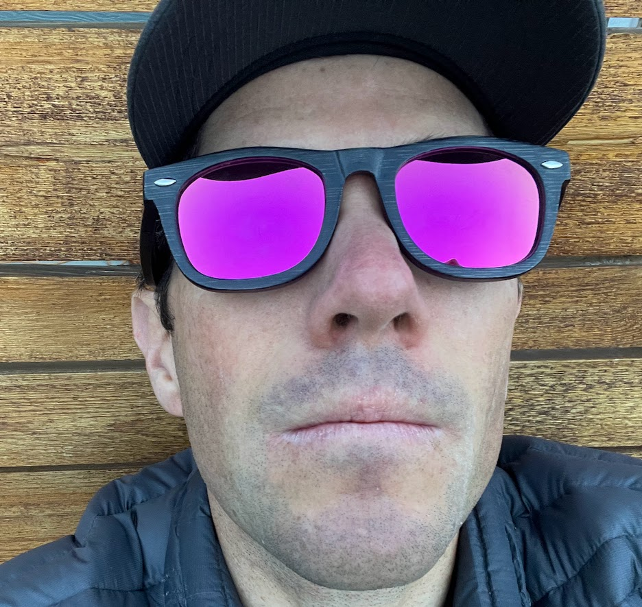
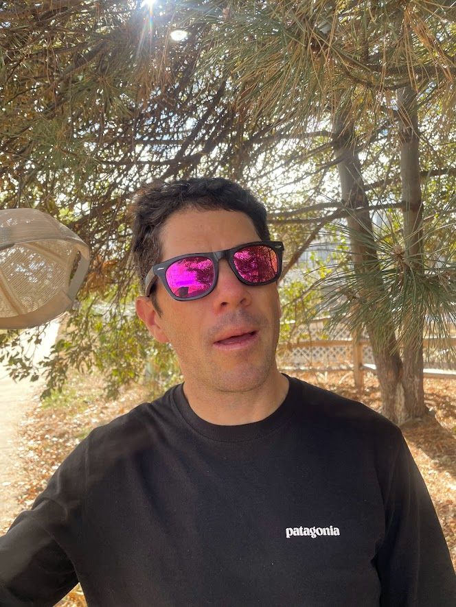

<!--more-->

In the realm of outdoor eyewear, the [Eastern Outer Bamboo Floating
Sunglasses with Pink
Lenses](https://easternouter.com/collections/sunglasses/products/bamboo-floating-sunglasses?variant=41637269962929)
stand out as a unique and compelling option. Crafted from sustainably
sourced bamboo, these sunglasses offer an impressive combination of
lightweight comfort, stylish design, and surprising durability. The
vibrant pink lenses add a touch of personality while providing essential
Polarized UV400 protection, effectively shielding your eyes from the
sun's harmful rays.

[Eastern Outer's story](https://easternouter.com/pages/about-us) is
deeply rooted in a passion for the outdoors and a commitment to creating
functional, eco-friendly products. The company wholeheartedly embraces
sustainable materials like bamboo, seamlessly integrating environmental
consciousness into every piece they craft. This unwavering dedication to
highly renewable resources like bamboo sets them apart in the crowded
outdoor gear market.

Having extensively tested the Eastern Outer Bamboo Floating Sunglasses
during a variety of outdoor activities, including cycling, running, and
hiking, I can confidently attest to their remarkable comfort. The
lightweight bamboo frame sits effortlessly on the face, ensuring a
comfortable fit even during extended wear. I was particularly impressed
by the snug and secure fit, with the sunglasses remaining firmly in
place even during moderate-paced runs. My only minor critique is that
the shape of the frames and the smoothness of the bamboo make it
challenging to rest the glasses on top of my head.

The floating feature is a game-changer for those who enjoy water-based
activities. Whether you're kayaking, paddleboarding, or simply enjoying
a day at the beach, the sunglasses' buoyancy effectively eliminates the
worry of losing them to the depths of a lake or calm ocean. The pink
lenses deliver exceptional clarity and enhanced contrast, making them
suitable for a wide range of lighting conditions. Their ability to
minimize glare proved particularly beneficial during sun-soaked hikes
and bike rides.

While bamboo might initially conjure up images of delicate materials,
these sunglasses proved surprisingly sturdy. They resiliently weathered
accidental drops and other minor bumps without sustaining any damage.
The hinges felt robust and offered smooth movement, instilling
confidence in their long-lasting durability.

The Eastern Outer Bamboo Floating Sunglasses with Pink Lenses
successfully blend functionality with style and environmental awareness.
They offer exceptional performance for outdoor enthusiasts, particularly
for cyclists, runners, and water sports aficionados. Their comfortable
fit, versatility, and durability make them a valuable addition to any
outdoor enthusiast's gear collection.

> ### Pros
>
> - Lightweight and comfortable bamboo construction
>
> - Sustainable and eco-friendly materials
>
> - Floating capability ensures worry-free water activities
>
> - Essential UV400 protection and polarized lenses
>
> - Stylish pink lenses enhance contrast and clarity
>
> - Durable design withstands everyday wear and tear

> ### Cons
>
> - Limited color options for lenses
>
> - Not ideal for resting on top of the head due to shape and smoothness
>   of frames

Thanks for reading Boulder Gear Lab! Subscribe for free to receive new
posts and support my work.
