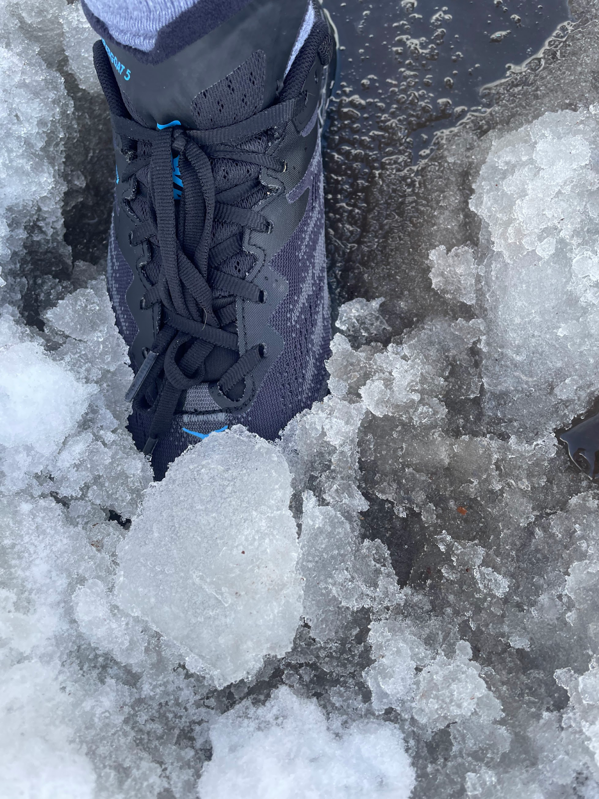
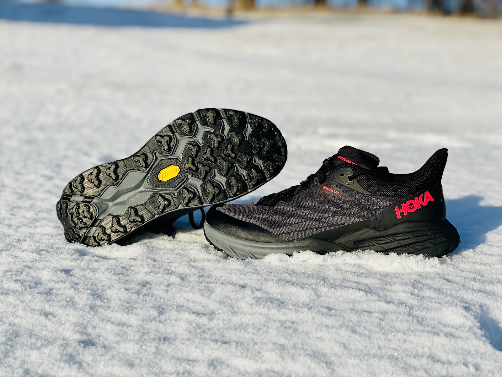
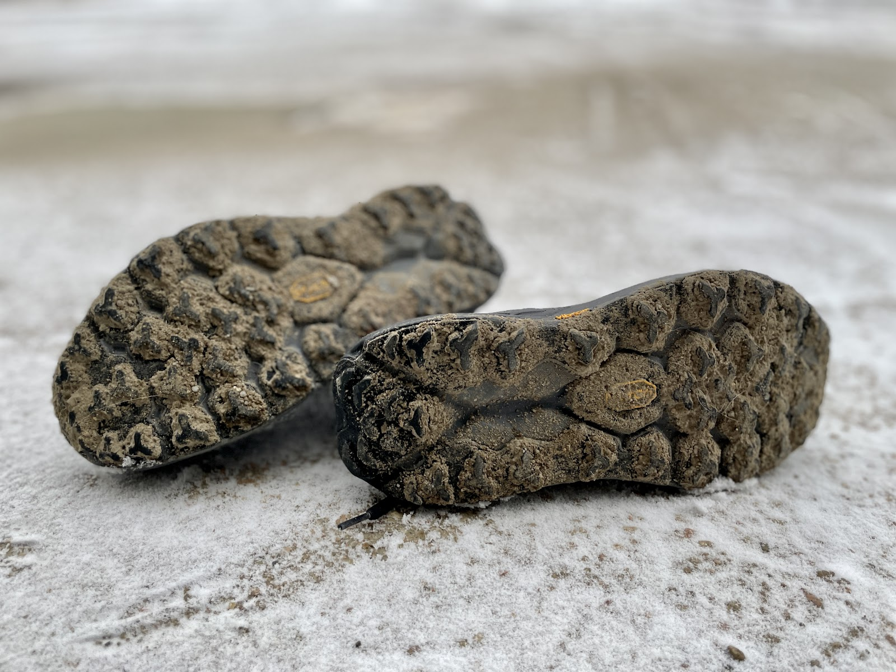

<!--more-->

*Article by Renee Krusemark and John Tribbia*

Original Post from RoadTrailRun
([link](https://www.roadtrailrun.com/2023/01/hoka-speedgoat-5-gtx-multi-tester-review.html))

<a href="https://www.roadtrailrun.com"
class="button primary button-wrapper">Read All RoadTrailRun
Reviews Here</a>

Hoka Speedgoat 5 GTX ($170)

**Pros**

Complete Gore-Tex upper coverage: **Renee/John**

Versatility in winter conditions: **Renee/John**

**Cons**

Weight: **Renee/John**

Heel shape: **Renee**

Midsole is dense and harsh in cold temperatures: **John**

### Stats

Sample Weights:  men’s     9.84oz  / 279g (US 9.0)

                               women’s 9.70 oz /275g (US 7.5)

Stack Height: M 32 mm heel / 28 mm forefoot :: W 30mm heel / 26mm
forefoot

$170. Available now at our partner REI 
[HERE](https://www.avantlink.com/click.php?tt=cl&merchant_id=e295c418-295a-447c-b265-734e25f82503&website_id=b49fa48c-1149-4bca-b4c4-b5af0c5246a3&url=https%3A%2F%2Fwww.rei.com%2Fsearch%3Fq%3DSpeedgoat%2B5)

### First Impressions, Fit and Upper

Renee: The fan favorite Speedgoat returns with a freaking fantastic
GTX upper! I bought the Speedgoat 4 (not a review sample) and returned
it. The shoe was too heavy for me and my little toe needed more room. I
won’t bury the lead here: I like the SG 5 much better. The GTX version
is quiteheavy and still doesn’t have what I call a “roomy toe box,”  but
it’s a useful winter running shoe. I don’t have the non-GTX version of
the Speedgoat 5 for reference. Jeff V. and Jeff B. have an excellent
review of [the non-GTX
version](https://www.google.com/search?client=safari&rls=en&q=roadtrailrun+speedgoat+5&ie=UTF-8&oe=UTF-8),
which I recommend reading. 

The upper is a double layer jacquard engineered mesh with what Hoka
calls a “Gore-Tex Leaf membrane bootie”. The fit of the upper uses a
normal lacing system and I thought it fit much like a trail shoe without
Gore-Tex. The “bootie” refers to the Gore-Tex completely wrapping around
the inside of the shoe, including the tongue and tongue gusset. As a
winter running shoe, that full coverage of Gore-Tex keeps sleet and snow
out of the upper. 

I’d prefer a traditional heel style and I’m hoping Hoka ditches the “elf
heel” for this shoe in the next version. The heel security is okay, but
the shoe would ride much better for me on uneven terrain if the heel fit
was lower and tighter around my ankle. Without a gaiter, the elf heel
can be a funnel for snow. 

For sizing, I suggest true-to-size or the same size of any other Hoka
shoe. I’m between half sizes, and despite Hoka having a narrow fit (and
narrow toebox), I prefer to wear my half size lower (women’s 7.5 instead
of 8). 

**John**: This is my first time running in the Speedgoat. The GoreTex
upper is a great feature of the Hoka Speedgoat 5. I like that it is
completely waterproof, but still somewhat breathable. I kept my foot
submerged in standing puddles for well over a minute or two and the
membrane bootie works like a charm - my foot was totally dry. 

The GoreTex upper also helps to keep my feet warmer in cold weather and
the full coverage keeps water from seeping into the shoe. Unless you’re
running in deeper snow, this means that my feet stay dry and
comfortable, even when running in wet and snowy conditions. 

The Speedgoat 5 fits true to size. If you are at a half size, I would
recommend trying on both the half size down and the half size up to see
which one fits better. The Speedgoat 5 has a roomy toe box that allows
for good movement of the toes. It is also designed with a midfoot
lockdown system that helps to keep the foot in place. The upper of the
Hoka Speedgoat 5 has a snug, comfortable fit. I don't feel like my feet
are slipping or sliding around in the shoe, and the upper hugs my foot
nicely. When I'm bombing down trails, I like that the Speedgoat 5 keeps
a tight grip on my foot, with no slipping or rubbing

### Midsole

Renee: The midsole is CMEVA (Compression Molded EVA) with a late
stage rocker. The midsole is firm, but not uncomfortably harsh and works
for me as a trail shoe when I don't want an over cushioned midsole. I’m
not a fan of rocker midsoles/rides for trails, but the late stage is
just enough to help roll forward without getting in the way of being
agile. 

The women’s stack height is 2mm less than the men’s at 30mm/26mm. For
trail, the 4mm drop is perfect. I won’t choose the shoe for buffed or
flat surfaces (mainly because of the weight). The shoe easily has enough
cushion and comfort for long runs. The shoe works for easy short runs
too, although I’d prefer a lighter shoe for any run less than one hour. 

**John**: Renee describes the midsole really well. I similarly found the
midsole to be firm and in really cold temperatures (&lt; 20\*F) I also
found it to be a bit harsh. That said, in more moderate temperatures,
the Speedgoat 5 strikes a good balance in terms of cushioning. It's not
super squishy that it feels like it's sapping energy with each step, but
it still provides a good amount of impact protection. The CMEVA midsole
foam provides a comfortable cushion that dampens the underfoot terrain
while offering good stability. 

### Outsole

Renee: I tested the non spike version of the GTX, which has the same
outsole as the regular non GTX Speedgoat. 

The 5mm lugs and Vibram MegaGrip are comfortable on a variety of
terrain. I ran through snow (mostly), some mud, gravel, grass, and
through fields. The 5mm lugs aren’t uncomfortable on rolling hills
(gravel roads) and offer enough traction through slight mud.

At times, the lugs seem less than 5mm, but it’s hard to get good
traction through snow regardless of outsole quality. Hoka’s “Traction
Lugs” refer to the small, rubber triangular shapes that outline the
front and back of most of the outsole lugs. 

**John**: The Speedgoat 5 outsole has a lot of small lugs that provide
good traction on a variety of surfaces, including mud, loose dirt, snow,
ice, and slick rocks. I've never felt like I was going to slip or slide,
even on wet or muddy surfaces. I also ran them on pavement and they were
reasonably efficient, although I would still prefer them off-road. 

### Ride

Renee: The ride is smooth. The more I ran in the shoes, the more I
liked it. The late stage rocker is not as obtrusive on uneven surfaces
as I initially thought it would be. At slow paces (which is pretty much
all I can manage when running through snow), the ride is protective and
comfortable. 

At 9.70 oz /275g in my women’s US7.5, the SG 5 GTX is a heavy shoe, so
it’s not my choice for moderate or fast paces. For 2-4 hour runs, the
ride was fine. For a longer run at a fast pace, the weight would bother
me so I’d hesitate to wear it for a race unless the trail conditions
warranted a GTX upper. 

I thought the shoes worked well for snowshoe running, although I’d
suggest a gaiter to keep snow from entering around the heel. 

**John**: The late stage Meta Rocker took some getting used to, but
after adjusting I found it helps to propel me forward with each step and
makes running feel more efficient. Like Renee, I like the smooth ride of
the shoe, especially for slower paces on uphills and downhills, but felt
encumbered when trying to pick up the pace. 

### Conclusions and Recommendations

Renee: For winter running, the SG 5 GTX is very useful. I don’t like
heavy shoes and I’m not usually a fan of rocker midsoles. However, the
GTX of the upper is well integrated around the entire tongue, so during
winter snow/slush/sleet running I had no issues racking up miles in this
shoe for review. 

I think Hoka fans will enjoy the ride. Runners who haven’t liked the toe
box or narrowness of the SG in the past probably won’t gravitate toward
this shoe, but I found the fit more accommodating than the SG 4, even
with the GTX upper. 

Some of the appeal of the SG5 is the weight reduction from previous
versions, but the GTX upper places the shoe in a heavy weight category
for me. I can complain about the weight, but for logging miles in harsh
conditions, the SG5 GTX is worth it. While I didn’t test the GTX Spike
version, I suggest reading my fellow RTR reviewers’ thoughts
[here](https://www.roadtrailrun.com/2023/01/hoka-speedgoat-5-gore-tex-spike-multi.html)
and consider it instead of the non-Spike version as it adds tungsten
carbide spikes for yet more winter traction. 

**Renee’s score: 9.0/10** (-.50 heavy, -.20 a bit narrow, .30 heel
security/shape)

😊😊😊

**John**: The Speedgoat 5 GTX is a great fitting shoe that has an
extremely waterproof + secure upper. It boasts a well cushioned (but not
pillowy) midsole with a smooth rockered ride. It is a fun, reliable and
stable shoe that opens greater possibilities of exploring in harsh
conditions thanks to the GoreTex upper.  The Speedgoat 5 is versatile
and is a great option for moderately paced runs, short and long distance
across a multiplicity of terrain types

John’s Score:  9.3/10

Ride: 9 - A smooth, well cushioned, and nice rocker  
Fit: 9.5 - Roomy toebox and secure upper  
Value: 9 - For a really winterized shoe that is waterproof AND
breathable, this is a good one  
Style: 9.5 - I love the all black!  
Traction: 9.5 - Very versatile and secure on wintry stuff  
Rock Protection: 9 - Dense midsole provides solid protection

😊😊😊😊

### Comparisons

Index to all RTR reviews:
[HERE](https://www.roadtrailrun.com/p/blog-page.html)

**Saucony Peregrine 13 GTX** (RTR Review soon)

Renee: The Peregrine 13 GTX is a lighter weight shoe without a
rocker ride. The rock plate helps with uneven surfaces although the
Speedgoat has good protection underfoot without a plate. The GTX on the
SG5 wraps around the heel, whereas the Peregrine GTX does not. For a
more traditional, faster ride I’d choose the Peregrine. For the GTX
coverage, I’d choose the SG. I have a size 8 in the Peregrine and a 7.5
in the SG. 

**John**: The Hoka Speedgoat 5 and the Saucony Peregrine are both great
trail running shoes, but they have different strengths and weaknesses.
Note: I didn’t test the GTX version of the Peregrine, so I’ll only
comment on the non-upper shoe features. The Speedgoat is a more
protective shoe underfoot with a pronounced rocker that is ideal for
long runs and hikes, while the Peregrine is a lighter and more
responsive shoe that is better for speed work, racing, or something
uptempo.

**Nike Pegasus Trail 4 GTX** ** **([RTR
Review](https://www.roadtrailrun.com/2022/12/nike-react-pegasus-trail-4-gtx-multi.html))

Renee: The Pegasus Trail 4 GTX is a lighter, more nimble shoe.
Although a road-to-trail shoe, it rides well on single track. The SG5
has a better forefoot cushion and overall protection for longer, more
technical trails. The GTX coverage is better too, but The Peg Trail GTX
upper is much more flexible and comfortable. The faux gaiter on the Peg
Trail GTX is a nice feature to keep some debris out from the heel
opening, a function I wish the SG had instead of the elf heel shape. 

**John**: The Hoka Speedgoat 5 has a more aggressive tread pattern than
the Pegasus Trail 4, which makes it better suited for running on snow
and ice. But the Pegasus Trail still does well in mud, rock, and off
camber slopes. The Speedgoat also has a wider toe box, which makes it
more comfortable for runners with wide feet.

The Nike Pegasus Trail 4 is a lighter shoe compared to the Speedgoat,
which makes it better suited for uptempo running. The Pegasus Trail 4
also has a more responsive midsole, which makes it feel more agile on
the trail. In addition, the Nike feels much softer and comfortable
underfoot, thanks to the midsole.

The GTX upper on the Speedgoat is more protective, warmer, and holds up
to full puddle submersion. I do like the pseudo-gaiter on the Pegasus
Trail and will always approve of the bright, flashy colorways of the
Nike. 
