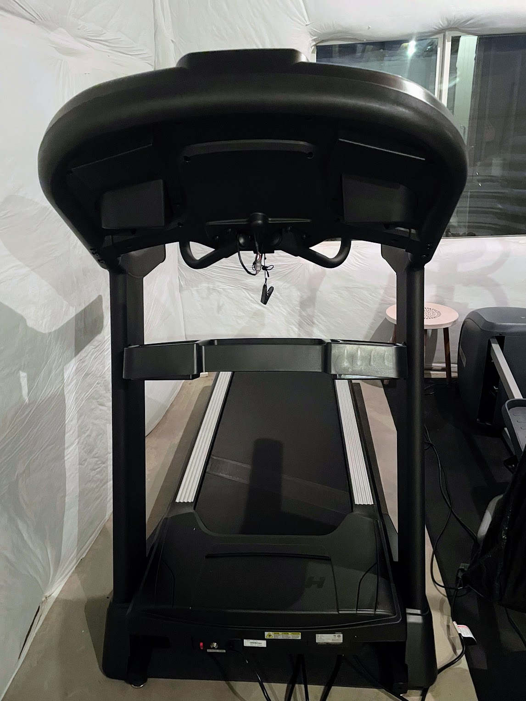
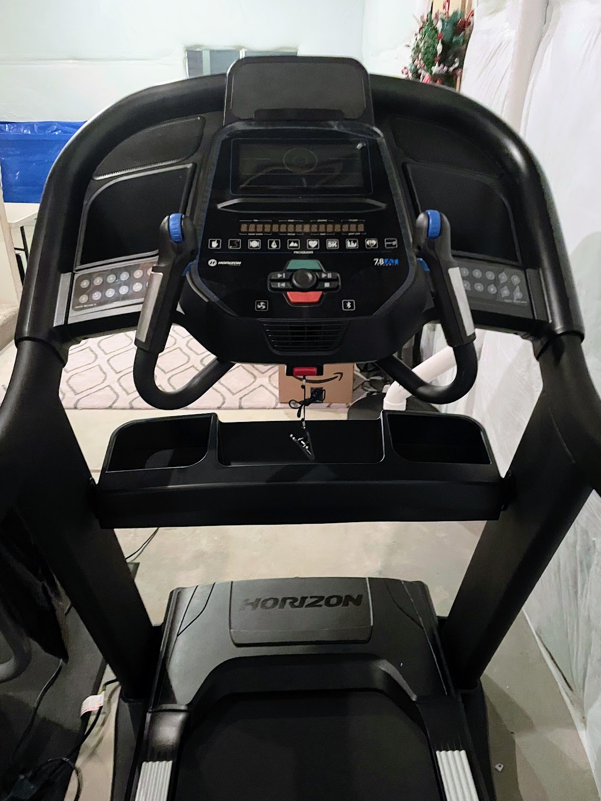
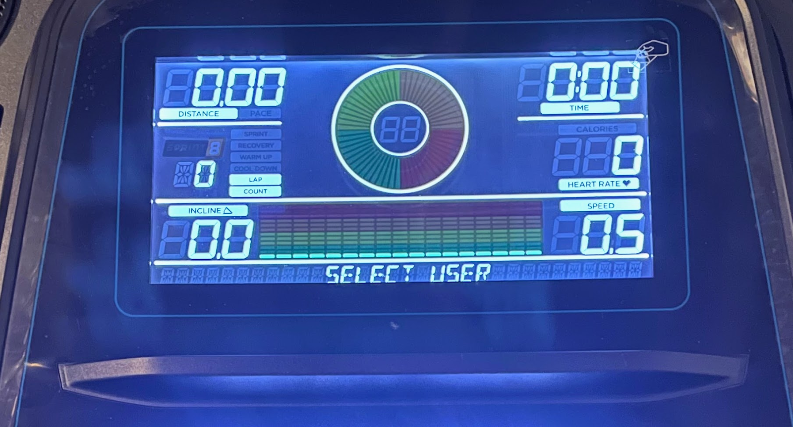
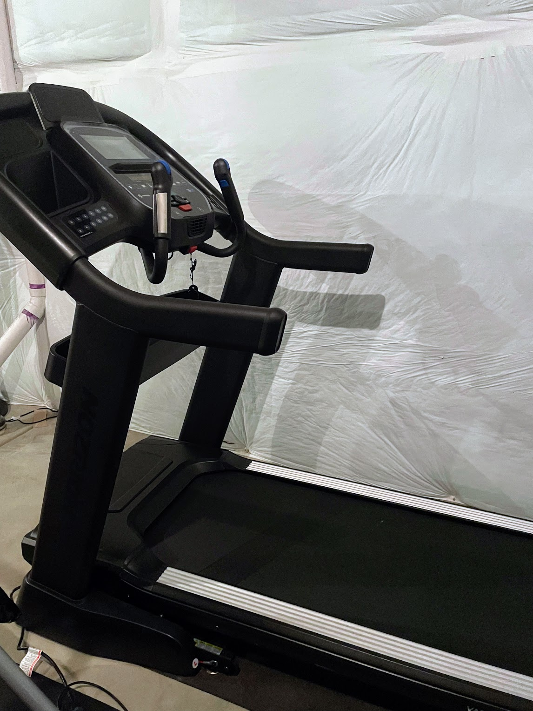
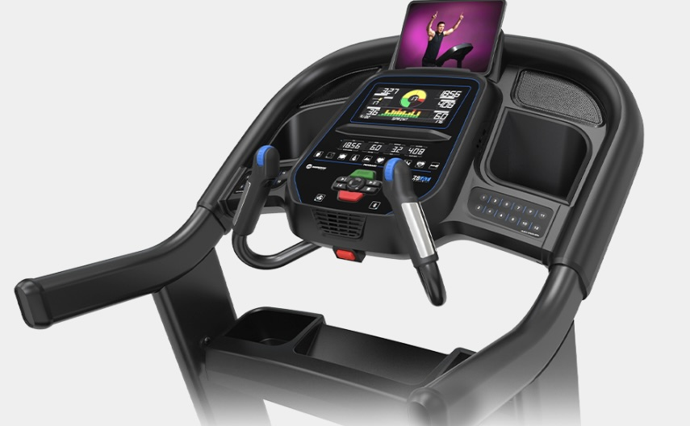
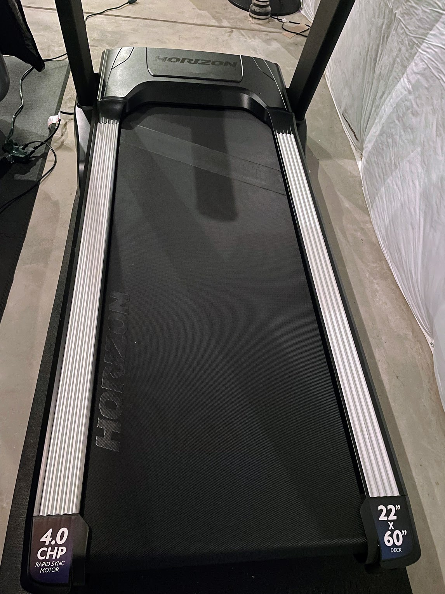

<!--more-->

As a longtime trail runner, I love the feeling of being outdoors - the
fresh air, and the challenge of running on uneven terrain. But lately,
my work and family schedule have made it difficult to get out on the
trails as often as I'd like and I decided I needed to get a treadmill. 

It isn’t that I’m not a fan of treadmills, because I think they are
great training tools for times where sustained hills aren’t accessible
or weather and air quality conditions are unsafe outside. Mentally,
though, they always felt like a chore to me. But, as circumstances
change, so do my own preferences and I’m really excited about having
this option at home. I've found that the treadmill is a great way to get
a run in when schedules are tight or I need to be home. I can run for a
quick 30 minutes before work, or I can spend an hour or more after work
getting a more intense workout. And because the treadmill is indoors, I
don't have to worry about the weather. I can run no matter what the
conditions are outside.

I'm still getting used to running on a treadmill, but I'm starting to
see some benefits. I'm able to run faster and longer than I could
before, and I'm feeling more fit on the inclines.

I received at no cost a [7.8 AT
Treadmill](https://www.horizonfitness.com/horizon-7-8-at-treadmill) from
Horizon Fitness, a company headquartered in Cottage Grove, Wisconsin
that sells a variety of fitness equipment, including treadmills,
ellipticals, and stationary bikes. Horizon Fitness is a subsidiary of
Johnson Health Tech, a Taiwanese company that is one of the largest
fitness equipment manufacturers in the world. Johnson Health Tech also
owns the brands Matrix Fitness and Vision Fitness. Horizon Fitness is
known for its high-quality fitness equipment and its excellent customer
service. In general, Horizon Fitness is a fairly popular choice for at
home fitness enthusiasts who need a quality treadmill or home fitness
equipment at a mid-tier price.

### Pros

- Powerful motor with Rapid Sync technology

- Quiet operation

- Large (long and wide), sturdy deck that is comfortable

- Intuitive controls

- Quick, on the fly, adjustable incline and speed

- Has a lifetime frame and motor warranty

### Cons

- Heavy and not as portable as some other treadmills

- Incline maxes out at 15%

- Speed and incline wheel adjustments are sensitive to accidental bumps
  or turns

### Home Delivery

Horizon Fitness has three options for home delivery: standard $159
delivery where the machine is delivered to your home and you are
responsible for moving it to the desired room and assembling, in-room
$199 delivery where it is delivered to a room of choice but you
assemble, or white glove $299 delivery where the treadmill delivery
comes with room choice and assembly. I opted for the white glove
delivery and was really glad I did. The treadmill comes boxed,
unassembled, and weighs over 350lbs!

The 7.8 AT features a wide and long deck and other features such as an
integrated fan, speakers, and spin dial speed + incline adjustment

### Comfortable running deck

The running deck on the 7.8 AT is made of 22" x 60" of durable material
with 3-zone cushioning. This provides plenty of space for walking,
jogging, or running and should offer enough kickback for even tall
runners. I’m only 5’6” so long strides aren’t a problem for me, but
having enough treadmill real estate to feel comfortable is really
important to me. Also, the impressive 350lb max weight capacity opens
this up as a viable option for larger runners or those that have a heavy
foot plant as well. The 3-zone cushioning system consists of a layer of
foam in the front of the deck, a layer of foam in the middle of the
deck, and a layer of rubber in the back of the deck. Horizon’s
cushioning system is made up of elastomers that have different levels of
support – softer in the front of the deck to absorb more impact where
you land, medium in the transition zone and firmer in the back where you
push off. This system helps to reduce impact and provide a more
comfortable running experience. I would describe the running feel of the
deck somewhere between field turf and gravel packed trails, so it is
pretty easy on the legs while still being responsive. I wore a pair of
Hoka Rocket Xs on my first few runs and didn’t experience any soreness,
even after a fartlek workout where my legs may have residual tenderness
had I done the same effort on concrete. Overall, the running deck on the
7.8 AT is a great option for runners of all levels, especially for
someone like me who is beginning to be more acquainted with treadmill
running. It is comfortable, durable, and provides a good amount of
cushioning.

The running deck is 22” wide and 60” long, which allows for long strides
and variable positioning

### Powerful motor

The 7.8 AT has a powerful motor that can go up to 12 mph and has a 15%
incline. This makes it a great option for runners who want to do
interval training or hill workouts. To be honest, I wish the incline
were more adjustable to 20%+ because I would love to have the option to
practice steep uninterrupted climbs. At the price point of &lt;$2,000,
15% grade is pretty common. By contrast, you’d expect to spend over
$3,500 - $4,500 for something like the NordicTrack Commercial incline
series. 

The motor is also really quiet, so you won't disturb anyone else while
you're running, which I quite like because most of my running is in the
early morning while the rest of my family is sleeping. The motor is also
continuous variable, which means that it can adjust its speed and
incline gradually, which makes it a more comfortable and natural running
experience. You can adjust either speed with the touch of a button on
the panel or use the roller adjustments on the handles with the
highly-responsive QuickDial™ controls and one-touch Interval Keys to
simplify speed and incline changes. I can see this as a great advantage
for runners who want to keep pace with Peloton, Studio.live and other
streaming fitness apps. On the right, you just roll the dial forward to
increase speed and roll it back to decrease speed. On the left, you just
roll it forward to go up the hill and roll it back to come back down.
The rollers are super convenient, but it can be easy to accidentally
adjust the speed or incline, which could be problematic for people who
run close to the console or like to use the handles for stability. 

The QuickDial on top of the heart rate sensor handle allows for quick
adjustment; in addition, there are button selections to quickly change
speed without having to calibrate with the dial. 

There is the same feature on the left side for incline from 0-15%. 

### Variety of features

The 7.8 AT comes with a variety of features that make it easy to use. It
has a built-in fan, which helps keep you cool while you're running and
since I am a self-proclaimed mega-sweater this comes in handy. It also
has a water bottle holder and a magazine/iPad holder rack, so you can
stay hydrated and entertained while you're running. The 7.8 AT console
has a 16 Digit Alphanumeric LED, 9.3" High Contrast Color TFT screen
that summarizes the most needed workout metrics: distance, pace, time,
calories, lap count, speed, incline, and heart rate. I’m okay with using
my own device as opposed to the larger consoles with built in screens.
It means I can flexibly navigate from iPad to phone to Chromebook with
ease.

9.3” screen that displays distance, pace, time, calories, lap count,
speed, incline, and heart rate

Tablets can be placed above the screen in the designated holder, which
is at eye level

There is additional storage for phones, water bottles, and other
miscellaneous things like (my personal preference) a wadded up towel on
the left and right parts of the screen below the speakers and above the
push button incline/speed controls. 

For those High Intensity Interval Training enthusiasts, the 7.8 AT also
comes with a custom Horizon Fitness [Sprint 8 HIIT
program](https://www.horizonfitness.com/sprint-8). The program is
basically a 20 minute interval session that is pre-programmed with eight
30-second intervals of high-intensity running followed by eight
30-second intervals of low-intensity running, plus warm up and cool
down.

You can also connect with the BlueTooth integration, which allows you to
connect your device to integrated speakers, transmit speed and other
metrics to any of the popular training apps for connected workouts, or
use the BlueTooth 4.0 heart rate strap that connects directly to the
Peloton app. There are also multiple device placement options that don’t
block the console, plus a rapid-charge USB port to keep your phone or
iPad changed at all times.

An integrated fan, BlueTooth connectivity, and several automatic workout
programs to select. When your personal mobile device is connected to
BlueTooth, there are big controls on the panel to stop/start your
playlist

Tucked in the corner of the basement, the 7.8 AT can be used without
taking too much space

### Overall

As someone who is new to home fitness equipment, I can’t necessarily
comment on how the 7.8 AT compares to other home options, but I have and
do run on treadmills at fitness centers, hotels, and the work gym. I can
say the 7.8 AT compares favorably to the other treadmills I’ve used in
terms of performance and ease of use. The motor is powerful (similar to
a Woodway, in fact) with easy on-the-fly adjustment controls to quickly
reach speeds of up to 12 mph and an incline of up to 15%, making it a
great choice for runners of all levels. Though, I do wish there was more
incline range, just out of personal preference. The treadmill also has a
comfortable running deck and a multiplicity of programs that can help
anyone reach your fitness goals or simply play around with so that the
monotony of running on a treadmill doesn’t bore you. The 7.8 AT is
relatively easy to set up (note I didn’t say assemble because I let the
professionals do that!) and use and the controls are intuitive with an
easy to read console. The treadmill also comes with a variety of nice
features, such as a well positioned fan and a water bottle holder.
Overall, the 7.8 AT is a good choice for runners who are looking for a
value priced high-quality treadmill that is both powerful and really
easy to use.

For home space optimization, the 7.8 AT can fold vertically

### Conclusion

So, there you have it. I'm a trail runner who's always been a bit
reluctant to have a treadmill at home, but this one has really changed
my mind. It's a great way to get a workout in when I don't have time to
go outside, and it's also a good way to prepare for my trail runs with
sustained running at an incline. Nothing will ever replace trail
running, but the treadmill is a great option for times when I'm unable
to get to the trails.

<a
href="https://www.roadtrailrun.com/2023/03/horizon-fitness-78-at-treadmill-review.html#more"
class="button primary">Click to See Review on Road Trail
Run</a>
