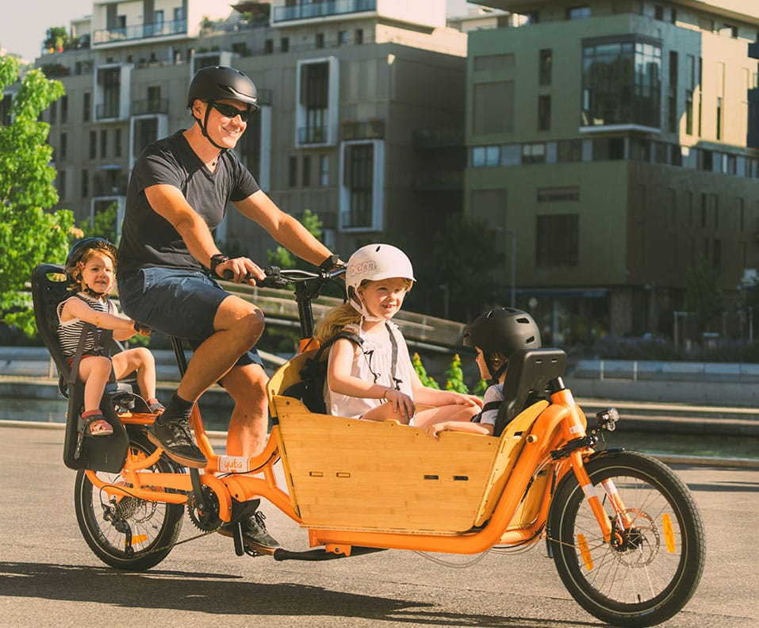

<!--more-->

**A few weeks ago, my car was totaled…**

**It was a trusty 1997 Subaru Legacy Wagon, approaching 222K miles on
the odometer. Prior to the accident, my mechanic told me the car had
another 30K miles of life on it, but the 20 year-old college student who
rear ended me as I was waiting to merge into traffic had different plans
for the fate of that car. Most importantly, and thankfully, nobody was
hurt!**

Thanks for reading Boulder Gear Lab! Subscribe for free to receive new
posts and support my work.

**After dealing with all of the nuances relating to police reports,
insurance claims, and coming to grips with the total loss, a strange
sense of** ***freedom*** **came upon me. I realized that having two cars
was more of a luxury and definitely not a necessity. Sure, an extra car
was great with a busy schedule revolving around family events and
activities, work, and other responsibilities. But, this time, I didn’t
feel burdened with the need to replace that trusty Subaru. Why? I’ve
seen many of my neighbors successfully managing car free lifestyles with
an e-bike. Not to mention, I got a decent payback from the insurance
claim, so I thought to myself “why not?” instead of car shopping right
away.**

### Step 2 : Research Cargo Bikes

**As I mentioned, with a family of three and two dogs, life isn’t short
of excitement. And, having a car made it convenient getting from home to
school drop-off to work to picking up dog food to swim lessons to back
home. I do commute by bike on days where it is conducive, but I was
ready for a complete lifestyle change so I began researching bike
options ranging from a super light hardtail 29er mountain bike with
slicker tires and a trailer in tow to a fully equipped cargo e-bike.
Given a typical day involves multiple stops between home and work, I
narrowed in on the e-bike option. (a) Because it looks super fun! (b)
Having the ability to carry loads with pedal assist is a major bonus and
(c) If you already my previous article \[[Step
1..](https://yubabikes.com/?p=38385)\], you’ll know why!**

- **Have you ever been in a situation where you lost a car and bike
  commuting was a real and practical option?**

- **Or, have you been stuck in traffic while driving to work, wishing
  for something less stressful and far more enjoyable?**

- **Or, perhaps, have you been experiencing a serious sense of FOMO
  because you see other people outside smiling ear-to-ear as they cruise
  along atop an e-bike?**

#### How To Adopt The Cargo Bike Lifestyle – Choose Your Bike

**If any of these describe you well or you have some other experience
that has inspired curiosity about adding to or replacing your
transportation fleet with an e-bike, there’s a chance you may not know
where to start researching.**

**Without a doubt, there is a lot of information available to research
your potential purchase of an e-bike. So much information, it can be
paralyzing. To help you get started, I’ve compiled a list of four key
topics as a launchpad for your car free journey.**

#### **1. Ask a friend**

**The best source of information often comes from those close to you.
So, if you have a friend, family member, or neighbor who owns an e-bike,
ask them what they like about the bike, what they had to learn to
operate the bike, and how they chose the one they own over all the many
other options available.**

#### **2. Go to the Internet**

**Researching what you don’t know, especially on the Internet, is always
a daunting endeavor. As I said before, there is SO MUCH information out
there and a lot of it is, well, not that great. I’ve found video product
reviews to be especially helpful because the really good reviewers tend
to educate about the basics and the nuances of each bike as they test
the rides. By the end, you’ll likely know the difference between a
middle motor system and a high torque hub motor. The best reviewers I
have viewed and read include:**

**[ElectricBikeReview.com – Electric Cargo Bike
Reviews](https://electricbikereview.com/category/cargo/)**

**[The Bike Dads: shhhhhhh I Ride an
e-Bike](https://thebikedads.com/shhhhhhh-ride-e-bike/)**

#### **3. Talk to a professional from a brand you are interested in**

**Yuba has extremely knowledgeable and above and beyond nice customer
service representatives. They are on-hand to answer all the questions
you might have about the Yuba bike.  Want to know how the Supermarché
rides different compared to the Spicy Curry? Simply send them a message
through their [Support
Hub](https://yubabicycles.freshdesk.com/support/tickets/new).**

**And they will respond with answers to your questions. Also, don’t
forget to check out their [FAQ solutions
page](https://yubabicycles.freshdesk.com/facebook/support/solutions),
because it has a wealth of information from common questions and
uncommon answers.**

#### **4. Find a local bike shop you trust that sells e-bikes you like**

**E-bikes are designed for different purposes and different people. A
trusted retailer will help you narrow in on what is most important to
you and what is not important to you. Moreover, its more likely you will
encounter an unpretentious sales person in a bike shop that sells
e-bikes compared to a shop only selling road bikes. And, with so many
models and types of e-bikes, a good retailer will ask you where you are
going to be riding and how often.  That way, they can determine what’s
best for you and only you. So, prepare yourself to explain the how,
where, and what of your e-bike needs.**

**My go-to shop for Yuba is in Boulder, Colorado named [University
Bicycles](https://ubikes.com/). They are full-service, honest,
unrelentingly friendly, and seemingly know more about bikes than an
encyclopedia. Moreover, their friendly staff and expert service means
the bike shop never ceases to exceed their customers’ expectations.
Everyone in there are avid cyclists and active in the community and will
always cheer for you and say hello when seeing you out on the roads,
trails, and paths.**

**In the end, there are many ways on how to adopt the cargo bike
lifestyle – choose your bike.**

Thanks for reading Boulder Gear Lab! Subscribe for free to receive new
posts and support my work.
