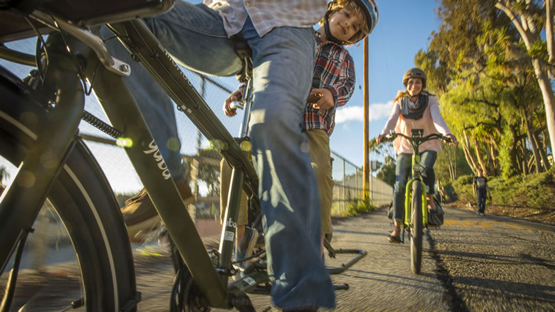

<!--more-->

Unlike in life where you “never know what you’re gonna get”, test riding
e-bikes is like a box of chocolates that you get to bite, break open, or
poke your finger through each chocolate piece until you find the one you
like most. How To Adopt The Cargo Bike Lifestyle – Yuba Step 4 – Test
Ride is here to help. 

When I was shopping for e-bikes, I hadn’t actually been on one before.
And even though I knew I really wanted the Spicy Curry Bosch electric
cargo bike, I approached my shopping process with the goal of riding as
many different e-bikes as I could. That way, I could make a list of
features I must have and a list of features I absolutely do not want.
So, I rode cargo bikes, cruisers, town bikes, mountain bikes, pedal
assist bikes, throttle electric bikes, and everything in between.

I remember that first pedal stroke on the first of my e-bike test rides
and it was magical. I felt like I was riding with the wind at my
back…all of the time! From that moment forward, I was hooked and
prepared to poke, prod, and get a little taste of each bike so that I
could either find something different from the Spicy Curry Bosch or
realize it is the perfect bike for me and my needs. Spoiler: the [Spicy
Curry Bosch](https://yubabikes.com/?p=87692) was and is perfect!

### Step 4 – Test Ride Cargo Bikes

Now that you’re at a stage where you are ready to test ride, I’ve
outlined a few helpful tips I gathered from my experience so that you
can maximize your success during this journey to find the right e-bike
for yourself.

\(1\)   Bring a list of bike types and specific bike choices you want to
try

- But don’t be so rigid that you are deaf to a salesperson’s
  recommendation, because they are the experts who know what each bike
  feels and rides like.

\(2\)   It is a good idea to test ride a top of the line model and a
bottom of the line model

- This way you can truly get a feel for what you’re paying for.

\(3\)   Bring your own helmet, wear loose and appropriate clothing, and
take a few snacks and water with you

- Sure it is an e-bike, but you can and will work up a sweat and
  appetite with all of the pedaling you will be doing. If you devote
  enough time to try out several bikes, expect to be riding and asking
  questions for more than an hour. So you’ll definitely want to be
  comfortable and satiated.

\(4\)   If you have kids, bring a baby sitter to help entertain while
you are out on the bikes.

- [University Bicycles](https://ubikes.com/) in Boulder has one at a
  reasonable rate:

  

  

\(5\)   When you are riding the bikes, ride on terrain you expect to
ride frequently

- Find stoplights and stop signs to experience what it is like to flow
  with traffic. If you live in a hilly area, find hills to ride. If your
  commute is on a gravel path, find some dirt. If you plan on carrying
  your kids along on a cargo bike, ask if there is one already equipped
  with some of the safety features and take the kids for a spin. In
  other words, leave no room for surprises when you bring your new bike
  home.

\(6\)   Lastly, when you are ready to decide, make your final bike
decision based on how you feel on and riding the bike, then let your
budget guide you

- My favorite kind of chocolate from the box is the dark chocolate shell
  with oozing chocolate in the center. Depending on what chocolatier you
  purchase from, those could cost $0.50 or $9.00 a piece. If I feel like
  treating myself, I’ll go for that $9.00 chocolate, but I definitely
  won’t turn down the $0.50 one either. As you narrow in on the bike
  that makes you happiest, know that there are similar bikes that might
  cost more or less depending on what you have been riding. And, since
  you test rode a high end and lower end bike, you’ll know what you pay
  for as you make your final bike decision.

