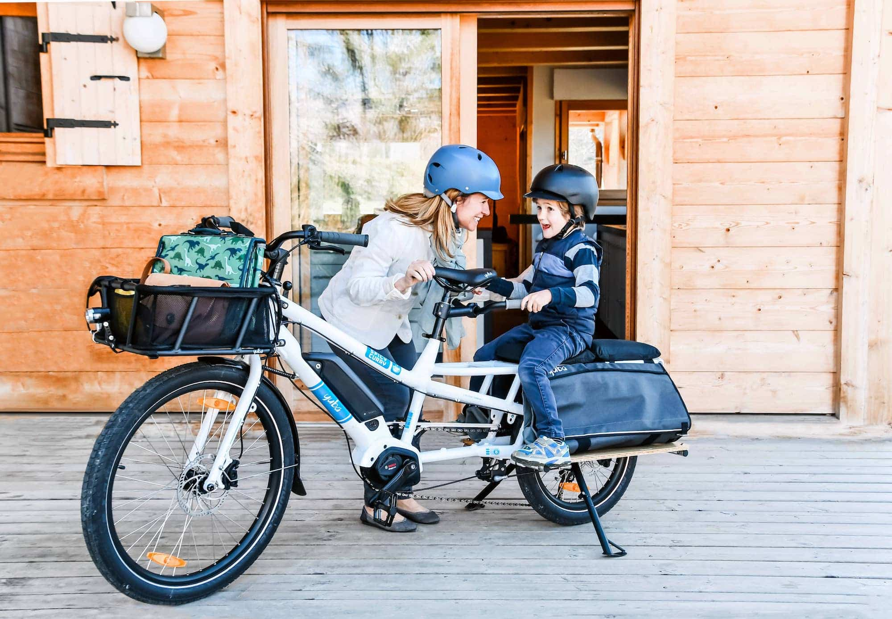

<!--more-->

# 

**During my graduate school days while living in Boulder, Colorado (my
hometown), I studied the social, economic, and psychological
determinants of environmentally responsible behavior. I specifically
wanted to know why people opt to drive personal automobiles as opposed
to riding a bike or taking alternative transportation, especially in
situations where infrastructure and attitudes are seemingly well aligned
to a car-free lifestyle.**

**Here, in Boulder, were a group of people who are notorious for being
athletic, educated, and affluent, they lived in a city and county with a
large network of paths that make biking very accessible, and the
Colorado Front Range weather boasts 300-plus days of sunshine. Yet, I
saw lines of cars and trucks sitting idly in traffic while I leisurely
passed them in my cross-town commute by bike each day.**

Thanks for reading Boulder Gear Lab! Subscribe for free to receive new
posts and support my work.

**Much to my disappointment, eleven years later, traffic is still at a
standstill in an even longer queue and the air quality has increasingly
worsened.  What I discovered was that that the key social-psychological
barriers preventing people from getting out of their cars and joining me
on the bike paths are their self-perceived inability and lack of skill,
as well as, an inadequate external support system that nurtures their
sense of community.**

### **Step 1: Fall in love with Cargo Bikes**

**Let’s be honest, the Colorado Front Range and Boulder Area is
undoubtedly an intimidating place to ride a bike. On any given day, you
might see a lycra-clad Olympian Mountain Biker, Professional Cyclist
preparing for the Tour de France, or World Champion Ironman Triathlete
effortlessly whizzing past you on the roadways or bike path. As a
commuter or recreational cyclist who shuns lycra clothing and other
pleasantries of cycling culture, biking alongside this elite crowd can
leave a person feeling inferior, unknowledgeable, and, even worse,
demoralized to the point that they don’t enjoy spinning around on two
wheels.**

**It wasn’t until I saw a middle-aged woman wearing a sun dress and
riding a cruiser bike, equipped with an electric pedal assist, easily
keeping pace behind two very fast elite cyclists that it dawned upon me:
e-bikes are the answer and will be the catalyst to automobile traffic
reduction and air quality improvements!**

**So, first things first, what is an e-bike?**

**Simply put, an e-bike is an electric bicycle that looks, fits, and
rides like a conventional bike but is equipped with a small electric
motor to either assist pedaling or replace pedaling entirely. That is,
most e-bikes have an electronic control system that allows riders to
select an option to pedal unassisted, pedal with some electronic
assistance, or not pedal at all with full electronic motorization.**

**Yuba Bicycles is a rapidly growing brand that has been at the
forefront of cargo bike development, especially with their [Yuba Spicy
Curry](https://yubabikes.com/cargobikestore/spicy-curry-bosch) cargo
bike that has electric assist. The company is one of the premier cargo
bike manufacturers on earth by creating bikes that are high quality and
motivate its riders to lead, inspire, educate, and share the power of a
healthy, sustainable way of life, via two wheels.**

**Moreover, the Spicy Curry has enabled even the non-rider types to
replace their vehicles with an assisted biking option. The batteries
used by these bikes are designed so they can be brought inside for
recharging using a normal electrical outlet when the ride is done or
when the rider is inside at work. With full electronic motorization,
these bikes have a range of around 25 to 45+ miles depending on the
terrain and weight of the rider and cargo. By U.S. law, e-bikes can only
reach a top speed of between 15 – 20 mph and Yuba e-bikes are no
exception with many of the bike options topping out at 20 mph.**

### **Intrigued? Well, here are 5 reasons why you should get a Yuba e-bike for your daily commute**

**(1) Your boss won’t give you a bar of soap for your going away gift**

**When I was in college during my summer breaks, I interned at a
research laboratory located at the top of a 2km long hill that climbed
several hundred feet in elevation. As long as there wasn’t snow on the
ground or gale force winds, I rode my bike up that hill to work
everyday. Without fail, the ride up was always challenging and it left
me sweaty by the end. Oftentimes I was too naive to consider bringing a
change of clothes (not even a t-shirt to change into!), so I would rely
on the air conditioning in my basement office space to cool off the
first 20-30 minutes of my workday. In hindsight, I should have brought
that change of clothes. I look back and realize my disregard was
seemingly problematic since my boss gifted me a bar of soap on my last
day prior to going back to my fall semester of classes. Hint, hint…**

**Commuting with an e-bike helps assist when the going gets tough, like
on long steep hills, and can make commuting to work less arduous and
less sweaty and thus more enjoyable for you and your coworkers when you
get to your office. In fact, the Yuba Spicy Curry with electric assist
can carry upwards of 300 lbs. of payload while still performing well at
relatively high speeds for bike commuting. Commuters no longer need to
worry about bringing an extra change of clothes because the Bosch Cargo
Line Motor system makes riding far more easier and “wet shirt” issues
things of the past.**

**(2) You can make that stop to the grocery store…and you won’t have to
look for a parking space**

**Regarding that huge cargo payload capacity, the rear rack on the Spicy
Curry can easily hold 120 lbs., while maintaining a high level of
stability on the 20-inch rear wheel, without issue. That means the bike
handles just like a standard sized bike yet can easily accommodate large
cargo loads, hauls from the grocery store, and our most valuable cargo
(children!).**

**Let’s say an average gallon of milk weighs about 8.5 lbs. and my
5-year-old son weighs about 40 lbs. With the 2-Go Cargo Bags, Bamboo
SideBoards, Adjustable Monkey Bars, and a Soft Spot Padded Seat, I could
carry my 5 lb. laptop, pick up my son from school after work, and make a
stop at the grocery store on the way home to get four gallons of milk (I
eat a lot of cereal). With the stability and power of the Spicy Curry
e-bike, the ride home on a full load with the pedal assist is no more
challenging than a leisurely cruise around the block. And, it should go
without mentioning, finding a parking spot close to the store entrance
for a bike is much easier than a car, especially if you do your shopping
at a national chain natural foods store that is notorious for having
crazier than normal parking lots.**

**(3) You will dominate Commuter Olympics**

**“Bike back!”**

**“On your left!” “Bike passing” (ring, ring)**

**Get ready to use all of those methods to warn encroaching cyclists and
pedestrians while riding a Spicy Curry with electric assist. E-bike
riders will have the ability to ride at speeds some riders would never
attain on a conventional bike and, as a result, there will be a lot of
passing slower riders, runners, and/or pedestrians. What’s more, having
electric assist on your cargo bike that can attain speeds up to 20 mph
actually helps commuters stay with the flow of automobile traffic at a
lower strain, making it safer for everyone (MacArthur, 2017). In
addition, e-bikes have good acceleration and it is not strenuous to
start from standstill, so riders are actually less inclined to speed
through very yellow or red lights.**

**(4) Save Money and Clean the Air**

**The many advantages of commuting by e-bike include enjoying free
parking, less roadway and path congestion, and the cost to charge the
battery is much less than gasoline to fill up a car (and it is worth
mentioning that there are major savings like no insurance, registration,
more expensive maintenance costs of an automobile). While not totally
emission free, since e-bikes require some form of electricity to charge,
the batteries on a Yuba e-bike set up still gets an equivalent of about
1,000 miles per gallon of gasoline (Thompson and Kennan, 2017). So,
growth in e-bike ridership will most certainly put a dent in the
emissions volume and simultaneously clean the air and reduce noise
pollution.**

**(5) You’ll want to ride your Spicy Curry even more!**

**Research on e-bike ridership has begun showing that these bikes are
effective at getting new riders on a bike who otherwise might be
intimidated about riding a bike. This also includes newer or returning
riders with physical challenges – like Parkinson’s, Arthritis, or
autoimmune disorders – who may not have the physical ability to go any
distance by conventional bike. E-bikes also encourage current riders to
ride more often, because of the cost effectiveness, convenience, and
sheer enjoyment of being on a bike. With research showing that all types
of e-bike riders feel more independent and free to explore, it goes to
show that the middle-aged woman in a dress on an e-bike cruiser who was
keeping pace with elite cyclists in Boulder is an excellent example
demonstrating that e-bikes are here to stay and will soon functionally
replace cars for a wide variety of trips, offer transportation options
to people who can’t drive, expand the number of people using bicycles,
get more people biking more often, and make family bicycling more
accessible (McLeod, K., 2015).**

**If you are already shopping for a Yuba Spicy Curry cargo e-bike or are
now in the market for one, there are a few things to keep in mind when
you finally get your bike.**

1.  **Get comfortable riding and operating your bike before making long
    trips. There are numerous videos on YouTube providing excellent
    instruction and tips on how to operate your bike. Not to mention,
    the employees at [University Bicycles in
    Boulder](https://ubikes.com/) and the customer service
    representatives at Yuba are an excellent and knowledgeable
    resource.**

2.  **Wear a helmet. This is a no** ***brainer*****.**

3.  **Know your local laws. Make sure you are aware of what roads and
    bike path routes are safe and allow e-bikes. Know what laws cyclists
    must obey and stay safe.**

### **References**

**Heather Thompson and Hallie Kennan. 2017. As Transportation Costs,
Emissions Grow, Electric Bikes Offer An Efficient Alternative. Forbes
Magazine.
https://www.forbes.com/sites/energyinnovation/2017/07/06/as-transportation-
costs-emissions-grow-electric-bikes-offer-an-efficient-alternative/**

**Evaluation of an Electric Bike Pilot Project at Three Employment
Campuses in Portland, Oregon J MacArthur, N Kobel, J Dill, Z Mumuni**

**MacArthur J., 2017 – National Electric Bike Owner Survey McLeod, K.,
2015 – Electric bicycles: public perceptions & policy**

**McLeod, K., 2015 – How people currently perceive electric bicycles and
how these new types of bicycles might fit into our work.**

Thanks for reading Boulder Gear Lab! Subscribe for free to receive new
posts and support my work.
