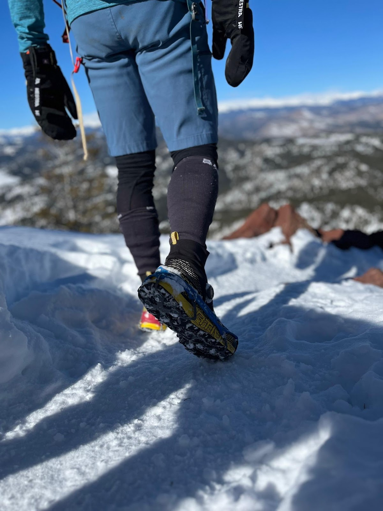

<!--more-->

A decade ago, I made my first purchase of [Kahtoola
MICROspikes](https://kahtoola.com/traction/microspikes-footwear-traction/?gad_source=1&gclid=Cj0KCQiAw6yuBhDrARIsACf94RVfyPen2YbnbU5zMeybKE2Q68NhE6lc3_qyUZI6Ll7VbLa_Qjd-sD0aAlQgEALw_wcB)
($74.95). They have become one of my all-time favorite pieces of outdoor
gear. In fact, they are a must-have for winter hiking and trail running
in Boulder, Colorado. Last year, I purchased a pair of [Kahtoola
EXOspikes](https://kahtoola.com/traction/exospikes-footwear-traction/)
($64.95) after my friend Jeff Valliere, a local legend, recommended
them. I couldn't fathom how anything could possibly be better than
MICROspikes.

The impressive quality of their performance truly astounded me. The
EXOSpikes have several advantages over MICROspikes:

**Reduced weight:** EXOSpikes are significantly lighter than
MICROspikes, weighing in at 7.8 ounces for a large size compared to 11.9
ounces for a medium size. This reduced weight makes them feel lighter on
foot and easier to carry in a pack.

**Lower profile:** EXOSpikes have a lower profile than MICROspikes,
making them less likely to catch on rocks or other obstacles. This can
be especially important when hiking in technical terrain or on icy
trails.

**Ease of use:** EXOSpikes are easier to put on and take off than
MICROspikes. They have a simple, intuitive design that doesn't require
any special tools or skills. MICROspikes, on the other hand, can
sometimes turn inside out when putting them on, which can be frustrating
and time-consuming.

**Reduced snow balling:** EXOSpikes are less prone to snow balling than
MICROspikes. This is because the spikes on EXOSpikes are designed to
shed snow more effectively, preventing it from building up and
interfering with traction.

**Unbluntable spikes:** The spikes on EXOSpikes are made of a durable
tungsten carbide material that is resistant to blunting. 

**Increased durability:** EXOSpikes are more durable overall than
MICROspikes. They are made with high-quality materials and construction,
and they are less likely to break or fail. 

**Affordability:** EXOSpikes are more affordable than MICROspikes, with
a retail price of $64.95 compared to $74.95. This makes them a great
option for those who are looking for a high-quality traction device
without breaking the bank.

As a seasoned winter runner, I have extensively tested EXOspikes, using
them over 50 times and gaining more than 100,000 vertical feet in
various ice, snow, and mixed conditions. **They are my new favorite
piece of outdoor gear**. Through direct comparison, wearing an EXOspike
on one foot and a MICROspike on the other, I found that EXOspikes are my
preferred outdoor gear.  I switched the spikes between feet on multiple
Bear Peak ascents, as shown in the photos (blue represents the EXOspike,
and red represents the MICROspike).

**What makes them better IMO than MICROspikes?** They are profoundly
better on ice, better on mixed (including rock) conditions, and *as
good* on snow (even loose snow).

*I wear size large EXOspikes (and medium MICROspikes) on my size 44.5 La
Sportiva Cyclon Cross GTX’s (the ideal Boulder, CO winter combo).*

------------------------------------------------------------------------

**Simon Testa** is a resident of Boulder, Colorado. He loves to trail
run, hike, scramble (*is the author of the Colorado Mountain Club, Best
Flatirons Scrambles guidebook*), mountain bike, fat bike, gravel bike,
and skimo. His favorite events are the Pikes Peak Ascent race
(3rd AG 2023) and the Aspen Power of Four Skimo race
(2nd AG 2024). He is obsessed with gaining elevation. Over
the last decade he has averaged 800,000 vertical feet a year and has
topped 1,000,000 feet twice. He is equally obsessed with Bear Peak,
which he has almost gridded and climbed almost 1,300 times! 

------------------------------------------------------------------------
