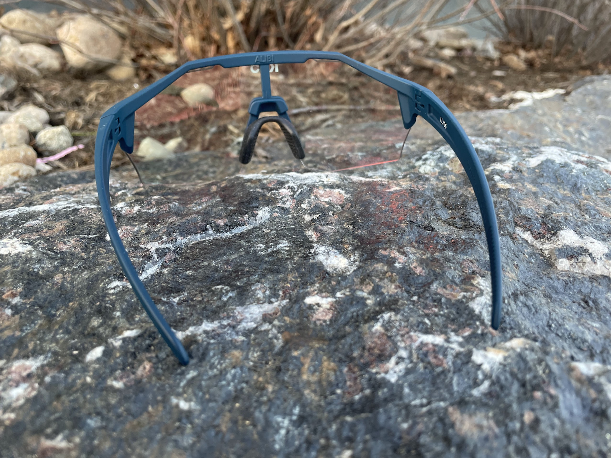

<!--more-->

Original review on RoadTrailRun
[HERE](https://www.roadtrailrun.com/2024/03/koo-alibi-sunglasses-review.html)

Like many runners, I’m on a relentless pursuit of the ideal sunglasses:
a featherweight design, an unobstructed view of the path, and adequate
protection from the elements - oh, and comfortable. The [Koo Alibi
sunglasses](https://kooworld.cc/us/en/product/sunglasses/alibi/)
recently emerged as a contender in this quest, and after putting them
through the paces on various runs and a few bike rides, I'm here to tell
you that they are a solid pair of eyewear.

**Features**

The Alibi sunglasses are incredibly lightweight, weighing only 21 grams,
making them feel practically invisible on my face. This is a significant
advantage for runners aiming to maximize their efficiency during runs.
The half-frame design further enhances this by providing an extensive
and clear view of the path ahead, eliminating the need for awkward head
movements. The Alibi sunglasses are a perfect choice for runners looking
for a combination of comfort, performance, and style.

**Fit**

Aside from its weight and appearance, the Alibi offers a secure and
comfortable fit. The ear stems are sturdily built, avoiding the common
problem of flimsiness, ensuring they remain firmly in place during
strenuous workouts and on rough trails. The well-designed nose bridge, a
frequently overlooked detail, effectively prevents fogging and maintains
a sweat-free experience. Additionally, the glasses can be securely
placed atop the brim of a hat or the front holes of a helmet, providing
a convenient option when you need a break from wearing them.

**Utility**

The true star of the Alibi show lies in their photochromic lenses. These
intelligent lenses adapt to varying light conditions, seamlessly
transitioning from clear to darker shades as the sun rises and sets.
This adaptability proved invaluable during my early morning runs. In the
pre-dawn twilight, the lenses remained remarkably clear, allowing for
excellent visibility on dimly lit paths. As the sun rose and the light
intensified, the lenses gradually darkened, providing a comfortable
level of shade without compromising clarity.

However, it's important to note that the transition speed of the
photochromic lenses isn't instantaneous. While the change is subtle and
hardly noticeable during most activities, it's something to keep in mind
for situations with rapidly changing light conditions. For instance,
transitioning from a brightly lit forest path into a deeply shaded
tunnel might require a few seconds for the lenses to adjust completely.

The 87% VLT (Visible Light Transmission) of the lenses are pretty good
for very low-light conditions or night runs. By contrast, while the 15%
VLT offered sufficient protection for most sunny days in my experience,
some runners, particularly those venturing into extremely bright,
high-altitude areas with snowy reflection, might find them lacking in
terms of sun protection. 
