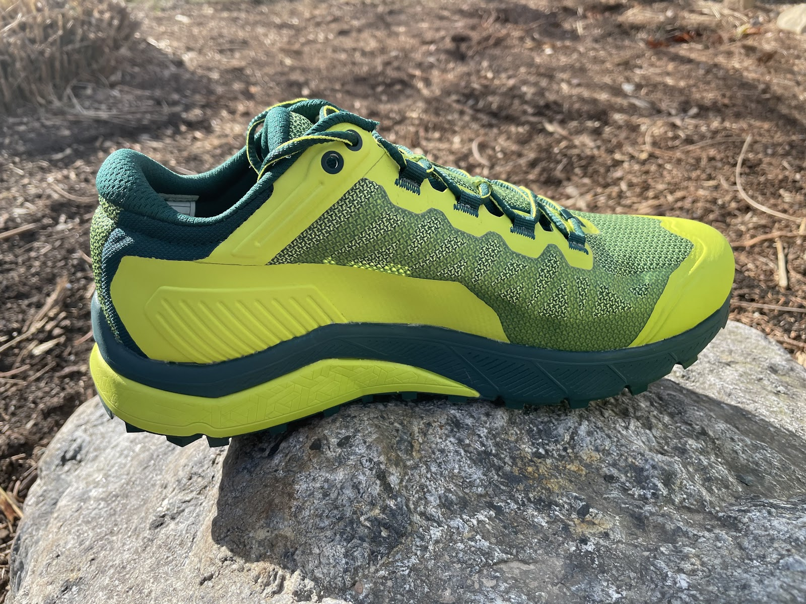
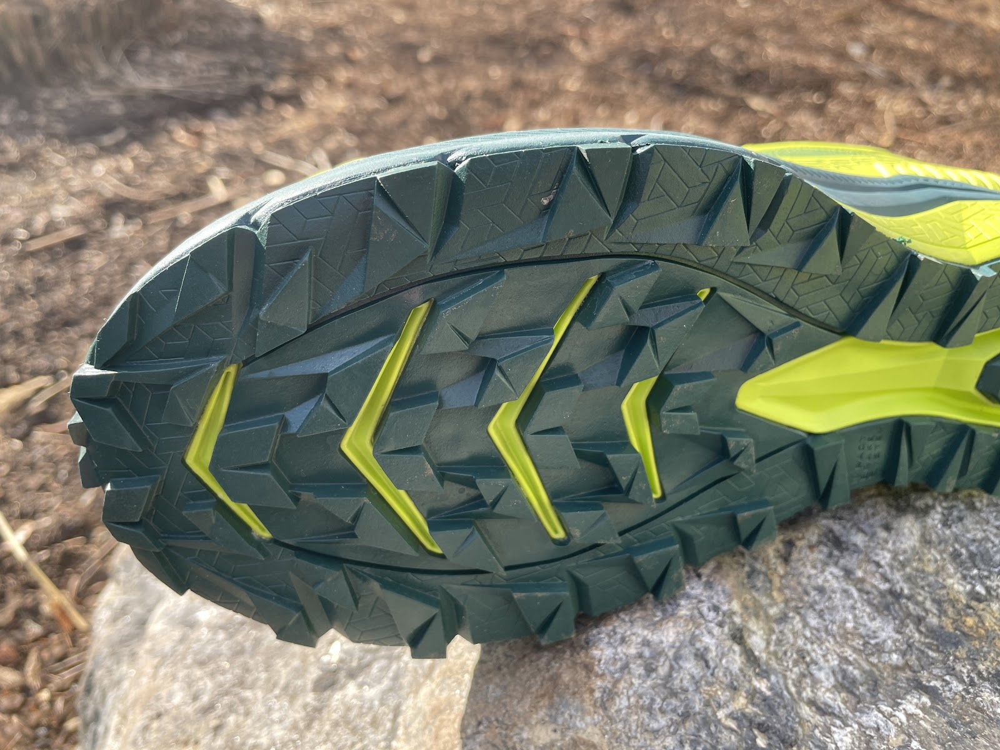
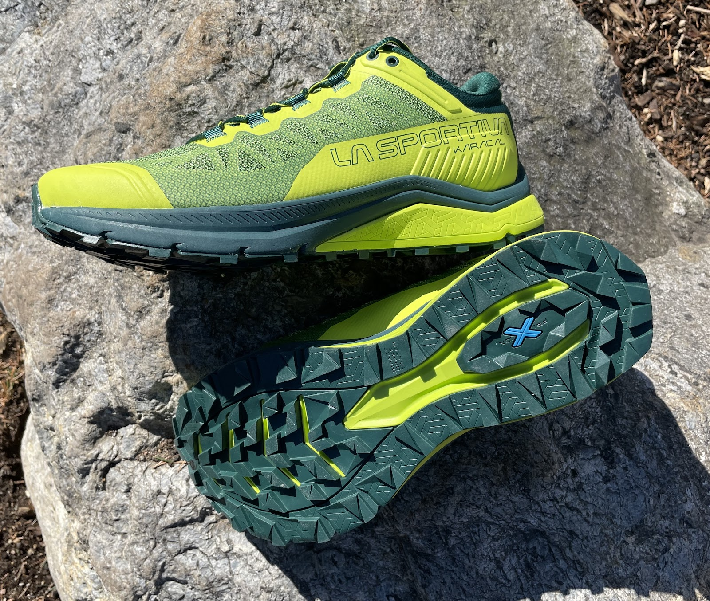
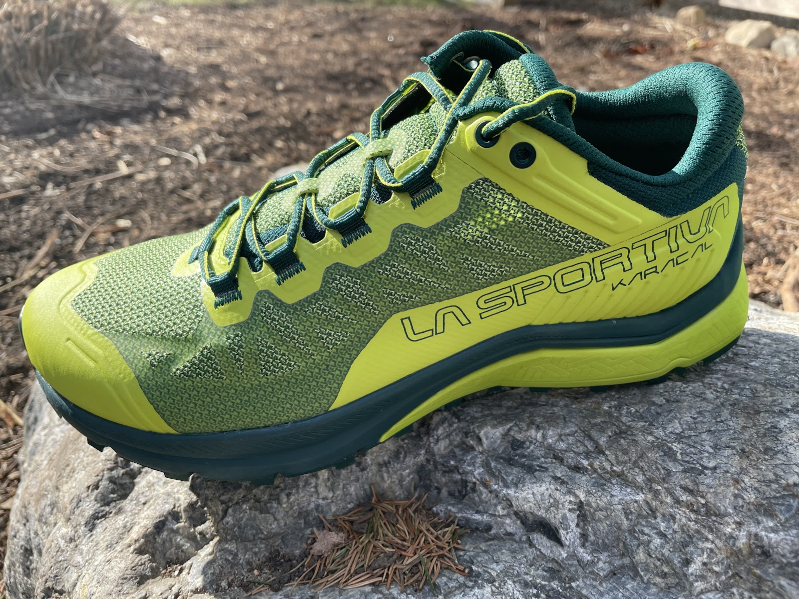

<!--more-->

*Article by John Tribbia and Jeff Valliere*

**La Sportiva Karacal** ($130)

Original Post from RoadTrailRun
([link](https://www.roadtrailrun.com/2020/12/la-sportiva-karacal-review.html))

<a href="https://www.roadtrailrun.com"
class="button primary button-wrapper">Read All RoadTrailRun
Reviews Here</a>

### Introduction

John: In a recent
[interview](https://thepillmagazine.com/feature/la-sportiva-ss21-news-interview-with-jonathan-wyatt-running-product-specialist/?lang=en)
with Jonathan Wyatt (multi-time World Mountain Running champion and La
Sportiva Running Product Specialist) he suggested that last year’s
release of the La Sportiva Jackal ([RTR
Review](https://www.roadtrailrun.com/2020/05/la-sportiva-jackal-multi-tester-review.html))
was a prelude to this year’s new release, the Karacal. 

The emphasis in design of the Karacal was comfort and maximum mobility,
which translates to a very comfortable and breathable shoe. La Sportiva
listened to consumers by focusing on the shoe’s protection to cushion
the impacts from varied terrain. The Karacal uses the blue FriXion
outsole with an “all ground” tread that is supposed to perform well on
any kind of surface. In addition, there is a full length hardened EVA
rock plate for best-in-class protection The shoe boasts a 7mm drop in
the midsole from 29mm in the heel to a forefoot height of 22mm, which
offers cushion in the back and exceptional ground feel in the front.
Coming in at approximately 10.37 oz (294 grams) in a 42 EU size, the
shoe is intended for training and off-road races over medium and long
distances.

### Pros:

John: great ground feel, very stable, well protected, and efficient in
technical terrain. Very breathable  
Jeff V:  Stable, protective both underfoot and upper, fit/security,
traction

### Cons:

John: a bit too breathable for colder pursuits, my feet were freezing at
45 degrees!  
Jeff V:  Firm ride

### Tester Profiles

**John Tribbia (5' 6", 130lbs)** is a former sponsored mountain/trail
runner who has run with La Sportiva, Brooks/Fleet Feet, Pearl Izumi, and
Salomon. Even though he competes less frequently these days, you can
still find John enjoying the daily grind of running on any surface,
though his favorite terrain is 30-40% grade climbs. He has won races
such as America's Uphill, Imogene Pass Run, and the US Skyrunner
Vertical Kilometer Series; and he's held several FKTs on several iconic
mountains in Boulder, Colorado and Salt Lake City, Utah. If you follow
him on [Strava](https://www.strava.com/athletes/1044838), you'll notice
he runs at varying paces between 5 minutes/mile to 12 minutes/mile
before the break of dawn almost everyday.

**Jeff** runs mostly on very steep technical terrain above Boulder often
challenging well known local FKT's. 

### Stats

Weight: men's 10.37 oz/ 294g   (US9)

Samples: men’s: 10.37 oz/ 294g   (288g left,, 301g right) US9, 10.9 oz /
310 grams US9

Stack Height: 29mm heel / 22mm forefoot, 7mm drop

Available early 2021, $130  

### First Impressions and Fit

John: The La Sportiva Karacal is incredibly comfortable and holds my
heel securely in place. 

The forefoot and toe box feels wider than other La Sportiva I have run
in, but not in a blister inducing way. The seamless upper is comfortable
on the foot with no abrasive spots, breathes well, and works well in
tandem with a wide tongue and locking lacing system to envelope the
foot. 

Jeff V:  The Karacal has a very familiar look, style and build, and is
very reminiscent of many La Sportiva shoes I have run in the past, and
is particularly similar in appearance to the Jackal, though this is a
very different shoe.  The Karacal has a very similar, if not the same
outsole and midsole as the Jackal, but with a completely different upper
that I find to fit much more “normal” and which is more accommodating in
the forefoot.  Fit is true to size for me.

### Upper

John: With a seamless 3D mesh upper that is covered with very thin
overlays and thicker wrap around rand, the upper of the Karacal is an
excellent combination of breathability and protection. 

The heel collar is low with just enough padding. There’s an external
heel cup overlay that provides structure to the upper and greatly
enhances the heel hold. 

Related, the midfoot hold is excellent. With the combination of a secure
heel and midfoot, the high volume fit in the forefoot / toe box allows
for swelling and splay, which I find gives me better control on the
technical terrain. 

Overall, the upper security is exceptional,, especially on steep
technical terrain.

The laces are soft, comfortable, and provide a secure tie-down. Lastly,
the gusseted tongue wraps around the foot nicely and stays in place
quite well.

**Jeff V: **John describes the upper very well and I agree with him on
all points.  The upper is pleasingly well ventilated, secure, without
feeling confining and while in comparison to most shoes, the forefoot is
not notably generous, it is relatively generous for a La Sportiva and
has just enough room for splay, swell and just a bit more relaxed, while
maintaining very good foothold throughout.  

### Midsole

John: the midsole of the Karacal is a dual density compressed EVA with a
full length hardened EVA rock plate designed to protect your feet from
those sharp and uneven rocky paths. Like the Jackal, I didn’t find the
cushion plush, responsive, or bouncy, but it provides excellent
stability upon impact. But, the shoe does have some give with the 4mm
Ortholite insoles that when combined with stability and firmness,
absorbs shock and keeps the foot stable when navigating rocky, unstable
terrain.

Jeff V:  The midsole has a firm feel and while the cushioning is not
particularly plush, does not necessarily feel harsh either and is best
suited for those runs on more rocky, technical terrain where protection
and stable predictability under foot are more important than a soft
plush ride.  Response is minimal, as they do not feel particularly quick
or lively, so the Karacal in my opinion is best suited for more
moderately paced efforts, or even somewhat quicker efforts in technical
terrain.

### Outsole

John: The FriXion AT2 outsole with 3mm lugs provide superb traction and
security in all types of terrain. I felt very secure and was able to be
aggressive in almost any terrain - from rocky trail, ice, gravel pack
trail, to mud. 

The yellow hardened EVA rock plate extends the entire length of the shoe
and provides stability at the rear while providing protection at the
front without being overly stiff as rock plates sometimes can be

Although the 3mm lugs aren’t exceptionally deep, they are sharp and
strategically placed so they attach well to a variety of surfaces 

Jeff V:  I found the Frixion AT2 outsole to be competent and adept in a
very wide variety of terrain, wet or dry, rocky slab, loose dirt, packed
dirt, off trail, snow and ice due to an efficient tread pattern, tread
shape and rubber compound.  For having such low profile lugs, they are
remarkably well designed and particularly effective on just about any
surface.  Durability thus far has been very good, with very minimal
signs of wear despite the rough and rocky terrain I frequent, which is
testament to the purpose of this shoe.

### Ride

John:  The ride of the Karacal is dreamy for those who run in the
mountains over rough and technical terrain. Traveling over scree or
other technical and rocky surfaces feels smooth and responsive.
Moreover, there’s plenty of cushion to soften descents or hard foot
impacts. What I love most about the Karacal is the exceptional ground
feel and low center of gravity. I never felt wobbly or disconnected from
the terrain even in the most technical situations. 

Jeff V:  John again nails it, as the ride here is dreamy for rough rocky
trails, rock gardens, talus hopping, steep off trail, anything beyond
the casual terrain, the Karacal is a protective, predictable, stable and
firm delight.  For more spirited, higher paced running on buffed out
terrain, dirt roads or pavement, the firmness of the Karacal and less
than lively outsole is not ideal, but is fine for short stints.

### Conclusions and Recommendations

John: If you are looking to add a shoe that is ideal when moving
fast and efficiently through technical mountain terrain, the Karacal is
a top choice. The shoe is comfortable with a wider fit than typical La
Sportiva shoes, feels secure and stable when running across varied
terrain, is firm in a good way, and can withstand long days in the
mountains.

John’s Score: 9.1/10 

Ride: 9 (fun mountain shoe with stable and firm ride)  
Fit: 9 (the roomier toe box is a welcome feature)  
Value: 8 (breathability is great for summer, but my feet get too cold in
colder temps)  
Style: 9 (I love bright yellow!)   
Traction: 10 (best in class)  
Rock Protection: 9.5 (toe protection, foot plate and firm cushioning,
and durable upper)

J**eff V: ** The Karacal has become one of my favorite La Sportivas and
in my opinion, is much better than the Jackal, which I think has mostly
to do with the better fit.  They are best suited for mountain terrain,
excelling on moderate to rough terrain, with amazing protection,
stability, predictability, traction and with a bit more of an
accommodating fit for those longer days or those with slightly wider
feet or those looking for just a touch of extra room for foot swell and
splay.  I would recommend for long days in the mountains, preferably if
the terrain is rugged, but for faster running over longer distances that
is less technical, I might look to the Akasha 2.

Score: 9.3/10

Ride: 9 - Firm, but appropriately so for rough mountain terrain  
Fit: 9 - Perhaps better than any La Sportiva to date, secure with a bit
of space  
Value: 9 - A fair price for a durable, competent, versatile shoe  
Style: 9.5 - I love the look  
Traction: 10 - Best in class, impressive for its versatility on a wide
range of terrain  
Rock Protection: 10 - Nothing comes close to poking through the Karacal

### Comparisons

Index to all RTR reviews:
[HERE](https://www.roadtrailrun.com/p/blog-page.html)

**La Sportiva Jackal** ([RTR
Review](https://www.roadtrailrun.com/2020/05/la-sportiva-jackal-multi-tester-review.html))

John: Karacal feels lighter on foot and more nimble. I would say the
Karacal is best on compacted terrain and the Jackal can perform a little
better in loose stuff, but honestly there's not a ton of differentiation
between the two other than I would use the Karacal for road to trail
runs more than I would the Jackal because I like the fit and feel of the
Karacal. The low center of gravity and snug fit of the Karacal yields
more ground feel. By contrast, I feel prefer the Jackal fit and that it
has a little more cushion. The upper of the Karacal is enveloping and
very breathable. The Jackal's upper is thicker and not as comfortable to
me. 

Jeff V: The Jackal just didn’t do it for me. I think much of the issue
was the fit for me and I just never really found it all that comfortable
or all that stable.  Even though the Karacal looks similar and in many
ways is similar, it has a much better fitting upper that changes the
entire character of the shoe for the better.  I’ll continue to run in
the Karacal, but have not run in the Jackal since I finished my review
way back when.

**La Sportiva Bushido 2** ([RTR
Review](https://www.roadtrailrun.com/2019/04/la-sportiva-bushido-ii-totally.html))

John: The Bushido is well protected and slightly more cushioned, but has
a rigid feeling ride. By contrast, the Karacal rolls better, has better
ground feel, and the more open toe box provides a more comfortable fit. 

Jeff V: John says it exactly right and I agree that the Bushido 2 feels
a bit more cushioned and might be a bit better for longer days because
of it.  Both are very competent in rough terrain and have very good
traction.

**Saucony Peregrine 10** ([RTR
Review](https://www.roadtrailrun.com/2019/12/saucony-peregrine-10-review-big.html))

John: Both have a really comfortable upper and similarly have great
ground feel. The tread on the Peregrine is great for loose, mud, and
soft conditions thanks to the aggressive lug design. The Karacal’s tread
is lower profile, more versatile, and very sticky on rocky surfaces. 

Jeff V: Agree with John 100%, nothing new to add.

**Salomon Sense Ride 3** ([RTR
Review](https://www.roadtrailrun.com/2020/01/salomon-sense-ride-3-review-moving-to.html))

John: The Sense Ride 3 has more cushion, especially in the forefoot.
Given the cushion differences, I would prefer to take the Sense Ride on
longer excursions. Both have really great traction, but the slight edge
goes to the Karacal. 

**Salomon Sense Ride 4** ([RTR
Review](https://www.roadtrailrun.com/2021/03/salomon-sense-ride-4-review-most.html)) 

Jeff V: Similar feelings to John on the SR3, but the Karacal for me has
overall better protection and traction, making it my choice for more
rugged all mountain excursions with talus and off trail, where I may
reserve the SR4 for more moderate trails.

**Hoka Torrent 2 ** ([RTR
Review](https://www.roadtrailrun.com/2020/06/hoka-one-one-torrent-multi-tester.html))

John: The Torrent 2 is lighter, faster, with less protection. I think
the Torrent does well in most terrain, but lacks an edge to the Karacal
in rocky and uneven terrain. The Karacal is well suited for trail and
off-trail sections where superior traction and protection are mandatory.

Jeff V:  Exactly what John said.

*Tested samples were provided at no charge for review purposes.
RoadTrail Run has affiliate partnerships and may earn commission on
products purchased through affiliate links. These partnerships do not
influence our editorial content.*

*The opinions herein are entirely the authors'.*

