

  
Road Trail Run

  
Boulder Gear Lab · Est. 2020 · Boulder, Colorado

Gear Review · Trail Running · Footwear

  
La Sportiva Prodigio 2 · Field Test

  <h1>La Sportiva Prodigio 2 Review</h1>

  
XFlow cushioning and a wider platform, tested across four terrain types from the Cragmoor trailhead to the summit of Bear Peak.

  

    
By John Tribbia

    
Published roadtrailrun.com

    
Test Terrain Bear Peak, Boulder CO

  

  

    
La Sportiva Prodigio 2

    
$160

  

  Bear Peak · 8,461 ft
  ~2,800 ft gain
  Cragmoor Trailhead
  Multiple ascents · Mixed conditions

  

    
I tested the Prodigio 2 across multiple ascents of Bear Peak from the Cragmoor trailhead, a route that moves through four distinct terrain types in under four miles. Shanahan Trail is wide and smooth, almost a maintained dirt road. Single track past the Mesa Trail junction toward the Slab narrows and picks up technical character. Fern Canyon is steep switchbacks, embedded rock, and roots. The ridge from the Saddle to the summit is loose scree, eroding dirt, and in early spring, snow patches that range from firm névé to afternoon slop. That sequence puts a trail shoe through a realistic range.

    

      <h4>Specifications</h4>
      

        
Weight (M US 9.5 / EU 42.5)10.26 oz / 291g

        
Stack Height34mm heel / 28mm forefoot

        
Drop6mm

        
Platform Width85mm heel / 70mm midfoot / 110mm forefoot

        
Lug Depth4mm (up from 3–4mm on v1)

        
MidsoleXFlow supercritical nitrogen-infused EVA

        
OutsoleFriXion compound, dual density

        
Price$160

      

    

    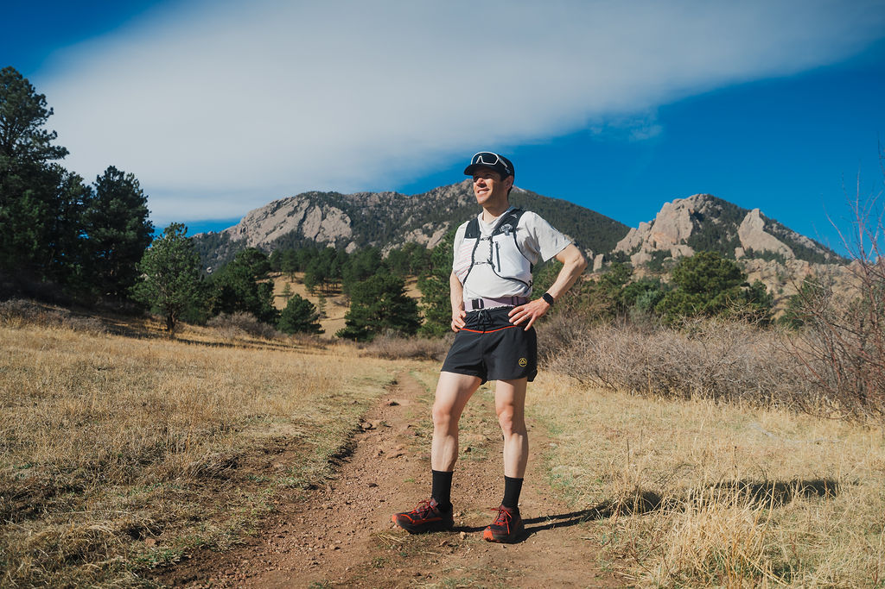

    <!-- ═══════════════════════════════════════════════
         FIT AND UPPER
    ════════════════════════════════════════════════ -->

    <h2>Fit and Upper</h2>

    <h3>On Shanahan Trail</h3>

    
Shanahan Trail out of the Cragmoor trailhead is forgiving terrain for a first read on a shoe. The surface is compact and wide, smooth enough that you pick up details technical terrain would mask: how the heel cup sits early in a run, whether the gusseted tongue stays centered, whether the forefoot has room without shifting.

    
I tested the EU 42.5, a half size up in US terms from my normal fit. That sizing is consistent with the original Prodigio and with most La Sportiva trail shoes I've run in. In it, the midfoot locks in without pressure points, the forefoot has room to splay, and the toe box doesn't crowd. La Sportiva advertises a wider platform on this version, and on Shanahan it's immediately apparent: there's more volume in the midfoot and forefoot without any sloppy movement. No heel slippage across any of the Bear Peak outings.

    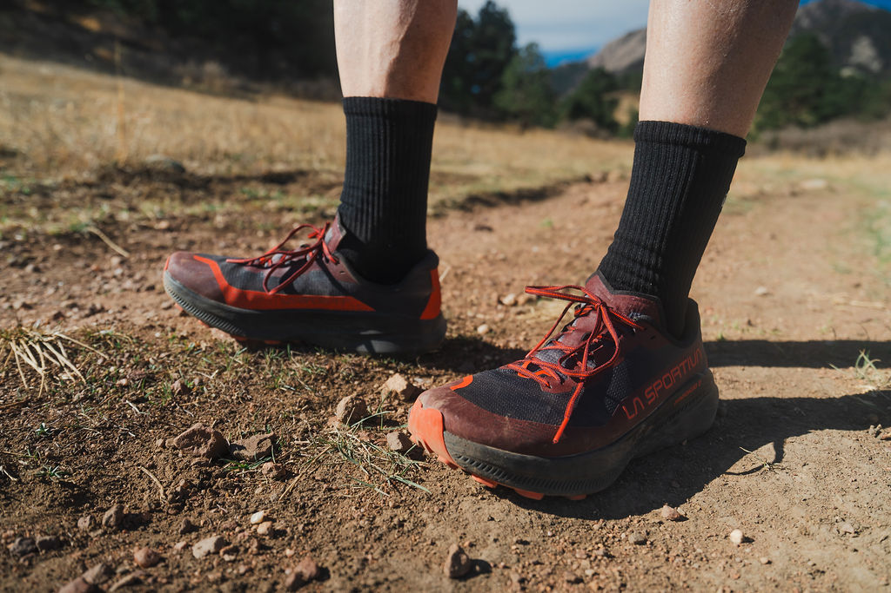

    
The upper is lightweight engineered mesh. It breathes well; on warmer mornings the airflow is noticeable by the time Shanahan climbs toward the Mesa junction. The seamless construction eliminates pressure spots that compound over technical miles. Through fifty miles of trail I've seen no meaningful wear. The same durability question I had with the original stays active here. This mesh feels less robust than the uppers on La Sportiva's burlier mountain options. The trade-off has held through fifty miles with no major wear, but the mesh is one full season away from a clearer verdict.

    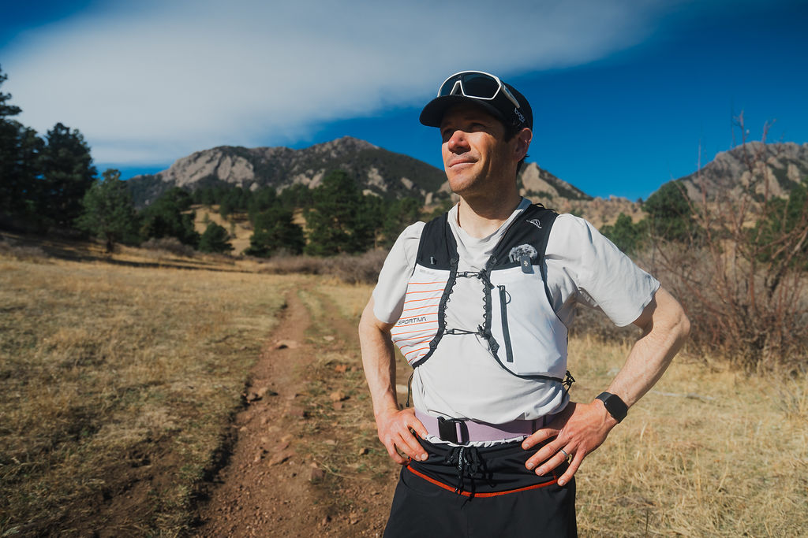

    
The lacing system is straightforward: even tension across the foot, nothing to manage. The gusseted tongue stays centered. A lacing system that requires attention midrun is a design failure, and this one disappears into the background entirely.

    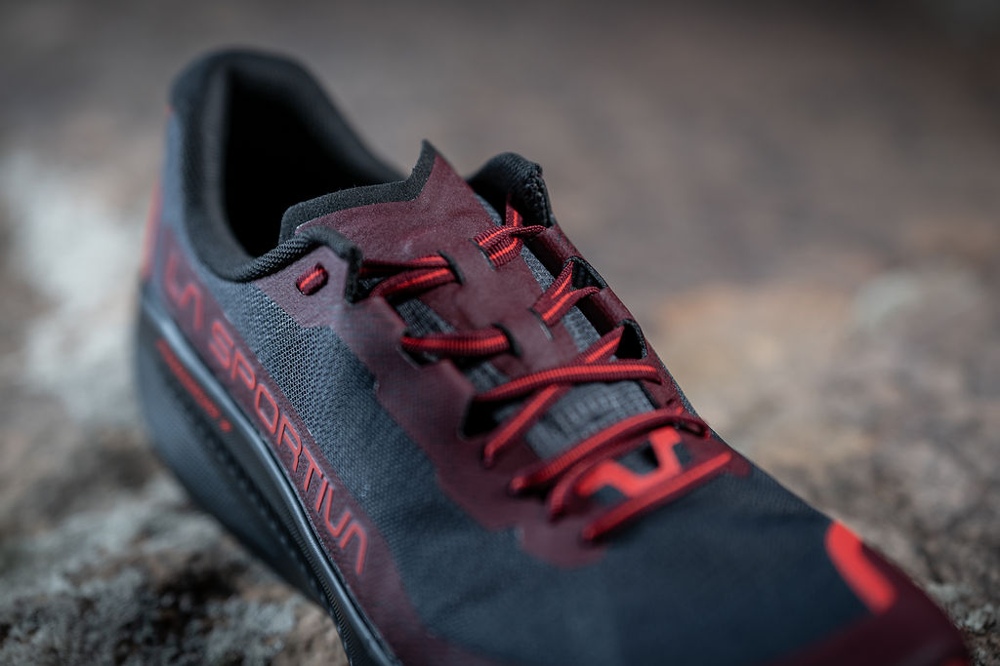

    <!-- ═══════════════════════════════════════════════
         MIDSOLE AND PLATFORM
    ════════════════════════════════════════════════ -->

    <h2>Midsole and Platform</h2>

    <h3>Through Fern Canyon</h3>

    
Fern Canyon is where a cushioned trail shoe either works on technical terrain or doesn't. The switchbacks are steep and closely spaced. The trail surface is root-laced, with embedded rock scattered throughout. A high-stack shoe that loses ground feel entirely becomes a negotiation with every step: you're guessing at contact rather than reading the trail.

    
The XFlow compound doesn't fall into that trap. La Sportiva claims it's slightly softer than the original generation. That reads accurate on trail. The initial impact is plush. But the layered construction (XFlow supercritical foam over a firmer EVA base) adds energy return under the softness. The midsole stack measures 35mm in the heel and 29mm in the forefoot, maintaining the 6mm drop. At those numbers, soft is expected. The energy return is not. On the Fern Canyon switchback climbs, where I'm pushing off repeatedly on the same forefoot zones, the foam doesn't feel deader after twenty minutes than it did at the start.

    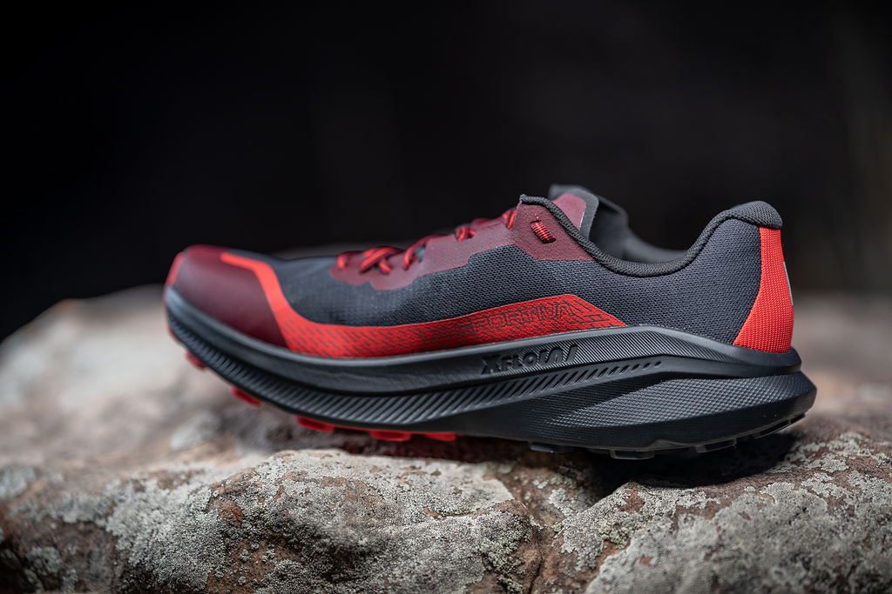

    
The midfoot PU coated insert handles the rock jab problem that soft midsoles typically compromise on. Through Fern Canyon's mid-section, where embedded rocks are everywhere underfoot, I logged far fewer painful contacts than I do in comparable cushioning-class shoes. The insert sits below the comfort layer: it shields without stiffening the ride. You don't feel it. You feel the absence of the problem it solves.

    
The wider platform is the other major story in the canyon. Where the original Prodigio could feel twitchy on off-camber footing, the Prodigio 2 tracks predictably on Fern Canyon's angled surfaces and uneven switchback landings. I trusted the lateral edge. No ankle rolls across all of my ascents, no hesitation on technical sections at pace. The repositioned rocker adds to this: transitions through the canyon are smooth, and the ball-of-foot buffer is most apparent on steep uphill sections where you're climbing on your forefoot onto uneven rock.

    

      "The XFlow compound is soft enough for long miles and responsive enough that Fern Canyon at tempo doesn't feel like a negotiation."
    

    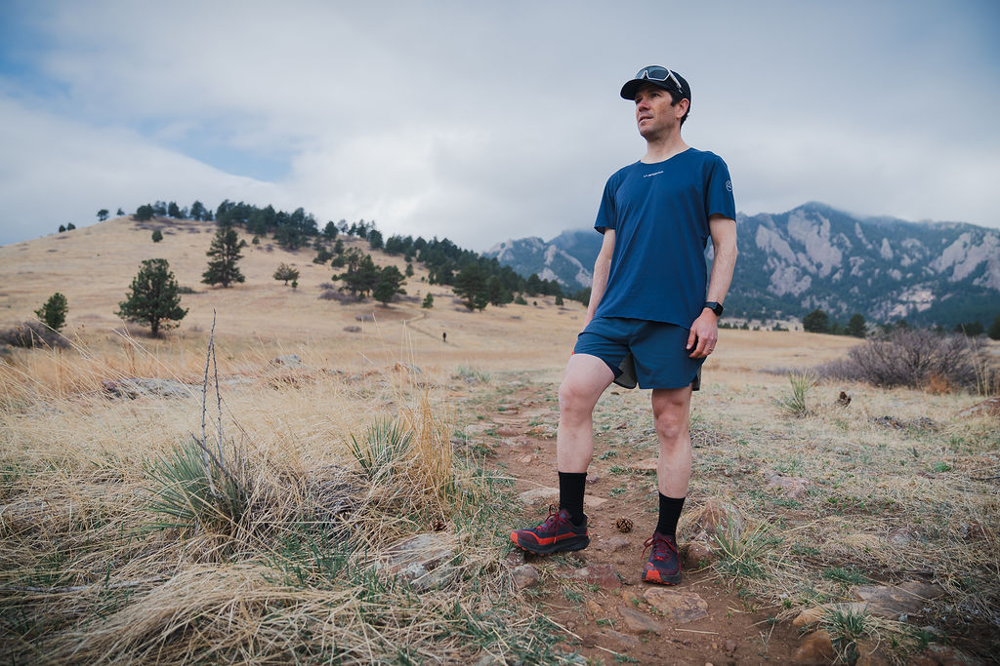

    
The trade-off is direct: this midsole prioritizes protection over ground feel. If you want to read every root and pebble through the sole, the Prodigio 2 is not built for that. I'm a ground feel runner, and the cushioning here registers as a meaningful concession. Over the accumulated miles of a long mountain outing, that concession starts to make sense.

    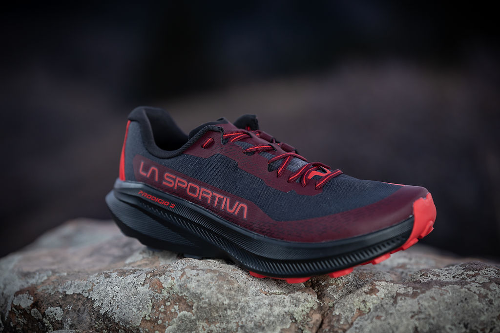

    <!-- ═══════════════════════════════════════════════
         OUTSOLE AND TRACTION
    ════════════════════════════════════════════════ -->

    <h2>Outsole and Traction</h2>

    <h3>The Slab Approach and the Summit Ridge</h3>

    
The single track past the Mesa Trail junction toward the Slab is where the outsole first gets tested in earnest. The trail narrows, the surface becomes variable: patches of loose dirt over hardpack, exposed root systems, occasional rock slabs. The FriXion compound in the forefoot grips dry stone cleanly. Lug spacing sheds material on each stride; nothing clings.

    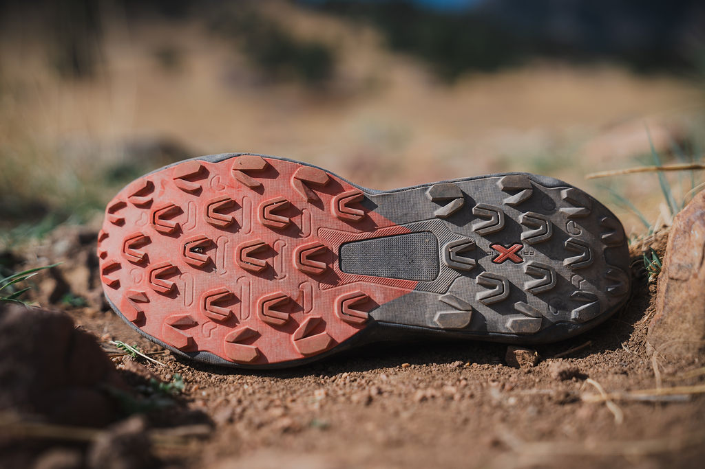

    
Above the Saddle, the character of the terrain changes entirely. The trail gives up the pretense of being a trail. Scree and loose dirt over rock slabs, with early spring snow patches (firm névé in the morning, softening by midday) scattered across the ridge to the summit. The 4mm lugs, one millimeter deeper than the original's top-end range, dig into loose terrain rather than skating across it. On scree where the surface shifts underfoot, the lugs commit with each step. The lug pattern is multidirectional, which matters when you're not moving in a straight line and the lateral edge needs bite.

    
The snow patches are a mixed read at the margins. On firm morning névé, the FriXion compound and lug depth grip confidently, better than I'd expect from a shoe not positioned for winter conditions. On afternoon slop, the lug spacing allows release rather than accumulation. You don't build up platform boots on the way to the summit.

    

      <strong>Terrain-by-terrain traction · Bear Peak route</strong>
      <dl>
        <dt>Shanahan (wide hard-pack)</dt>
        <dd>Smooth, fast, quiet.</dd>
        <dt>Single track toward the Slab (mixed dirt and root)</dt>
        <dd>Confident throughout.</dd>
        <dt>Fern Canyon (embedded rock and root)</dt>
        <dd>Lugs bite on rock; FriXion holds on dry stone.</dd>
        <dt>Summit ridge scree</dt>
        <dd>Digs in, sheds material on each stride.</dd>
        <dt>Snow patches</dt>
        <dd>Firm névé: solid. Afternoon slop: acceptable, no accumulation.</dd>
      </dl>
    

    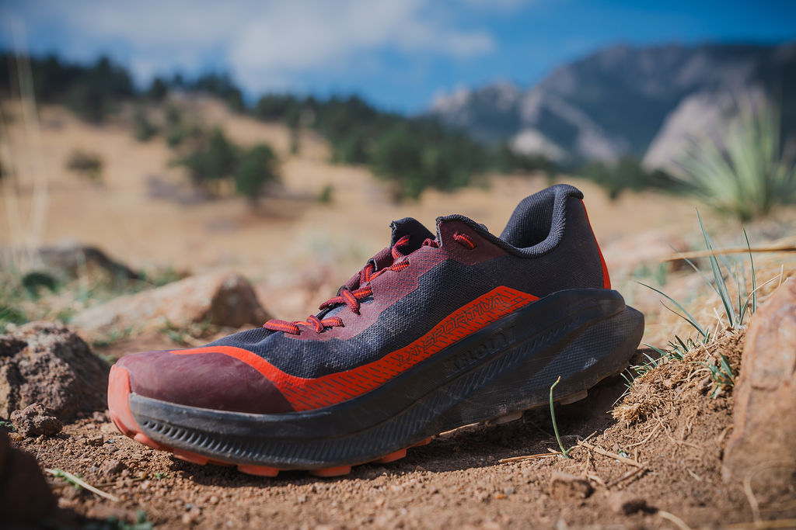

    <!-- ═══════════════════════════════════════════════
         THE DESCENT
    ════════════════════════════════════════════════ -->

    <h2>The Descent</h2>

    
The descent reverses the sequence and loads everything differently. Coming off the summit ridge, scree braking is quad-intensive and demands outsole grip under a downhill load. The force vectors differ from the ascent. The Prodigio 2's wider platform handles the lateral instability of scree descent without drama. On steep switchback landings where the outside edge of the shoe takes the initial contact, the shoe tracks rather than slides. I drove hard into the downhill on multiple outings. No slipping, no moment of uncertain footing on ground that wanted to give.

    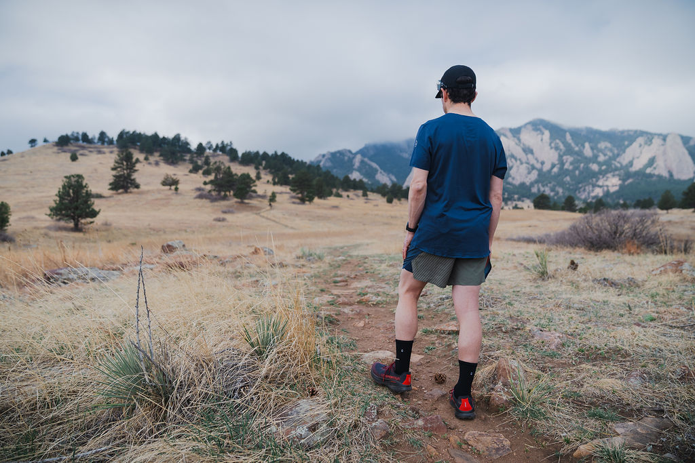

    
Through Fern Canyon on the way down, the technical surface shifts to forefoot and midfoot landings on roots and embedded rock, where the rocker geometry earns its keep. No nervous braking. The midsole absorbs. The platform holds. You keep moving.

    
By the time the descent flattens onto single track toward the Mesa Trail junction, the shoe has absorbed a full loop's worth of load: the ascent miles, the scree, the canyon. The XFlow midsole hasn't compacted. There's still return underfoot on the final Shanahan stretch back to my house. After multiple Bear Peak round trips in mixed early-spring conditions, the midsole response is unchanged. That is the bar for a shoe you plan to put real miles on.

    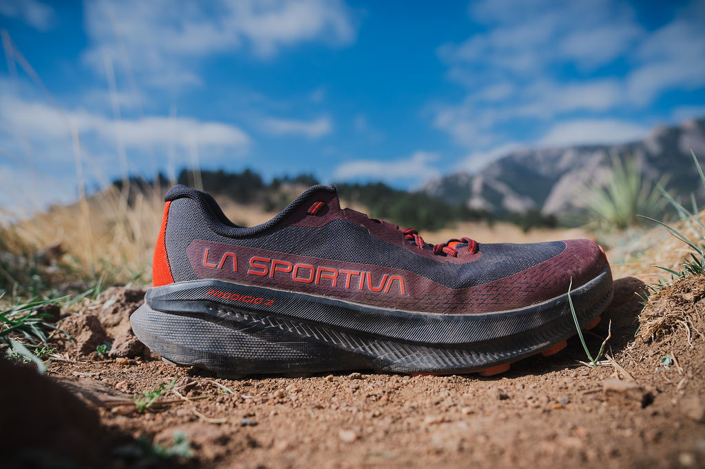

    

      

        <h5>Works Well</h5>
        <ul>
          <li>Wider platform holds on off-camber terrain and scree descent</li>
          <li>XFlow foam: soft under long load, responsive at pace</li>
          <li>Midfoot insert neutralizes rock jabs without stiffening the ride</li>
          <li>4mm lugs dig into loose dirt and scree</li>
          <li>FriXion compound grips dry stone aggressively</li>
          <li>Rocker adds forefoot buffer on technical descents</li>
          <li>Heel lockdown solid from the first mile</li>
          <li>Breathable mesh with no irritation points</li>
        </ul>
      

      

        <h5>Limitations</h5>
        <ul>
          <li>Too cushioned for runners who rely on direct ground feel</li>
          <li>Requires sizing up half a EU size; test fit before purchasing</li>
        </ul>
      

    

    

      
9.5Ride

      
8.5Fit

      
9Traction

      
9Rock Protection

      
9.2Overall

    

    

    <!-- ═══════════════════════════════════════════════
         SUMMARY
    ════════════════════════════════════════════════ -->

    <h2>Summary</h2>

    
The Prodigio 2 is La Sportiva's best iteration of this platform. The slightly softer XFlow midsole improves long-distance comfort, the deeper lugs improve traction in loose conditions, and the wider platform makes technical terrain more manageable than the original. On the Bear Peak route from Cragmoor (smooth approach, technical single track, Fern Canyon switchbacks, scree ridge, and full descent back), the shoe handled each transition cleanly.

      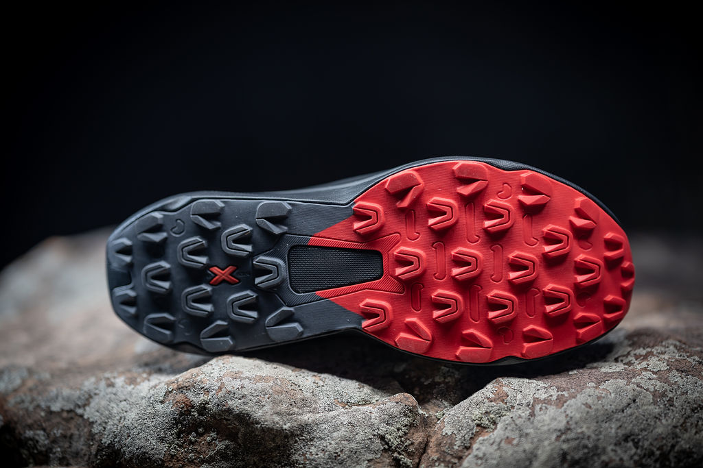

    
The midsole softness is a real trade-off for runners who want to read terrain through the sole. This shoe is built for accumulated miles on mixed terrain where cushioning and protection matter more than tactile feedback. Those are different priorities, and the Prodigio 2 is clear about which side it's on.

    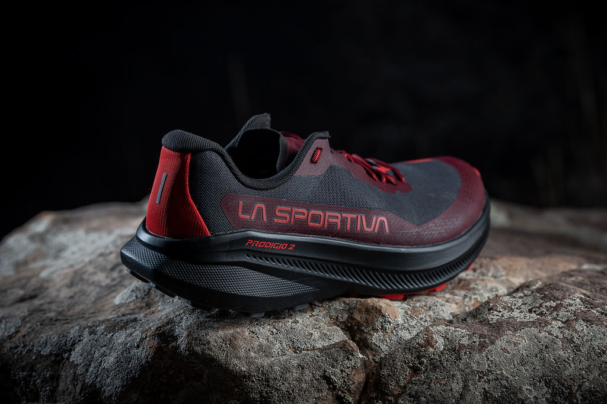

    

      
Bottom Line

      
A well-cushioned trail shoe that handles the route from smooth approach trail to scree summit ridge. The XFlow midsole delivers what it promises: soft under load, responsive at pace. The wider platform and deeper lugs are both real improvements over the original. At $160, the price is justified.

      
Recommended for sub- and ultra-distance runners who prioritize comfort and protection across mixed and technical terrain.

    

    

    <!-- ═══════════════════════════════════════════════
         COMPARISONS
    ════════════════════════════════════════════════ -->

    <h2>Comparisons</h2>

    <h3>La Sportiva Prodigio v1</h3>

    
The Prodigio 2 improves on the original across the board: softer midsole, deeper lugs, wider platform, better rock protection from the midfoot insert. Lengthwise fit is similar; both require sizing up half a US size. The wider platform on the 2 is the most significant upgrade; it adds lateral stability that changes how the shoe handles off-camber terrain and technical descents. If you own the original and run routes like Bear Peak regularly, the upgrade is worth it.

    <h3>Salomon S/Lab Ultra Glide 1.5</h3>

    
Both shoes target ultra-distance comfort with soft cushioning and a smooth ride. The Ultra Glide 1.5 is lighter and more race-focused; it's plusher underfoot but less responsive and offers less rock protection. The Prodigio 2's midfoot insert and deeper lugs give it a clear edge on technical terrain. Choose the Ultra Glide 1.5 for maximum plushness and Salomon's fitted harness system; choose the Prodigio 2 if you want more ground protection and a livelier response across variable terrain.

    <h3>Craft Xplor 2</h3>

    
The Xplor 2 is firmer and more planted, with a more aggressive outsole aimed at muddy conditions. The Prodigio 2 is the lighter and more nimble shoe. That difference shows on mixed routes that combine road approach miles with technical trail. On the Bear Peak loop from Cragmoor, the Prodigio 2's versatility fits the terrain better than the Xplor 2's heavier build. Choose the Xplor 2 if the majority of your running is in genuinely muddy conditions; choose the Prodigio 2 for mixed surfaces.

    <h3>Craft Pure Trail Pro</h3>

    
The Pure Trail Pro is Craft's race-oriented option: less cushioning, lower to the ground, more responsive at pace. It suits faster efforts on moderate terrain. Over the cumulative load of a technical mountain route or any ultra-distance effort, the Prodigio 2's cushioning advantage is substantial. Choose the Pure Trail Pro for shorter, faster races; choose the Prodigio 2 for longer mountain outings where comfort compounds across the miles.

    

  

