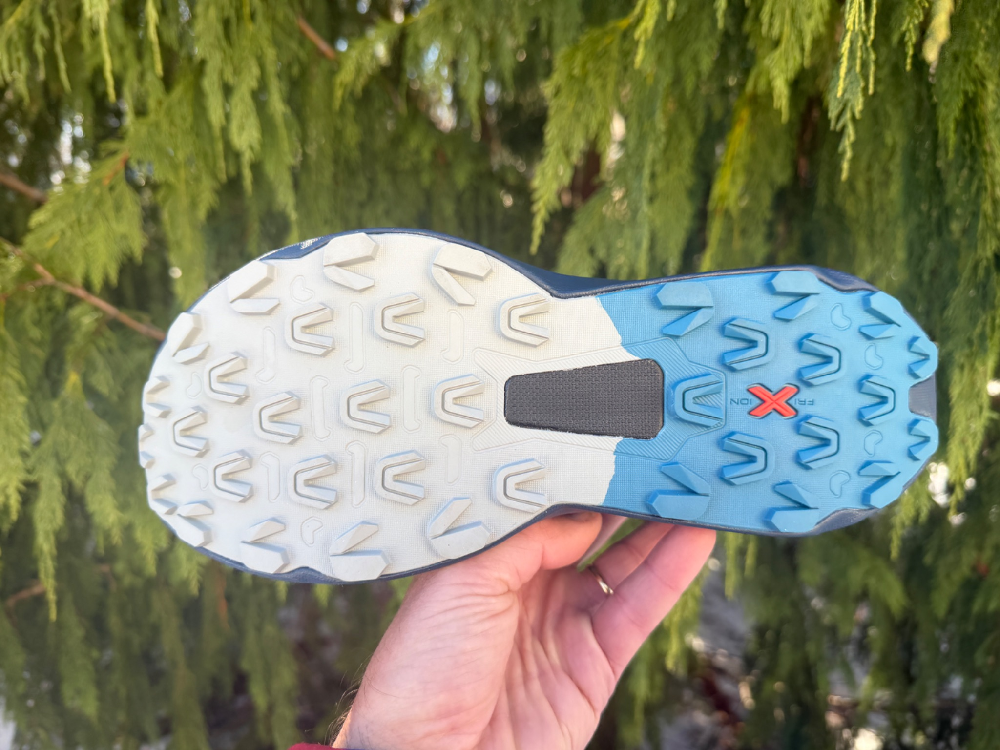
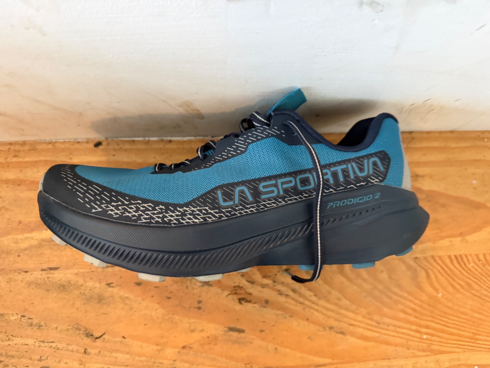
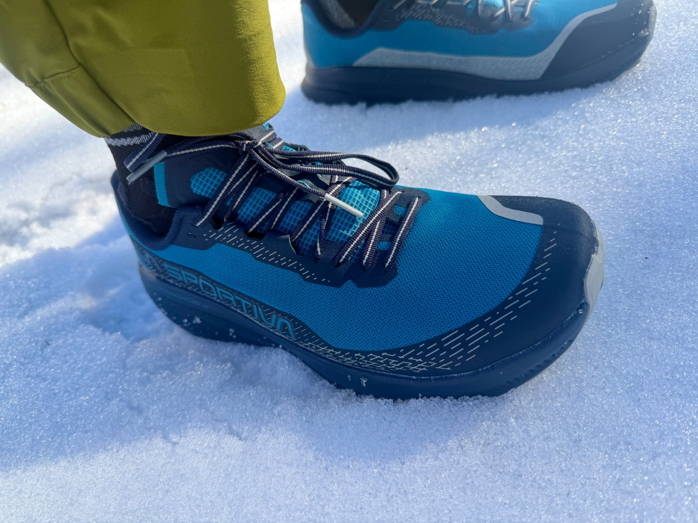
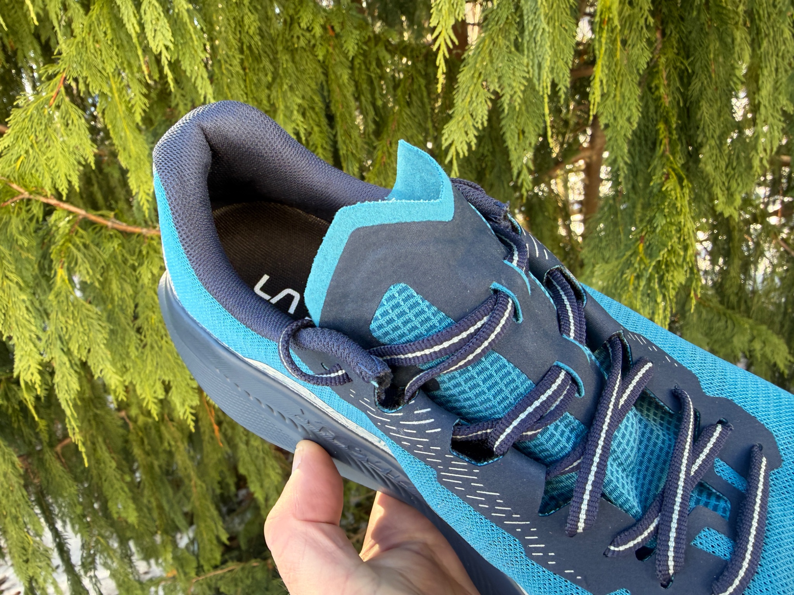
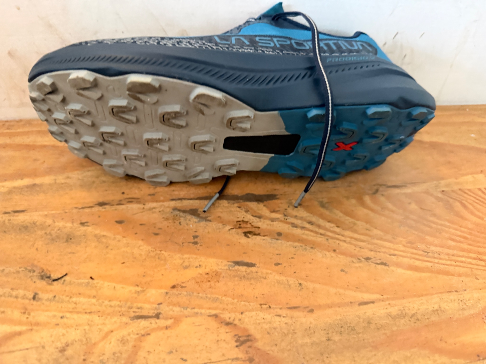

<!--more-->

*Article by John Tribbia*

Original Post from RoadTrailRun
([link](https://www.roadtrailrun.com/2026/01/la-sportiva-prodigio-2-review-4.html))

<a href="https://www.roadtrailrun.com"
class="button primary button-wrapper">Read All RoadTrailRun
Reviews Here</a>

### Introduction

John: The trail running community has been eagerly awaiting La Sportiva’s follow-up to their groundbreaking Prodigio, and I think they did well with the Prodigio 2.
When the original Prodigio launched in early 2024, it was a major shift in La Sportiva’s design philosophy - a move away from their traditionally firm, mountain-focused shoes toward something softer, more cushioned, and geared for ultra-distance comfort on moderate terrain. It was followed by the faster long race Prodigo Pro and more technical long races Prodigio Max.
Now, with the Prodigio 2, La Sportiva aims to refine that formula while addressing some of the original’s limitations.
According to La Sportiva, the Prodigio 2 features a wider fit and platform, along with their XFlow nitro EVA compound that’s said to be a little softer than the first generation.

They’ve also incorporated a midfoot PU coated insert, slightly deeper 4mm lugs (up from the 3-4mm range on the original), a new 5mm TPU Nitro insole, and a repositioned rocker for more ball of foot protection.
As someone who gave the original Prodigio high marks - a 9/10 in my review - I was particularly curious to see how these updates would translate on actual trails. The original impressed me with its surprisingly responsive ride despite the softer cushioning, though I noted concerns about upper durability and fit issues that required sizing up half a size.

### Pros:

* Wider, more accommodating fit - finally! - John
* Softer XFlow Nitro EVA delivers excellent long-distance comfort - John
* Improved platform stability for technical terrain - John
* Lightweight at approximately 9.35 oz (US 9) - John
* Excellent breathability in warm conditions - John
* Enhanced rock protection from repositioned rocker and midfoot insert - John

### Cons:

* Upper still feels less robust than La Sportiva's burlier mountain shoes - John
* May be too soft for runners seeking maximum ground feel - John
* Still requires sizing up half a size for ideal fit - John

### Stats

Sample Weight:
men’s  10.26 oz / 291g US9.5/ EU 42.5 sample
Stack Height:  34mm heel /  28mm forefoot
Also list previous if available
Platform Width: 85 mm heel /  70mm midfoot  / 110mm forefoot

### First Impressions, Fit and Upper

John: After taking the Prodigio 2 for walks around the block and a first short trail run, I can confidently say that my initial impression is overwhelmingly positive. The shoe feels comfortable, building on what made the original so appealing.
Regarding fit, I'm testing the 42.5 EU size, which in La Sportiva shoes is a half size up in US sizing from what I'd normally wear. Just like the original Prodigio, I'd recommend sizing up at least 0.5 in US standards or try them on at a store before purchasing. The good news? In this half size up, the fit is excellent.
The wider platform that La Sportiva advertises is immediately noticeable. The midfoot and forefoot feel more generous without any sloppiness.

The toe box offers comfortable room for splay, and the overall fit feels secure and snug without uncomfortable pressure points, which is a solid improvement over the original.
The heel cup locks in nicely from the first step. I've experienced zero slippage during my initial runs, and the gusseted tongue sits nicely centered with adequate padding where it counts.
The upper is a highlight for me. I love the lightweight and breathable engineered mesh construction, which keeps my feet cool and comfortable throughout runs. Note: we have had an unprecedented balmy winter here in Colorado, so the breathability has been welcome :)
The seamless design contributes to a smooth and irritation-free experience. However, I do have one concern regarding the upper's durability - the same concern I had with the original. While the mesh is comfortable and breathable, it feels less robust than the uppers of other La Sportiva shoes I’ve tested and raced in over the years. This might be a trade-off for the Prodigio 2’s focus on comfort and weight reduction, but we’ll see how well the upper will hold up over time and rugged terrain. After about 50 miles of minimal road and a lot of trail, I'm seeing no major wear and tear.

The lacing system is straightforward and effective. Nothing fancy, which is fine by me - sometimes simple is better, and the lacing provides even tension distribution across the foot without any drama.

### Midsole & Platform

### 

John: The Prodigio 2’s midsole is evolved from the original. They refined their XFlow supercritical nitrogen-infused EVA compound, and they claim it's a little softer than the original generation. On the trail, I'd say that's accurate; it's noticeably softer, though not dramatically so.
The midsole stack measures 35mm in the heel and 29mm in the forefoot, maintaining the 6mm drop. This generous cushioning platform is really good at absorbing the repetitive impact of long miles. The softness is most apparent on harder surfaces like on roads approaches to trailheads.
What continues to impress me about La Sportiva's XFlow compound is how it manages to feel both soft and responsive. This isn’t the dead, mushy softness you get with some over-cushioned shoes. There’s some liveliness to the foam that provides energy return on toe-off. I suspect this comes from the layered construction, which is similar to the original design with XFlow foam sitting atop a firmer EVA base layer. This combination delivers soft initial impact absorption with a responsive platform underneath.
The new midfoot PU coated insert adds noticeable stability and rock protection. On my local technical trails with embedded rocks and roots, I experienced far fewer painful rock jabs than I typically do in softer-cushioned shoes. The insert creates a subtle but effective shield without making the shoe feel stiff. This is a nice addition that addresses one of the inherent compromises in soft midsole designs.
La Sportiva’s repositioned rocker for more ball of foot protection is subtle but definitely effective. The rocker profile promotes a smooth, efficient gait cycle with natural transitions from heel strike through toe-off.
I found myself maintaining momentum more easily on rolling terrain, and the rocker prevented that stuck-in-the-mud feeling that can plague heavily cushioned shoes. The ball of foot protection is most noticeable on technical descents where you're landing on your forefoot on rocks and roots—there's definitely more buffer there than in the original.
My personal favorite new feature is how the wider platform contributes significantly to stability. Where the original Prodigio could feel a bit twitchy on off-camber trails or when landing awkwardly on rocks, the Prodigio 2 feels planted and confidence-inspiring. I never felt like I was going to roll an ankle, even when moving quickly on technical terrain. This is a meaningful upgrade that expands the shoe’s versatility beyond what the original could handle.
However, I should note that this midsole design prioritizes comfort over ground feel. If you're someone who loves feeling every pebble and root beneath your feet, the Prodigio 2 isn't for you. I’m a big ground feel person, so this is kind of a big deal for me, but I find this trade-off worthwhile for long miles, but it's worth considering based on your preferences.

### Outsole

### 

John: La Sportiva has upgraded the outsole on the Prodigio 2 with slightly deeper 4mm lugs compared to the original's 3-4mm range. This might seem like a minor change on paper, but it makes a meaningful difference in real-world traction, particularly in loose or muddy conditions.

The outsole features La Sportiva's FriXion compound in what appears to be a dual-compound configuration - stickier rubber in the forefoot for grip, with more durable compound at the heel for longevity.
The lug pattern is multidirectional with a good mix of shapes and sizes, providing bite in multiple planes of movement.
On my test runs spanning roads, hard-packed trails, loose gravel, mud, and technical rocky sections, the Prodigio 2’s outsole proved impressively versatile. Road sections - inevitable when running from home to trailheads - were smooth and quiet. On hard-packed dirt and gravel trails, the outsole excels. The FriXion compound grips confidently, and the lug pattern sheds small debris effectively. I could maintain pace on descents without any skidding or uncertainty about my footing.
Where the original Prodigio was adequate in mud, the Prodigio 2 provides noticeably better traction. The lugs dig in more effectively, and the spacing allows mud to release rather than building up into platform boots. After several runs on tacky, muddy single-track, I'm impressed with how well these shoes handle these conditions.
Technical, rocky terrain is where I enjoyed them most. The 4mm lugs provide good traction on rock, and the sticky FriXion compound grips amazingly well on dry stone.
How does the outsole affect the ride? Significantly. The combination of the grippy but not overly aggressive outsole with the cushioned midsole creates a ride that feels fast and efficient on moderate terrain. You’re not fighting against deep lugs that grab and stick on hard surfaces, yet you have enough traction to handle variable conditions confidently. This makes the Prodigio 2 genuinely versatile.

### Ride, Conclusions and Recommendations

John: The Prodigio 2’s ride is smooth. From the moment you start running, the shoe delivers a fluid, comfortable experience that is capable of long miles over varied terrain.
The soft XFlow Nitro EVA midsole absorbs impact nicely without feeling mushy or dead. Every footstrike feels cushioned and protected, which translates to less fatigue over distance.
Despite the softness, the ride maintains a lively, responsive quality. The rocker geometry promotes natural transitions, and there's enough energy return from the midsole to keep you moving efficiently. I've run everything from easy aerobic pace to tempo efforts in these shoes, and they handled the full range of paces admirably. The responsiveness is there when you want to push the pace, but the cushioning never fights you or feels sluggish.
The wider platform creates a stable, planted ride that gives me confidence on technical terrain. When landing on uneven surfaces or navigating off-camber trails, the shoe tracks predictably without the shifty feeling that some cushioned shoes can have. This stability is particularly appreciated on descents.
One aspect of the ride that stands out is how well the Prodigio 2 handles transitions between surfaces. Running from roads to gravel to single-track to technical rocky sections, the shoe adapts seamlessly. There’s no awkward adjustment period when switching terrain types and the combination of the versatile outsole + balanced midsole just works across the board.
The Prodigio 2 is ideal for sub- and ultra-distance runners looking comfort over their trail miles, trail runners who prioritize cushioning and protection, runners who need a versatile shoe capable of handling mixed terrain including road sections, and anyone who wants a comfortable, confidence-inspiring shoe for all-day trail adventures.
Compared to the original Prodigio, the Prodigio 2 is the better shoe. The slightly softer midsole enhances long-distance comfort, the deeper lugs provide better traction, and the enhanced rock protection makes technical terrain more manageable.
At $160, it's not cheap, but the quality, performance, and versatility justify the price.
These shoes will handle just about everything from casual trail runs to challenging ultras. La Sportiva continues to evolve and expand their product line in exciting directions, and the Prodigio 2 is their best iteration yet.

### John’s Score:  9.2/10

Ride: 9.5 (awesome shoe for variety of paces and terrain)
Fit: 8.5 (make sure to try on a pair for you to ensure you get the right fit)
Value: 9 (feels like a do-everything)
Style: 10 (nice sleek upper)
Traction: 9 (Sportiva’s can’t miss outsole)
Rock Protection: 9
😊😊😊😊½

### 4 Comparisons

La Sportiva Prodigio v1 ()
John: The Prodigio 2 improves on the original in several key ways. The slightly softer midsole enhances comfort, the deeper lugs provide better traction, and the enhanced rock protection makes technical terrain more manageable. The lengthwise fit remains similar, both require sizing up half a size for me, but the Prodigio 2’s wider platform feels more secure and accommodating. If I’m choosing between them, I’m going with the Prodigio 2.

### Salomon S/Lab Ultra Glide 1.5 (RTR Review)

John: The S/Lab Ultra Glide 1.5 shares the Prodigio 2’s ultra-distance focus with soft cushioning and a smooth ride, but the S/Lab version is lighter and more race-focused. The Ultra Glide 1.5 feels softer and plusher underfoot with less responsiveness. The Prodigio 2 offers better rock protection from the midfoot insert and slightly better traction on technical terrain with its deeper lugs. Both excel at long distances on moderate terrain. Choose the Ultra Glide 1.5 if you want maximum plushness and Salomon's dialed fit, or the Prodigio 2 if you prefer more ground feel, better protection, and a livelier, more responsive ride.

### Craft Xplor 2 (RTR Review)

John: The Xplor 2 is another cushioned trail shoe aimed at long distances, but it takes a different approach than the Prodigio 2. The Xplor 2 has a wider, more stable platform with a rockered geometry similar to the Prodigio 2. However, the Xplor 2 feels firmer and more planted, with less bounce and energy return than the Prodigio 2’s XFlow midsole. The Prodigio 2 is noticeably lighter and more nimble, making it better for varied paces and technical terrain. The Xplor 2’s outsole is more aggressive, giving it an edge in loose or muddy conditions. Choose the Xplor 2 if you want maximum stability and traction on challenging terrain, or the Prodigio 2 if you prioritize a lighter, more responsive ride with better versatility across mixed surfaces.

### Craft Pure Trail Pro (RTR Review)

John: The Pure Trail Pro is Craft’s more race-oriented trail shoe with less cushioning than the Prodigio 2. It's firmer, lower to the ground, and more responsive, making it better suited for faster efforts on moderate terrain. The Pure Trail Pro weighs less and feels more agile, but sacrifices the long-distance comfort that the Prodigio 2 excels at. The Prodigio 2’s softer midsole and higher stack height provide significantly more protection and fatigue resistance over ultra-distances. The Pure Trail Pro has a grippier outsole for muddier / softer terrain. Choose the Pure Trail Pro for shorter, faster races where you want maximum responsiveness, or the Prodigio 2 for ultras and long training runs where comfort matters most.

### Tester Profile

John Tribbia (5' 6", 130lbs) is a former sponsored mountain/trail runner who has run with La Sportiva, Brooks/Fleet Feet, Pearl Izumi, and Salomon. Even though he competes less frequently these days, you can still find John enjoying the daily grind of running on any surface, though his favorite terrain is 30-40% grade climbs. He has won races such as America's Uphill, Imogene Pass Run, and the US Skyrunner Vertical Kilometer Series; and he's held several FKTs on several iconic mountains in Boulder, Colorado and Salt Lake City, Utah. If you follow him on , you'll notice he runs at varying paces between 5 minutes/mile to 12 minutes/mile before the break of dawn almost every day.
