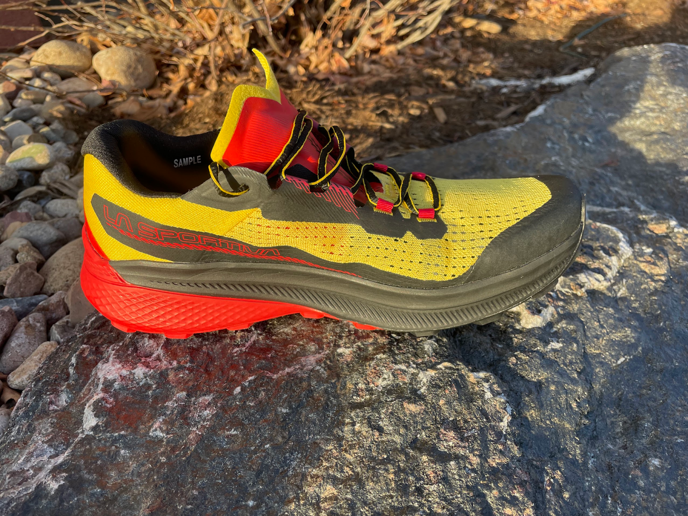
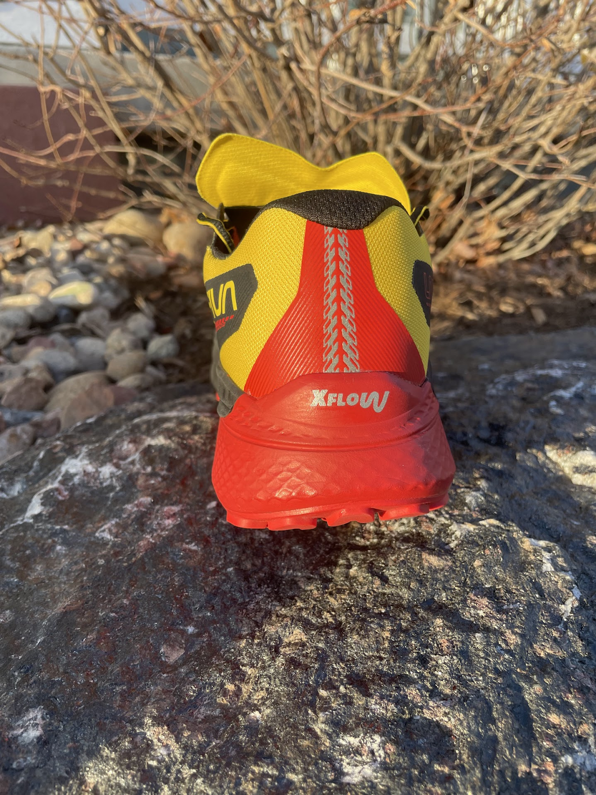
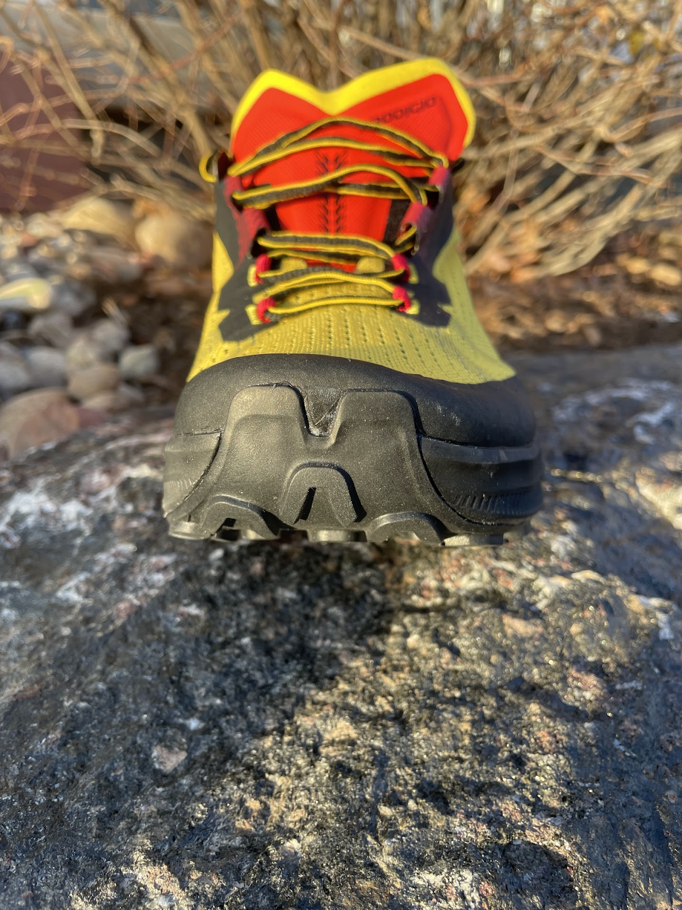
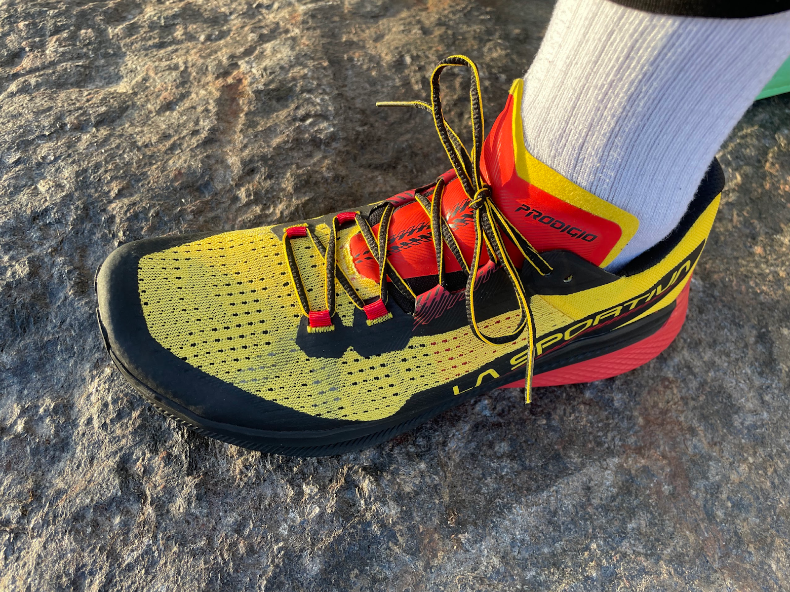

<!--more-->

Original review was posted on
[www.roadtrailrun.com](http://www.roadtrailrun.com)
[HERE](https://www.roadtrailrun.com/2023/12/la-sportiva-prodigio-review.html)

La Sportiva Prodigio ($155, release in mid-February 2024)

## **Introduction**

The trail running world is buzzing with anticipation for La Sportiva's
newest release: the Prodigio. As a regular trail running shoe reviewer,
I'm particularly intrigued by this ultra-distance shoe with its promise
of a softer midsole, a novel concept for a brand typically known for its
more rigid, firmer and responsive offerings.

According to La Sportiva, the Prodigio aims to cater to the
ultra-distance runner seeking comfort and protection over long, grueling
hours on the trail. This shift towards cushioning marks a significant
departure from their previous models, which prioritized agility and
stability on technical terrain.

Having tested several La Sportiva shoes and being a sponsored runner
with them in the past, I've come to appreciate their exceptional
durability and grip, even in the most demanding conditions. For my
personal preference, I often found their trademark firmness a bit
unforgiving, especially on longer runs. This is where the Prodigio's
softer midsole sparked my excitement. The potential for a shoe that
combines La Sportiva's renowned performance with enhanced comfort for
ultra-distances is a truly compelling proposition.

Of course, only a thorough test can reveal whether the Prodigio lives up
to its expectations. I was eager to put the shoe through its paces,
exploring its cushioning, responsiveness, and overall performance in the
terrain it's designed for. Stay tuned for the full review here, where
I'll delve into the Prodigio's strengths and weaknesses, and shed light
on its suitability for the dedicated ultra-distance runner.

**Pros:**

- Softer midsole: Designed for comfort and protection over long
  distances

- Lightweight: Weighs under 9.6 oz / US9 sample

- New XFlow supercritical nitrogen infused midsole compound: more
  responsive and durable than previous La Sportiva offerings

- Highly breathable 

- Rocker profile: Promotes natural gait and smooth transitions

- Tri-compound FriXion Offers a balance of grip, durability, and
  versatility across different terrains

**Cons:**

- Less stability and protection: Softer midsole compromises performance
  on technical terrain

- Less robust upper: May be more susceptible to wear and tear than La
  Sportiva's traditionally rugged designs

Please find the testers full run bios at the end of the article after
Comparisons.

## **Stats**

Samples: men’s  9.6 oz / 273 g US 9

Stack Height: men’s 34mm heel / 28mm forefoot (6mm drop) 

Available February 15, 2024.

## **First Impressions, Fit and Upper**

After taking the Prodigio for walks around the block and a first short
trail run, I can confidently say that my initial impression is
overwhelmingly positive. The shoe feels remarkably comfortable,
especially compared to other La Sportiva models I've tested.

Firstly, regarding the fit, I would recommend to size up 0.5 US.
Initially, I tried my usual US 9, but it felt slightly too short and
quite tight horizontally + over the toes in the toe box. Moving up to
9.5 US (or even 42.5 EU) would provide the perfect amount of space.
Regardless, the overall fit feels secure and snug without any
uncomfortable pressure points.

The upper is a highlight for me. I love the lightweight and breathable
knit construction, which kept my feet cool and comfortable throughout
the run. The seamless design also contributes to a smooth and
irritation-free experience. However, I do have one slight concern
regarding the upper's durability. While the knit is comfortable and
breathable, it feels less robust than the uppers of other La Sportiva
shoes I've run. This might be a trade-off for the Prodigio's focus on
comfort and weight reduction, but it remains to be seen how well the
upper will hold up over time and rugged terrain.

Overall, I'm highly impressed with the Prodigio's initial performance.
The cushioning is noticeable and feels ideal for long runs, and the shoe
is surprisingly responsive despite its softer midsole. I'm eager to see
how it performs on longer trail runs and more technical terrain, but my
first impression is that La Sportiva has delivered an exceptional
contender for the ultra-distance running market.

## **Midsole & Platform**

The Prodigio's X-Flow supercritical foam midsole and platform represent
a significant step forward for La Sportiva, marking their boldest foray
into the realm of ultra-distance comfort. 

The new foam is said by LS to have 15% more cushioning 18.5 % more
rebound and is 18% lighter than the usual compression molded EVA. EVA is
not completely eliminated as there is a 2.4mm layer of LaSpEVA, likely
to stabilize, protect from rocks and give some response. We also have
FlowFilm a full length PU coated nylon mesh for rock protection in the
mix

After putting the shoe through its paces on varied terrain and
distances, I can confidently say that the new midsole delivers on its
promise of enhanced cushioning and responsiveness.

The initial impression of softness is undeniable. The X-Flow compound
absorbs impact effectively, reducing fatigue on long runs and minimizing
the jarring sensation on hard surfaces. This translates to a smoother,
more forgiving ride that feels noticeably different from the firmness
typically associated with La Sportiva shoes.

Despite its softer nature, the X-Flow midsole retains a surprising level
of responsiveness. It offers a springy feel, aiding in efficient
transitions and promoting a natural gait cycle. This attribute surprised
me, as I initially expected the additional cushioning to compromise the
shoe's agility. Instead, the Prodigio manages to strike a commendable
balance between comfort (X-Flow foam) and responsiveness (EVA layer)
making it suitable for both long, slow runs and tempo efforts.

The platform also deserves praise. Its rocker profile facilitates a
smooth roll-through motion, helping you maintain momentum and conserve
energy on long runs. This design, combined with the midsole's intrinsic
properties, makes the Prodigio an ideal candidate for tackling long
distances on moderate terrain.

However, it's crucial to acknowledge that the X-Flow platform might not
be suitable for everyone or every terrain. While it excels on moderate
trails, the increased cushioning compromises stability on highly
technical terrain. For runners who prioritize agility and precision over
comfort, La Sportiva's other models with their firmer midsoles might be
a more appropriate choice.

## **Outsole**

The Prodigio's outsole proved surprisingly versatile across diverse
terrain. While not ideal for deep snow, its multidirectional lugs
offered reasonable grip in light to moderately snowy conditions. Mud
proved no obstacle providing excellent traction and mud-shedding
capabilities. Dry dirt trails saw the shoe excel, with a combination of
FriXion compound delivering exceptional grip and stability. 

On technical rocky sections, the Prodigio's limitations emerged, with
the relatively shallow 3 and 4mm lugs providing less grip and stability
compared to La Sportiva's more aggressive offerings. Nevertheless, on
road sections, the shoe surprised with a smooth transition and ample
traction despite the prominent lugs.

## **Ride, Conclusions and Recommendations**

The Prodigio delivers a smooth and comfortable ride, particularly
evident on moderate terrain. 

The X-Flow midsole absorbs impact effectively, minimizing fatigue on
long runs and offering a level of protection previously unseen in La
Sportiva's offerings. 

Despite the additional cushioning, the shoe retains a surprising level
of responsiveness, aided by the rocker profile that promotes a natural
gait cycle and smooth transitions. The combination of these elements
translates to a ride that feels both forgiving and lively, ideal for
long distances and varied paces.

Overall, I'm impressed with the X-Flow midsole and platform. La Sportiva
has successfully created a comfortable and responsive experience without
sacrificing performance entirely. The Prodigio shines for ultra-distance
runs on moderate terrain, offering exceptional comfort and a
surprisingly lively feel. 

While the durability of the X-Flow compound remains to be tested over
time, the initial impression points to a promising future for La
Sportiva in the ultra-distance running market. The Prodigio represents a
significant step forward in their quest to cater to a broader range of
runners and terrain types.

The Prodigio's outsole shines in mud, dry dirt, and even road sections,
offering an excellent balance of grip and stability. Its limitations,
however, surface in deep snow and highly technical terrain, where deeper
lugs and a more aggressive design are preferred. For ultra-distance
runners seeking comfort and versatility on moderate to challenging
terrain, the Prodigio's outsole provides a well-rounded performance. For
those consistently tackling highly technical trails, La Sportiva's
models with dedicated aggressive outsoles might be a better choice.

The La Sportiva Prodigio represents a significant evolution in the
brand's approach to ultra-distance running. It successfully blends
comfort and responsiveness, offering a compelling option for runners
seeking long-distance comfort on moderate terrain. While not designed
for the most technical trails, the Prodigio demonstrates La Sportiva's
commitment to broadening its market reach and catering to a wider range
of trail and ultra runners' needs. It's a shoe that will undoubtedly
find its place among dedicated long-distance enthusiasts who prioritize
comfort without entirely sacrificing performance and versatility.

**Rating Score:  9/10**

Ride: 9.5 (great shoe for variety of paces on the smooth trails and
road)

Fit: 8.5 (short and tight in the forefoot)

Value: 9 (La Sportiva’s first versatile road to trail *running* shoe) 

Style: 10 (I love the classic Sportiva Yellow/Black/Red)

Traction: 9 (Sportiva’s can’t miss outsole)

Rock Protection: 8.5

😊😊😊😊 

## **Comparisons**

Index to all RTR reviews:
[HERE](https://www.roadtrailrun.com/p/blog-page.html)** **

**La Sportiva Cyklon** ([RTR
Review](https://www.roadtrailrun.com/2021/02/la-sportiva-cyklon-review-trail-runner.html))

Cyklon is a more aggressive trail running shoe that is best for
technical terrain and fast-paced runs in those ankle-breaking places. It
offers more responsiveness and traction than Prodigio.

**La Sportiva Jackal** ([RTR
Review](https://www.roadtrailrun.com/2023/02/la-sportiva-jackal-ii-and-jackal-ii-boa.html))  
Jackal is a more responsive and agile shoe that is ideal for
faster-paced runs in varied terrain. It has a lower level of cushioning
and a more energetic feel. Both shoes have a grippy and versatile
outsole, but Jackal performs better on technical terrain.

**La Sportiva Kaptiva** ([RTR
Review](https://www.roadtrailrun.com/2019/04/la-sportiva-kaptiva-review-light-and.html))

Prodigio is a great choice for long-distance runners who want a
comfortable and cushioned shoe. Kaptiva is a good option for runners who
want a responsive and agile shoe with great ground feel that is ideal
for technical terrain.

**Saucony Peregrine 13** ([RTR
Review](https://www.roadtrailrun.com/2023/01/saucony-peregrine-13-and-peregrine-13.html))

Prodigio is a more cushioned and responsive shoe that excels in mud and
diverse terrain. Peregrine 13 is a more versatile shoe with good
performance on rocky and technical surfaces. Peregrine 13 offers greater
stability and control on technical terrain.

**Salomon Sense Ride 4** ([RTR
Review](https://www.roadtrailrun.com/2021/03/salomon-sense-ride-4-review-most.html))

Prodigio offers more cushioning, ideal for long-distance comfort,
whereas the Sense Ride 4 takes a more balanced approach with moderate
cushioning. Prodigio feels slightly more responsive thanks to its rocker
profile. Both offer versatile outsoles, performing well on diverse
terrain. Sense Ride 4 has a clear edge on dry and rocky surfaces and
offers slightly better stability on technical terrain. Prodigio performs
adequately but might feel less secure on highly technical sections.

**Nike Pegasus Trail 4 GTX** ([RTR
Review](https://www.roadtrailrun.com/2022/12/nike-react-pegasus-trail-4-gtx-multi.html))

Prodigio is a great choice for long-distance running on trails with
varied terrain. It offers superior cushioning and traction, making it a
comfortable and stable option for runners of all levels. Pegasus Trail 4
GTX is a good choice for runners who want a more responsive shoe that
performs well on moderate terrain. However, it lacks the traction and
stability of Prodigio on technical surfaces.

**Norda 002** ([RTR
Review](https://www.roadtrailrun.com/2023/06/norda-002-multi-tester-review-9.html))

Prodigio prioritizes cushioning for long-distance comfort, while Norda
002 offers minimal cushioning, focusing on ground feel and agility.
Norda 002 is highly responsive, promoting a barefoot-like experience.
Prodigio feels more cushioned and less agile in comparison. 

Thanks for reading Boulder Gear Lab! Subscribe for free to receive new
posts and support my work.
