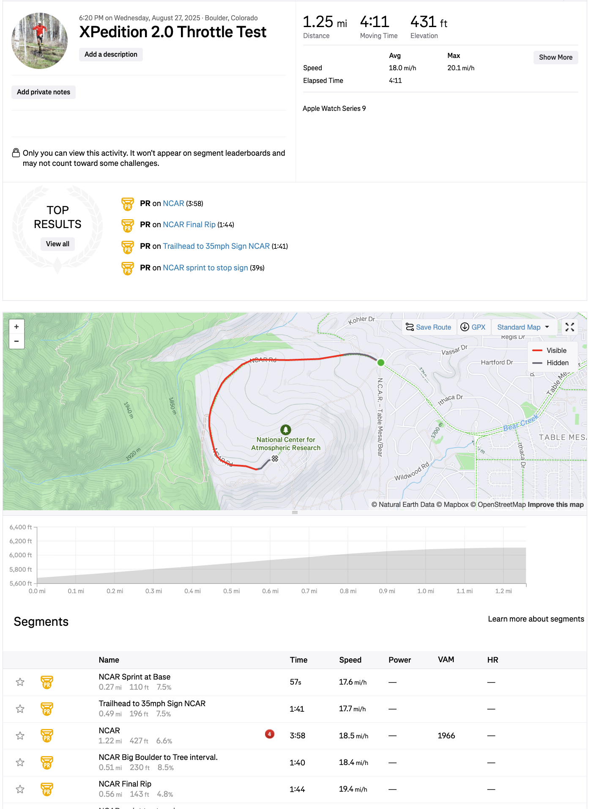
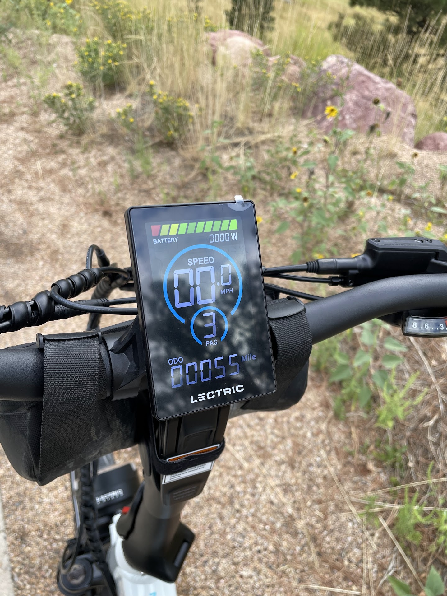

<!--more-->

*Article by John Tribbia*

Original Post from RoadTrailRun
([link](https://www.roadtrailrun.com/2025/09/roadtrailride-lectric-xpedition-20.html))

<a href="https://www.roadtrailrun.com"
class="button primary button-wrapper">Read All RoadTrailRun
Reviews Here</a>

Article by John Tribbia

### Lectric XPedition 2.0 Cargo eBike ($1,799 + accessories)

### Introduction

Here in Boulder, Colorado, my cargo eBike isn't a novelty, it's a necessity. With over 4,000 miles logged on my trusty Yuba Spicy Curry, I've hauled everything from a week’s worth of groceries up steep roads to commuting across town along a mix of gravel trails, roads, and bike paths.
It’s basically our second car, my work shuttle, my transportation to trailheads, and my weekend escape rolled into one. So when the opportunity arose to test the Lectric [XPedition 2.0](https://lectricebikes.com/products/xpedition-dual-battery) - a bike claiming massive utility and power at a fraction of the cost of premium brands - my interest was piqued, and admittedly, I was a bit skeptical.
I tested the cargo bike  on a variety of terrain, including those steep unforgiving hills, winding bike paths, and light trails to find out if this budget-friendly cargo bike is a true car-killer or just a pretender.
Note: the bike was donated on behalf of Lectric for testing purposes.

### First Impressions, Pros & Cons

Unboxing the XPedition 2.0, it’s immediately clear that Lectric is a solid company that knows how to ship a bike. The packaging was robust, and every component was securely fastened, arriving without a scratch. Assembly was straightforward, aided by clever QR codes on the box that link directly to instructional videos, a thoughtful touch for those new to eBikes.

Once assembled, the bike's build quality is impressive for its price point. The welds on the new hydroformed aluminum frame are clean, and the overall construction feels sturdy and ready for work. It's a heavy machine at 83 pounds with both batteries installed, but its low step-thru design makes it surprisingly approachable.

### Pros

Exceptional Value: Offers features like a torque sensor and dual-battery capability at a price point competitors can't touch.
Immense Power and Capacity: The 750W motor (peaking at 1310W) and a 450 lb payload capacity mean it can handle heavy loads (in my case, two 11 year olds) and steep hills with confidence.

### Massive Range: The dual-battery option provides an incredible amount of range.

Smooth and Intuitive Ride: The new PWR+ torque sensor delivers natural-feeling pedal assist, a significant upgrade from cadence-only systems.
Highly Customizable: Comes with a host of included accessories and a wide range of optional add-ons to tailor it to any need.

### Cons

Heavy: At over 80 lbs with batteries, lifting it onto a car rack or carrying it up stairs is a serious challenge.
Basic Suspension: While the front fork and suspension seatpost help, the ride can be harsh on very rough terrain due to the lack of rear suspension.

### Proprietary Charger Connector: Makes it difficult to use third-party chargers.

### The Ride

The heart of the XPedition 2.0 is its powerful 750W rear hub motor, which puts out an impressive 1,310W at its peak. The real game-changer, however, is the new custom-tuned torque sensor with PWR+ technology.
Unlike the jerky on/off feel of many cadence-based systems, the XPedition delivers power that feels like a natural extension of your own pedaling. On the steep climbs around my neighborhood, the motor never felt underpowered, even when loaded down. My wife and I took turns as passengers and the bike handled our weight with ease. It provides a smooth, steady assist that makes you feel superhuman, rather than just a passenger.

While the XPedition's hub motor is only marginally less refined than the premium Bosch mid-drive motor on my Yuba Spicy Curry, it delivers a more noticeable surge of power at higher assist levels. Surprisingly, the Lectric holds its own when it comes to hill-crushing ability. I even conquered a well-known cycling training hill ([NCAR](https://www.strava.com/segments/638399?filter=overall)) in Boulder and crushed the Strava segment using only the throttle (though no crowns were claimed as I kept this a private activity).

The bike's handling is a tale of two traits. The long wheelbase and low center of gravity (thanks to 20" wheels) make it incredibly stable at speed, even when fully loaded. Yet, those smaller wheels also lend it an agility that defies its size, making it easy to maneuver through city bike lanes and around obstacles.
That said, I did find it to be squirrely and unstable on gravel trails, largely due to the wheel size. The hydraulic disc brakes with 180mm rotors are a necessary feature, providing strong, reliable stopping power on steep descents.
With dual 48V, 17.5Ah batteries, the long-range model boasts 1680Wh of capacity. While the advertised range reaches 170 miles, in real-world conditions with hills and a heavy load, a more realistic expectation is in the 50-60 mile range - which is still phenomenal and more than enough for several days of commuting and errands without a recharge.

### Fit and Features

As a cargo bike, the XPedition is designed for utility and excels at it. The extended rear rack is a massive platform, rated for 300 lbs. The model I tested came with plush passenger seat cushions and sturdy running boards, creating a comfortable and secure spot for a passenger. The dual-leg kickstand is exceptionally stable, a critical feature when loading up kids or heavy groceries.

The ergonomics are also highly adaptable. The step-thru frame is a breeze to mount and dismount, and the adjustable stem and long shock absorbing seatpost accommodate a wide range of rider heights, from 4'11" to 6'5".
I’m 5’6” and the bike fits comfortably, which isn’t always true for lower price point one-size-fits-all eBikes.
The color LCD is bright and easy to read, even in direct sunlight, and includes a handy USB-C port for charging devices on the go. The left-hand thumb throttle and Shimano 8-speed shifter are intuitively placed and easy to operate.

### Conclusions and Recommendations

The XPedition 2.0 is not just a great cargo eBike for the price, it's a great cargo eBike, period. It democratizes the car-replacement lifestyle, offering a level of power, range, and utility that was previously the domain of bikes costing two or three times as much. It’s a workhorse that can comfortably haul kids to school, conquer a massive grocery run, or serve as a reliable daily commuter.
The bike is an outstanding choice for anyone looking to reduce their car dependency (especially to/from work, school, gym, track, trailhead, etc), urbanites needing to haul substantial cargo, and anyone seeking a powerful, long-range utility vehicle without breaking the bank. Its ease of use and stable handling also make it a great entry point for those new to the world of cargo eBikes.
Who should look elsewhere? If you live in a third-floor walk-up, the XPedition's 83-pound weight will be a significant drawback if not impossible for most. Riders who frequently tackle rough and loose trails or potholed roads might also wish for rear suspension.

Ultimately, the Lectric XPedition 2.0 punches far above its weight class. And it delivers on the core promises of a cargo eBike - power, capacity, and versatility - at a value that is simply undeniable.