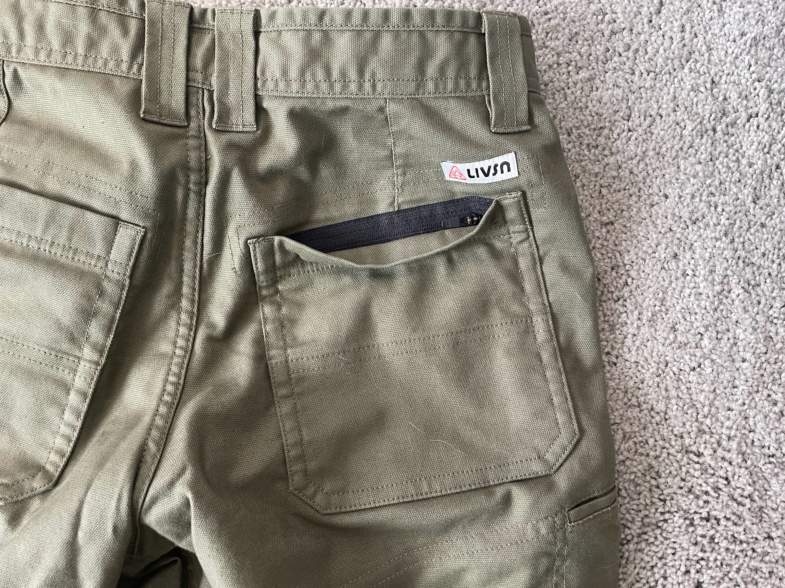
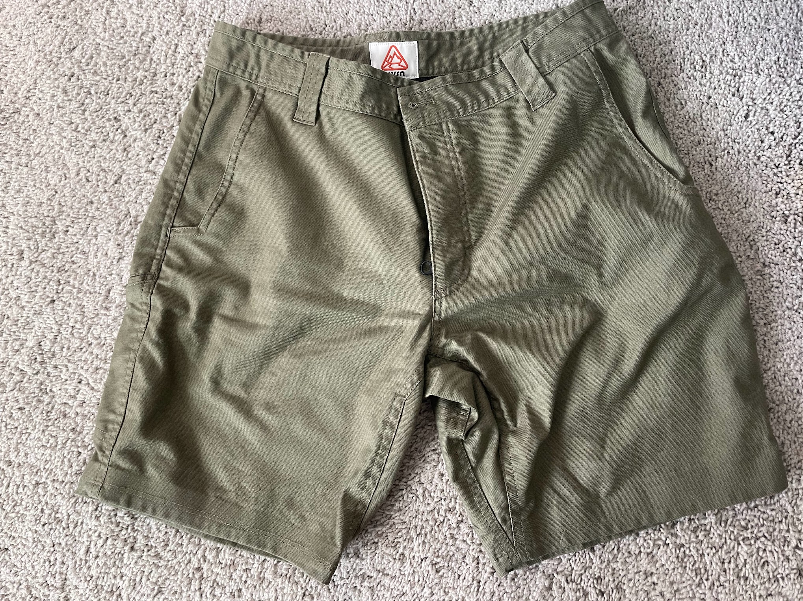
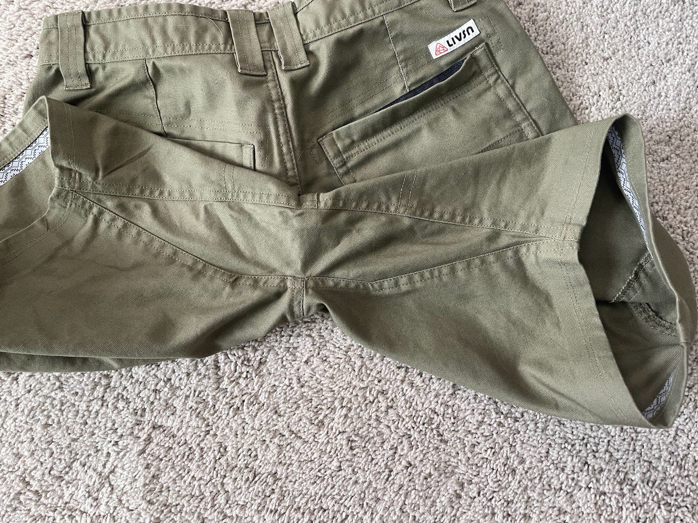
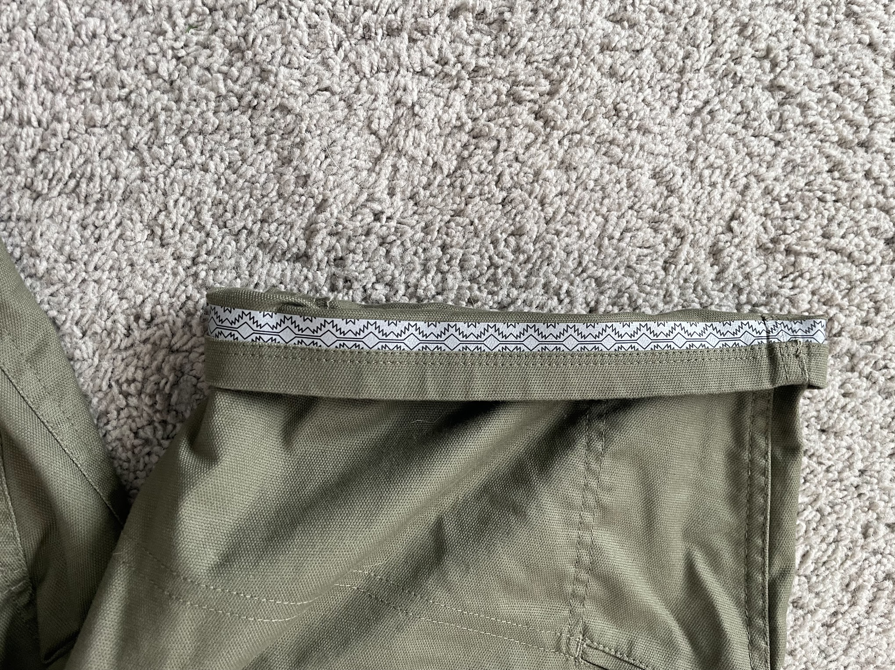

<!--more-->

[LIVSN](https://www.livsndesigns.com/) is a clothing brand that was
founded in 2017 by two friends, David and Anders. The name LIVSN comes
from the Swedish word "livsnjutare," which roughly translates to "one
who loves life deeply; an enjoyer of life." Their mission is to create
durable, versatile, high-quality outdoor clothing that encourages people
to wear it more, keep it longer, and spend more time outdoors. The
company's products are made with sustainable materials and construction
methods, and they are designed to perform in a variety of outdoor
activities. LIVSN offers a wide range of products, including pants,
shirts, jackets, and accessories. LIVSN's products are designed to be
comfortable, stylish, and functional.

I received a pair of the LIVSN Flex Canvas Shorts, which are a versatile
and durable pair of shorts that are perfect for a variety of activities.
They are made with a custom EcoFlex Canvas fabric that is made with 58%
GOTS Certified Organic Cotton, 40% Recycled Polyester, and 2% Spandex.
This fabric is soft, durable, and breathable, making it perfect for both
hot and cold weather.

The inseam of the LIVSN Flex Canvas Shorts is 8.5 inches. This is a good
length for shorts that are both comfortable and stylish. They are not
too short to be considered indecent, but they are also not too long to
be motion restricting. The 8.5-inch inseam is perfect for a variety of
activities like hiking, bike commuting, around town, yardwork, and so
on. The shorts are made of a comfortable and durable canvas fabric that
feels like it will last for many wears, similar to Carhartts.

The **strongmesh interior** on the Flex Canvas Shorts is a nice touch
because it helps to keep the shorts cool and comfortable, even when you
are sweating. It also helps to wick away moisture, which can help to
prevent chafing.

The shorts have **reinforced pockets with zippers** to keep your
belongings secure, even when you are moving quickly. The zippers are
also really durable - the reinforced pockets are made with a
heavier-duty material compared to the rest of the shorts, which helps to
prevent them from tearing or being damaged. The zippers are also made
with a high-quality material that is resistant to wear and tear, helping
to ensure that your belongings will stay safe and secure, even when you
are moving around.

**Gusseted Crotch**: The gusseted crotch on the LIVSN Flex Canvas Shorts
is a great feature. It allows for a full range of motion, so you can
move freely without feeling restricted.

The **reflective taping** inside the hem of the Canvas Shorts is a nice
added safety feature because it helps to make you more visible to cars
at night. When walking or biking at night, the reflective taping helps
keep you safer by reflecting light back to drivers, making it easier for
them to see you. This can be a lifesaver, especially if you are walking
or biking in an area with a lot of traffic.

**Hidden Security Pocket**: The hidden security pocket is a great
feature. It is a small pocket that is located on the inside of the
shorts. This pocket is perfect for storing small items, such as keys or
a wallet.

Overall, the Livsn Flex Canvas Shorts are a solid pair of shorts. They
are comfortable, stylish, durable, and secretly reflective at night.

Thanks for reading Boulder Gear Lab! Subscribe for free to receive new
posts and support my work.
