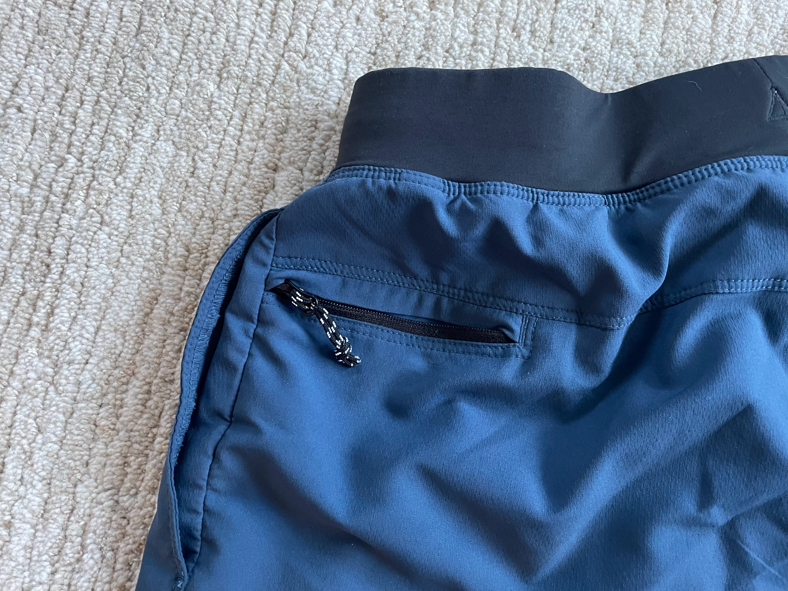
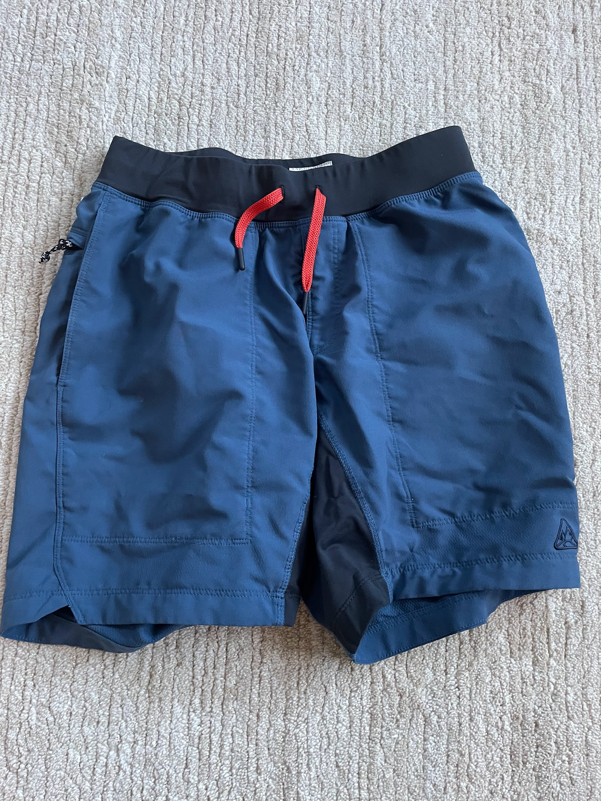
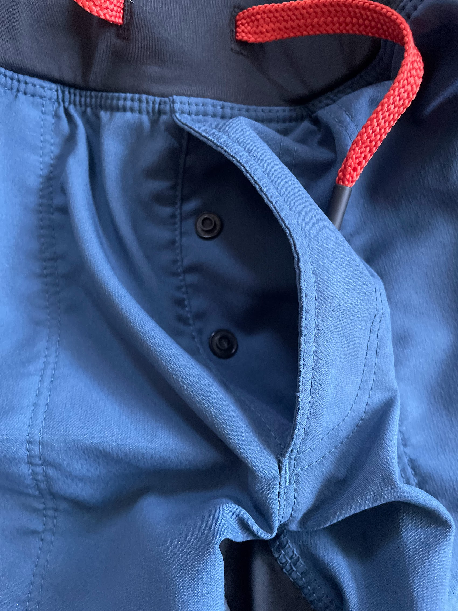
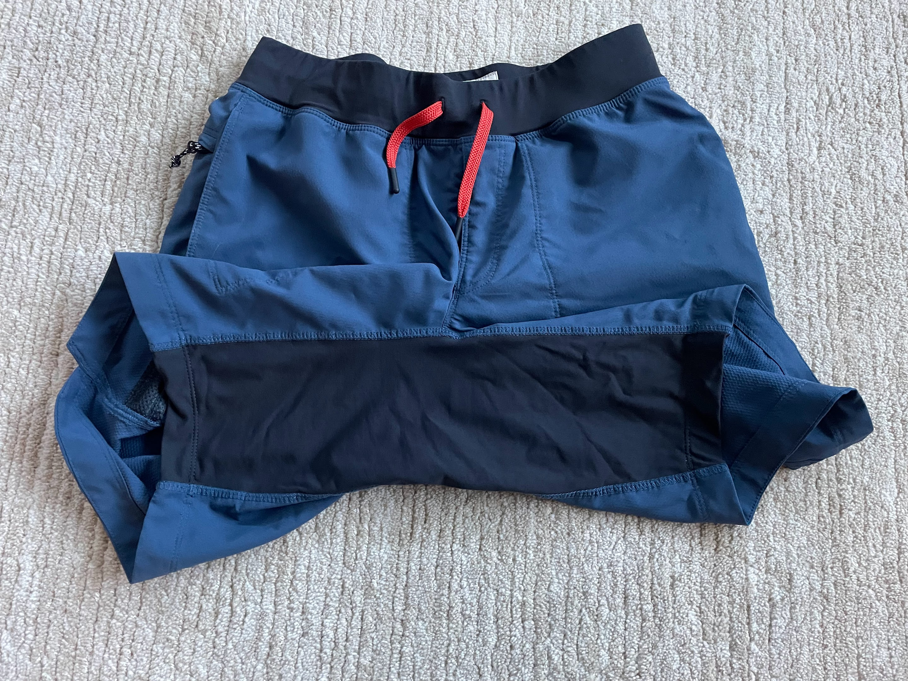
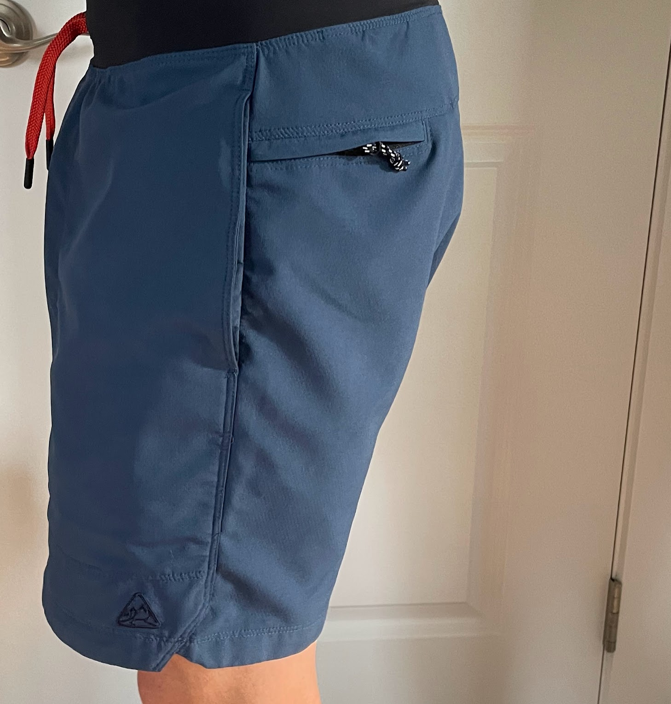

<!--more-->

The [LIVSN Reflex
Shorts](https://www.livsndesigns.com/products/reflex-shorts) ($79) are
the perfect shorts for anyone who wants to look good, feel good, and be
the life of the party while they're out exploring the great outdoors.
They're made of a lightweight, water-resistant fabric that dries
quickly, and they have a four-way stretch that makes them comfortable to
move in. Plus, they have a number of features that make them ideal for
hiking, biking, climbing, and even mowing the lawn or dancing the night
away, including two YKK lockdown zippered media pockets, ventilated deep
front pockets, a snap button front fly, a movement crotch gusset, and a
really comfortable stretch waistband.

I've been wearing the LIVSN Reflex Shorts for a few weeks now, and I've
been very impressed with them. They're incredibly comfortable, and
they've held up well to all sorts of abuse.

- **YKK lockdown zippered media pockets on each backside/hip:** These
  pockets are perfect for storing your phone, keys, or other small
  items. They are also water-resistant, so you don't have to worry about
  your belongings getting wet.  

  

  

  

  

- **Ventilated deep front pockets w/ phone sleeves:** Designed to help
  keep your phone from bouncing around your front pocket and in an
  accessible + comfortable position. It is a bit on the narrow side, so
  not all phones will fit.

  

  

- **Snap button front fly:** In my opinion, this type of fly is more
  secure than a zipper fly, and it's also easier to open and close.
  Buyer beware though: the buttons can come unsnapped with an
  inadvertent tug from a branch.

  

  

- **Movement crotch gusset:** Allows for more movement and flexibility
  in the crotch area, which is beneficial for activities like hiking,
  biking, and scrambling.

  

  

- **Movement comfort stretch waistband:** This waistband is made of a
  comfortable, stretchy material. It's also drawstring adjustable, so
  you can find the perfect fit.

  

  

- **7” inseam (8.5" if measured to top seam of gusset, but they fit like
  a 7" inseam short):** The 7" inseam is a good length for active
  pursuits. I found the length to be perfect for steep hiking, keeping
  the shorts out of the way of your knees on high steps.

  

  

- **Flat felled center seam:** This type of seam is more durable than a
  traditional seam and it's also less likely to chafe, which is
  important for activities like hiking and biking.

When I wore the LIVSN Reflex Shorts on a hike, I found them to be very
comfortable. The fabric is lightweight and breathable, and the four-way
stretch made them easy to move in. The pockets were also very useful for
storing my phone, keys, and other small items. I also appreciated the
snap button front fly, which made it easy to use while I was on the
trail.

When I wore the LIVSN Reflex Shorts while bike commuting, I found them
to be just as comfortable. The fabric is water-resistant, so I didn't
have to worry about getting wet in the rain. Overall, I found the LIVSN
Reflex Shorts to be a great pair of shorts for hiking, bike commuting,
or any other outdoor activity. They are comfortable, durable, and
versatile, and they have a number of features that make them ideal for
these activities.

Thanks for reading Boulder Gear Lab! Subscribe for free to receive new
posts and support my work.
