

  Boulder Gear Lab
  Est. 2020 · Boulder, Colorado

Gear Review · Trail Running · Pack &amp; Poles

  
Gear Review · Trail Running

  <h1>Mammut Aenergy Trail Vest 12L and Aenergy Ultra Carbon Poles Review</h1>

  
Field-tested across Bear Peak, Fern Canyon, West Ridge, and Bear Canyon — a vest built for short mountain runs and the lightest carbon poles I've put under hard load.

  

    By John Tribbia
    &nbsp;·&nbsp; Published roadtrailrun.com
    &nbsp;·&nbsp; Test Terrain Bear Peak, Boulder CO
  

  

    Mammut Aenergy Trail Vest 12L
    $149
    Aenergy Ultra Carbon Poles
  

  
Bear Peak · 8,461 ft

  
~2,800 ft gain

  
Fern Canyon · West Ridge · Bear Canyon

  
Multiple ascents · Mixed conditions

  <!-- ═══════════════════════════════════════════════
       INTRO
  ════════════════════════════════════════════════ -->

  

    
I run Bear Peak from the Cragmoor trailhead regularly, usually in the early morning. I've started carrying a vest with bear spray and using poles on the descent to manage some knee load. When Mammut sent the Aenergy Trail Vest 12L and the Aenergy Ultra Carbon poles, the poles were what I was most interested in. I'm already running in a vest I'm satisfied with. But a good set of poles is harder to find, and the carbon options in particular vary more than their weight specs suggest.

    
Testing covered several outings across Fern Canyon, West Ridge, and Bear Canyon in conditions from temperate March weather to appropriate winter-season cold with wind. Both pieces went through the same terrain sequence the route demands: wide hard-pack on the approach, technical single track, steep switchbacks in the canyon, scree and loose dirt on the ridge, and a full descent back to the trailhead.

  

  <!-- ═══════════════════════════════════════════════
       PRODUCT 1: VEST
  ════════════════════════════════════════════════ -->

  

    Aenergy Trail Vest, 12L
    $149
  

  

    <h4>Specifications</h4>
    

      
Capacity12 Liters

      
ShellRipstop fabric

      
Back Panel3D mesh

      
Flask Pockets2× front chest, 500ml

      
Back StorageTunnel pocket + zip main

      
SafetyRECCO reflector

    

  

  <!-- Fit -->
  <h2>Fit and Bounce</h2>

  

    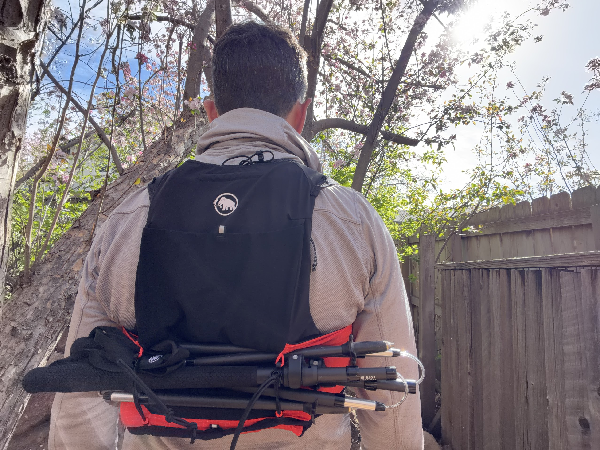

    
I'm 5'6" and 135 lbs and tested a medium. I sized up one step from where I might otherwise land because I don't want constriction across my chest on effort. In medium, the fit is snug and athletic without pressure. On steep uphills where you're leaning hard into the pitch, the harness doesn't shift up or gap at the shoulder. I ran it over a base layer in the 40s and skin-direct in the 70s. The fit didn't change between the two configurations.

    
Bounce on the descent is the more important test. I ran down multiple times with a full practical load: two 500ml soft flasks, a packable shell, my bear spray in the tunnel pocket, and a phone. Nothing shifted, nothing slapped. For a point of comparison, I'd been running shorter outings in a Kiprun 5L vest. The Mammut's bounce suppression is on par. That's meaningful for a 12L vest where you're carrying weight farther from the body.

    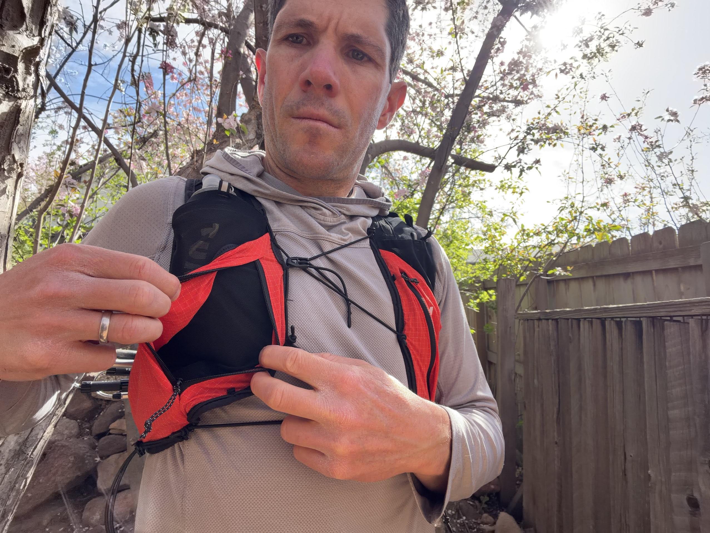

  

  <!-- Ventilation and Storage -->
  <h2>Ventilation and Storage</h2>
  

    
The 3D mesh back panel puts real space between the pack and your skin. This isn't a full channel-frame system — the Aenergy is built for mountain running, not ultralight backpacking — but the separation is enough to register. Running in direct sun on a warmer morning, the airflow is noticeable. At the end of a 90-minute loop, my shirt was evenly damp across the back rather than the concentrated pressure stripe you get from a flat foam panel. On the summit ridge when the wind picks up, the mesh dries quickly.

    

      "The back tunnel pocket is the standout feature. Pull a wind layer out while moving without stopping, without removing the vest."
    

    
The front chest pockets sit at the right height for access at pace. Flask retention uses bungee cord on each pocket and holds 500ml flasks securely without being a production to open. I've run in vests that require two hands and a pause to retrieve a flask. This one doesn't.

    
    
The back tunnel pocket is the standout storage feature. It accommodates a packable wind layer cleanly, and access is from the side — you reach across and pull the layer out while moving, no stopping, no removing the vest. I stow my bear spray there instead and it doesn't bounce perceptibly.

    
The zippered main compartment handles phone, keys, and the essentials for a 60 to 90-minute effort. Extend the outing past two hours or add layers and you'll run short on room. The 12L rating is accurate. The vest doesn't overpromise its capacity. It's built for short to moderate mountain outings and it suits that use case precisely.

    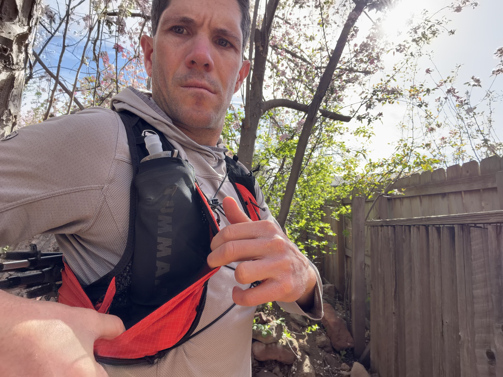

  

  <!-- Durability -->
  <h2>Durability</h2>
  <h3>Scrambling Sections and Bear Canyon</h3>

  

    
Several outings on variable terrain including scrambling sections where I grabbed the vest to move across exposed rock. The ripstop shows no snagging or delamination. Stitching at the shoulder anchor points is clean. Zipper pulls haven't snagged once. The vest looks essentially the same as it did out of the box. The ripstop fabric holds up without drama on the kind of terrain where a thinner mesh would already show wear.

    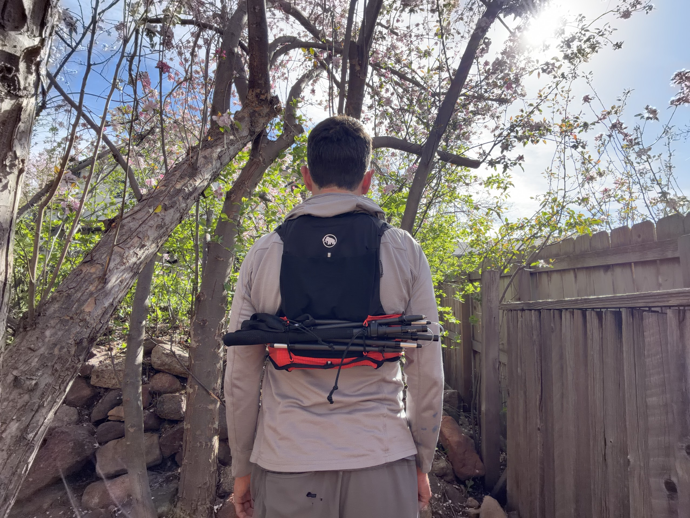

  

  

    

      <h5>Works Well</h5>
      <ul>
        <li>Bounce suppression holds under a full practical load</li>
        <li>3D mesh back reduces sweat buildup noticeably</li>
        <li>Tunnel pocket: side-access while moving</li>
        <li>Flask access is clean and one-handed</li>
        <li>RECCO reflector included</li>
        <li>Dedicated pole attachment bungee</li>
        <li>Ripstop holds up through scrambling terrain</li>
      </ul>
    

    

      <h5>Limitations</h5>
      <ul>
        <li>12L caps useful range around 90 minutes</li>
        <li>Chest strap buckle is hard to secure with cold hands</li>
      </ul>
    

  

  

    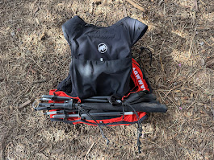
  

  

    
Vest Verdict

    
A well-built short-to-moderate mountain running vest. The tunnel pocket and bounce suppression are the two things that distinguish it from comparable options. The 3D mesh back delivers real ventilation benefit. At $149 it's priced fairly for the construction quality.

    
Recommended for runners covering 60–90 minute mountain efforts who carry bear spray, a spare layer, and flasks without needing a full day-pack setup.

  

  

    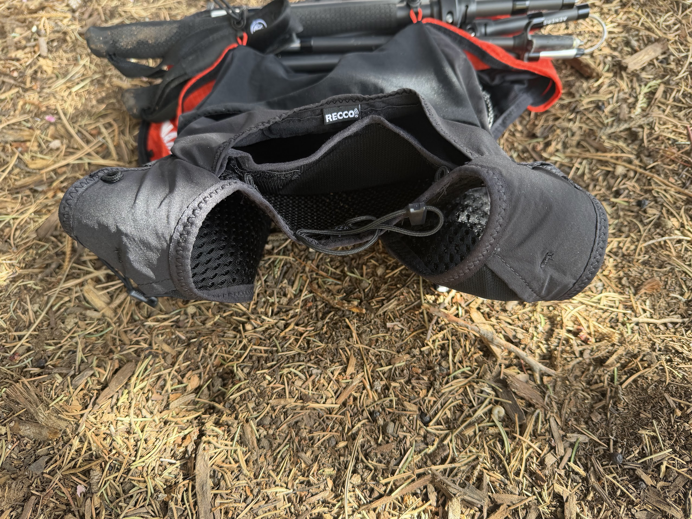
  

  

  <!-- ═══════════════════════════════════════════════
       PRODUCT 2: POLES
  ════════════════════════════════════════════════ -->

  

    Aenergy Ultra Carbon Poles
    Sold as pair
  

  

    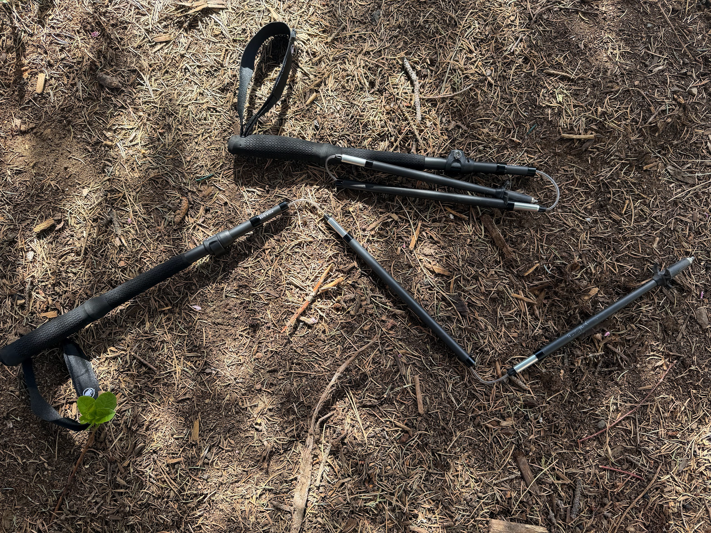
  

  

    <h4>Specifications</h4>
    

      
Material100% Carbon fiber

      
Size Range7 settings

      
Weight (1 pole)164g / 5.8 oz

      
Construction3-piece folding, push-button

      
GripEVA foam

      
TipsCarbide + rubber (both included)

    

  

  

    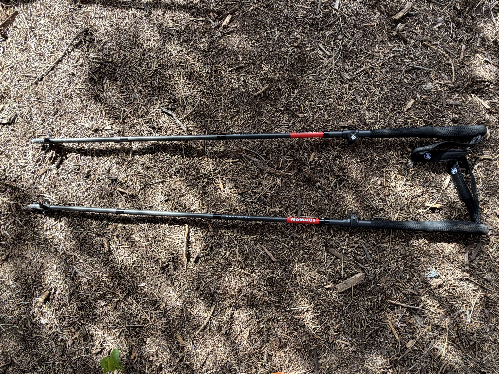
  

  <!-- Weight and Stiffness -->
  <h2>Weight and Stiffness</h2>
  <h3>The West Ridge Descent</h3>

  

    
These are noticeably light the first time you pick them up. The instinctive response is to question whether they'll hold under hard use. They do. The full-carbon shaft doesn't flex or deflect under aggressive weight bearing. I drove hard into them on steep descents, braked with them on scree, pushed off them on long switchback climbing sections. No structural movement at any point.

    
For comparison, I've been running with Black Diamond Distance Carbon Z poles for the past several months. The Mammuts are stiffer under hard lateral loading and feel more planted when pushing off rocky ground on the descent. The Black Diamonds are a bit lighter. On scree where you're driving the tip into an unstable surface and loading the pole laterally while your foot searches for purchase, that stiffness difference is the one you want.

    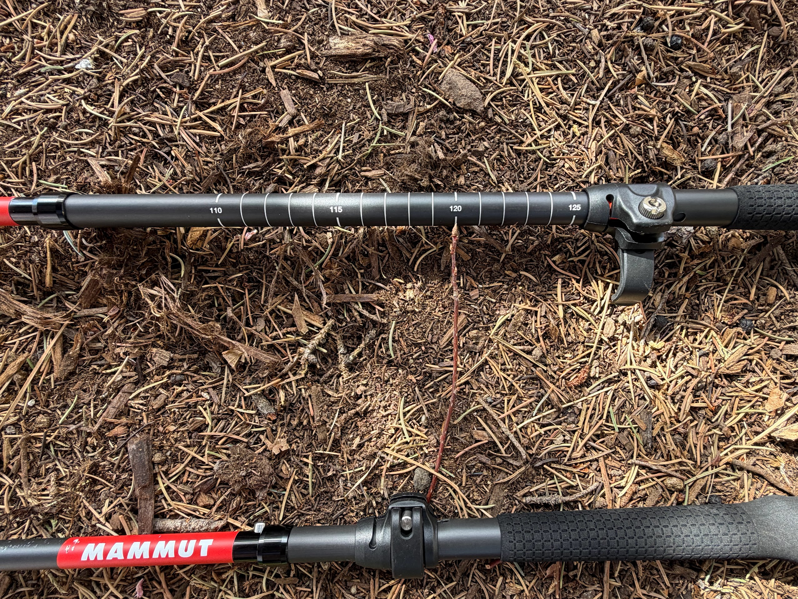

  

  <!-- Fold and Deploy -->
  <h2>Fold and Deploy</h2>
  <h3>Runnable Sections and Summit Scrambles</h3>

  

    
Three sections, push-button release. I've used twist-lock and lever-lock poles for years. The push-button fold on the Mammuts is faster than either. On runnable flats where I want poles stowed, fold-down takes under ten seconds with gloves on. The push button does require a firm press — it won't fire accidentally — but it's not a two-hand operation.

    
Lock-up on deployment is equally fast. The lock clicks home with a clear positive stop. There's no ambiguity about whether the pole is actually extended and set. At the summit scramble block where I collapsed the poles and stowed them on the vest before the technical section, and then redeployed them on the scree descent, I logged that transition at under ten seconds each way across multiple outings.

    

      "Under ten seconds each way, consistently — with gloves on, on a cold summit."
    

    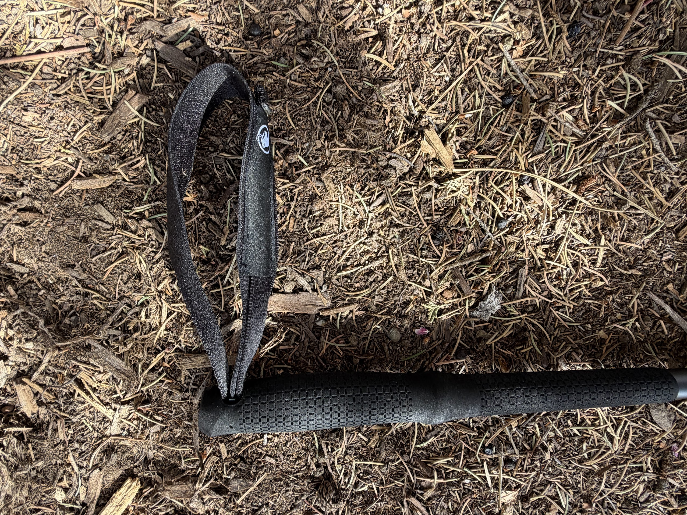

  

  <!-- Adjustability and Grip -->
  <h2>Adjustability and Grip</h2>
  <h3>Switchbacks and Scree</h3>

  

    
Seven length settings cover the full range mountain running requires. I shortened them from my flat-terrain setting on switchback climbs, collapsed and stowed them at the summit scramble block, and extended to maximum on the scree descent off the west ridge for braking leverage. I run at 5'6" and used these primarily at 110–115cm on climbs and 120–125cm on descents. The range from shortest to longest is wide enough that the same pair works across different runner heights without compromise.

    
The EVA foam grip stays comfortable over long efforts and doesn't get slippery when your hands are working and sweating on steep climbing sections. The grip shape works in both the standard hold and the shortened low-grip position on steep pitches where you choke down. The wrist strap is minimal — functional but without the velcro and adjustment buckle you'd find on a more traditional trekking pole. That suits a running grip pattern well. Runners who rely heavily on strap braking on descents may want more.

    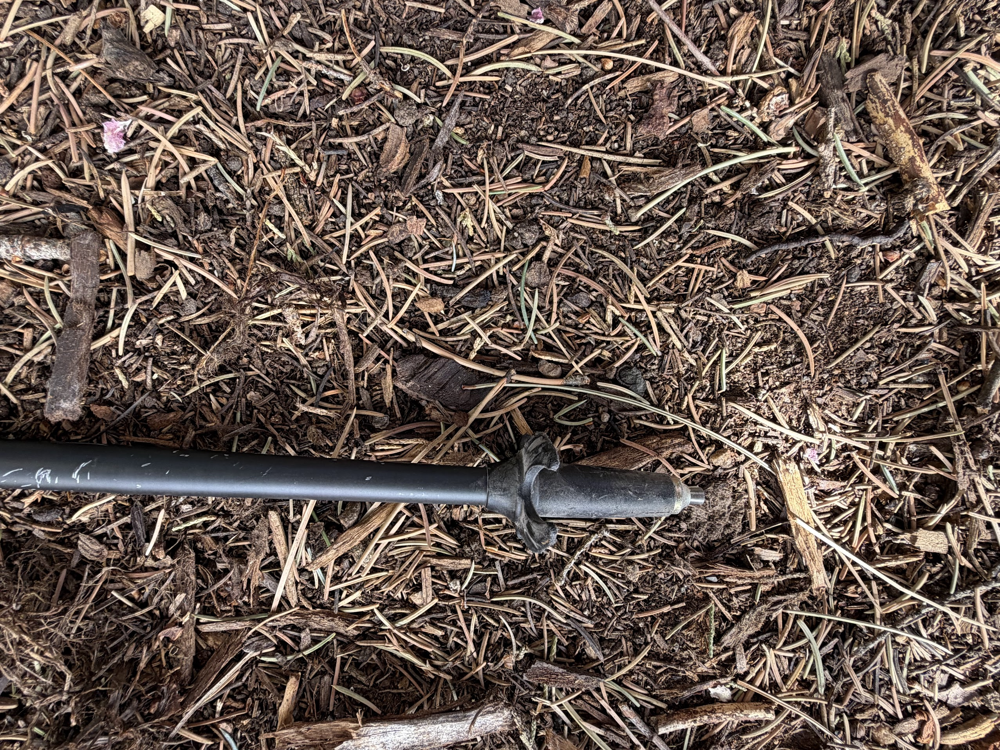

  

  

    <strong>Pole use by terrain · Bear Peak and West Ridge</strong>
    <dl>
      <dt>Switchback climbs (Fern Canyon)</dt>
      <dd>Shortened setting, push-off on uphills. Stiff, no lateral deflection.</dd>
      <dt>Runnable single track</dt>
      <dd>Folded and stowed. Under ten seconds with gloves on.</dd>
      <dt>Summit scramble block</dt>
      <dd>Collapsed and attached to vest. Redeployed on far side.</dd>
      <dt>Scree descent (West Ridge)</dt>
      <dd>Extended to max. Carbide tips grip on loose rock. Lateral load absorbed without flex.</dd>
      <dt>Hard-pack and trail surface</dt>
      <dd>Rubber tips on for road and softer approach sections. Five-second swap.</dd>
    </dl>
  

  

    
The included carbide tips provide reliable grip on rock, root, and hardpack. Rubber tip swap is a five-second pull-on process. Both tip types are included. The baskets are fixed and cannot be interchanged — a fair trade for the system's overall simplicity and reliability. Carbon construction requires more careful handling in transport than aluminum; they're not poles you throw loose in a gear bin.

  

  

    

      <h5>Works Well</h5>
      <ul>
        <li>Stiff under hard lateral load on scree and rock</li>
        <li>Push-button fold is fast and reliable with gloves</li>
        <li>7 settings cover the full terrain and height range</li>
        <li>Carbide tips grip rock and root cleanly</li>
        <li>EVA grip stays secure when hands are sweating</li>
        <li>Both tip types included in the package</li>
      </ul>
    

    

      <h5>Limitations</h5>
      <ul>
        <li>Grip zone could be 2cm longer for extended low-grip use</li>
        <li>Wrist strap is minimal; not enough for runners who rely on it</li>
        <li>Carbon requires more careful transport than aluminum</li>
      </ul>
    

  

  

    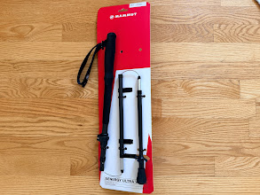
  

  

    
Poles Verdict

    
The Aenergy Ultra Carbon poles are the lightest I've run with that hold up under hard use without question. The push-button fold system is faster than twist-lock or lever-lock in real conditions with gloves on. The stiffness under lateral load on descents — the use case that matters most to me — is a meaningful improvement over the Black Diamond Distance Carbon Z.

    
Recommended for mountain runners who want a pole that deploys and stows fast, carries minimal weight, and doesn't compromise on structural integrity when the terrain demands hard weight-bearing use.

  

  

  

    <h5>About the Tester</h5>
    
John Tribbia is a trail runner based in Boulder, Colorado. He runs Bear Peak regularly from the Cragmoor trailhead and tests gear across the Front Range in conditions from summer heat to early-season snow.

  

  
Products provided by Mammut for review purposes. All testing conducted independently.

