<!--more-->

*Article by John Tribbia, RTR Contributors*

Original Post from RoadTrailRun
([link](https://www.roadtrailrun.com/2025/06/mizuno-wave-rider-29-review-true-to-its.html))

<a href="https://www.roadtrailrun.com"
class="button primary button-wrapper">Read All RoadTrailRun
Reviews Here</a>

### Mizuno Wave Rider 29 ($150)

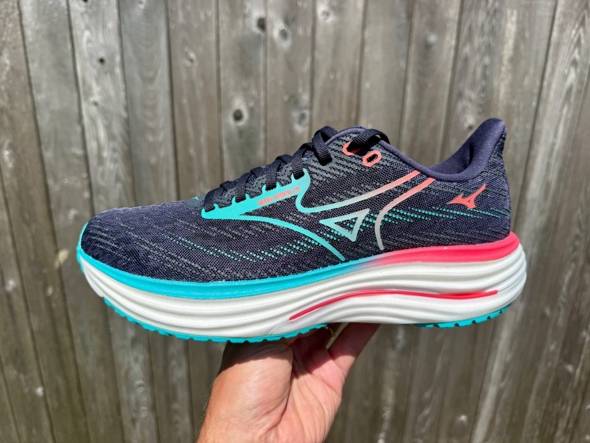

### Introduction

The Wave Rider is a classic daily trainer. By this I mean a shoe at a moderate stack height and a high drop with some neutral focused stability and with durability a priority all at a weight below 10 oz / 284g. In recent years the “classic” formula has stretched as supercritical foams and lighter uppers allow great stack height at the same or lower weights.
For its 29th edition, the Wave Rider fully joins the “modern world” without losing its essence as a stable neutral trainer suitable for all types of runs. It goes from a 12mm drop to 10mm.. progress..Its midsole goes all supercritical nitrogen infused EVA retaining the Wave Plate but now higher up  in the rear of the  shoe. The upper is a highly supportive yet light and breathable Jacquard Air Mesh.
More modern bonuses: 3mm more forefoot stack height and 1mm more heel stack height to a for 2025 moderate 38.5 mm heel /  28.5 mm forefoot stack height. Final bonus it loses about 13g to come in at a highly competitive for its class weight of about   9.2 oz / 261g US9. Let’s see how this  fully renewed classic performs!

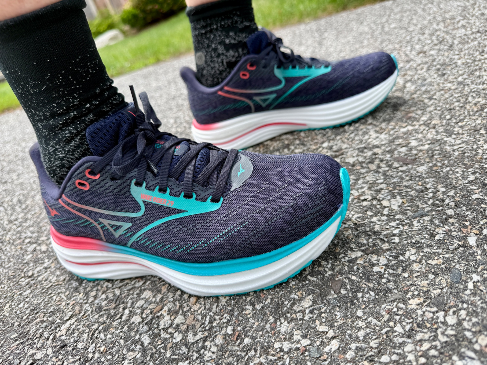

### Pros:

* Very energetic and modern supercritical midsole foam ride: Sam/John/Dominique/Michael/Jen
* Simple, effective, comfortable and breathable Jacquard “Air” Mesh upper: Sam/John/Dominique/Michael/Jen
* Stable: higher Wave Plate location increases stability focus even with now softer foam and without the usual sensation of a firmer medial side of the shoe: * Sam/Dominique/Jen
Lightweight feel: John/Michael/Dominique/Jen

### Cons:

* If you don’t need mild pronation control the new higher plate location may be over present in feel directly under foot, is for me: Sam
* Front of shoe could use more flex: Sam/Michael
* Not sure about long term durability: John

### Most comparable shoes

* Diadora Nucleo 2
* Puma ForeverRun
* adidas Supernova Prima

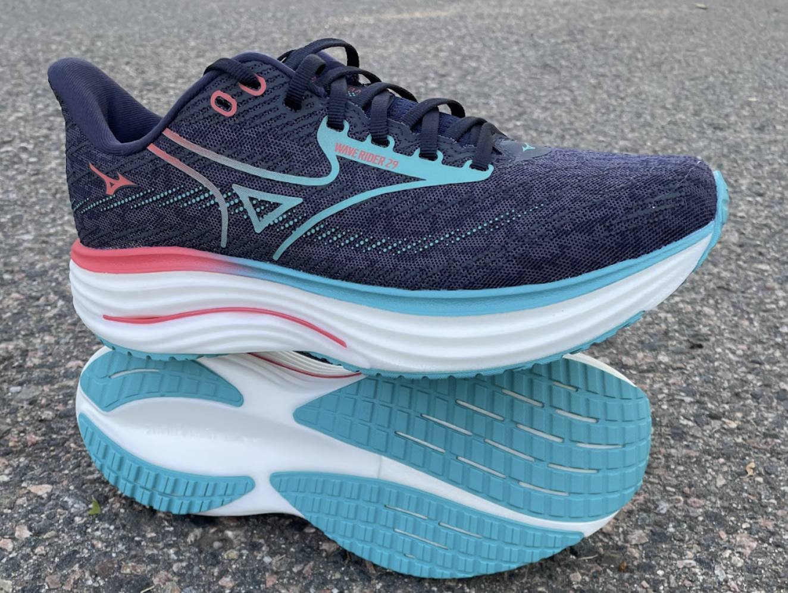

### Stats

Approx. Weight: men's  9.2 oz / 261g US9 (Prior Version Spec Weight: 9.7 oz / 274g US9)
Sample Weights:
men’s  8.96 oz / 254g US8.5
women’’s oz / g US9
Stack Height:
Wave Rider 29: 38.5 mm heel /  28.5 mm forefoot, 10 mm drop
Wave Rider 28: 37.5mm heel / 25.5 mm forefoot, 12mm drop
Platform Width:
85 mm heel /  65 mm midfoot  / 105 mm forefoot

### First Impressions, Fit and Upper

### 

The upper is a new Jacquard Air Mesh and it is a beaut! Smooth fitting, very breathable for such a dense mesh (tested on a feel- like 91 F / 32 C day), true to size and very smooth fitting.

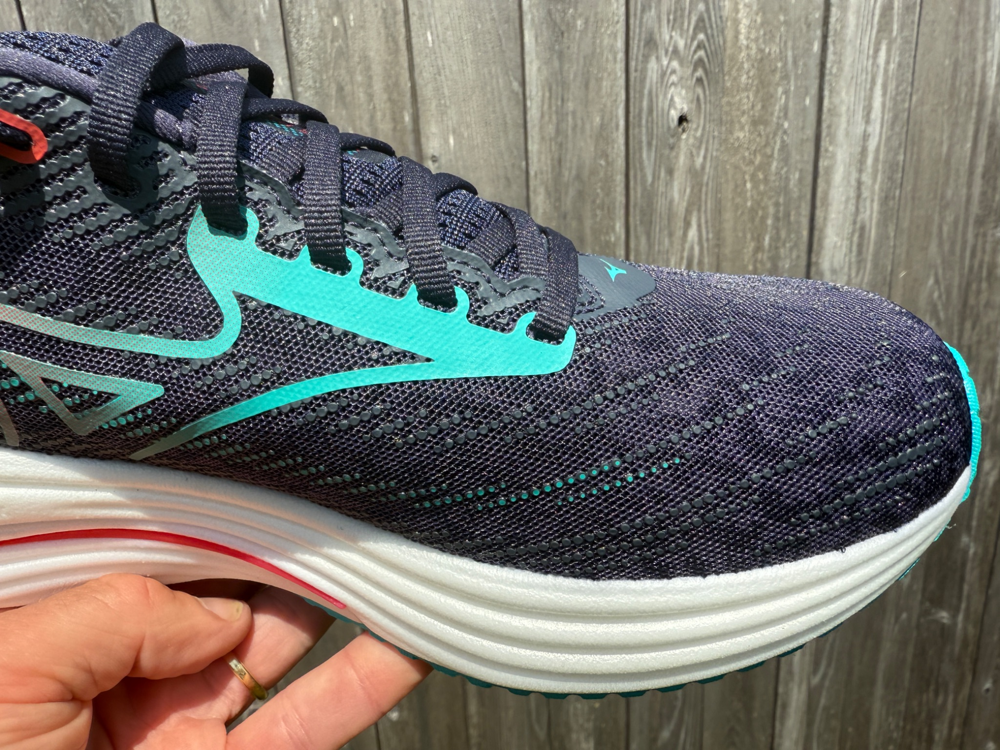

While the mesh is dense in appearance it is surprisingly breathable and for sure supportive without overdoing it. Beyond the midfoot overlays, the upper is unstructured and fits like a smooth and very secure glove.
To help lockdown the foot we do have a very stout rigid heel counter and a gusset tongue for the moderately padded tongue. Lace up was secure, stayed put with no adjustments even in heat which tends to stretch uppers.

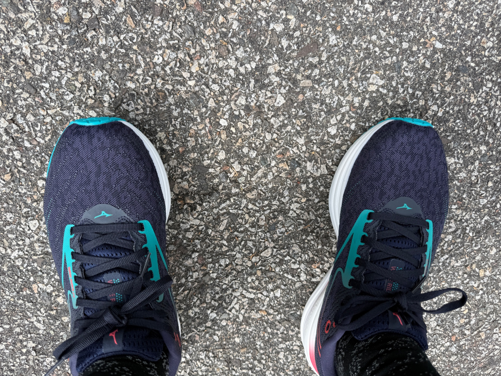

The fit is true to size length and volume for my narrow to medium feet. 2E men’s wide and 2D women’s wide are also available.

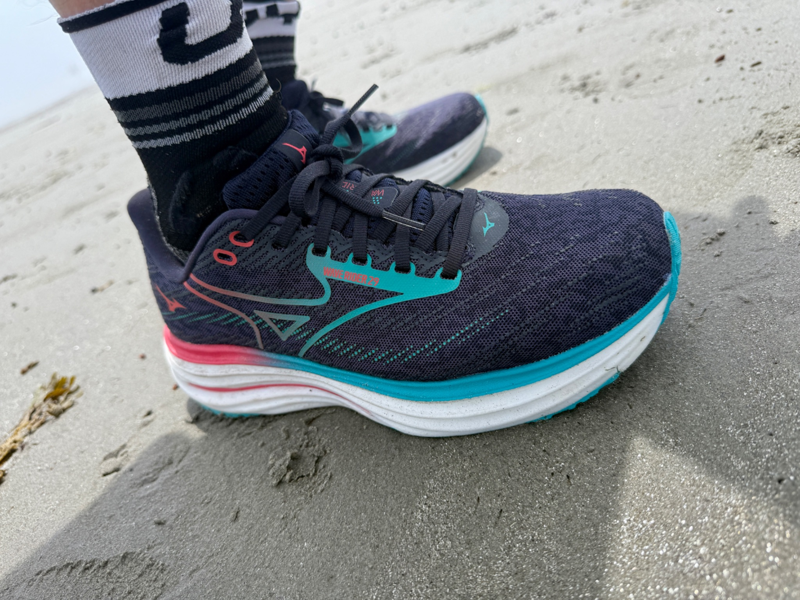

Simple and effective, the WR29 upper is one of the best trainer uppers of 2025 for me.

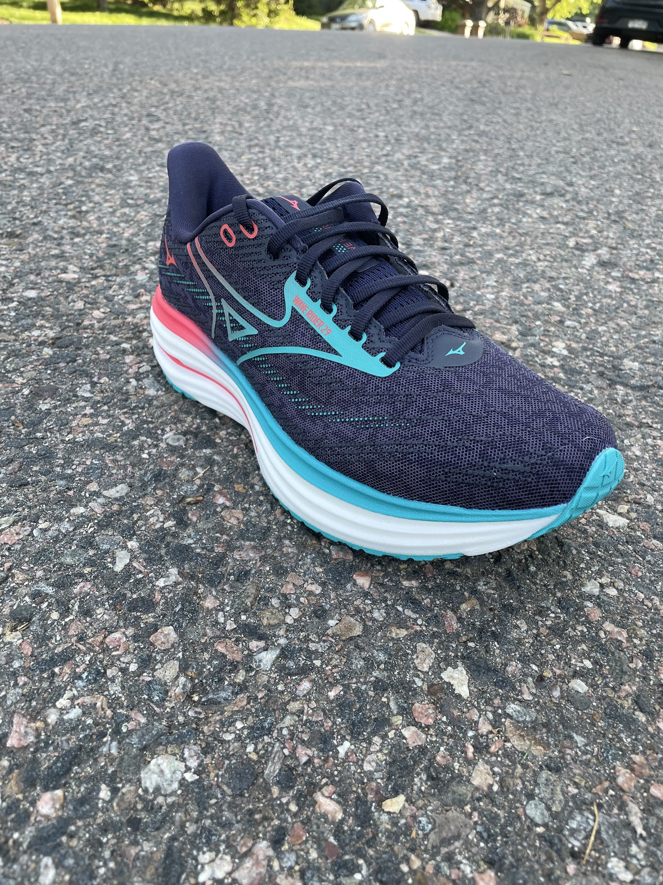

John: My first impression of the Wave Rider 29 is that it looks sleek and modern. The Jacquard Air Mesh upper is not only visually appealing but also incredibly comfortable. As Sam mentioned, it’s surprisingly breathable for such a dense-looking mesh. I took them out on a warm day, and my feet stayed cool and dry.
The fit is true to size, providing a snug and secure feel without any pressure points. The gusseted tongue and sturdy heel counter work together to lock the foot in place, which I appreciate, especially on longer runs. The seamless PU overlays add structure without unnecessary bulk. It’s a simple yet effective upper that gets the job done.

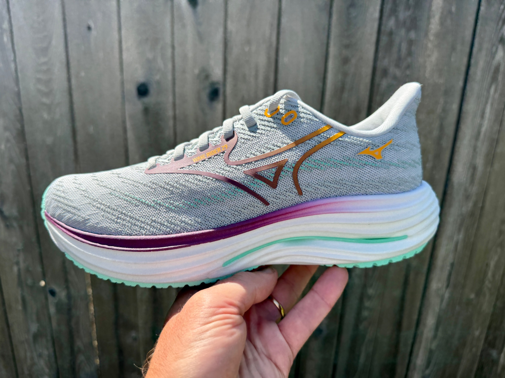

Dominique:  This is only my second pair of Wave Riders and I am glad for the opportunity to test this 29th edition given its noteworthy updates.  It took me a couple of runs to get in the groove given the high drop of the shoe - 10 mm - though not as sky-high as its predecessor at 12mm, along with the plate which adds stability to the shoe and which was noticeable at first. As others have noted some break in runs are required to get some flex..

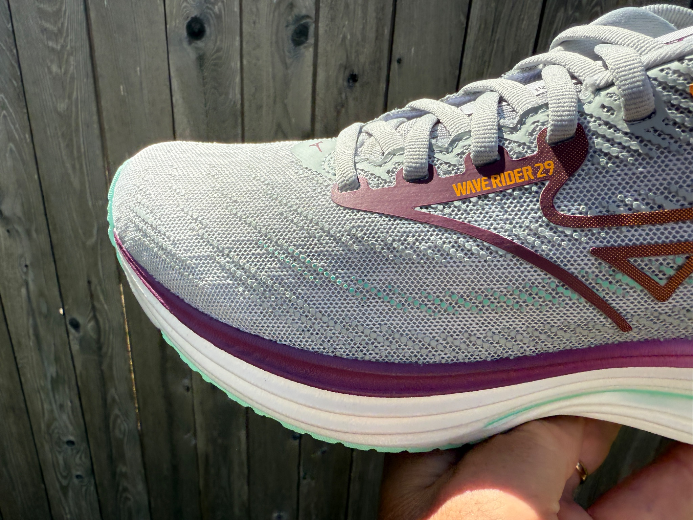

A beautiful Jacquard Air Mesh upper that fits like a glove, and though the toebox is not roomy, the fit is extremely comfortable and secure.  I concur with both Sam and John that the dense mesh upper is quite breathable after several runs in the heat.

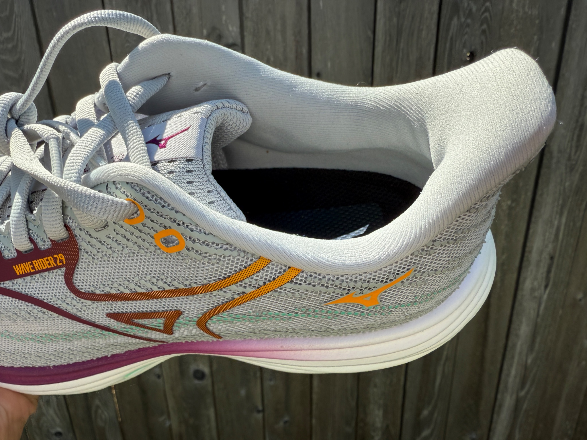

The upper delivers a superior hold with no adjustment needed after lacing them up along with a very satisfying feel on foot.

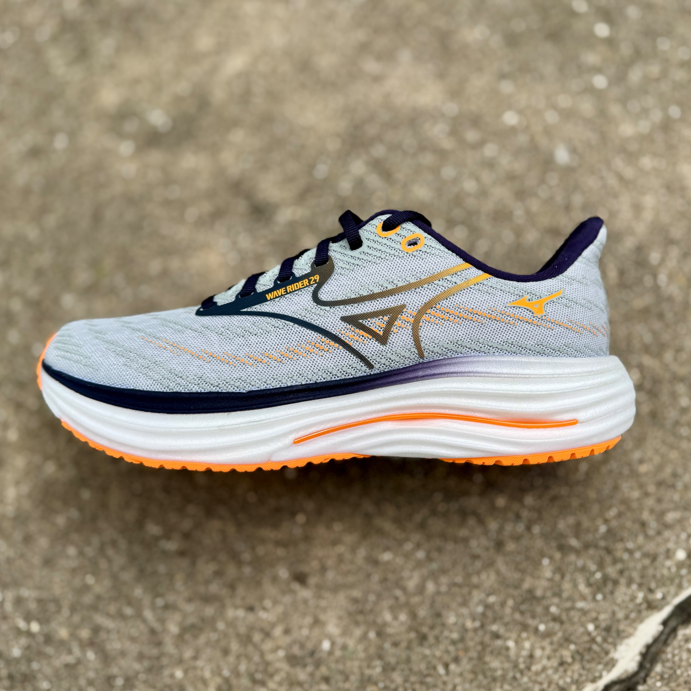

Michael: The Wave Rider has been sitting in a kind of holding pattern for a while now - competent, dependable, but rarely exciting. With version 29, I think that changes. Mizuno has finally modernized this shoe in a way that feels meaningful and not just incremental. This is an excellent, excellent update.
Let’s start with the upper. It’s lovely. It fits well and breathes better than you’d expect from something that looks this dense - no slippage, no hotspots, and it holds its shape perfectly even in hot weather (which, believe me, we’ve had the chance to test!). Honestly, this is one of the best “traditional” uppers I’ve tried in a daily trainer this year, and is where the shoe won me over right away. It’s not flashy, but it’s flawlessly executed.
The heel counter is rigid and supportive (a bit too stiff for me on the Haugland’s side, but  with no issue on the other), the tongue stays in place, and the laces hold without fiddling. I didn’t have to think about the upper during the run - and that’s exactly what I want. Fit is true to size for me, and I imagine runners across a range of foot shapes will be happy here.
Jen: This was my first experience with a Mizuno shoe, and I see right away why the Wave Rider is such a popular model. The upper is streamlined and relatively lightweight, without any rigid elements. As other testers have noted, the breathability is a plus this time of year, but the mesh is still tightly woven enough to prevent grit from getting in. I found it true to size for my relatively low-volume foot, but with ample room for toes to spread out in the forefoot.
The very rigid heel counter was a question mark for me at first, as I wondered whether it would cause heel rubbing or pressure on the Achilles. Perhaps because of the generous padding around the back and sides of the heel collar, it was a non-issue. The material of the liner is soft and comfortable without adding weight. All in all, a very comfortable fit out of the box for a daily trainer.

### Midsole & Platform

### 

Sam: The platform moves to a 10mm drop (from 12mm) with a 38.5 mm heel /  28.5 mm forefoot stack height. This means 3mm more cushion at the forefoot and 1mm more at the heel.
The weight is very reasonable at about 9.2 oz / 261g in a US men’s 9
The platform width of 85 mm heel /  65 mm midfoot  / 105 mm forefoot  gives a stable heel landing,  with a narrower midfoot (well supported by the Wave Plate) and a not excessively wide front platform width for some agility
The Enerzy NXT foam is soft and very energetic reminiscent of the Neo Zen’s NXT but here the compound is nitrogen infused EVA whereas the Zen has a nitrogen infused TPU. As with many brands, the foam, while named the same, can actually be different foams in different models/versions and change over time:  Nitro, ZoomX, FuelCell being examples.
They represent an “experience”. Here the experience is soft, and both springy and bouncy. It is more  similar to Puma’s latest Nitro foams than the denser PEBA blends found in Nike ZoomX, New Balance FuelCel and adidas Dreamstrike+.

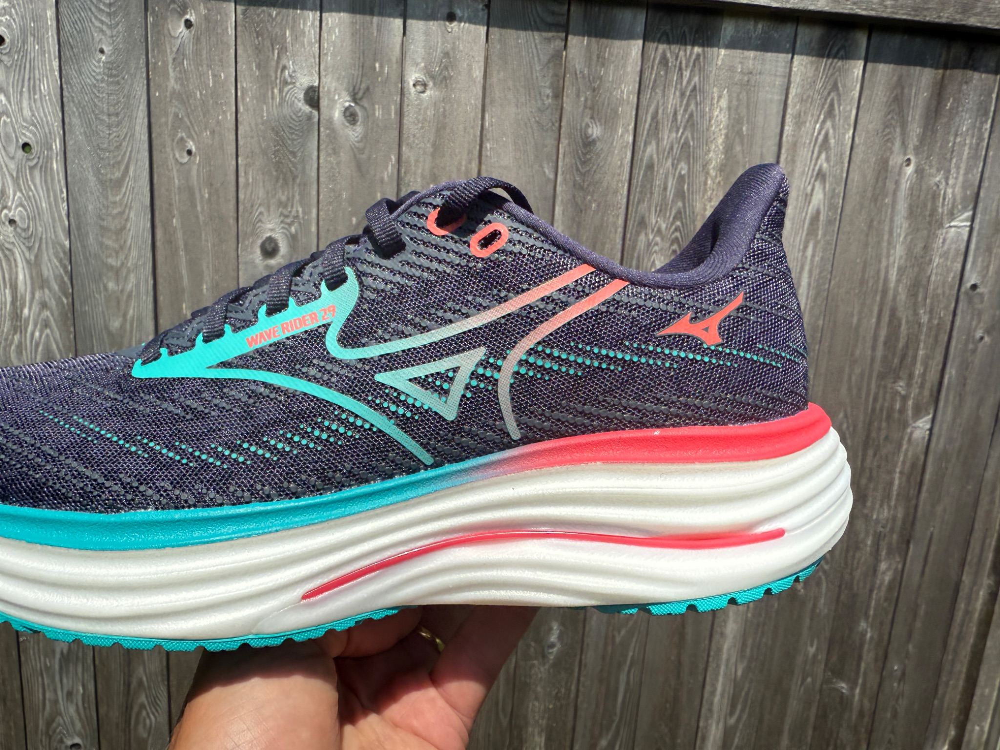

Mizuno moved the plate up in the stack for the 29 compared to the 28 and this clearly stabilizes the rear and midfoot of the shoe. This makes the Wave Rider a near light stability/pronation control shoe for me and this even with the softer and more energetic Enerzy NXT foam now found throughout the entire midsole. The 28 which I didn’t personally test had a layer of light EVA below its lower mounted Wave Plate with NXT foam above.
Mizuno talks about smooth transitions. Well if you need a touch of stability in the mix I would agree but I found the plate somewhat over present in feel under the rear of the  foot especially in the first 10 miles in the shoe. This is not a traditional support approach with firmer medial support or a new age broad platform (especially wide midfoot platforms)  of inherent support such as in ASICS Kayano and recent Saucony Guide. Essentially the plate is a thin layer of support that keeps the foot aligned in the direction of travel.
I find it a bit overdone, especially at the transition point to toe off area at midfoot with the extensive rubber just ahead of the plate making it quite rigid if stable towards  the front of the shoe This sensation was especially present in the first few runs but now has subsided with the shoe more flexible and easter to roll past midfoot.

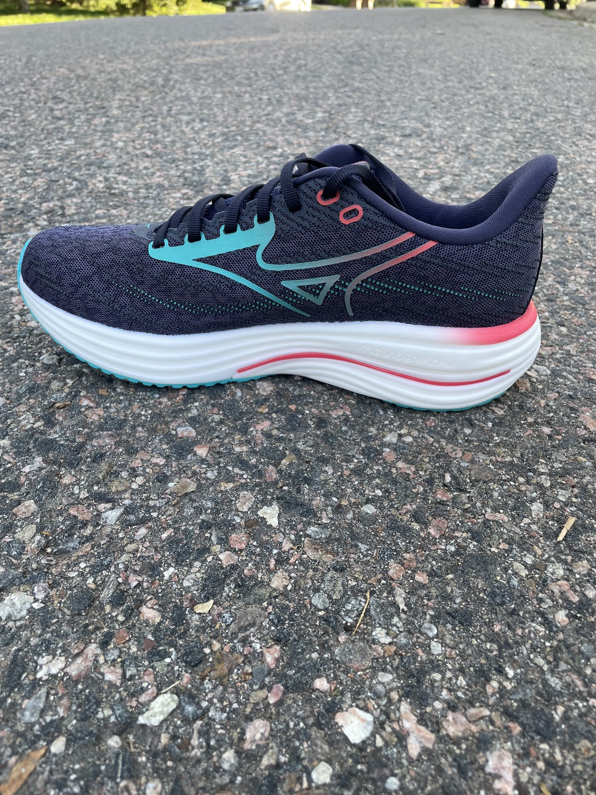

John: The midsole is where the Wave Rider 29 truly shines. The full-length Enerzy NXT foam provides a soft and responsive ride that feels both energetic and protective. As someone without much prior experience with the Wave Rider line, I was impressed by the balance of cushioning and responsiveness.
The shift to a 10mm drop is a welcome change that I think will appeal to a wider range of runners. The Wave Plate is noticeable but not intrusive, offering a touch of stability that guides the foot through a smooth transition.
Sam found the plate a bit over-present, but for me, it provided a reassuring sense of stability, especially when my form started to break down towards the end of a run. The midsole offers a great mix of softness and bounce, making it a versatile option for various types of runs.

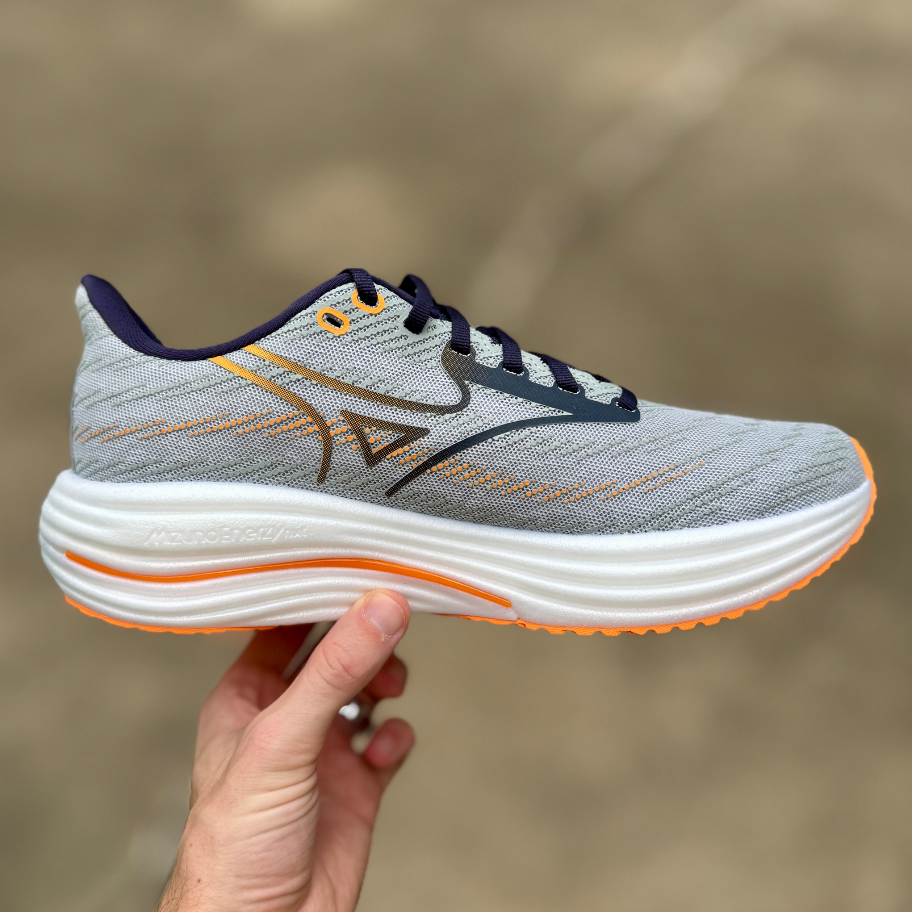

Michael: To cut to the chase, the midsole on the Wave Rider 29 is terrific. Enerzy NXT runs soft but lively - a real leap forward from past versions I’ve tried, and I think safe to say, “fully modern” (which we’ve seen from the existing Neo Zen and Neo Vista, but was sorely lacking on the more “traditional” Mizuno offerings!). This is the first Wave Rider in a long time where the platform actually feels exciting underfoot. There’s bounce, there’s give, but it never feels mushy.
The 10mm drop (down from 12mm) makes the ride feel more balanced, and the 38.5/28.5 mm stack gives plenty of cushion without losing connection to the ground. I wouldn’t complain about a 12mm drop, but 10 is plenty, and works well for this type of shoe. The Wave Plate is still here, but now it’s embedded higher in the heel. For me, that stabilizing element is well-tuned - present but not intrusive. If you’re sensitive to plates, you might notice it early on, but it settles in quickly. It’s rigid, to be sure (this is a Wave Rider, after all!) but I didn’t find it obtrusive. Of course, if you’re looking for “plated trainer” vibes, as it were, this isn’t exactly that given its rear of the shoe focus - but it is a solid, stable, well-done ride.
The Enerzy NXT material isn’t a soft-and-sinky foam like ZoomX, but it’s way more fun than traditional EVA. In my opinion, the best comparison is probably Puma’s latest Nitro foams - energetic, springy, and durable. As should be clear, this is the best riding Wave Rider I’ve tested in years (and probably ever!).

### 

Dominique: Commenting in Michael’s footsteps, I am equally enthusiastic about the upgrades in the midsole though my prior experience with the Waive Rider is limited to the 26th edition and I tend to prefer the middle of the road drops in the 5-8 mm range..
The midsole, with its new blend of Mizuno Enerzy NXT (Nitrogen Infused EVA), and higher stack height, especially in the forefoot (29mm/39mm), feels great underfoot delivering a smooth and energetic ride.

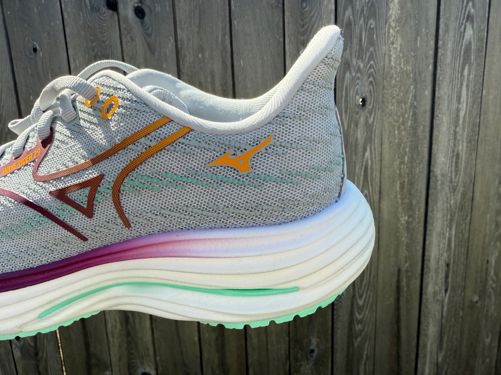

I quickly adjusted to the feel of the plate and value it as a stability enhancing component of the midsole.
Jen: Being new to the Wave Rider and knowing only that it was a trainer with a plate, I was pleasantly surprised by how subtle it feels underfoot. As a neutral midfoot/forefoot striker, I barely notice the rear part of the plate that other testers may have found bothersome. The experience underfoot is a gentle roll through to the toe-off thanks to the substantial 12 mm drop and forefoot part of the plate. It didn’t feel like a “stability shoe” to me, but rather a true neutral ride.
Like John, I found the midsole to be a great balance between cushion and responsiveness. The Enerzy NXT is light and dynamic for a daily trainer and soft enough for long road miles. While the non-carbon-fiber Wave Plate isn’t firm enough to put the Wave Rider 29 in the super trainer category, it’s certainly more fun than I expected. (The plate is made of Pebax Rnew, a bio-based thermoplastic.)

### Outsole

### 

The outsole has an almost full coverage with a lugged pattern. I especially note the very extensive forefoot coverage which helps stabilize the forefoot in front of where the plate ends while also providing response or pop. All good but I think the front rubber could be more segmented in the area near the  midfoot where it overlaps the plate above as the first part of transition to toe off in that area is stiffer than I like

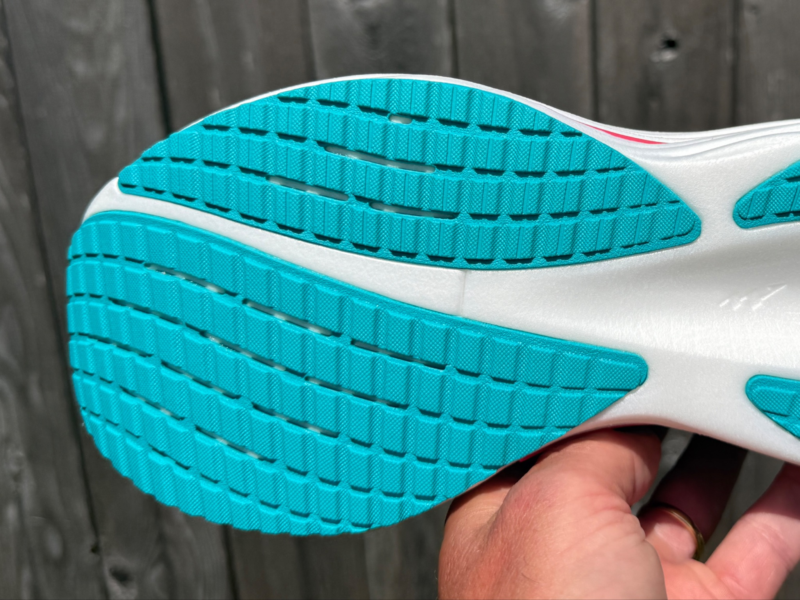

John: The outsole of the Wave Rider 29 is built to last. The extensive coverage of durable X10 rubber gives me confidence that this shoe will hold up for many miles. The single vertical flex groove in the forefoot provides a snappy toe-off without making the shoe feel overly stiff. I found the traction to be decent on both wet and dry pavement. As someone who appreciates a shoe that can handle various conditions, the outsole of the Wave Rider 29 is well designed.
Michael: No surprises here: Mizuno’s X10 rubber is tough and well-positioned, and really looks like it’ll take a beating. The outsole coverage is generous, especially in the forefoot, which helps with stability and a little extra pop at toe-off. That said, I agree with Sam that the front rubber could benefit from more segmentation. There’s a touch of stiffness through the midfoot during transitions, especially early in the break-in period.
Traction has been solid on a mix of surfaces, including light rain. This should wear well over the long haul - it’s built for mileage, after all. No issues.

### 

### Dominique: Designed for durability, the thread pattern of the outsole provides good traction.

Jen: As the other testers note, the majority of the outsole is covered with waffled X10 rubber for significant traction. I took it on gravel roads and light trail as well as wet and dry pavement and was satisfied in all conditions. I especially appreciate that the center groove is large enough to avoid capturing gravel when going off-road. No signs of wear on the outsole after 40+ miles in my pair, and I would guess that the outsole is the most durable component of the shoe.

### Ride, Conclusions and Recommendations

### 

The Wave Rider 29 is a fully modernized classic daily trainer. Light stability from its Wave Plate, an energetic supercritical foam midsole, a simple and effective upper, and light weight for its very decent stack height.
My only issue with the shoe is the somewhat over present Wave Plate outsole combination at midfoot which makes transitions a bit more labored and over stabilized there and less fluid than I would like. I wore the shoes for standard daily runs at near 9:00 minute miles as well as somewhat slower recovery runs where the plate and outsole combination did not have me worried about my form as the shoe kept me nicely aligned.
The “support/stability” element delivered mostly by the plate is linear in feel. No firm medial side pressures of support or overbroad midfoot platform, but for sure is still present.
As such, and given its stats and materials, I see it as an excellent all around daily trainer for moderate pace runners, a top choice for beginners unsure how much support they really actually need (often less than “prescribed). It is a solid value at $150 with expected good durability.

### Sam’s Score: 9.08 / 10

Ride (50%): 8.8 Fit (30%): 9.5  Value (15%): 9 Style (5%): 9
😊😊😊
John: Overall, the Mizuno Wave Rider 29 is an excellent daily trainer that offers a comfortable, responsive, and stable ride. I agree with Sam that it’s a fully modernized classic that will appeal to a wide range of runners, from beginners to seasoned veterans.
The Enerzy NXT midsole provides a lively and energetic feel, while the Wave Plate offers a touch of stability that keeps the foot aligned. The Wave Rider 29 is a reliable workhorse that you can count on for your daily miles. I would recommend this shoe to anyone looking for a versatile and durable daily trainer that can handle a variety of paces and distances. It’s a great option for neutral runners or those who need a touch of mild stability. At $150, it offers excellent value for the quality and performance you get.

### John’s Score: 8.9 / 10

Ride (50%): 8.5 Fit (30%): 9.5  Value (15%): 9 Style (5%): 9
😊😊😊

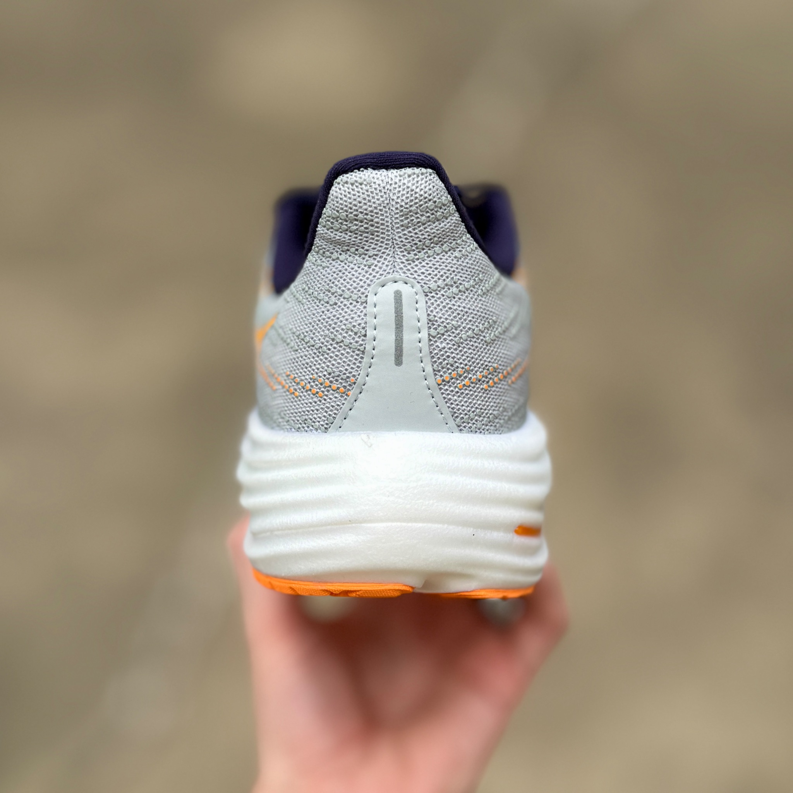

Michael: This is a Wave Rider that finally (finally!) feels like it belongs in the current generation of daily trainers. It’s still stable, still durable, still fits like a glove - but now it’s paired with a truly modern ride that we knew Mizuno could do, but hadn’t yet seen on this model, their bestseller. The Enerzy NXT midsole transforms the shoe from functional to genuinely enjoyable, and the upper is near flawless.
If you’ve bounced off the Wave Rider in recent years because it felt too rigid or dated, it’s worth coming back for the 29. It’s versatile enough for everyday miles, recovery runs, and even uptempo efforts, I think (though again, don’t take “plated” to mean “fast,” here). For runners who want a neutral trainer with just a whisper of guidance and a dialed-in fit, this should be near the top of your list - and boy, I didn’t think I’d be saying that about a Wave Rider!

### Michael’s Score: 9.3 / 10

😊😊😊😊
Dominique:  Unexpectedly, this latest edition of Waiver Rider has delivered for me!  After my one experience with the Waive Rider 26, I moved on to other brands with softer midsoles and more exciting rides.  Admittedly, as a heel striker, the high drop works with my gait and I enjoy the propelling feel that is also helped by the rocker.  In short, a high drop shoe is not necessarily a negative though I like to switch back to middle of the ground drops in between testers.
My experience with “super critical foam” has been limited to only a couple of shoes, yet it is something that rtr contributors expect from new models.  So Mizuno has not disappointed the pros along with the novice in this review by introducing a new blend of Enerzy (NXT) in its midsole, along with a longstanding tradition in their upper design.
A neutral daily trainer that has gotten a lot better through this latest edition and that is still reasonably priced.

### Dominique’s Score: 9.2/10

😊😊😊😊
Road: Ride (50%): Fit (30%):Value (15%):  Style (5%):
Trail: Ride (30%): Fit (30%): Value (10%): Style (5%) Traction (15%):  Rock Protection (10%):
New Smiles Fun  Score!  Out of 5 This score is about how pleasing/fun the experience is on the run, or in the case of race type shoes how effective it is to race.
😊😊😊😊😊(copy paste as many smiles as you need)
Jen: The Wave Rider 29 far exceeded my expectations, and I place it near the top of the list of daily trainers I’ve reviewed this year. With a narrow midfoot opening up to a wider toebox and comfortably locked-down upper, the fit is just right for my relatively low-volume foot, and the plate placement doesn’t interfere with my mid/forefoot strike. The combination of cushion and energy return was just right for daily miles followed by strides, or slightly uptempo runs. I expect to reach for this shoe often during fall marathon training.

### Jen’s Score: 9.5/10

😊😊😊😊.5

