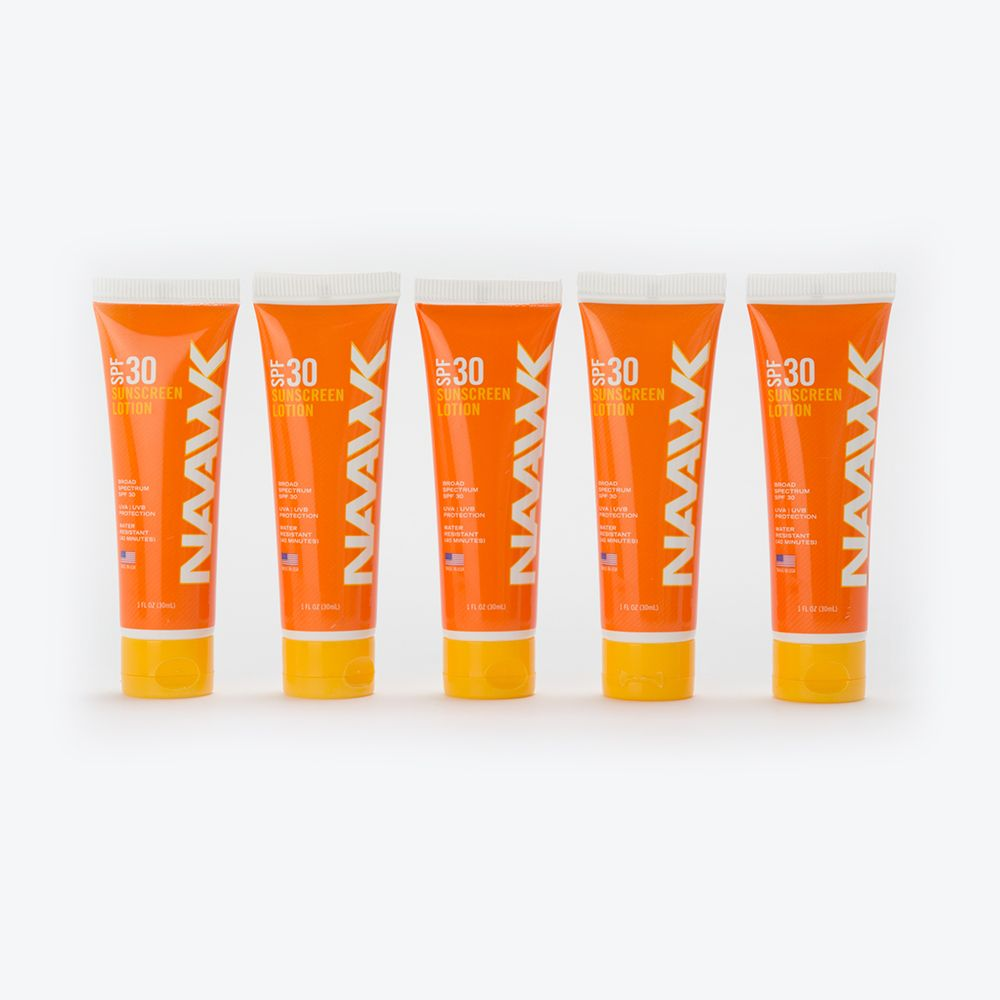

<!--more-->

## 

<a href="https://bouldergearlab.substack.com/subscribe?"
class="button primary">Subscribe now</a>

## **Warm weather has come and gone**

and, with it, most people stow away their swimsuits, shorts, Hawaiian
shirts, barbecues, and sunscreen. But wait…don’t hastily put that
sunscreen away, because you can sunburn and get sun damaged skin all
year round.

It is easy to assume that we are safe from the harmful effects of the
sun if it is cloudy, rainy, snowy, or cold. Most people associate
sunscreen with the clear sunny skies of summer months or spring break
trips to the beach. However, protecting your skin from UV rays is
important even in the winter months, because exposed skin is at risk
even if it is cloudy, rainy, cold, or snowy. It seems counter intuitive
to use sunscreen if you can’t see the sun. Turns out, though, clouds
mostly block sun*light*, not harmful ultraviolet (UV) rays that increase
our risk of getting skin cancer and accelerate the skin aging process.
In fact, clouds only block around 20 percent of UV rays according to the
Environmental Protection Agency (EPA).  Said differently, we are exposed
to 80 percent of UV ray intensity on cloudy days compared to the UV ray
intensity on a clear and sunny day. That’s still a lot, especially at
higher altitudes where the UV intensity is even greater!

You might think: “it’s winter and I tend to spend a lot of my time
indoors so I don’t need to worry about wearing sunscreen, cloudy or
sunny”. Unfortunately, we aren’t completely protected from exposure to
harmful UV rays even indoors or in your car. According to the Skin
Cancer Foundation, 50 percent of harmful UVA rays can pass through
windows and 60 percent can pass through car windows.

Whether it is sunny or cloudy, you are indoors or outdoors, or the
season is summer or winter, make sure to apply an SPF-30 (or more),
broad-spectrum sunscreen to protect your skin from harmful UV rays!

## **Here are some additional helpful tips to help you better protect your skin year round:**

- **No sun? No sunscreen, right?** Unless it is in the dark hours of the
  day, any daylight carries the risk of harmful UV rays.

- **Going skiing, snowshoeing, hiking, or sledding in the snow?**
  Weather conditions like snow on the ground actually increase your
  vulnerability to sun exposure by reflecting incoming UV rays back on
  to you. That means you get almost twice the exposure while out in
  wintertime. Put on some sunscreen before you head out and carry a
  lightweight pouch to reapply on longer outings.

- **When is the best time for outside activities?** If possible, it is
  best to avoid the peak hours when the sun’s UV rays are strongest.
  That means planning your activities before 11am and after 3pm,
  especially during Daylight Savings Time.

- **Are you an athlete?** Taking care of your skin can actually improve
  recovery from hard efforts. If you just finished up a huge day on the
  bike or a really long run, but came away with a massive sun burn, your
  body’s ability to recover from training is compromised if it also has
  to recover from a healing sun burn. More specifically, sunburns can
  dehydrate you, which can cause blood vessels to dilate so your skin
  receives more blood than usual and your recovering muscles receive
  less (see skincancer.org).

- **What kind of sunscreen should I use?** While there are a lot of
  daily foundations, face moisturizers, or body lotions that have SPF in
  them, cosmetic products typically don’t act as UV defenders if you are
  outside for the day. Look for “broad spectrum”, “UVA and UVB
  protection”, and higher than SPF-30.

  Thanks for reading Boulder Gear Lab! Subscribe for free to receive new
  posts and support my work.
