<!--more-->

*Article by John Tribbia*

Original Post from RoadTrailRun
([link](https://www.roadtrailrun.com/2025/12/nordictrack-x16-elliptical-in-depth.html)

<a href="https://www.roadtrailrun.com/"
class="button primary button-wrapper">Read All RoadTrailRun
Reviews Here</a>

NordicTrack x16 Elliptical Review
Article by John Tribbia
($2,799 MSRP)

### 

As a longtime trail runner who's been battling patellofemoral syndrome flare-ups for over a year, I've had to get creative with my training. The journey hasn’t been easy (but far from unique) - I've gone through periods of rest, physical therapy, and carefully rebuilding my running volume. But the truth is, sometimes my knee just needs a break from the pounding of the trails and pavement. That’s where low-impact cross-training has been helpful, and I've been testing the NordicTrack x16 Elliptical to see if it could become a valuable part of my rehab and long-term training strategy.
While I generally prefer the varied terrain and natural movement of trail running to the predictability of most ellipticals - even the BowFlex Max Trainer I recently tested - my focus has shifted.
My current main goal is to maintain fitness while protecting my knee, which has made me appreciate the value of the right equipment. For the past several weeks, I have rigorously tested the x16 in my basement, evaluating its performance across various resistance levels, inclines, and workout programs.
I received the x16 Elliptical at no cost from NordicTrack, a well-known brand in the home fitness space that’s owned by iFIT, Inc. I doubt this is news, but NordicTrack has been around for over 40 years and is one of the most recognized names in home cardio equipment, offering everything from treadmills to bikes to rowers. The x16 represents their entry into what they’re calling a “3-in-1” design - combining elements of an elliptical, stepper, and treadmill motion in one machine.

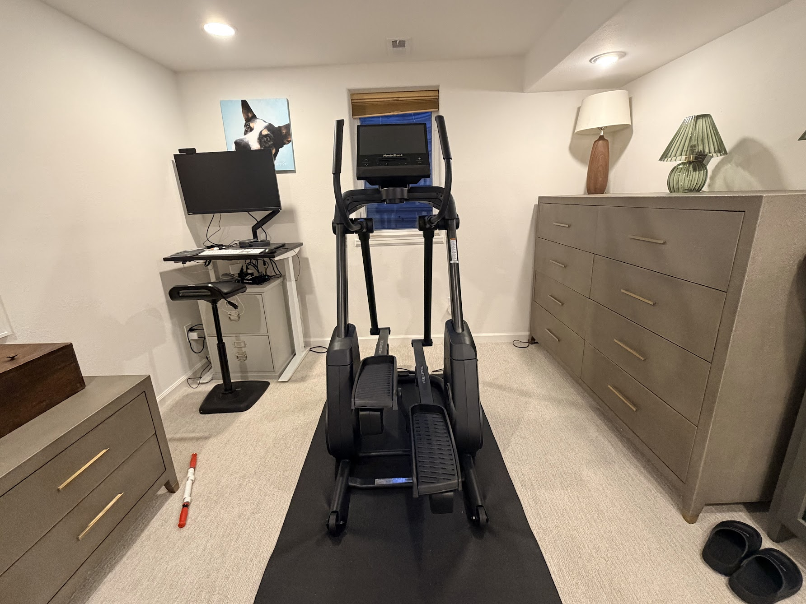

### Pros

- Free motion stride feels natural and is gentle on joints
- Massive incline/decline range (-10% to 10%) adds real variety
- 26 resistance levels accommodate everything from recovery to HIIT
- Tilting 16" touchscreen is crystal clear and easy to view
- iFIT integration is seamless with excellent workout library
- AutoBreeze fan that adjusts automatically is a nice touch
- Integrated handle controls make on-the-fly adjustments easy
- Solid build quality with 375 lb user capacity

### Cons

- Ceiling clearance is a real concern - measure carefully!
- Heavy and not easily moved despite transport wheels
- iFIT membership required to access full features
- Price point is steep compared to basic ellipticals
- Learning curve to optimize the 3-in-1 motion

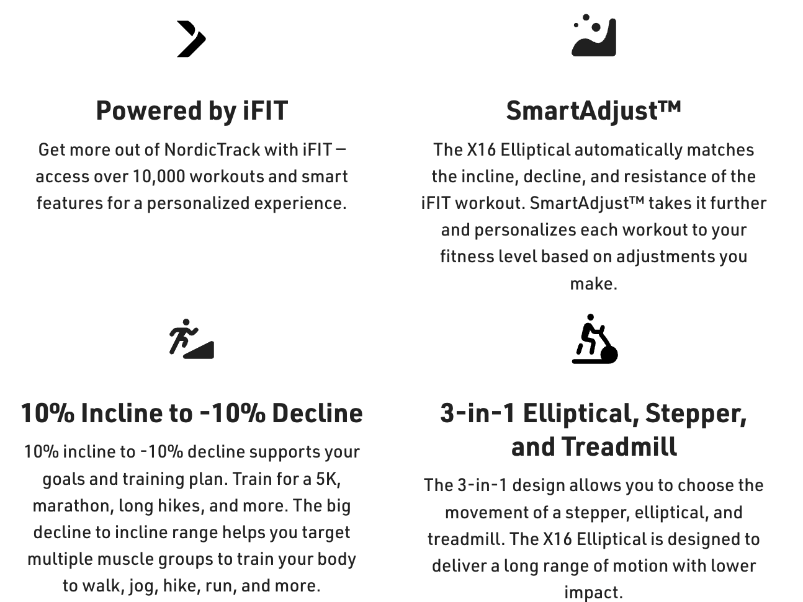

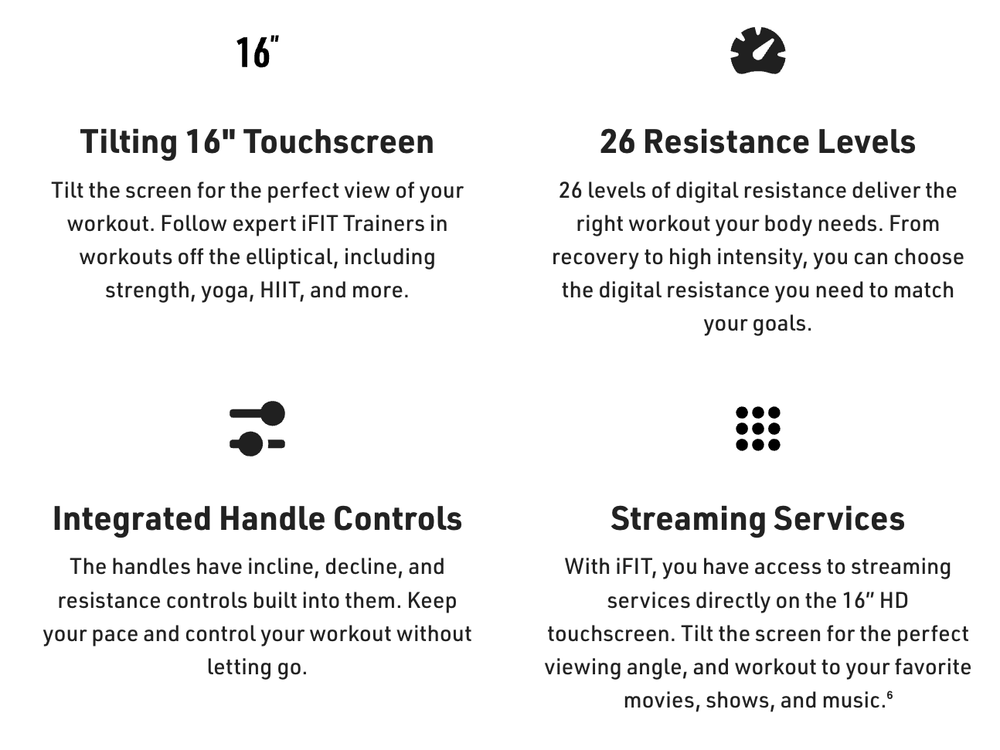

### Home Delivery

NordicTrack offers free standard curbside delivery (up to a $249 value) with options to upgrade to in-room delivery or white glove service that includes assembly and haul-away. I opted for the white glove delivery which comes at an additional cost, and I'm really glad I did. At 289 lbs boxed, this machine is no joke. The delivery team was professional, got it set up in my basement in about 45 minutes, hauled away all the packaging, and walked me through the basic controls. Worth every penny.
One critical note before you buy: measure your ceiling height! The x16 stands 74 inches tall (that's over 6 feet), and when you're using it, you need to account for your own height plus the pedal motion. My wife and I are both 5’6”, so we have enough clearance in our basement, but if I were 4-5 inches taller, it would be a serious problem. NordicTrack says this is designed to provide a long range of motion, but that comes with spatial requirements. Double-check your space before ordering.

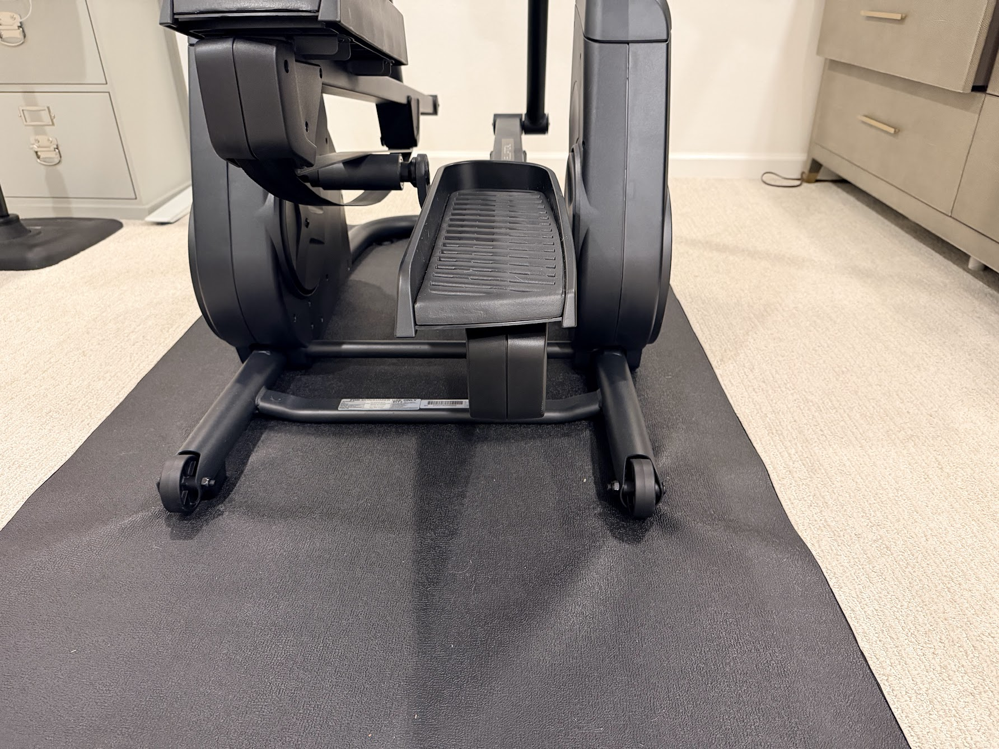

---

### The 3-in-1 Design

NordicTrack markets the x16 as a “3-in-1 elliptical, treadmill, and stepper.” This means the machine is designed to simulate three different types of motion depending on how you adjust the incline and your stride pattern. At lower inclines with a smooth stride, it feels like a traditional elliptical. Increase the incline significantly with shorter steps, and it mimics a stepper or stair climber. Use a longer, driving stride at moderate incline, and they claim it approximates the feel of a treadmill.
In practice, the “3-in-1” description is somewhat marketing-forward, but there is truth to it. What I have found most valuable is how the free-motion stride allows me to vary my gait naturally throughout a workout. Some days I focus on smooth elliptical motion. Other days, especially when my knee is feeling good, I use a more aggressive, forward-driving stride that feels surprisingly treadmill-like. And cranking the incline to 8-10% with shorter steps absolutely works the glutes and quads like a stepper.
The real magic is that all of this can happen in a single session without stopping. I can go from recovery-pace elliptical motion to high-incline climbing to fast-paced “running” motion simply by adjusting my stride and using the controls. For someone managing an injury, this adaptability is gold.

---

### Free Motion Stride

The x16's free-motion stride has been incredibly gentle on my knee. Traditional ellipticals lock you into a fixed stride pattern, which I found can still create repetitive stress on my patellofemoral joint. The x16's 32-inch auto-adjustable stride gives you flexibility in how you move, and I can subtly change my gait pattern throughout a workout to avoid aggravating my knee.
For context, I've been dealing with this injury for well over a year now - that nagging pain behind the kneecap that flares up with repetitive loading, especially running downhill or high-volume training. Physical therapy has helped tremendously, but low-impact cross-training has become essential for maintaining and supplementing fitness while keeping inflammation under control.
The x16 feels like a combination of a smooth, low-impact elliptical with the power and drive of something like a Lever treadmill. The pedals move in an arc that lets me adjust how much knee flexion I'm experiencing, and the cushioning on the oversized pedals absorbs impact beautifully. Even after 45-60 minute workouts, I had zero knee soreness - something I usually can't say about running, even on soft trails.
The decline function (down to -10%) has been particularly useful for rehab. Eccentric loading - where the muscle lengthens under tension - is crucial for rebuilding quad strength, and the decline setting lets me simulate downhill walking without the impact. I've been working with my physical therapist on eccentric exercises, and being able to incorporate them into cardio sessions has been a game-changer.

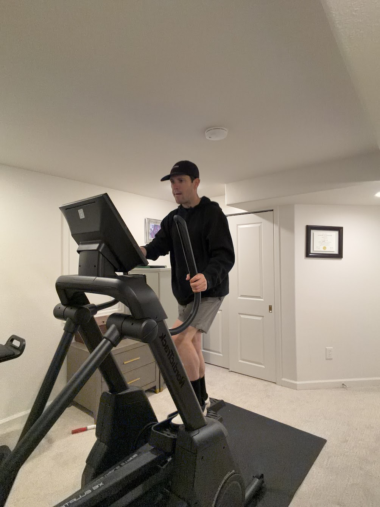

---

### Incline and Decline Range

NordicTrack advertises a range of -10% decline to 10% incline and that feels about right. The incline adjustment is smooth, responsive, and makes a noticeable difference in workout intensity. I've tested everything from flat recovery sessions to sustained efforts at 8-10% incline, and the machine handles it all without hesitation.
At 10% incline with moderate resistance (around level 15-18), the workout is challenging. My heart rate climbs quickly, and I can feel it working my glutes, hamstrings, and calves in a way that mimics uphill trail running. The incline changes are controlled via buttons on the console or via integrated controls on the handlebars.
The decline setting is less common in ellipticals, and as I mentioned above about my eccentric loading exercises, I appreciate having it. It's not exactly like running downhill, but it's close enough to be useful training. I've been incorporating decline intervals into my sessions - 2 minutes at -8% followed by 2 minutes at 6% incline - and it's a great way to simulate trail running ups and downs without the joint stress.

---

### Resistance Levels

The x16 offers 26 levels of digital resistance, and I tested across the full spectrum. The resistance adjustment is impressively smooth and varied.
Levels 1-8 are perfect for active recovery or warm-up. Levels 10-18 are the sweet spot for steady-state cardio. I can maintain a conversational pace while still elevating my heart rate into Zone 2-3. Levels 20-26 are legitimately hard. At level 24-26 with any incline, these upper levels are great for interval work. What I really appreciate is that resistance changes happen almost instantaneously. When I'm doing interval training and need to jump from level 10 to level 24, the machine responds immediately.

### Integrated Handle Controls

One feature that NordicTrack highlights is the integrated handle controls, and I have to say, they're incredibly convenient. Both handlebars have buttons for adjusting incline, decline, and resistance without having to reach for the console or touchscreen.
When I'm in the middle of a hard interval and my heart rate is spiking, the last thing I want to do is let go of the handles and fiddle with touchscreen controls. The handle buttons are intuitive - up/down arrows for incline on the left, up/down for resistance on the right. They're tactile enough that I can find them by feel without looking down.
That said, I do sometimes accidentally bump the controls when I shift my grip, especially during longer sessions when my hands get sweaty. It's not a huge problem, but it has happened a few times where I've inadvertently changed the resistance by a level or two. The buttons are fairly sensitive, which is great for responsiveness but requires a bit of awareness during use.

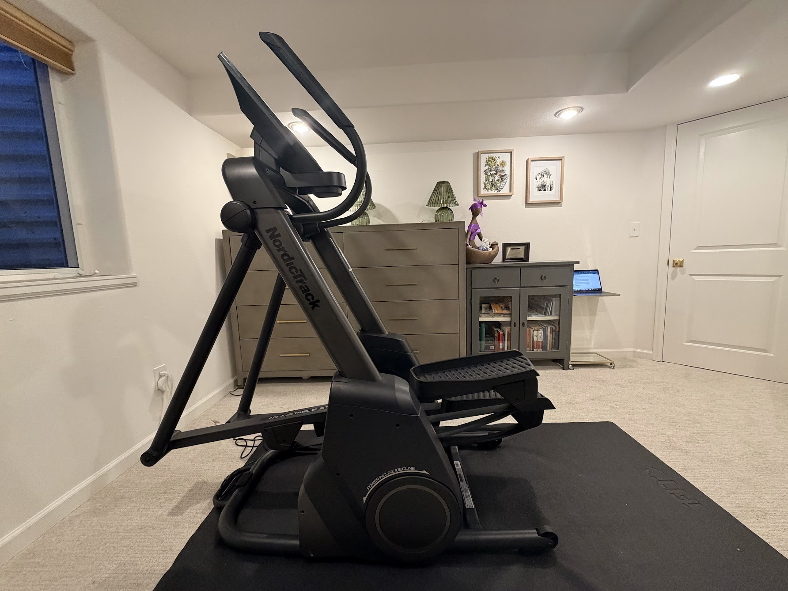

---

### The 16" Tilting Touchscreen and iFIT Integration

The x16 features a tilting 16" HD touchscreen that's one of the best displays I've used on home fitness equipment. The resolution is sharp, colors are vivid, and the touch response is fast. The tilting function is genuinely useful - I keep the screen at a higher angle during elliptical workouts, but it tilts down for floor-based exercises like stretching or core work after my session.
---

The heart of the x16's software experience is iFIT, NordicTrack's subscription-based fitness platform. I'll be upfront: iFIT membership is required to unlock the full capabilities of this machine, which is an additional cost beyond the equipment itself. Pricing as of 12/26/25 is below:

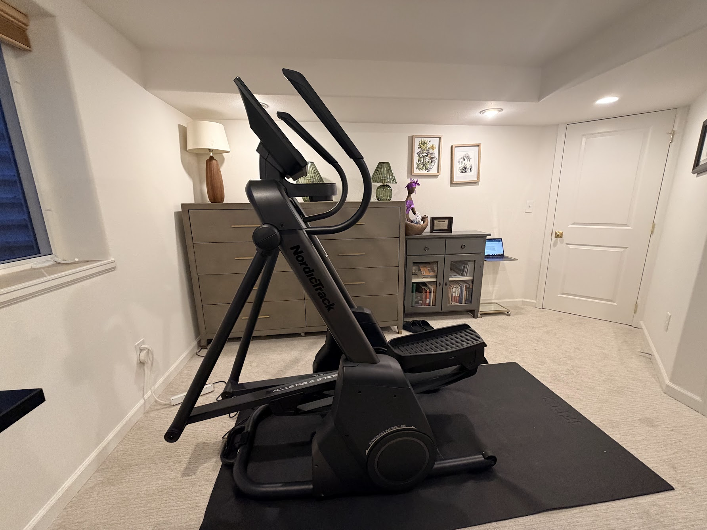

That said, iFIT is excellent. The workout library is massive - NordicTrack claims over 10,000 workouts - and I've yet to run out of options.

I've done scenic trail runs through the Grand Canyon, interval sessions with elite trainers like Tommy Rivers Puzey and Hannah Eden, and low-key recovery sessions.

The production quality is high, and the trainers are motivating without being overbearing. My favorites have been the trail running series - it's satisfying to “run” through stunning scenery on a giant screen while my knee stays happy.

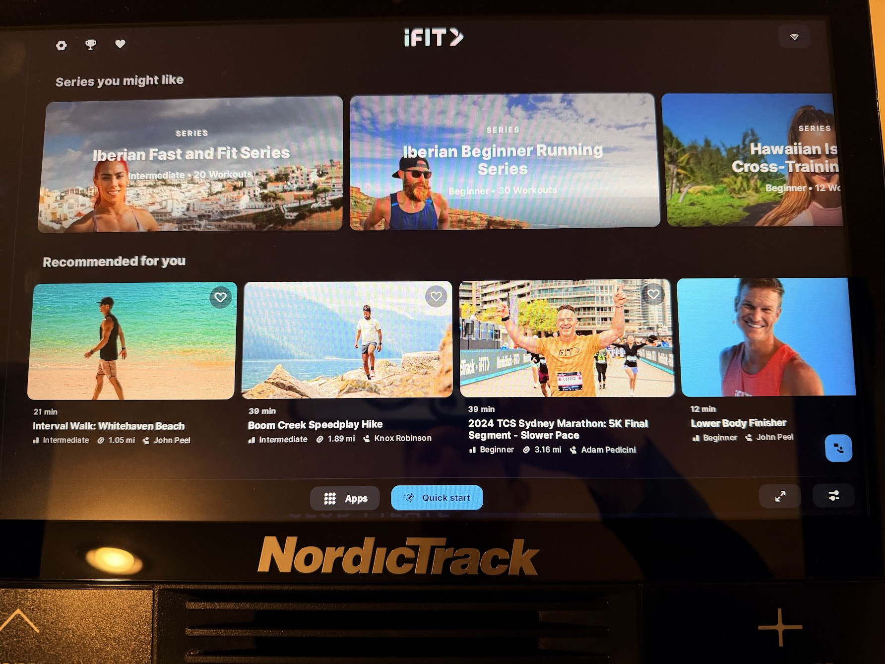

One of iFIT's standout features is SmartAdjust, which NordicTrack describes as intelligently adjusting incline and resistance to your fitness level based on your workout behavior. In practice, the machine learns from your adjustments. If you consistently increase resistance during a particular section, SmartAdjust will start to anticipate that next time. The workouts become more personalized over time.
The x16 also supports streaming services like Netflix, Hulu, and Spotify directly on the touchscreen. On days when I want to zone out and do steady-state cardio, being able to watch a show beats staring at the basement window. The sound quality from the built-in 2" speakers is decent, though I usually connect my headphones.

### AutoBreeze Fan

The x16 includes an AutoBreeze fan that automatically adjusts its intensity based on your workout effort. NordicTrack says the fan "changes intensity to match your workout," and it does exactly that. During warm-up or recovery, the fan runs at a low setting. As my heart rate climbs and the workout intensifies, the fan ramps up accordingly.
I'm a self-proclaimed mega-sweater (just ask anyone who's run with me on a hot day), so the fan has been a welcome feature. It's positioned well - aimed at my face and chest - and moves enough air to make a difference. It's not industrial-strength, but for a home elliptical, it's better than most. The automatic adjustment means I don't have to fiddle with settings mid-workout, which keeps me focused.

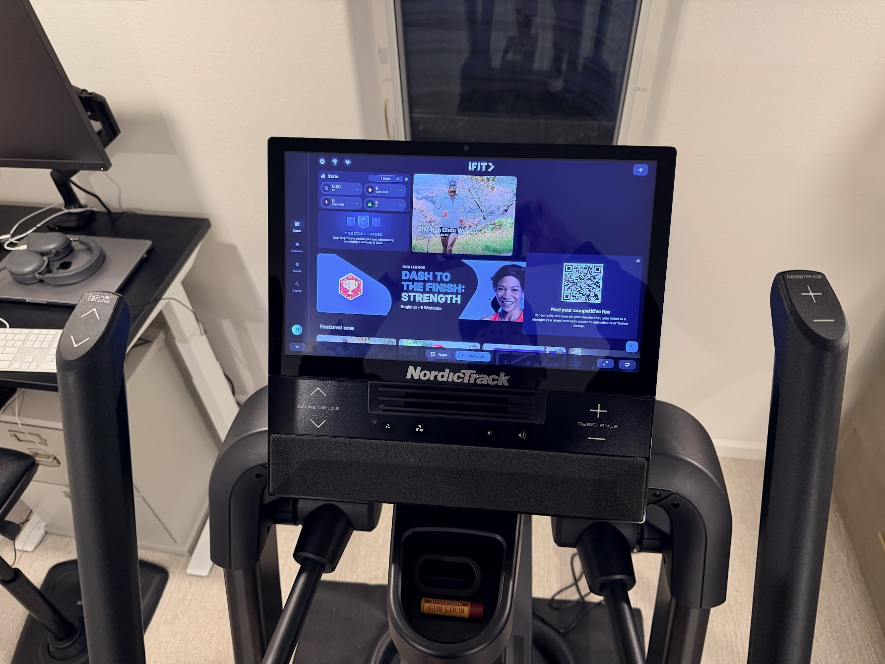

---

### Build Quality and Stability

At 289 lbs, the x16 is a tank. Once it's set up in your space, it's not going anywhere without significant effort. The frame feels solid and stable even during high-intensity intervals when I'm really driving through the pedals. There's no wobbling, creaking, or flexing - something I've experienced on cheaper ellipticals in hotel gyms.
The oversized, cushioned pedals are comfortable and accommodating. They're large enough that I can shift my foot position slightly throughout a workout, which helps prevent hotspots or numbness. The cushioning absorbs impact well, and the non-slip surface keeps my shoes planted even when things get sweaty.

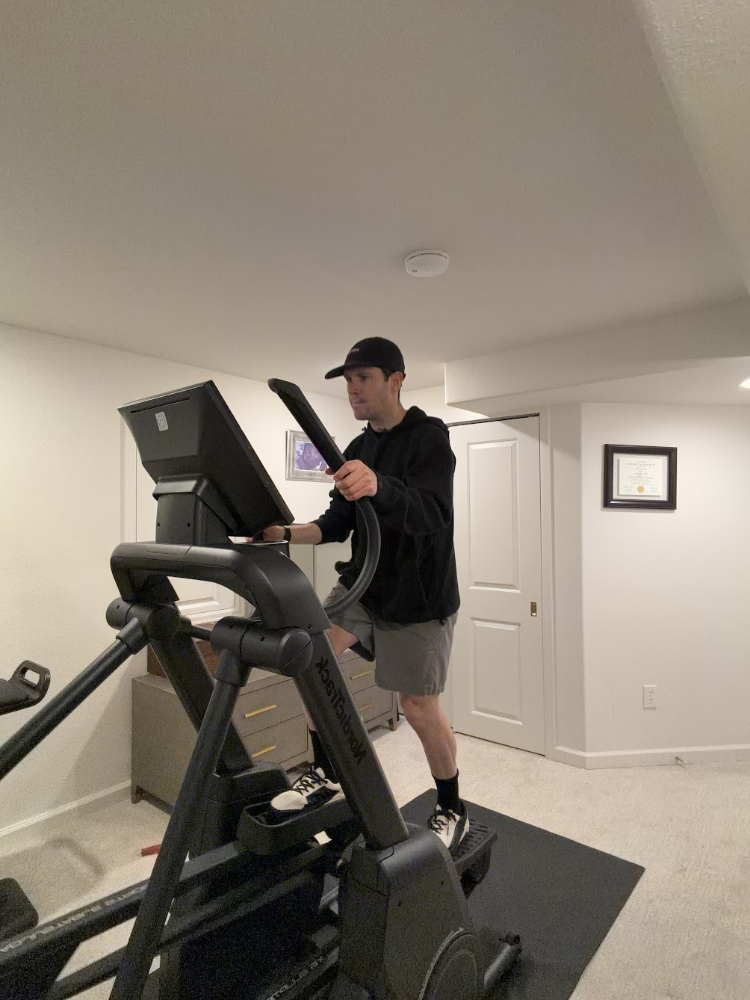

NordicTrack rates the x16 for users up to 375 lbs, which is a solid weight capacity and speaks to the robust construction. The 10-year frame warranty is reassuring and suggests they're confident in the build quality.
That said, the x16 does come with transport wheels to help move it, but given the weight, "transport" is a generous term. It's possible to tilt and roll the machine, but it's definitely a two-person job, and you'll want to be careful on carpet or uneven surfaces. Once you pick a spot for this elliptical, plan on it staying there.

---
Testing Across Settings: My Experience
Over the past several weeks, I've tested the x16 across a wide variety of settings and workout styles. Here's what I've learned:
Recovery Sessions (Low Resistance, 0-2% Incline): Perfect for active recovery days. I can maintain a smooth, easy pace while barely elevating my heart rate.
Endurance Workouts (Moderate Resistance, 3-5% Incline): My go-to sessions. I typically do 45-60 minutes at resistance levels 12-16 with a slight incline. The motion feels natural, and I can easily settle into a rhythm while watching Netflix or following an iFIT scenic workout.
Hill Climbs (High Resistance, 6-10% Incline): At 8-10% incline with resistance around 18-22, I'm working harder. It's about as close as I can get to uphill trail running without the impact.
Interval Training (Variable Resistance, 0-6% Incline): This is where the x16 is intended to shine. I have done a few iFIT HIIT workouts that alternate between 30-second max efforts (resistance 24-26) and 90-second recovery periods (resistance 8-10). The machine responds instantly to resistance changes, and the free-motion stride lets the user really push during work intervals.
Decline Work (Low Resistance, -6 to -10% Decline): Less common but valuable for rehab. The eccentric loading at decline settings has been great for quad strength.
The 3-in-1 motion takes some experimentation to optimize. The first few sessions, I wasn't sure how to best use the machine's versatility. But after playing around with stride length, incline, and resistance combinations, I've found what works for me.

### Specs

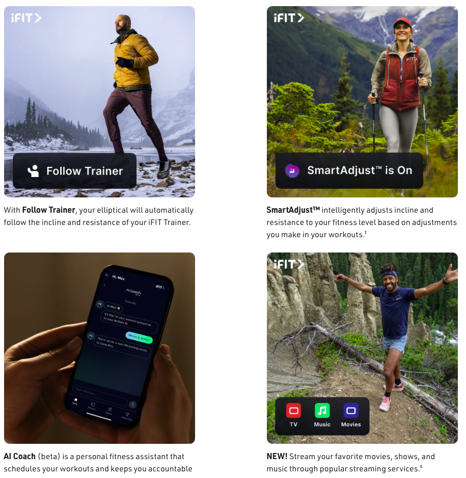

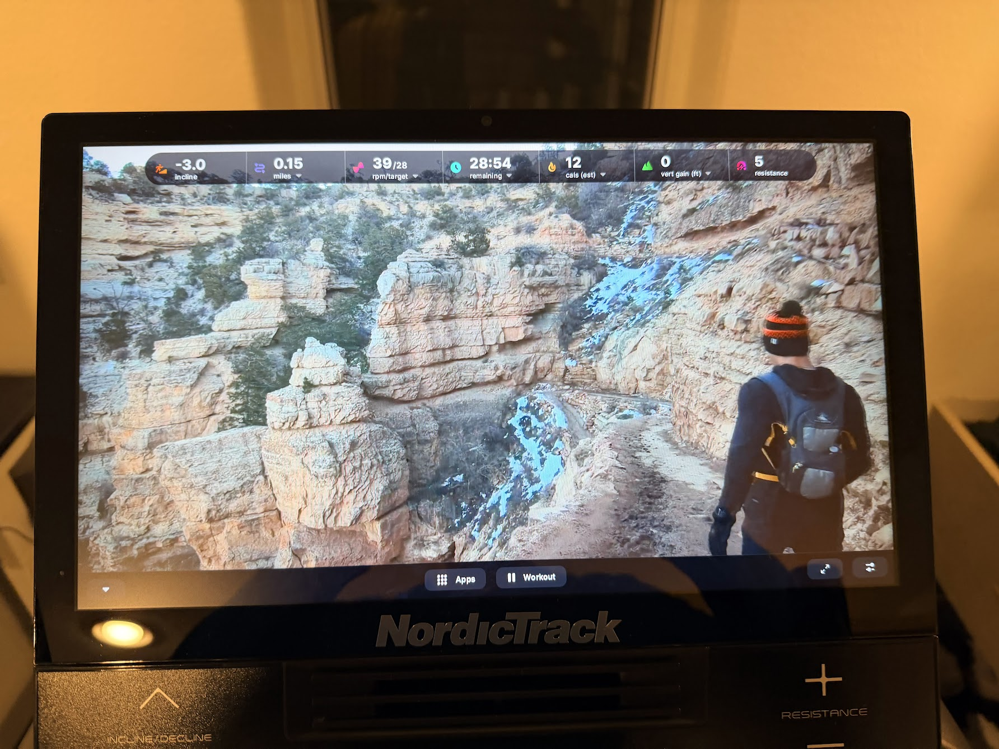

---

### How It Compares to Other Home Fitness Equipment

As someone who's new to owning a home elliptical, I can't do an exhaustive comparison to other ellipticals. But I have used ellipticals at fitness centers, hotels, and the gym at work, and I can say the x16 compares very favorably in terms of build quality, features, and user experience.
The motion feels more natural and less “locked in” than most commercial ellipticals I've tried. The incline/decline range is better than anything I've seen in a standard elliptical, and the 26 resistance levels provide more granularity than the 10-16 levels you typically find on basic models. The touchscreen and iFIT integration blow away the clunky, outdated consoles on most gym equipment.
That said, the x16 is not cheap. At $2,499 on sale (from $2,799 MSRP), it's a significant investment. Add in the annual iFIT membership (required for full functionality), and you're looking at a substantial ongoing cost. But if you are like me who needs consistent low-impact training, it's worth it. But if you're just looking for a basic elliptical for occasional use, there are definitely more affordable options out there.
The closest comparison I can make is to the . Both machines offer unique hybrid designs that go beyond traditional ellipticals, and both feature premium touchscreens with robust fitness app integration. The Bowflex focuses more on the stepper/climber motion with its dual-track system, while the x16 emphasizes the free-motion elliptical stride with its wider incline/decline range. The x16's 32-inch stride length gives more freedom of movement compared to the Bowflex’s more structured path, and the decline function is something the Bowflex doesn't offer. For my knee rehab specifically, I've found the x16’s free-motion stride to be gentler and more adaptable. That said, both are excellent machines with thoughtful features and solid build quality - the choice really comes down to whether you prefer a more guided stepping motion (Bowflex) or a more variable, natural stride with more assistance (x16).

### Conclusion

The NordicTrack x16 Elliptical has exceeded my expectations. Coming into this review as someone who traditionally prefers running and has a slight aversion to indoor training, I've been impressed by how much I've genuinely enjoyed using this machine. The free-motion stride is comfortable and adaptable, the incline/decline range adds real training versatility, and the iFIT integration keeps workouts fresh and engaging.
I can get intense, challenging workouts without aggravating my knee. I can simulate uphill climbing, work on eccentric strength with decline settings, and do interval training - all with zero impact. It's allowed me to maintain and supplement fitness now that high volume training has become a slippery slope.
The touchscreen is excellent, the controls are intuitive, and the build quality inspires confidence. Small touches like the AutoBreeze fan and USB-C charging port show thoughtful design. The tilting screen for off-machine workouts is a nice bonus, and the streaming capability means I can catch up on shows during longer sessions.
The downsides are real but manageable. The ceiling height requirement is critical - measure carefully before you buy. The machine is heavy and not easily moved. And the iFIT membership is functionally required, which means an ongoing expense. The price is steep compared to basic ellipticals, but you're getting a lot more machine for the money.
If you're a runner looking for high-quality cross-training, someone managing an injury who needs low-impact options, or just someone who wants a versatile, premium elliptical for home use, the x16 is absolutely worth considering.

