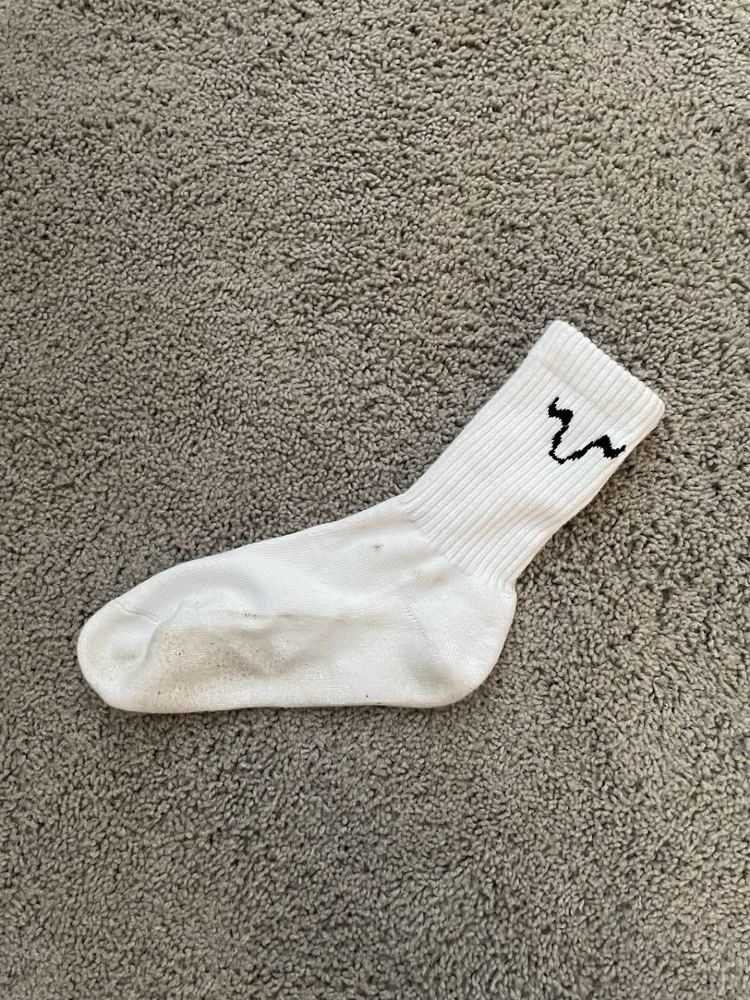

<!--more-->

As a seasoned runner and cyclist, conquering the post-workout foot funk
can be an ongoing struggle. [OX SOX](https://getoxsox.com/) ($19.99 for
a single pack crew height), with its promise of natural odor
elimination, ignited a glimmer of hope. However, my test drive revealed
both brilliance and shortcomings.

OX SOX's triumph lies in its proprietary fabric blend, which neutralizes
odor-causing bacteria. After weeks of rigorous testing, I can attest to
their effectiveness. My feet remained odor-free despite sweat-drenched
runs and hours of cycling. The freedom from post-workout stench was
liberating.

But the socks' thickness and high cotton content present challenges.
While they provided exceptional softness, the bulkiness felt excessive
during hot summer days. My feet sometimes felt trapped in a warm cocoon,
compromising breathability. Additionally, the high cotton content raised
concerns about moisture management during intense activities.

While the socks remained odor-free, their thicker construction
occasionally hampered sweat wicking. This resulted in dampness that,
while not detrimental, detracted from the overall comfort. On cooler
days, the warmth was welcome, but the ideal athletic sock is best if it
is adaptable across all temperatures.

Beyond the concerns about thickness and material composition, OX SOX
excelled in other areas. The seamless toe box and snug fit ensured
blister-free comfort, even during long runs. The socks also proved
durable, retaining their shape and elasticity after repeated washes.

OX SOX delivers on its odor-neutralizing promise, offering a welcome
reprieve from embarrassing foot funk. However, its thickness and high
cotton content raise questions about its suitability for high-intensity
activities, especially during warmer seasons.

The price point, while higher than traditional athletic socks, reflects
the innovative technology and environmental consciousness. For those
with chronic foot odor, OX SOX is a potential game-changer. However, for
athletes prioritizing breathability and moisture-wicking above all else,
the socks might fall short.

I remain hopeful that future iterations of OX SOX will address these
concerns, offering a more universally comfortable experience. Until
then, the socks remain a welcome addition to my wardrobe, albeit with
specific limitations. They're a dependable weapon against foot odor, and
the battle for ultimate performance continues.

Thanks for reading Boulder Gear Lab! Subscribe for free to receive new
posts and support my work.
