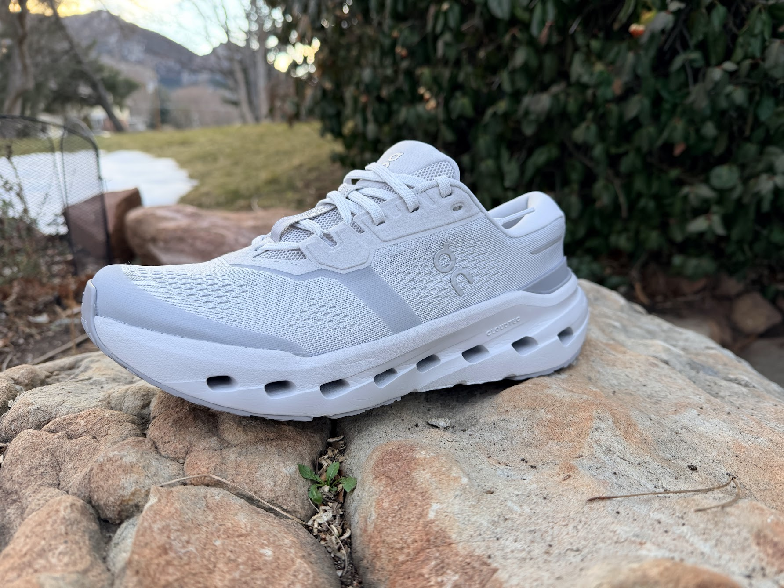
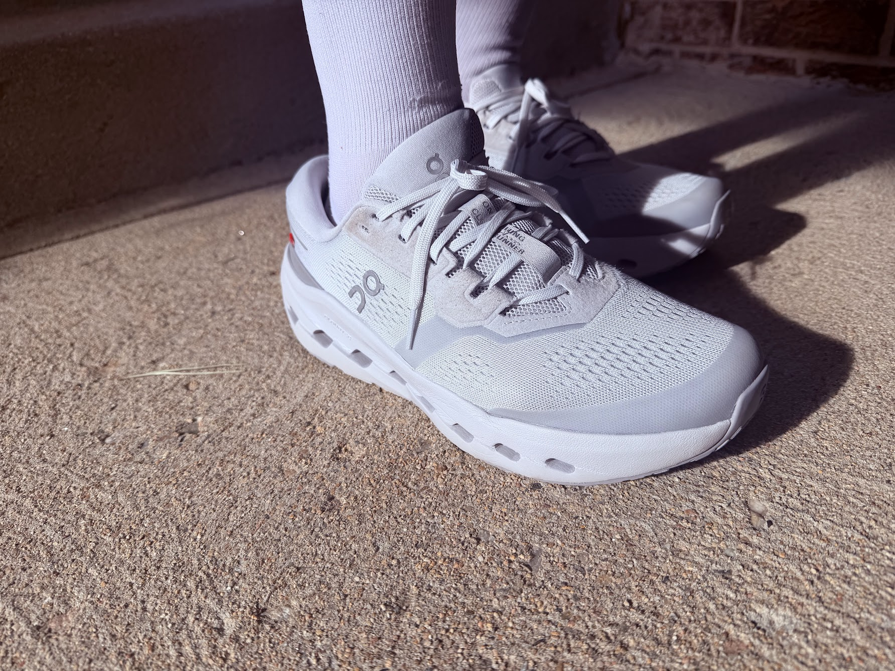
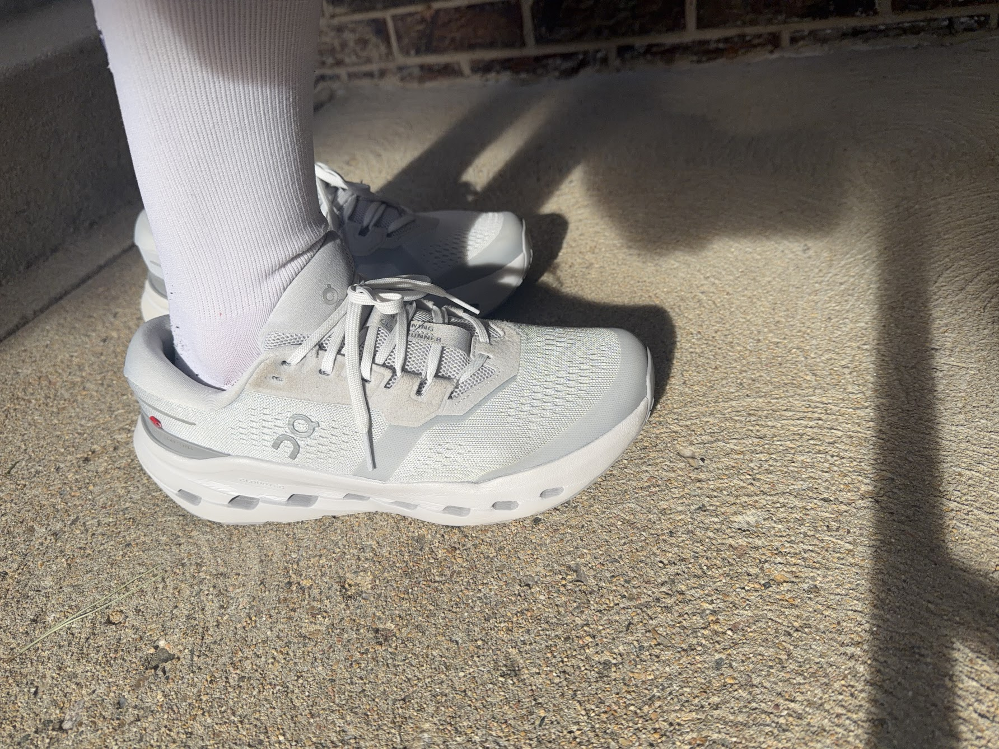
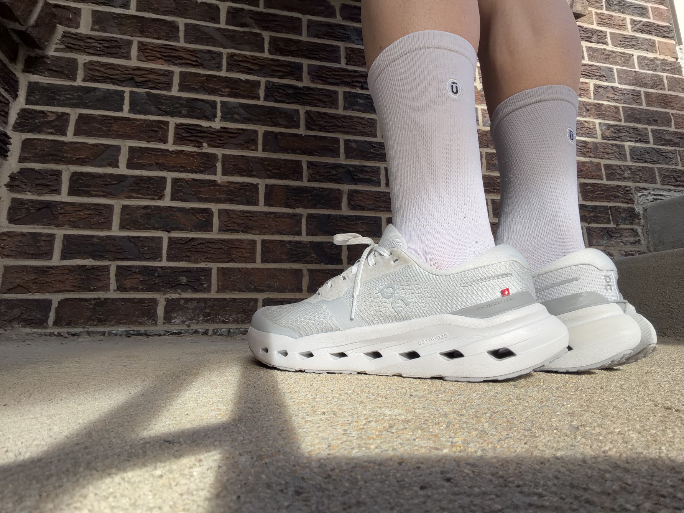
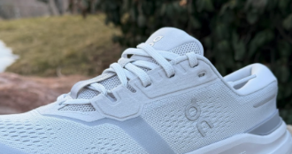
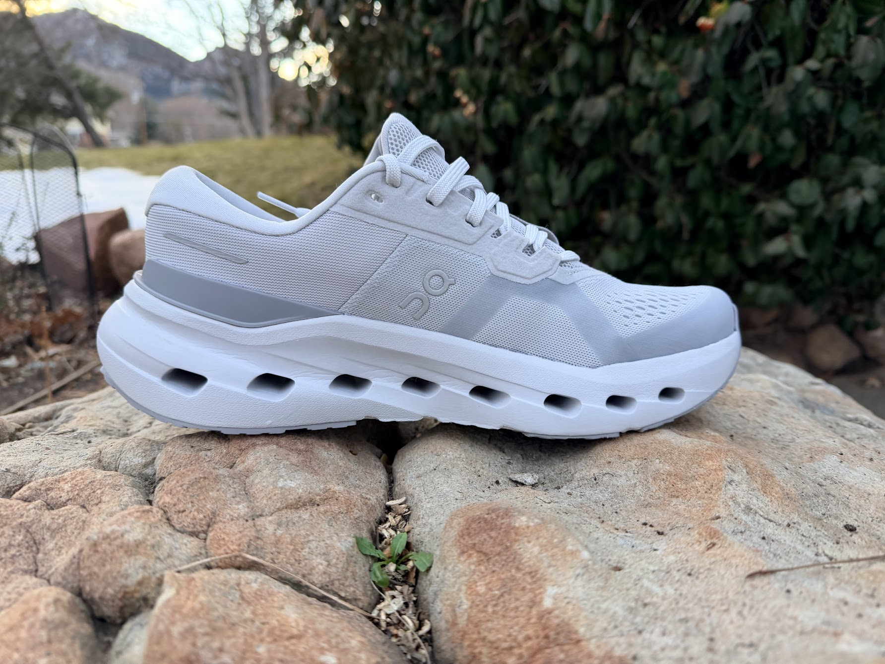
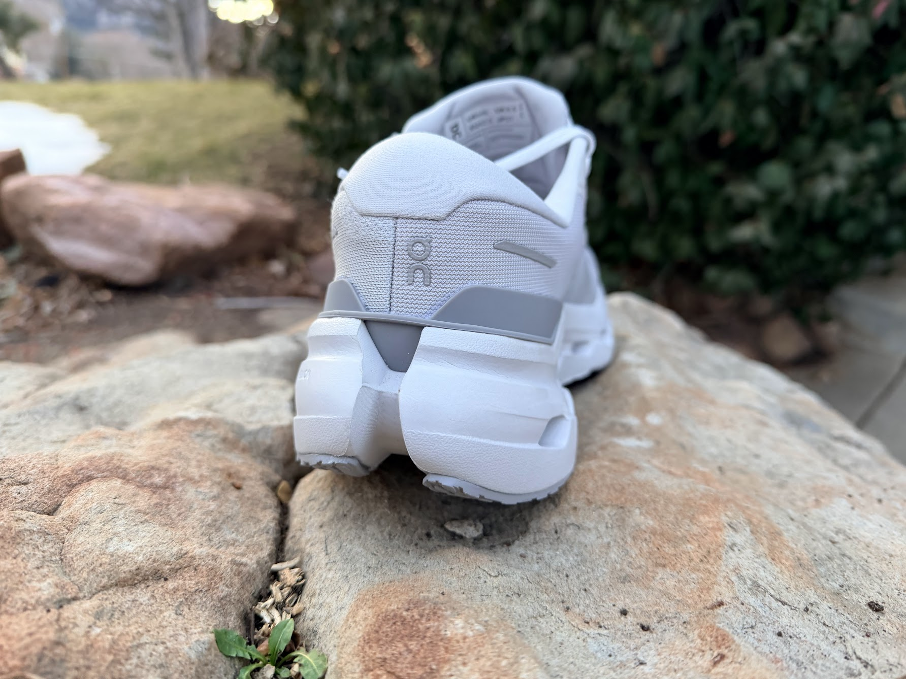
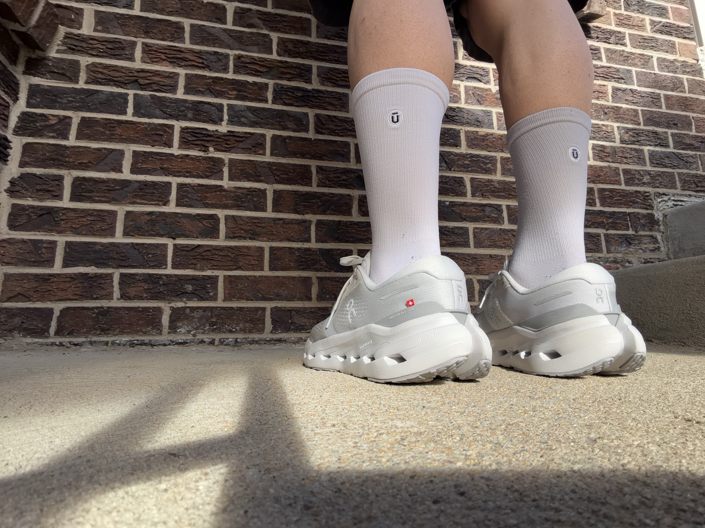
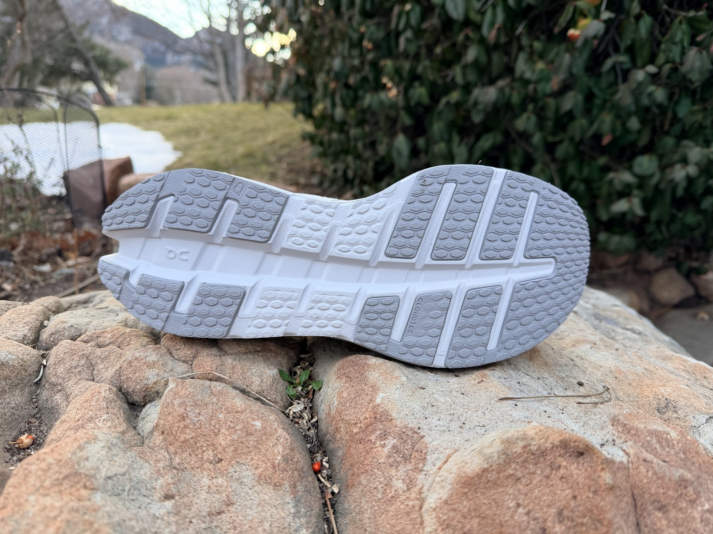
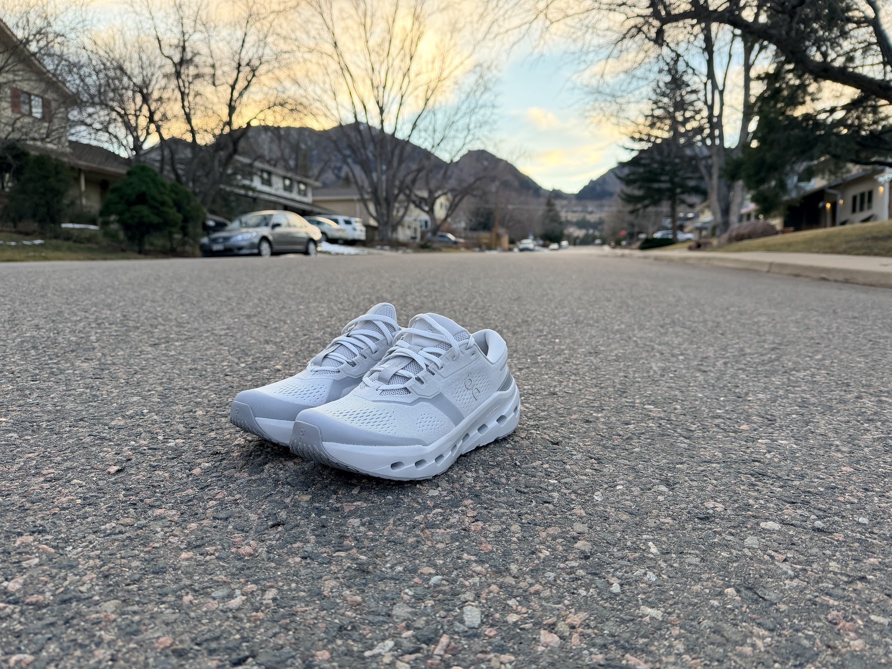

<!--more-->

*Article by John Tribbia*

Original Post from RoadTrailRun
([link](https://www.roadtrailrun.com/2026/02/on-cloudrunner-review-4-comparison.html))

<a href="https://www.roadtrailrun.com"
class="button primary button-wrapper">Read All RoadTrailRun
Reviews Here</a>

### ON Cloudrunner 3 ($160)

### Introduction

John: As someone who's spent most of my reviewing career testing trail shoes on steep Colorado grades, I'll admit I was curious when the On Cloudrunner 3 showed up at my door. This is my first review of an On road shoe, though I’ve certainly noticed the brand’s growing presence in the road running world over the past few years, especially since many of the pros live and train in Boulder. The Cloudrunner line has built a solid reputation as On's moderate stability trainer, and with version 3, they’re doubling down on what On calls “confidence for all runners.”
According to On, the Cloudrunner 3 features their signature CloudTec cushioning system “engineered for stable runs” with Helion foam for “comfort and impact absorption.” They emphasize a flat forefoot rocker and wide base that is intended to deliver “controlled, balanced ground contact.” The promo highlights include an asymmetrical heel clip for optimal support, higher sidewalls that lock you in, and a plush heel and tongue for secure, cushioned fit.
Having recently reviewed shoes like the Brooks Adrenaline GTS 25, Mizuno Wave Rider 29, Diadora Vigore V, and Saucony Ride 19, I was interested to see how On’s approach to road stability would stack up. The Cloudrunner 3 sits in that moderate cushion, moderate stability space - not quite a full stability shoe, but offering more support than a neutral trainer.
The Cloudrunner 3 is positioned as a daily trainer for runners who want some guidance without feeling locked into heavy support features. So far, I put about 60 miles on these across varied road terrain, everything from flat neighborhood loops to the rolling hills leading up into the foothills west of Boulder, and I’m impressed.

### Pros:

- Excellent step-in comfort with plush upper and collar - John
- Wide, stable platform inspires confidence on varied terrain - John
- Smooth transitions from heel strike through toe-off - John
- Upper fit is accommodating without feeling sloppy - John
- Clean aesthetic works for both running and casual wear - John

### Cons:

- Midsole feels firm, especially on longer runs - John
- Limited energy return compared to other daily trainers - John
- Weight feels substantial for the amount of cushioning provided - John

### Stats

- Men’s  10.5 oz / 299g US9
- Platform Width:  100mm heel /  80mm midfoot  / 118mm forefoot

### First Impressions, Fit and Upper

John: Right out of the box, the Cloudrunner 3 makes a nice first impression with its upper construction. This is genuinely one of the most comfortable step-in experiences I’ve had in a daily trainer recently. The plush heel collar and padded tongue create an immediately comfortable sensation that makes you want to keep these on your feet,  which is probably why I found myself wearing them around town on non-running days more than I initially expected.
The upper uses an engineered mesh that is both breathable and surprisingly durable-feeling. Unlike some lightweight mesh uppers that feel fragile, the Cloudrunner 3’s upper has a substantial quality to it without feeling heavy or restrictive. The mesh is smooth against the foot with no irritation points, and I appreciated how well it handled the varying Colorado weather I threw at it - from crisp 30-degree mornings to those weird 60-degree winter afternoons we’ve been getting.

Regarding fit, I'm testing the US9, which is my standard size, and the fit is excellent right out of the box. The heel counter locks my foot securely with zero slippage - something I particularly appreciated on downhill sections where heel lift can become an issue in some shoes.

The midfoot and forefoot offer comfortable room without any sloppiness. I’d describe the fit as accommodating but not wide and there's space for natural foot splay without the shoe feeling oversized.
The padded tongue sits nicely centered and has adequate cushioning to prevent any lace bite, even when I cinched things down for faster-paced running. The lacing system is straightforward and effective - nothing fancy, but it does its job well with good tension distribution across the foot.

One highlight feature is the heel construction. On has integrated a substantial amount of padding into the heel collar, and combined with the asymmetrical heel clip (a plastic reinforcement that wraps around the heel), it creates a secure, locked-in feeling without being restrictive or causing any achilles irritation. The heel counter has some rigidity to it, but it’s well-integrated and comfortable rather than stiff or poky.

The suede overlays on the lacing eyelets are a nice touch that adds to both the premium feel and the structural integrity of the upper. And, they aren’t just for looks as they provide solid durable anchor points for the laces.
Coming from a trail running background where I'm used to more protective, sometimes burlier uppers, I found the Cloudrunner 3's upper to hit a nice sweet spot - substantial enough to feel durable, light enough to not feel like overkill for road running. After 60 miles, I'm seeing no significant wear on the mesh, and the overlays are holding up well.
One note: the glacier colorway I tested looks sharp, but it's also a magnet for showing dirt. If you're particular about keeping your shoes pristine, you might want to consider one of the darker color options.

### Midsole & Platform

John: The Cloudrunner 3's midsole is where things get interesting, and honestly, where my feelings about this shoe are most mixed. On uses their Helion Superfoam, which they describe as providing “comfort and impact absorption.” The signature CloudTec technology - those distinctive hollow pods you see on the outsole - is visible throughout the platform and plays a significant role in how this shoe rides.

The stack height measures 31mm in the heel and 23mm in the forefoot, giving an 8mm drop. For a daily trainer these days, this is considered moderate cushioning. What’s notable about the Cloudrunner 3 is how the cushioning feels relative to that stack height. Put simply: this is a relatively firm shoe. Not punishingly firm, but noticeably firm, especially compared to other daily trainers I’ve been testing lately. The Helion foam provides adequate impact protection - I never felt beat up after runs - but it doesn’t have a plush, sink-in sensation you get with softer modern foams like PEBA compounds or even softer EVA formulations.

The CloudTec® pods are what On calls their cushioning system, and they do create an interesting ride characteristic. On paper, these hollow sections should compress on impact and then spring back during toe-off. In practice, I found the compression phase to be subtle, and the energy return to be minimal. The pods do seem to help the shoe adapt to different surfaces - the platform feels stable whether I'm on smooth pavement, rougher asphalt, or the occasional gravel section - but I wasn't feeling any meaningful bounce or propulsion from them.

Where the midsole really performs well is in stability. The wide base is immediately noticeable and genuinely effective. The platform feels planted and secure, particularly through the heel and midfoot. On has incorporated higher sidewalls in this version, which means your foot sits more inside the shoe rather than perched on top of it. This creates what I'd describe as a “bucket seat” sensation - you feel surrounded and supported by the cushioning.
The rocker geometry On has designed into the midsole is modest but effective. This isn't an aggressive, curved rocker like you'd find in a HOKA or even the Saucony Ride 19. Instead, it’s a gentle roll that promotes smooth transitions without feeling like the shoe is trying to propel you forward. The toe-off point feels natural, and I never felt like I was fighting the shoe’s geometry. The heel-to-forefoot transition is smooth and I never felt stuck or dead-legged. The shoe always wanted to keep moving forward, which is a positive.

### Outsole

John: The outsole of the Cloudrunner 3 features what On describes as enhanced rubber for traction and durability, and from what I researched it is a step up from some of their earlier models in terms of rubber coverage. The forefoot and heel have substantial rubber sections, while the midfoot shows more of the CloudTec pods with selective rubber placements.
The rubber compound feels moderately soft but definitely not super tacky like the stickier trail shoe compounds I'm used to - though grippy enough for road use. On wet pavement, which we haven’t had a ton of this winter, the Cloudrunner 3 provided confident traction. I never experienced any concerning slippage, even on painted road lines or manhole covers when damp.
The lug pattern is low-profile and multidirectional, which is appropriate for a road shoe. There are no deep lugs here,  just enough texture to provide grip without creating a harsh ride on smooth surfaces. On harder surfaces like concrete sidewalks, the outsole feels smooth and quiet. There’s no slapping or clunking sound that you sometimes get with shoes that have more aggressive outsole designs.

### Ride, Conclusions and Recommendations

John: The Cloudrunner 3’s ride is, in a word, steady. This is a shoe that prioritizes stability and predictability over plushness or energy return. From the moment you start running, the shoe delivers a firm, controlled experience. The heel clip and high sidewalls guide your foot through a smooth transition from heel strike to toe-off, and the modest rocker keeps things moving forward without any awkward dead spots. Every footstrike feels stable and planted, which is particularly noticeable on uneven surfaces or when you're fatigued late in a run.
I tested the Cloudrunner 3 on a variety of road surfaces - smooth neighborhood pavement, chunkier older asphalt, some concrete, and occasional hard-packed gravel sections. The shoe handled all of these confidently, with the CloudTec pods seeming to help the platform adapt to surface variations. On hillier routes, including some of the steeper residential streets, the shoe performed well both on climbs and descents. The firm platform and sticky outsole provided good traction heading uphill, and the secure heel lockdown prevented any slippage on downhills.
I tested the Cloudrunner 3 at paces ranging from easy recovery runs (8:30-10:00/mile) to moderate efforts (6:00-7:30/mile). The shoe was most comfortable at easy to moderate paces. At faster efforts, the weight and firm ride became more noticeable and I found myself wishing for either less weight or more cushion to offset the extra impact from the faster turnover. This isn’t a shoe I would reach for if I am planning intervals or truly fast running. For steady-state efforts, though, it's perfectly capable.
Coming back to the firmness. This is where the Cloudrunner 3 most clearly shows its design priorities, and it's also where I think some runners will bounce off this shoe. If you're coming from plush trainers or even softer neutral shoes, the Cloudrunner 3 will feel noticeably harder underfoot. That firmness provides excellent stability and ground feel, but it comes at the expense of cushioned comfort, especially on longer runs. Personally, I am a fan given my lean toward more ground feel in my trail shoe collection.

### Overall Score 9.1 / 10

- Ride: 8.5 - Stable and steady
- Fit: 10 - Best upper comfort
- Value: 9.0 - Solid construction and versatile on gravel
- Style: 9.0 - I plan to make this my around town shoe too
- Smiles: 😊😊😊😊½

### Brooks Adrenaline GTS 25

John: The Adrenaline is heavier but offers more cushioning and a plusher ride. If you want maximum comfort in a stability shoe, the Adrenaline wins. If you want a lighter, more nimble stability option, the Cloudrunner 3 edges it out.

### Saucony Ride 19

John: The Ride is lighter, softer, and more versatile. The Ride 19 can handle everything from recovery runs to uptempo work more comfortably. The Cloudrunner 3 offers more structure and stability but sacrifices some of the Ride's comfort and liveliness.

### Diadora Vigore V

John: These are surprisingly similar in firmness and stability approach, though the Vigore V has a bit more energy return from its Blushield technology. Both are moderate stability shoes with firm rides. The Vigore V is slightly lighter and feels a touch more responsive.

### Mizuno Wave Rider 29

John: The Wave Rider is lighter and offers better energy return while maintaining good stability through Mizuno's Wave plate. The Cloudrunner 3 is more explicitly a stability shoe with its heel clip and sidewalls, but the Wave Rider is more fun to run in at faster paces.