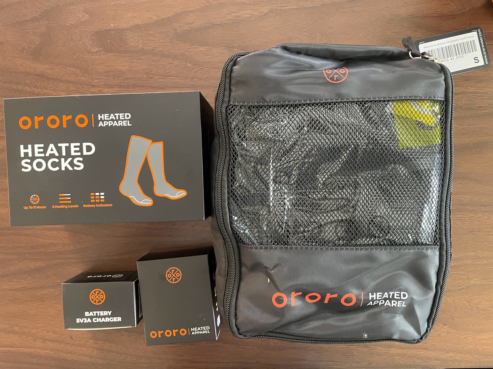
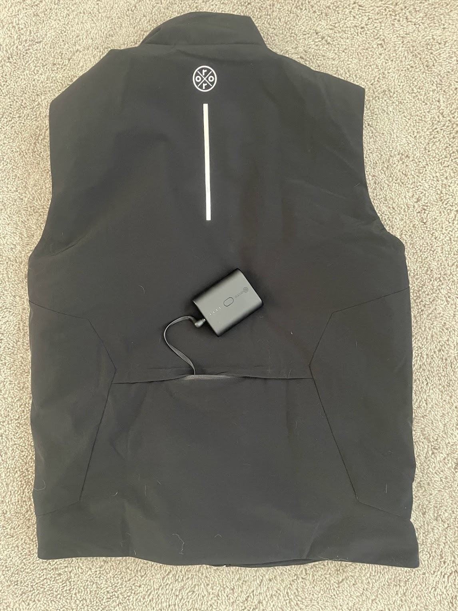
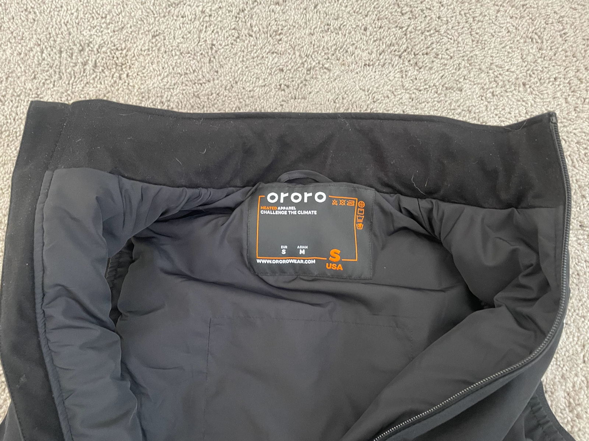
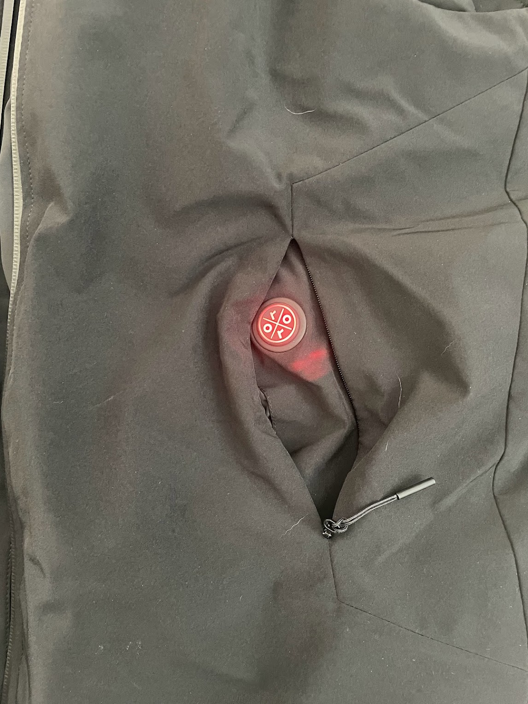

<!--more-->

Is it possible that heated clothing can make bike riding in the winter
more comfortable? Earlier in January I saw my coworker wearing a heated
jacket and I was immediately intrigued. It wasn’t easily recognizable as
a heated jacket, but my friend showed me the battery, let me feel the
heating element, and showed me that the heat intensity could be adjusted
with the push of a button. As a California transplant, he told me that
it had been a lifesaver for him during this particularly cold Colorado
winter. 

I’m someone who enjoys being out in the cold weather running, biking,
walking the dogs, hiking, shoveling. I was interested to see if I could
feel the difference of wearing heated clothing and was especially keen
to see if heated socks would help keep my feet warm while winter
biking. 

I reached out to [ORORO](https://www.ororowear.com/) to ask if I could
review a pair of their socks, and I'm so glad I did. Jack, their lead
Brand Operation Specialist, was stoked to send me socks and their heated
vest to try. Thankfully, too, we had an unusually long stretch of days
with sub-zero temperature once they arrived.

Packaging is really nice with unassuming yet clean brand logo

A little about the company: The name ORORO is inspired by the X-Men
superhero Storm, who is able to control weather. Kind of a fitting name
for a company that is dedicated to providing warmth and comfort to its
customers, even in the coldest weather. It was founded in 2015 in the
Midwest, and it is known for its high-quality, affordable heated
jackets, vests, and other apparel. 

### **MEN'S HEATED PRIMALOFT® GOLF VEST**

*$230*

First things, first, the [ORORO
heated](https://www.ororowear.com/products/mens-heated-lightweight-golf-vest?variant=42015619645622)
*[golf](https://www.ororowear.com/products/mens-heated-lightweight-golf-vest?variant=42015619645622)*
[vest](https://www.ororowear.com/products/mens-heated-lightweight-golf-vest?variant=42015619645622)
should be used as a loose description, because it is more than something
to wear on the links. I found it to be more of an activewear piece of
clothing that offered a good range of motion for walking, jogging, or
shoveling. It is a high-quality, well-made vest that provides pretty
good warmth and is quite comfortable. The fabric outer shell is
water-resistant and windproof, and it has a 4-way stretch polyester
lining with a really soft neck liner. The vest has 4 Carbon Nanotube
heating elements that generate heat across core body areas (left & right
pocket, collar, upper back). With three adjustable heating settings, it
lasted over 6 hours on the hottest setting for me on a single charge.

Stock image of the heating elements: back and pockets are warming

Before putting on the vest, I was thinking it would feel like wrapping a
heating pad around my abdomen. My enthusiasm was a bit tempered when I
realized the heating sensation was more modest than that. However, I
still found it really effective. We had a really cold couple of days in
February (-10 \*F) and I wore it to shovel some snow. I was impressed
that it took the edge off of those near shivers and provided a
noticeable warmth without being too hot. Moreover, I can’t really run
with it because it is *too* hot for my preference. To that end, the vest
is a great way to stay warm and comfortable during less vigorous
activities, and it can make winter walks much more enjoyable. Overall,
I'm really happy with my [ORORO heated
vest](https://www.ororowear.com/products/mens-heated-lightweight-golf-vest?variant=42015619645622).
It's a great way to stay warm and comfortable in cold weather. I would
highly recommend it to anyone who lives in a cold climate.

On/Off button in left pocket glows red when on high setting

Close up of the on/off button

Rear pocket to hold battery

Battery and USB charging cord

Soft fleece on neck is really comfortable

Here are some of the pros and cons of the ORORO heated vest:

> ### Pros
>
> - It is lightweight and portable, making it easy to take with you
>   wherever you go.
>
> - It has three different heat settings, so you can adjust the level of
>   warmth to suit your needs.
>
> - It has a built-in battery that is advertised to last for up to 10
>   hours on a single charge. I got six hours in the hottest setting.
>
> - It is machine washable, making it easy to keep clean.
>
> - It comes with a one-year warranty.

> ### Cons
>
> - It is relatively expensive, costing around $200.
>
> - It can be bulky to wear, especially if you are wearing other layers
>   of clothing.
>
> - The battery can feel awkward and heavy in the back pocket.
>
> - It is not waterproof, so you cannot wear it in the rain or snow.

### **"MOJAVE" HEATED SOCKS 3.0**

*$120*

My feet notoriously get cold while biking - most people share the same
problem, so I’m not some sort of an anomaly. But, winter riding can be
challenging when commuting or riding in freezing temps. I’ve tried
GoreTex shoes with double layers of socks and my feet still turn into
ice cubes after 30-45 minutes. I have long wanted to try heated socks
because, let’s be honest, it makes sense! 

Overall, the [ORORO "Mojave" Heated Socks
3.0](https://www.ororowear.com/products/unisex-mojave-heated-socks?variant=42082258124982)
are a great option for people who want to keep their feet warm and more
comfortable in cold weather while standing or doing mild activity. The
entire sole of the foot is covered with the heating elements, providing
a nice mellow warmth that (similar to the vest) takes away the edge of
bitter cold. The socks are made with a customized and functional
combination of cotton, COOLMAX®, polyester, and spandex. They are
constructed using a Terry Loop knitting method that provides a cushiony
feel and moisture-wicking.

I did an A/B test while biking in the cold with my left wearing a wool
sock and the right wearing the ORORO. I can attest that the ORORO kept
my foot incredibly comfortable and the cold riding was more than
tolerable, it was enjoyable. However, I didn’t find the socks to work
very well for faster moving and higher impact activities like running,
because the battery element was heavy and awkward. It might work better
if the battery storage was deeper so that it didn’t feel like the
battery was about to slip out each time I took a hard footplant.
Moreover, the heating element on the bottom of the foot felt awkward at
first when trying to run in them. Notwithstanding, I did enjoy the socks
for the colder days, especially while walking, hiking, riding my bike,
and hanging out around the house. 

Battery tucks into upper calf pocket and button is overlaid on the
pocket

Fast charging battery and on/off button at top of calf 

A lot of times when I was moving, I felt like the battery was going to
slip out

Here are some pros and cons of the [ORORO Mojave
Socks](https://www.ororowear.com/products/unisex-mojave-heated-socks?variant=42082258124982):

> ### Pros
>
> - Adjustable heating settings
>
> - Durable and thick with Coolmax blend for cold walks and hikes
>
> - Comes with a USB charging cable and battery life is solid

> ### Cons
>
> - Bulky fit, which is a downside for active pursuits like running
>
> - Battery storage on the upper calf is shallow, causing battery to
>   slip out if running
>
> - Not sure about durability of heating element

Thanks for reading Boulder Gear Lab! Subscribe for free to receive new
posts and support my work.

### **Tester Profile**

**John Tribbia** is a regular technical reviewer for running-oriented
product testing website [RoadTrailRun](http://www.roadtrailrun.com/)
with a large readership domestically and internationally. He has other
writing about NAAW
[Sunscreen](https://naawkblog.wordpress.com/2017/01/03/dont-stow-away-the-sunscreen/),
Thule [Jogging
Strollers](http://www.backcountry.com/explore/dos-and-donts-of-baby-jogging),
Atlas [Snowshoe
Running](http://www.backcountry.com/explore/winter-fitness-snowshoe-running),
and Yuba Cargo E-Bike ([Part
I](https://yubabikes.com/how-to-adopt-the-cargo-bike-lifestyle-step-1/),
[Part
II](https://yubabikes.com/how-to-adopt-the-cargo-bike-lifestyle-step-2/),
[Part
III](https://yubabikes.com/how-to-adopt-the-cargo-bike-lifestyle-step-3/),
[Part
IV](https://yubabikes.com/how-to-adopt-the-cargo-bike-lifestyle-step-4/)). 

He dabbled in bike racing both mountain and road as a junior Cat 5 and
eventually upgraded to Expert on the mountain bike. After his brief
stint of cycling racing and once in college, John crossed over to
running and found success as a sponsored mountain/trail runner by
placing atop the podium in domestic and international races. But he
always kept his bikes nearby for cross training while injured,
supplemental training, and commuting. Given that cross-over experience
as well as 6+ years of working at [University
Bikes](https://www.ubikes.com/) in Boulder, CO and over 20 years of
competitive running, he loves the opportunity to test the latest and
greatest in both sports. 
