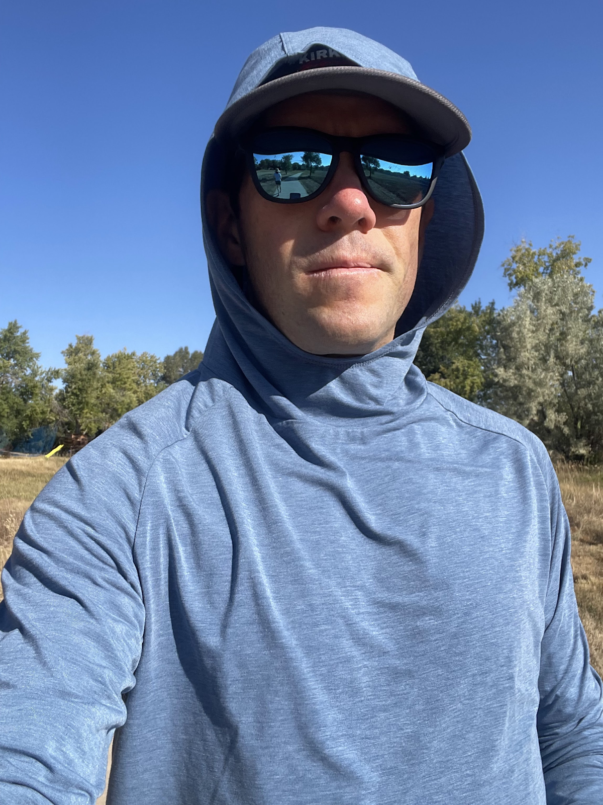
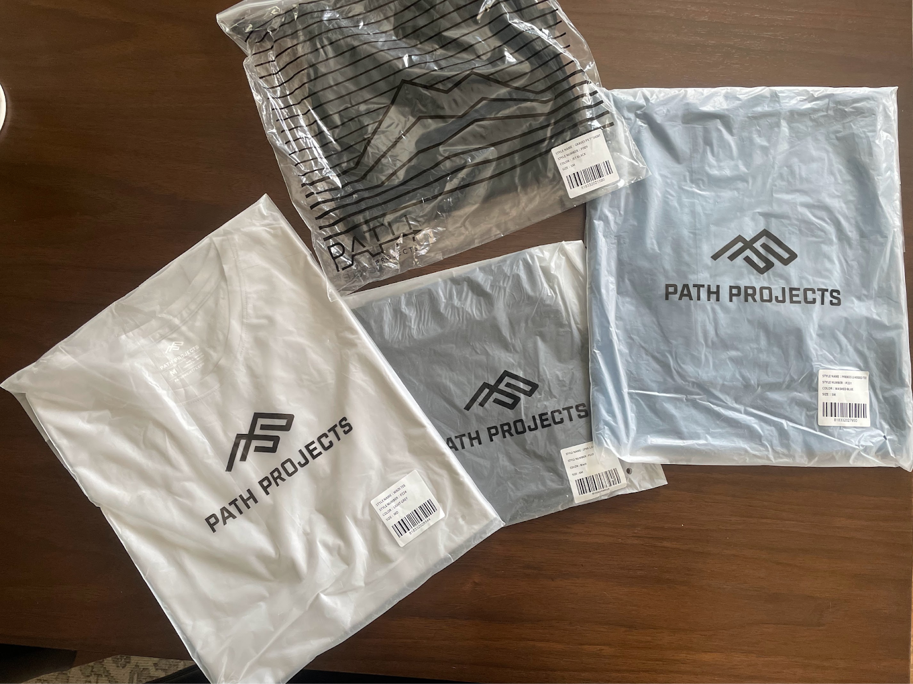
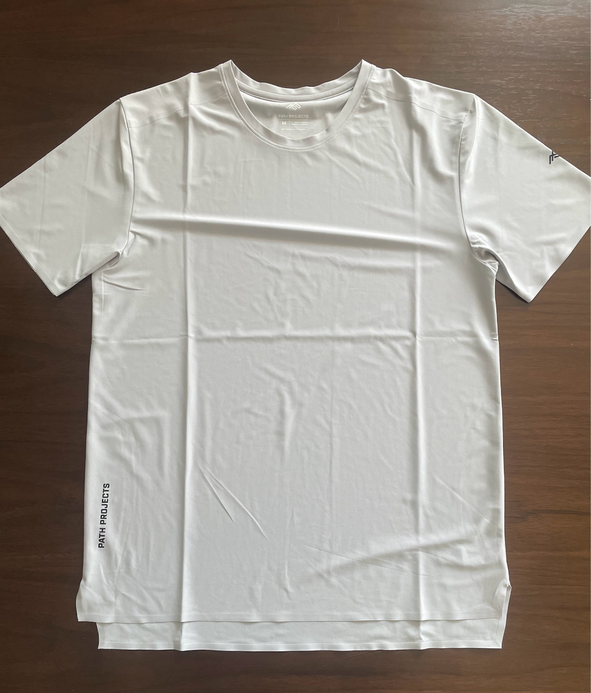
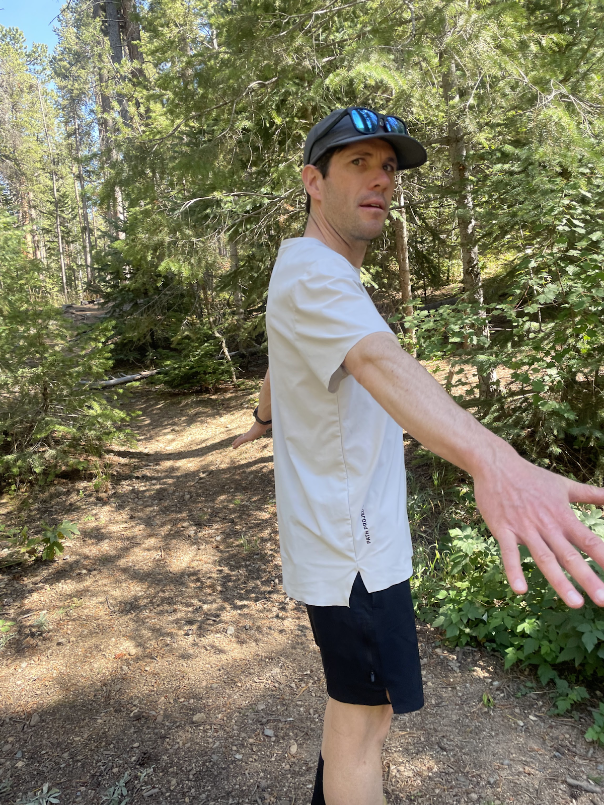
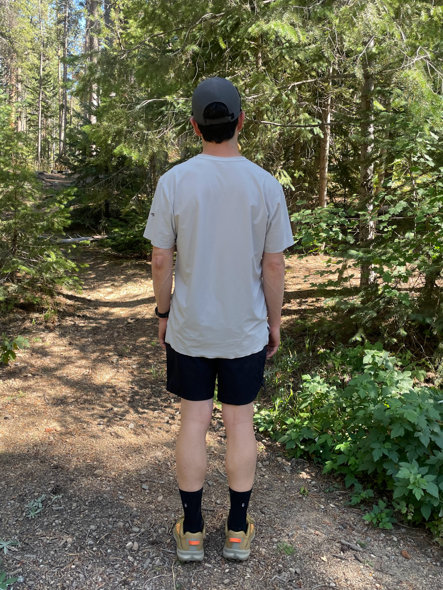

<!--more-->

## 

When it comes to hitting the trails or pounding the pavement, you need
gear that can keep up with your active lifestyle. But what if you want
clothing that can seamlessly transition from rugged runs to everyday
adventures? That's where [Path Projects](https://pathprojects.com/)
comes in.

Founded in 2018 by a group of athletes who were tired of not being able
to find the perfect running shorts, Path Projects set out to create
clothing that would bridge the gap between function and aesthetics.

They're committed to using innovative materials and thoughtful design in
their gear. The result is a complete line of technical apparel for the
modern endurance athlete. From sleek running shorts to versatile
hoodies, Path Projects gear prioritizes performance without sacrificing
style.

## **Pyrenees T19 Hoodie: A Versatile Performance Piece**

The [Pyrenees T19
Hoodie](https://pathprojects.com/products/pyrenees-t19-hoodie) ($78) is
a versatile, high-performance garment designed for both running and
everyday wear. Its lightweight, breathable fabric and thoughtful
features make it a standout choice for endurance athletes seeking
comfort and functionality.

**Key Features**

- **Tencelite 19 Fabric:** This proprietary blend offers exceptional
  breathability, moisture-wicking, and odor resistance, ensuring you
  stay cool and dry during intense workouts.

- **UPF 50+ Protection:** The Pyrenees T19 provides ample sun
  protection, making it ideal for long days on the trails or under the
  open sky.

- **Snorkel Hood:** The hood offers versatile coverage, protecting your
  head, neck, and ears from the elements.

- **Watch Slot:** A convenient watch slot on the left sleeve allows for
  easy access to your smartwatch or GPS device.

- **Adjustable Cuffs with Thumb Holes:** The adjustable cuffs provide a
  customizable fit and added warmth when needed.

**Performance**

The Pyrenees T19 stands out for its remarkable combination of
performance and comfort. Its lightweight fabric, crafted from soft,
quick-drying material, prevents chafing and keeps you feeling at ease.
Designed with breathability in mind, the material ensures you stay cool
during vigorous workouts, while its UPF 50+ protection safeguards your
skin from harmful ultraviolet rays.

The hood provides ample coverage, with ample room to accommodate hats
underneath. A thoughtful addition is the watch slot, allowing you to
monitor your metrics without the hassle of removing gloves or rolling up
sleeves. Adjustable cuffs enhance versatility, giving you the
flexibility to customize the fit and warmth to your preferences.

**Fit**

Being a 5'6" runner who usually wears a small size, the Pyrenees T19
Hoodie's fit was unexpectedly roomy for me. While this may not be an
issue for everyone, it's important to mention that the small size was
quite loose on my frame. However, the bagginess didn't diminish the
overall comfort of the hoodie. Surprisingly, I found the extra space
rather enjoyable, particularly on cooler days when layering was
necessary.

**Overall Impression**

The Pyrenees T19 Hoodie is a versatile and meticulously crafted apparel
designed for outdoor enthusiasts and runners. This lightweight and
breathable hoodie offers exceptional performance and comfort, making it
a perfect choice for various activities. Its thoughtful features include
sun protection, ensuring you stay shielded during your outdoor
adventures. Whether you're embarking on an extended trail run or seeking
a stylish and comfortable hoodie for daily wear, the Pyrenees T19 is a
worthwhile investment. Experience the harmonious blend of functionality
and style with this remarkable hoodie.

## **Graves PX 7" Short: A Lightweight and Durable Workhorse**

The [Graves PX 7"
Short](https://pathprojects.com/collections/shorts/products/graves-px-short)
($58) is a lightweight and durable running short designed for the most
grueling workouts. Constructed with Primeflex™ fabric from Toray, this
short offers exceptional breathability, abrasion resistance, and a soft
feel against the skin.

**Key Features**

- **Primeflex™ Fabric:** This high-performance fabric provides excellent
  stretch, recovery, and breathability, without the added weight of
  traditional elastic materials.

- **Secure Pocketing System:** The Graves PX features multiple zip
  pockets for secure storage of essentials.

- **Separate Shorts and Base Liner System:** For optimal performance and
  comfort, Path Projects recommends pairing the Graves PX with one of
  their base liners.

**Performance**

Having worn the Graves PX shorts for several weeks, I remain
consistently impressed by their performance. The lightweight Primeflex™
fabric feels incredibly comfortable, allowing effortless movement during
my runs. The shorts never restrict my movements or cause chafing, even
during longer runs.

The secure pocketing system is a lifesaver, allowing me to carry
essentials like my car key, ID cards, and a portable keychain alarm. The
pockets are spacious enough to accommodate my iPhone 12 mini with a slim
case without feeling bulky, although I rarely carry it on runs.

The separate shorts and base liner system are game-changers. The base
liner remains firmly in place, effectively wicking away moisture, while
the shorts ride comfortably on top, minimizing the risk of chafing.

**Fit**

Standing between sizes Small and Medium, I chose Medium this time. While
a Small might fit snugly but not overly tight, the Medium provides a
greater range of motion without any sense of restriction.

**Overall Impression**

The Graves PX 7" Short is a fantastic piece of running apparel that I
highly recommend. Its lightweight fabric, secure pocketing system, and
compatibility with Path Projects base liners make it a versatile and
comfortable choice for runners of all levels.

## **Linx PD Undershort Liner: A Lightweight and Breathable Base Layer**

The [Linx PD undershort
liner](https://pathprojects.com/products/lynx-pd-base-liner) ($38) is a
lightweight and breathable base layer designed to enhance the
performance of Path Projects running shorts. This liner offers superior
wicking, quick drying, and a comfortable fit.

**Key Features**

- **Power Dry® Technology:** This technology provides exceptional
  mechanical wicking, pulling moisture away from the skin and dispersing
  it for faster drying times.

- **Acrofuse™ Seam Technology:** Stitch-free seams provide unmatched
  mobility and prevent chafing.

- **Lightweight and Breathable:** The Linx PD is designed to be
  lightweight and breathable, keeping you cool and comfortable during
  your workouts.

**Performance**

I've been using the Linx PD undershort liner with my Graves PX shorts,
and it's been a great combination. The liner does an excellent job of
wicking away moisture, keeping me dry and comfortable even on the
hottest days. The Acrofuse™ seam technology is a game-changer,
preventing chafing and allowing for unrestricted movement.

**Fit**

The Linx PD is a snug-fitting base layer, as it's designed to be worn
underneath your running shorts. I find that the medium size fits me
perfectly, providing the right amount of compression without feeling too
tight.

**Overall Impression**

The Linx PD undershort liner is like a *super cool* base layer that
makes those Path Projects running shorts work even better. The fabric is
lightweight and breathable, and the Acrofuse™ seam tech makes it feel
like you're not even wearing anything at all. It's a must-have for any
runner who wants to take their running game to the next level.

## **Wadi Tee: A Lightweight and Breathable Summer Essential**

The [Wadi
Tee](https://pathprojects.com/collections/best-sellers/products/wadi-tee)
($68), a lightweight and breathable t-shirt, is an excellent choice for
warm summer days. During my runs and hikes, it has definitely become one
of my top gear preferences.

**Key Features**

- **Toray Fieldsensor™ Byokan Fabric:** This innovative fabric provides
  exceptional moisture management and sun protection without the need
  for a topical finish.

- **Lightweight and Breathable:** The Wadi Tee is incredibly lightweight
  and breathable, keeping me cool and comfortable even in the hottest
  conditions.

- **Welded Seams:** The welded seams provide a seamless fit that
  prevents chafing and allows for unrestricted movement.

**Performance**

I've been particularly impressed with the Wadi Tee's ability to manage
moisture. The Toray Fieldsensor™ Byokan fabric does an excellent job of
wicking away sweat, keeping me dry and comfortable even during intense
workouts. The lightweight and breathable nature of the fabric is another
standout feature. It never feels heavy or restrictive, even on the
hottest days.

The welded seams are a great touch. They provide a seamless fit that
prevents chafing and allows for unrestricted movement. I've noticed that
I'm less prone to irritation when wearing the Wadi Tee compared to other
t-shirts.

**Overall Impression**

The Wadi Tee is a fantastic summer essential. Its lightweight and
breathable fabric, combined with the excellent moisture management and
sun protection, make it a must-have for anyone who spends time outdoors
in hot weather. If you're looking for a comfortable and functional
t-shirt that can keep up with your most demanding workouts, I highly
recommend the Wadi Tee.

