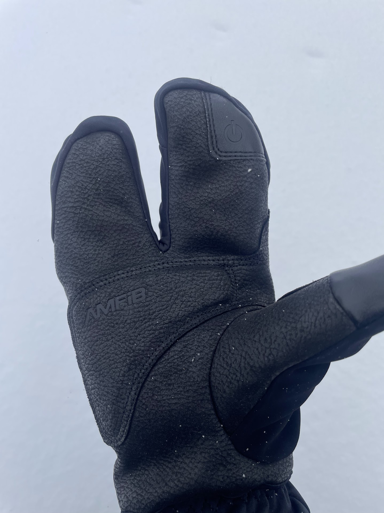
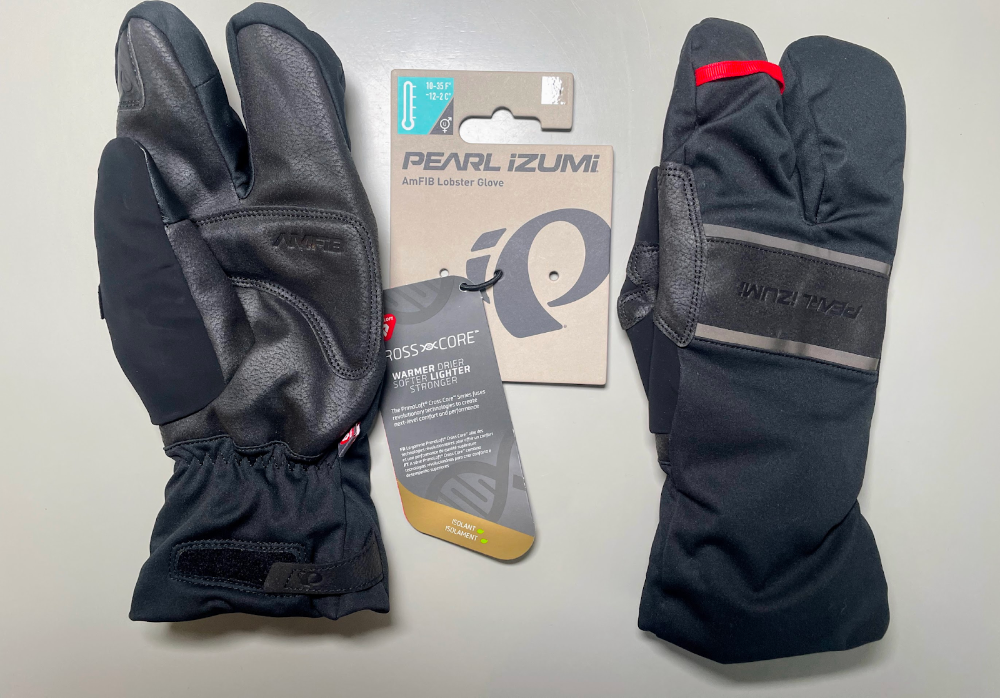
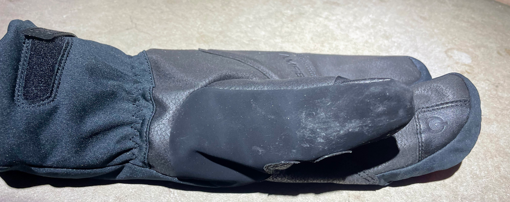
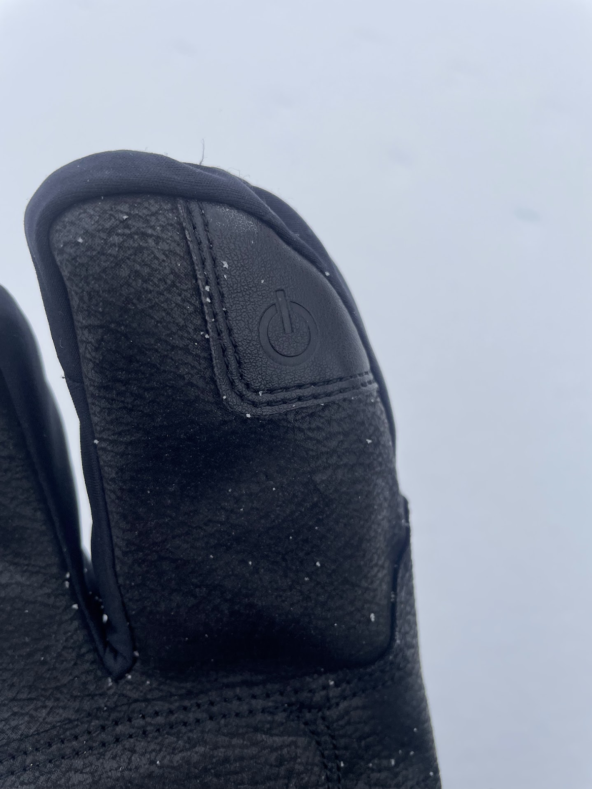
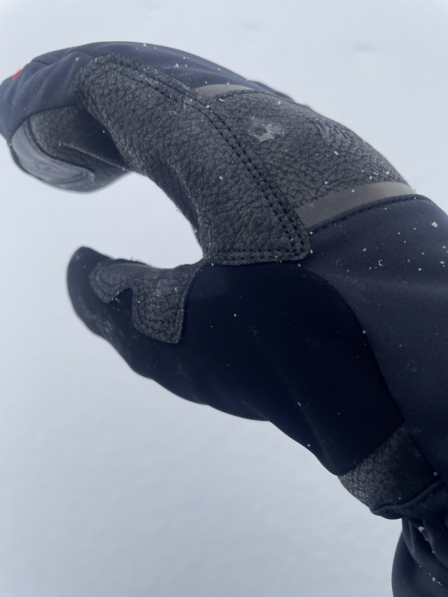
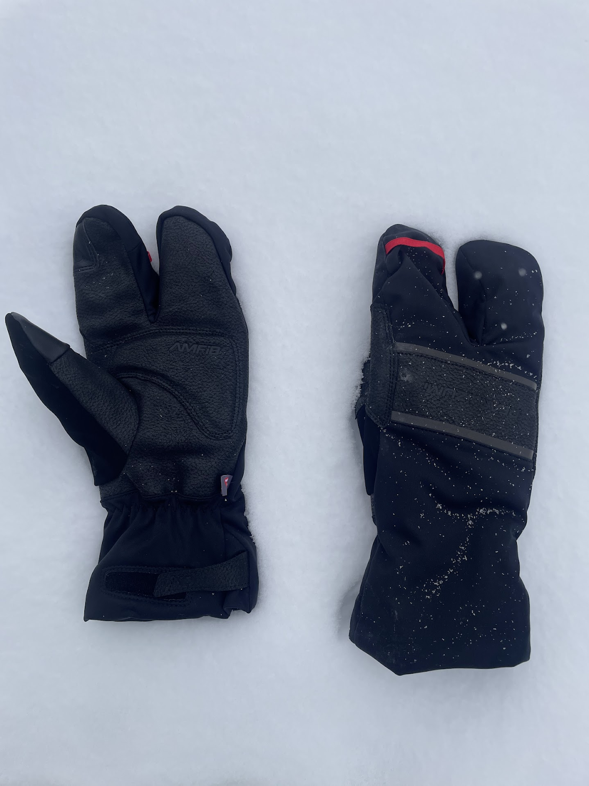

<!--more-->

In the realm of winter gear, where warmth and dexterity engage in a
delicate dance, the [Pearl Izumi AmFIB® Lobster Gel
Gloves](https://www.pearlizumi.com/products/amfib-lobster-gel-gloves-14342006?variant=40647605485739)
($85) emerge as a captivating creation. They weave together innovative
technology and thoughtful design, promising to shield hands from the icy
grasp of frigid temperatures. But do they truly deliver on their
ambitious claims? This review, forged through rigorous testing in
10-20°F temperatures, seeks to unravel the truth.

The core of these gloves is the 170g Primaloft Gold insulation with
Crosscore technology, a blend that delivers unmatched warmth without
compromising performance. The lobster design, an innovative fusion of
two fingers grouped together, aims to bridge the gap between mitten-like
warmth and individual finger dexterity - ideal for grasping large
shoelaces and bike brakes. This intricate blend of technology and design
warrants a closer look.

## Warmth

The gloves provide a warm and comfortable embrace, like a warm hearth in
the midst of a snowstorm. The Primaloft Gold insulation lives up to its
reputation, keeping your hands warm in temperatures as low as 10-20
degrees Fahrenheit. The innovative lobster design traps heat in the
gloves, while still allowing for a surprising amount of dexterity.
During frosty runs and brisk bike rides, my hands remained blissfully
unaware of the biting wind, thanks to the gloves' thermal sanctuary.

## Dexterity

While warmth is the gloves’ primary focus, they do not entirely
sacrifice dexterity. The split fingers provide a surprising degree of
control, allowing me to shift gears and manipulate brake levers on my
bike with relative ease. 

However, there is a slight decrease in precision compared to traditional
gloves. I was also able to use my phone’s touchscreen, though it
required more focus due to the gloves’ thickness.

## Weather Resistance

Mother Nature put the gloves’ mettle to the test with a flurry of snow
and ice. The AmFIB® DWR water-resistant fabric repelled the elements,
keeping the gloves dry and comfortable. The gloves also provided a
barrier against the wind, blocking its icy breath.

## Comfort and Fit

These gloves fit like … a glove … providing a secure and reassuring
hold. The velcro closure at the wrist allows for fine adjustments,
ensuring a personalized fit. The palms are padded, which provides a
welcome respite from the constant tremors of the handlebars, especially
during extended rides.

However, even the most impressive feats of engineering come with some
caveats:

- **A Stiff-Clothed Thumb**: The gloves were impervious to the cold and
  elements, but the thumb’s fabric was a different story. Its coarse,
  inflexible texture made it difficult to wipe away sweat or a runny
  nose. I liked when Pearl Izumi used terry cloth because it was so much
  softer and less abrasive. 

- **Dexterity's Sacrifice**: Although the gloves enabled me to perform
  rudimentary maneuvers, intricate tasks that required exacting finger
  dexterity, such as tying shoelaces or retrieving fallen earbuds, were
  much more challenging.

## Conclusion

The Pearl Izumi AmFIB® Lobster Gel Gloves are a testament to the power
of innovation and resilience in the face of winter's wrath. They offer
unparalleled warmth, weather resistance, and a comfortable fit, making
them ideal for runners and cyclists braving the frosty landscape.
However, those who prioritize dexterity and a softer thumb material may
find themselves disappointed. Ultimately, the decision of whether or not
to purchase these gloves depends on your individual needs and
priorities. If you are seeking warmth above all else, then these gloves
will serve you well. However, if you require the dexterity of nimble
fingers, you may want to look elsewhere.