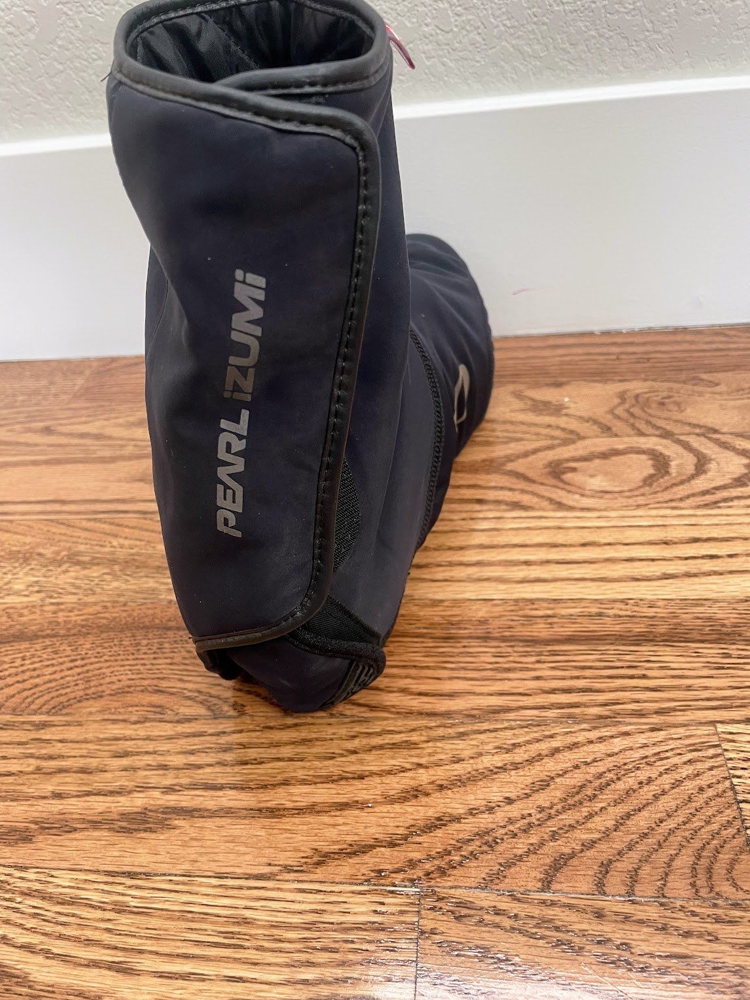

<!--more-->

Here in the Front Range of Colorado, April weather really just means
that <s>second</s> <s>third</s> fourth winter is coming, and that means
cold weather cycling. If you're like me, you know that nothing can ruin
a cold weather ride faster than cold toes. That's where the PEARL iZUMi
AmFIB Shoe Covers come in.

The AmFIB Shoe Covers are made from a combination of AmFIB fabric and
Thermolite insulation. AmFIB is a water-resistant, windproof, and
breathable fabric that helps to keep your feet warm and dry in cold
weather. Thermolite insulation is a lightweight, synthetic insulation
that traps heat, providing additional warmth.

The AmFIB Shoe Covers are designed to fit snugly over your cycling
shoes. They have a wide elastic band at the top that helps to keep them
in place, and a hook-and-loop strap at the bottom that provides
additional adjustability. The velcro secure on the heel is nice for easy
entry and removal.

The shoe covers are also compatible with cleats, so you can wear them
with your favorite cycling shoes.

I've been using the AmFIB Shoe Covers for a few months now, and I'm very
impressed with them. They've kept my toes warm and dry in cold weather,
even when I've been riding in wet conditions. They're also very
comfortable to wear, and they don't restrict my movement.

If you're looking for a pair of foot warmers to keep your toes warm in
cold weather, I highly recommend the PERAL iZUMi AmFIB Shoe Covers.
They're a great value for the price at $85, and they're sure to keep
your feet warm and dry all winter long.

Here are some additional pros and cons of the PEARL iZUMi AmFIB Shoe
Covers:

> ### **Pros**
>
> - Keep your toes warm and dry in cold weather
>
> - Comfortable to wear
>
> - Don't restrict movement
>
> - Compatible with cleats
>
> - Affordable at $85 compared to other brands that can be over $150

> ### **Cons**
>
> - The elastic band at the top can be too tight
>
> - The AmFIB fabric can be a bit noisy when it rubs against your shoes

Overall, the **PEARL iZUMi** AmFIB Shoe Covers are a great option for
cyclists who want to keep their toes warm and dry in cold weather.
They're comfortable to wear, they don't restrict movement, and they're
affordable. I highly recommend them.
