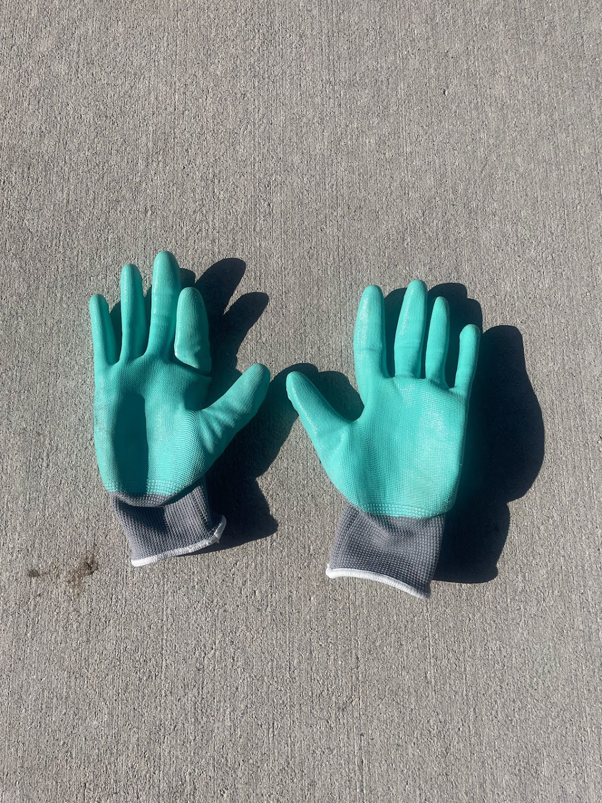
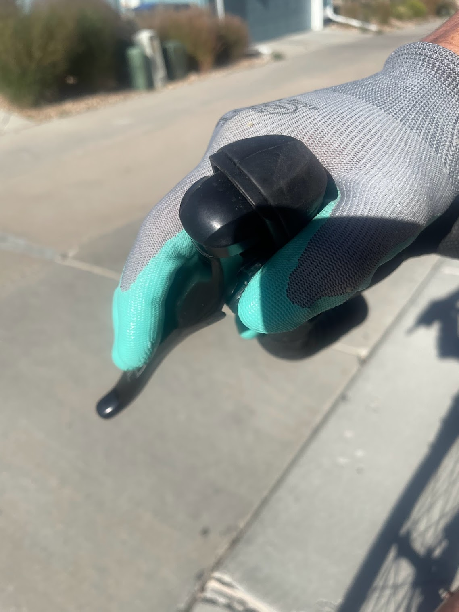

<!--more-->

I'm always on the lookout to try out products in unique ways. Recently,
I bought a package of [HAUSHOF nitrile coated gardening
gloves](https://www.walmart.com/ip/HAUSHOF-6-Pairs-Garden-Gloves-for-Women-Nitrile-Coated-Working-Gloves-for-Gardening-Restoration-Work-Pink-Green-M/764270151).
I was curious to see how they would work as cycling gloves, so I decided
to give them a whirl.

I was a little doubtful at first, but I was pleasantly surprised by how
well the gloves worked. The nitrile coating provided a good grip on the
handlebars, and the gloves were comfy enough to wear for long rides. I
was also impressed by the durability of the gloves. I've been using them
for a few weeks now, and they've held up well to the elements.

Thanks for reading Boulder Gear Lab! Subscribe for free to receive new
posts and support my work.

Of course, there are a few downsides to using these gardening gloves as
cycling gloves. The biggest downside is that they're not as breathable
as traditional cycling gloves. This can lead to sweaty palms inside the
nitrile coating, especially on hot days. Another downside is that the
gloves aren't as protective as cycling gloves on the back of the hand or
in the palm. And, if you crash, you're more likely to get road rash on
your hand.

Overall, I was impressed with the HAUSHOF nitrile coated gardening
gloves. They're a great option for cyclists who are looking for a
durable, comfortable, and very affordable pair of gloves. However, if
you're looking for a pair of gloves that will provide the best possible
protection and padding, you're better off with a pair of traditional
cycling gloves.

Here are some of the pros and cons of using HAUSHOF nitrile coated
gardening gloves as cycling gloves:

### Pros

> - Durable
>
> - Comfortable
>
> - Very affordable

### Cons

> - Not as breathable as traditional cycling gloves
>
> - Not as protective as traditional cycling gloves without reinforced
>   padding in the palms

Thanks for reading Boulder Gear Lab! Subscribe for free to receive new
posts and support my work.
