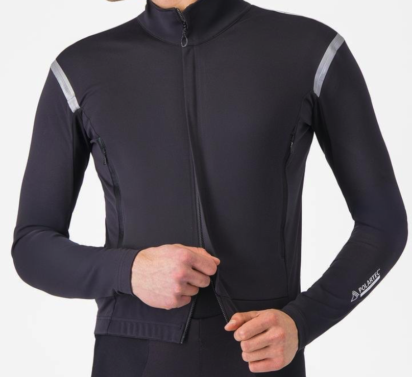
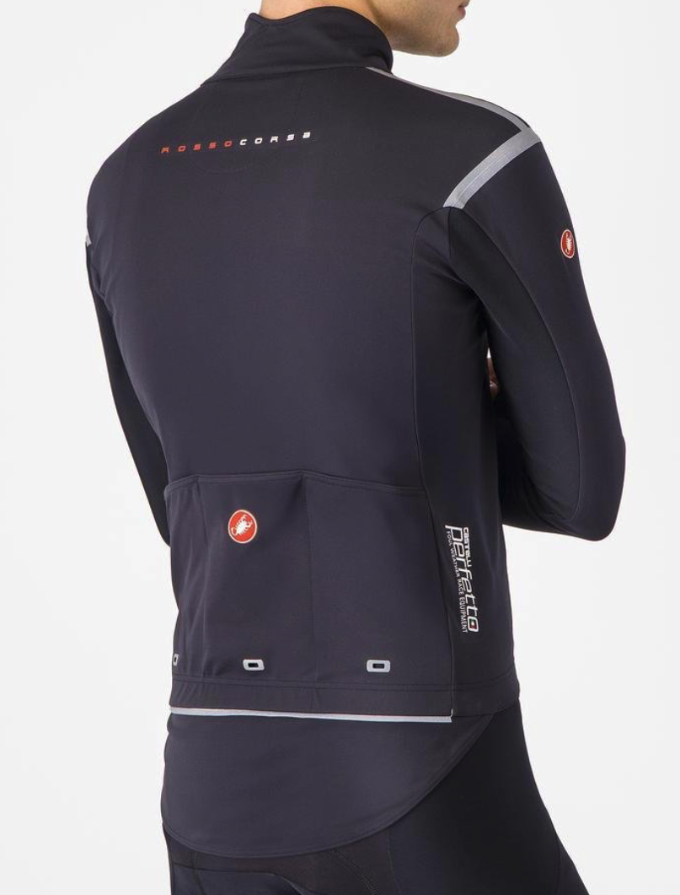

<!--more-->

*Article by John Tribbia*

Original Post from RoadTrailRun
([link](https://www.roadtrailrun.com/2025/11/polartec-aircore-castelli-perfetto-ros.html))

<a href="https://www.roadtrailrun.com"
class="button primary button-wrapper">Read All RoadTrailRun
Reviews Here</a>

Article by John Tribbia
($320)

John: While the Castelli Perfetto has long been a staple in the world of cycling, I've always viewed it through the lens of a cold-weather aerobic enthusiast. As a daily bike commuter and runner, I need a jacket that can handle the rigors of hard efforts in chilly, and even damp, conditions. This latest iteration, the Perfetto RoS 3, represents a significant shift in philosophy, prioritizing breathability over absolute waterproofness.

My testing took place through a classic shoulder season, with cool mornings, and some surprisingly chilly days. The fit of the Perfetto RoS 3 is excellent - a nice, aerodynamic cut that still allows for comfortable movement thanks to the Lycra-like feel of the new  new material which “maximizes breathability while protecting against the elements.

Designed for full-range movement, the highly engineered nano-fiber membrane enables a controlled airflow to keep you dry by escaping moisture and vapor at an industry-leading MVTR 25,000 g/m²/24 hours, along with the combination of air permeability ranging from 0.4 to 1 CFM, while also repelling water from the outside during high-intensity activities.”

I’m usually small in apparel, but Castelli generally runs smaller so I opted for the medium. This new material is incredibly clever, designed to be highly breathable while still offering a functional level of water resistance.
On cool, dry days, or during rides (and even runs) with a light, intermittent shower, this jacket is great. The increased breathability is immediately noticeable. I found myself overheating far less on climbs and staying drier from sweat, which is a common problem with less breathable jackets. The jacket effectively keeps the worst of the weather at bay and then helps you dry out quickly.

To truly make this jacket work in a variety of winter conditions, you need to be strategic with your layering. I found that I needed a slightly warmer base layer than I would typically use with a more traditional softshell. In a way, you have to relearn how to use it. You'll find yourself unzipping less on climbs and perhaps wearing it on warmer days when you would have previously opted for a long-sleeve jersey.

When layered appropriately with a quality base layer and a hardshell for heavy rain, the Perfetto RoS 3 can be part of a very effective system that keeps you drier overall.
Pros
Exceptional breathability prevents overheating and keeps you drier from sweat during high-intensity efforts.
Comfortable, stretchy, and aerodynamic fit.
Effective at keeping you dry during light showers and helping you dry out quickly.
Environmentally-friendly construction using PFAS-free materials.
Cons
Not suitable as a standalone piece for cold and wet winter conditions.
The high breathability can lead to getting cold quickly if you get soaked.
Relies on proper layering with other garments to be truly versatile.
The dropped tail lacks a gripper and can ride up.

Verdict / Who is this for?
The Castelli Perfetto RoS 3 is a highly technical garment for the runner and cyclist who prioritizes breathability and often runs in cool, but not brutally cold and wet, conditions.
Think of it as a high-tech long-sleeve jersey with significant weather resistance rather than a traditional winter jacket.

If you are a rider or runner who already has a good system of base layers and a reliable waterproof hardshell, the Perfetto RoS 3 can be a fantastic addition to your wardrobe, offering unparalleled performance on mild, damp days.