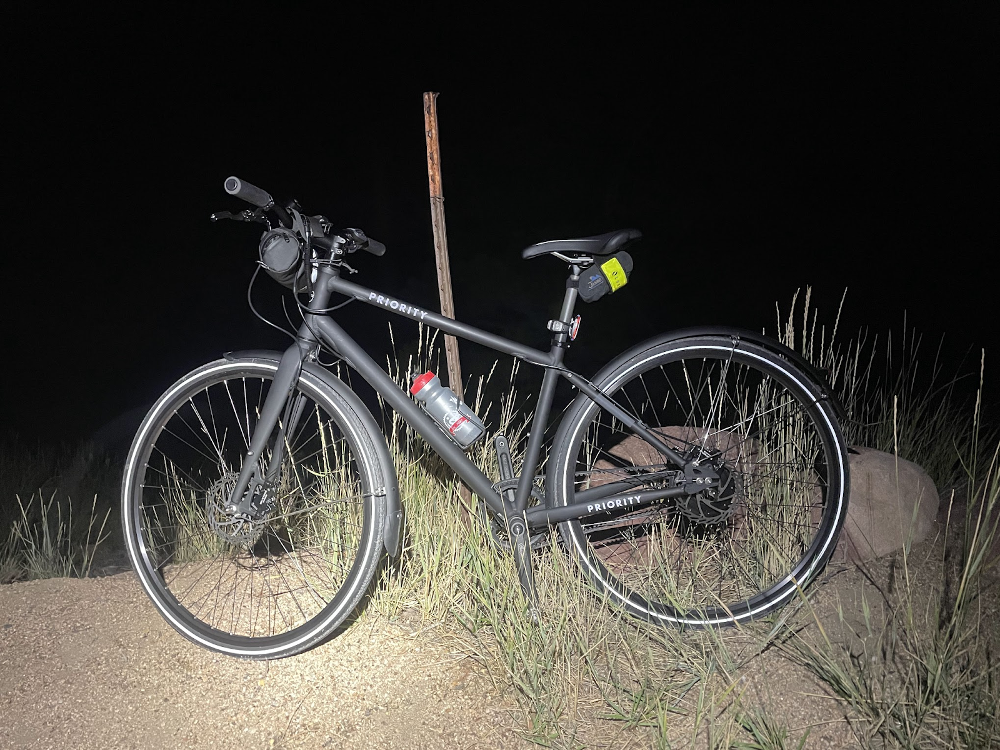
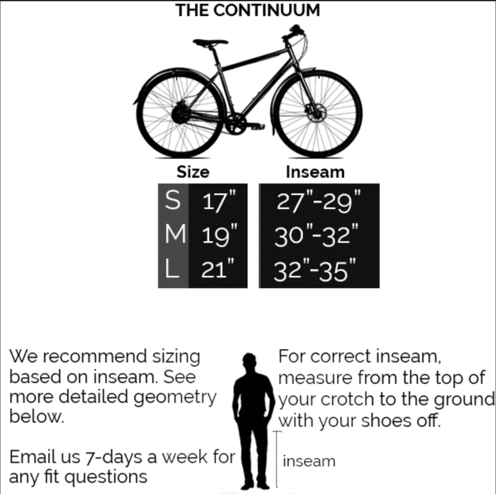
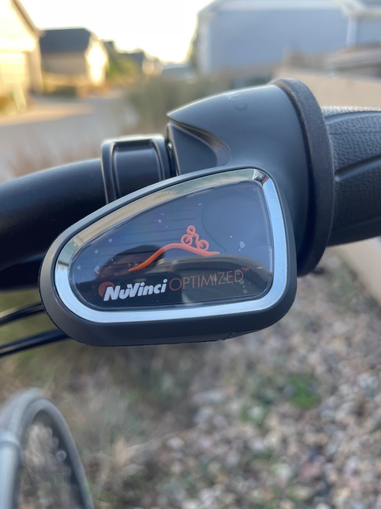
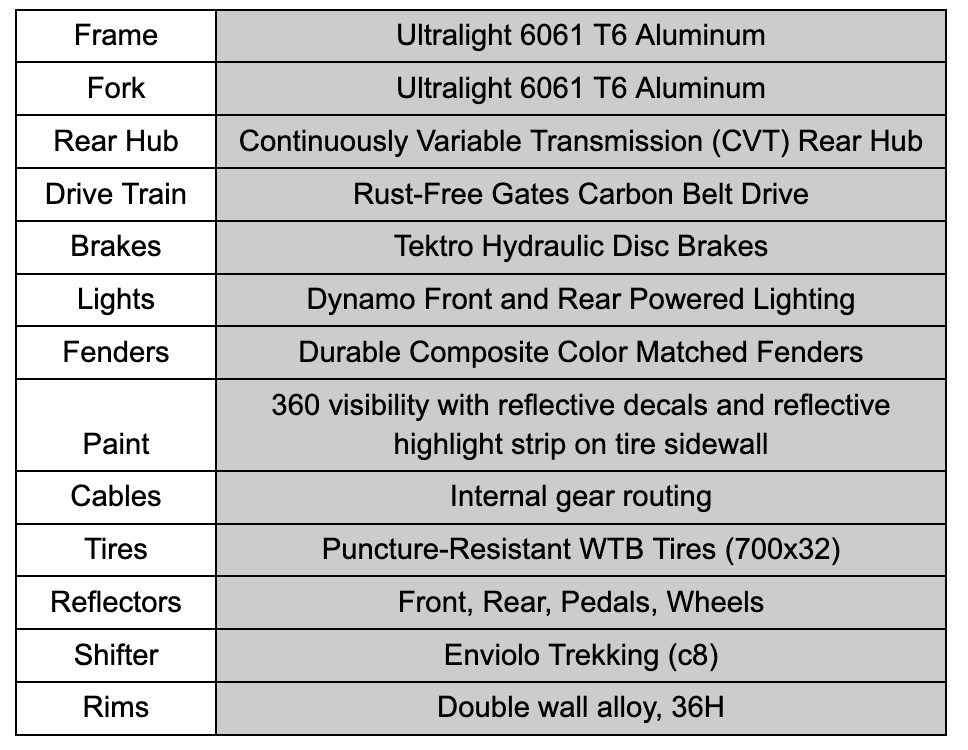

<!--more-->

Original Post on RoadTrailRun
([link](https://www.roadtrailrun.com/2022/09/roadtrailride-priority-continuum-onyx.html))

<a href="https://www.roadtrailrun.com"
class="button primary button-wrapper">Read All RoadTrailRun
Reviews Here</a>

Priority Continuum Onyx ($1,299)

Despite the fact that I’ve been riding bikes and commuting for countless
years, to this day I still end up with a greasy chainring mark on my leg
or end up staining my long pants if I’m commuting. But, what if I told
you there’s a practical bike that is low hassle, easy to take on short
or long trips for a commute or to get some exercise, feels comfortable
the moment you take it for a spin, isn’t a cruiser, and is not a greasy
mess? There seem to be a lot of bikes in this category that can cover
most of those, but the [Priority Continuum
Onyx](https://www.prioritybicycles.com/products/continuumonyx) is
unmatched when you consider its features and price point. Out of the
box, the Continuum is equipped with hydraulic disc brakes, front and
rear fenders, front and rear lights that derive power from a Dynamo hub
instead of batteries, a solid aluminum frame, and the star of the show -
a continuously variable rear hub with a Gates carbon belt.

 If you’re wanting to drive less, ride more, and experience a low
maintenance bike that is comfortable, check out the Continuum Onyx and
read more below for additional details about this affordable and
performant option.

**Pros**

- Ideal for year-round use with fully-sealed and weatherproof Enviolo
  rear hub drivetrain and Gates carbon belt. 

- Easy maintenance: no chain to clean or lubricate, no derailleurs to
  adjust. 

- Smooth CVT shifting and suitable 380% gearing range for flat and hills

- Easy assembly

- $1,299 budget friendly and well equipped

**Cons**

- Puncture-Resistant WTB Tires (700x32) are a great tire for road
  riding, but I switched them out for 700x35 wider tires to be able to
  ride on gravel

- Heavy and especially at the rear due to the weight of rear hub and
  wheels.

<a href="https://bouldergearlab.substack.com/subscribe?"
class="button primary">Subscribe now</a>

## First Impressions

The Priority Continuum Onyx arrives packed in a bike box. 

It is wrapped and packaged safely, so that there are no scratches or
damage during transport. While it might be intimidating at first to
receive an unassembled bike, it comes partially built with most of it in
one piece except the front tire, handlebars, seat post, pedals, and
fenders needing installment. Priority makes it super easy with [video
instruction](https://www.prioritybicycles.com/collections/instructions/instructions-continuum).
If you’re comfortable assembling IKEA furniture, then you should have no
problems putting this bike together. In fact, it only took me about
15-20 minutes after watching the video. 

Moreover, Priority sends you with all of the needed tools to build the
bike. 

It is worth noting that Priority recommends that a certified bike
technician should check your assembly, especially if bike mechanics are
not a comfortable area of knowledge for you.

The bike is 90% assembling and there are only a handful of tools
necessary to complete the build. 

After assembling and adjusting to fit, I took the bike for a spin around
the neighborhood. The most noticeable thing about the Continuum Onyx is
how quiet it is while pedaling and shifting. The belt drive, rear hub,
and CVT grip shifting don’t have gear steps like a traditional
drivetrain, so there is no “clang” or “crank” when shifting. I have
never experienced CVT shifting and I’m a big fan already! By twisting
the grip shifter you move up or down the resistance spectrum and can
adjust to the ideal setting rather than finding a gear and having to
adjust your effort to match.

Sealed Continuously Variable Transmission (CVT) Rear Hub with carbon
belt is durable, low maintenance, and shifts smoothly.

Another view of the sealed hub drivetrain

## Ride

I've been riding the Continuum on commutes to/from work, neighborhood
tours, and even a couple of longer recreational rides. For me, the
highlights are the shifter and brakes. 

The Enviolo hub is game changing. I realized after a few rides that I
now change resistance much more often than I would change gear on a
traditional drivetrain because I try to optimize my pedaling resistance
to the terrain. It’s so cool to be able to change gears even when you’re
not pedaling or moving. The ride is smooth and quiet, in large part due
to the shifting and gear system. In addition, the gearing - noted to be
equivalent to an 8 speed - is low enough to get me up steeper hills and
the high is great for flatter and faster terrain. 

Since there is no gear ratio, the indicator on the shifter is
represented by a rider on a hill and low means uphill while high means
flat. 

The Priority Continuum Onyx is fun to ride! It is smooth, nimble, and
relatively fast off the line if you need it to be. At 30+ pounds it is a
heavier ride, and since most of the weight is in the rear I experienced
a pinch flat in the rear tire on my first longer ride after hitting a
pothole too hard. Nonetheless, the extra weight is advantageous too as
it provides stability and compliance on the road and gravel paths. 

I ended up changing to wider tires (Schwalbe Marathon Plus Das 700x35)
to give more cushion, protection, and stability on loose gravel. The
frame and fork are aluminum, so the added tire width also dampens the
road a little more than the 32s. 

Needless to say, I also traded out the Wellgo pedals with some clipless
pedals so that I could take the bike on longer adventures and, at 8
miles one-way, my commute isn’t a quick cruise. 

What I love most about this bike is its versatility - it feels good over
longer distances, is convenient for quick jaunts around the block, and
is prepared for the adverse weather conditions with the carbon belt
drive, hydraulic disc brakes that are easy to squeeze with cold hands or
with mittens on, and a comfortable positioning that can span upright and
leisurely to streamline and competitive.

​​Carbon belt drive generates plenty of torque for steep hills given the
gearing ratio on the drivetrain.

## Fit

The Continuum comes in three sizes - Small, Medium, and Large - and the
top tube is angled for a more compact fit. I’m 5’6” and have a short
torso thanks to my scoliosis. I comfortably fit well in the Small and
find the reach to be just fine. I am upright just enough and feel like I
could lengthen the reach a little without much discomfort. All that is
to say is the Continuum is a compact bike that fits smaller reached
people like myself quite well. Not to mention, it is important to make
adjustments to the horizontal seat position and (if needed) stem length
to ensure your body is over the pedals for power and speed. 

## Specs

360 visibility with reflective decals and reflective highlight strip on
tire sidewall is great for being seen during dark night or morning
riding.

## Rating

The Priority Continuum Onyx is a perfect bike for anyone who is
interested in a low maintenance, easy to operate, smooth shifting, and
an ideal point A to point B or fitness bike. 

Versatility is the name of the game here and I found this bike was a
great option for cruising on road, bike path, and crushed gravel paths.
I would say it is best suited for bike paths and the road though. 

The Continuum’s shifting and drivetrain are the quietest and smoothest
I’ve ever used. The 380% gearing range is enough for most hills. 

Moreover, the appeal of low-maintenance with the sealed rear hub and the
belt drive is top of the list for any commuter or cyclist who prefers
quick transitions. The drivetrain cogs and belt are probably going to
wear out and need replacement, but those have much longer lifespans than
the traditional chain and derailleur drivetrains. Notwithstanding, they
don’t risk damage with bumps to rocks, walls, or other obstacles. 

At $1,299, the Continuum is budget friendly and has a great return on
investment because it comes equipped with durable quality components
including, but not limited to, hydraulic disc brakes, Gates carbon belt
drivetrain with a CVT rear hub. 

Ride - 9/10 (quick, stable, and fun!)  
Fit - 9/10 (three size options and would be hard if you were in between
sizes)  
Specs - 8.5/10 (low maintenance, smooth shifting, and bomb proof
components)  
Fun Factor (out of 5) - 🙌 🙌 🙌 🙌 

**Overall Average: 8.8 / 10**

Thanks for reading Boulder Gear Lab Substack! Subscribe for free to
receive new posts and support my work.

## Tester Profile

**John Tribbia** is a regular technical reviewer for running-oriented
product testing website [RoadTrailRun](http://www.roadtrailrun.com) with
a large readership domestically and internationally. He has other
writing about NAAWK
[Sunscreen](https://naawkblog.wordpress.com/2017/01/03/dont-stow-away-the-sunscreen/),
Thule [Jogging
Strollers](http://www.backcountry.com/explore/dos-and-donts-of-baby-jogging),
Atlas [Snowshoe
Running](http://www.backcountry.com/explore/winter-fitness-snowshoe-running),
and Yuba Cargo E-Bike ([Part
I](https://yubabikes.com/how-to-adopt-the-cargo-bike-lifestyle-step-1/),
[Part
II](https://yubabikes.com/how-to-adopt-the-cargo-bike-lifestyle-step-2/),
[Part
III](https://yubabikes.com/how-to-adopt-the-cargo-bike-lifestyle-step-3/),
[Part
IV](https://yubabikes.com/how-to-adopt-the-cargo-bike-lifestyle-step-4/)). 

He dabbled in bike racing both mountain and road as a junior Cat 5 and
eventually upgraded to Expert on the mountain bike. After his brief
stint of cycling racing and once in college, John crossed over to
running and found success as a sponsored mountain/trail runner by
placing atop the podium in domestic and international races. But he
always kept his bikes nearby for cross training while injured,
supplemental training, and commuting. Given that cross-over experience
as well as 6+ years of working at [University
Bikes](https://www.ubikes.com/) in Boulder, CO and over 20 years of
competitive running, he loves the opportunity to test the latest and
greatest in both sports. 
