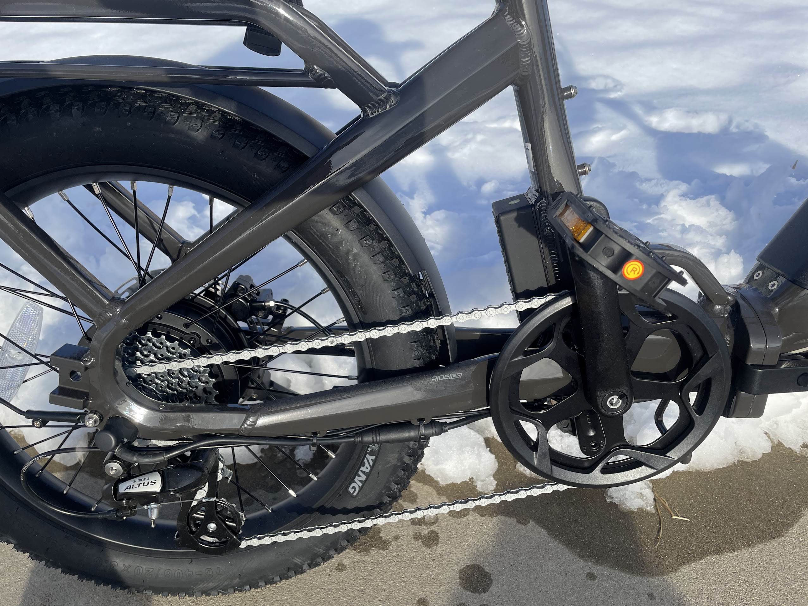

<!--more-->

Whether you live in a crowded city or crave a bike that's easy to store
for all your adventures, folding eBikes offer a fantastic solution. The
[Ride1up
Portola](https://ride1up.com/product/portola?offer_id=1&aff_id=1542)
($995) is a prime example, blending practicality, sustainability, and
power for a ride that fits seamlessly into today's eco-conscious,
space-saving lifestyle.

## **Assembly**

Let's start with the good news: [setting up the Portola is a
breeze](https://www.youtube.com/watch?v=4YjfHkL6JK4). Even for DIY
novices, the process is straightforward. The bike arrives partially
assembled, and the remaining steps – attaching the handlebars, wheels,
and seat – are well-explained in the included manual. Within 30 minutes,
I was ready to roll (or fold, to be more precise).

