<!--more-->

Original Post from RoadTrailRun
([link](https://www.roadtrailrun.com/2026/01/salomon-aero-glide-4-grvl-review-5.html))

<a href="https://www.roadtrailrun.com"
class="button primary button-wrapper">Read All RoadTrailRun
Reviews Here</a>

Article by Kelly McHenry Jennings, Sam Winebaum and John Tribbia

### Salomon Aero Glide 4 GRVL ($160)

### Introduction

Sam: The Aero Glide 4 GRVL is Salomon entry into the growing “gravel” category or really any road to light trails as far as I am concerned.
The GRVL can now take you from the road, where even with its enhanced traction over a road shoe it runs smoothly, to now even moderately rougher trails than before increasing its versatility.
The Aero Glide 3 GRVL was fun and bouncy due to its supercritical expanded TPU beads foam, had adequate light trails traction but essentially had a road shoe upper that didn’t keep up for me on any kind of rougher terrain.
The update here is to the upper and this stouter upper with a new one handed closure system is now far more trails worthy than before as it now better controls the soft and bouncy foam below.
The underfoot platform of foam, with a big 41mm heel / 33mm forefoot full stack height, moderately broad at the ground platform and outsole of 2 and 3mm lug depth remain unchanged. Please read on for all the details as Kelly and I ran them on the road and snow here in Park City. Actual gravel to come!

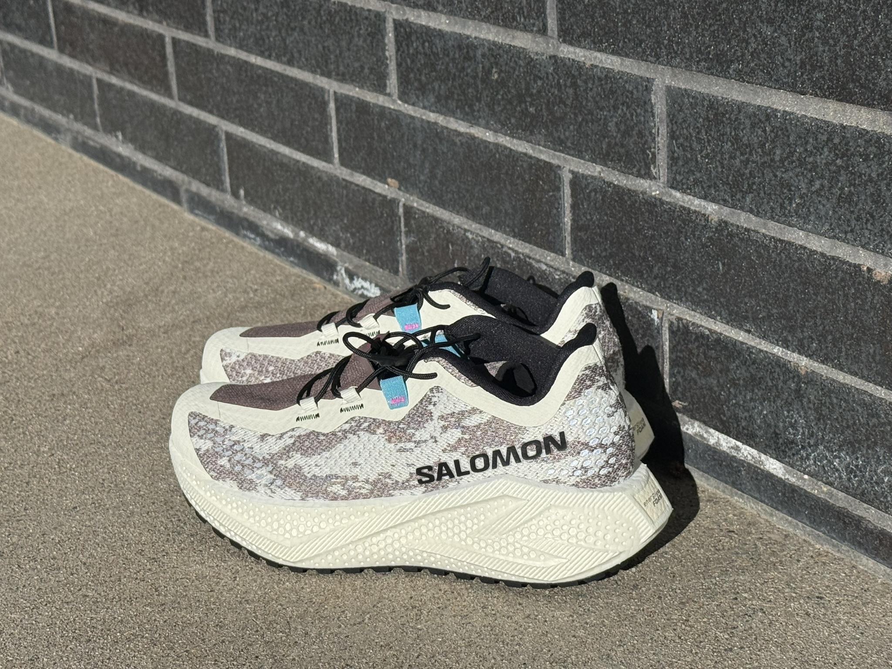

Kelly: One of the great things about living in Park City, Utah is the easy access to an incredible variety of trails and running surfaces. The options are so plentiful that I often prefer to run straight from my front door to the trailhead, picking up a mix of terrain along the way. That’s exactly where the Salomon Aeroglide 4 GRVL fits into my shoe rotation. It sits in the growing hybrid space between road trainers and light trail or gravel shoes, designed for runners who don’t want to think twice about what surface comes next.
While I haven’t been able to put in significant miles on true gravel just yet—current conditions are a mix of hard-packed snow, asphalt, and muddy trails—the Aeroglide 4 GRVL has already shown its versatility. It delivers a smooth, comfortable ride on pavement, with enough traction and protection to feel confident when the run heads off-road. For anyone looking for a single shoe that transitions easily from asphalt to light trail without feeling heavy or overly rugged, the Aeroglide 4 GRVL makes a strong early impression.

### Pros

New secure and trails worthy upper, improved over v3, new single handed closure system: Sam
Versatile: Energetic soft bouncier ride is now more stable due to the new upper and can better range off gravel and road to trails: Sam / John
Outsole has solid grip and plays well on the road: Sam / John
Notable extensive reflective highlights: Sam
Breathable mesh upper (but perhaps a little too breathable for wet winter running!): Kelly
Easy to step into and very quick to secure: Kelly / John

### Cons:

Significant 24g difference in weight between left and right shoe sample: Sam
Plastic cord closure clip is large and hard to stuff into the front garage: Sam
Plastic cord feels bulky and slightly uncomfortable on the top of my foot when I secure it in the front garage, so I’ve been mostly running with the cord out, which is a bit distracting: Kelly
Unstable on technical terrain: John
Hard to pull on, also a Pro as the fit is very secure: Sam

### Stats

Approx. Weight: men's  9.5 oz / 269g :: women’s  8.1 oz / 230g US8
Sample Weights:
men’s  9.63 oz / 273g US8.5/ EU42 (average L/R-261g left shoe, 285g right shoe)
v3: 9.2 oz / 261g US8.5
Women’s   9.175oz/ 260g US W8  (average L/R- 9.21oz /261g left shoe, 9.14oz/259g right shoe)
Stack Height:  41mm heel /  33 mm forefoot (unchanged)
Platform Width:  90mm heel /  75mm midfoot  / 110 mm forefoot (unchanged)

### Most comparable shoes

Mount to Coast H1 ()
Brooks Ghost Trail ()
Adizero EVO SL ATR (w)

### First Impressions, Fit and Upper

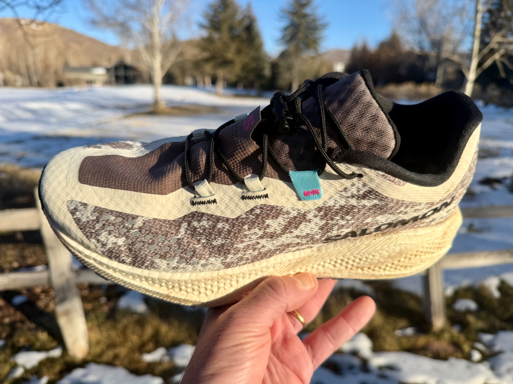

Sam: The upper material is a relatively soft and pliable mesh with a raised outer texture and smooth inner texture. A substantial overlay extends from the ankle collars all the way in parallel lines on either side to create the webbing cord ace loop holders all the way through the toe box ending as the outer layer of a moderately stiff toe bumper.

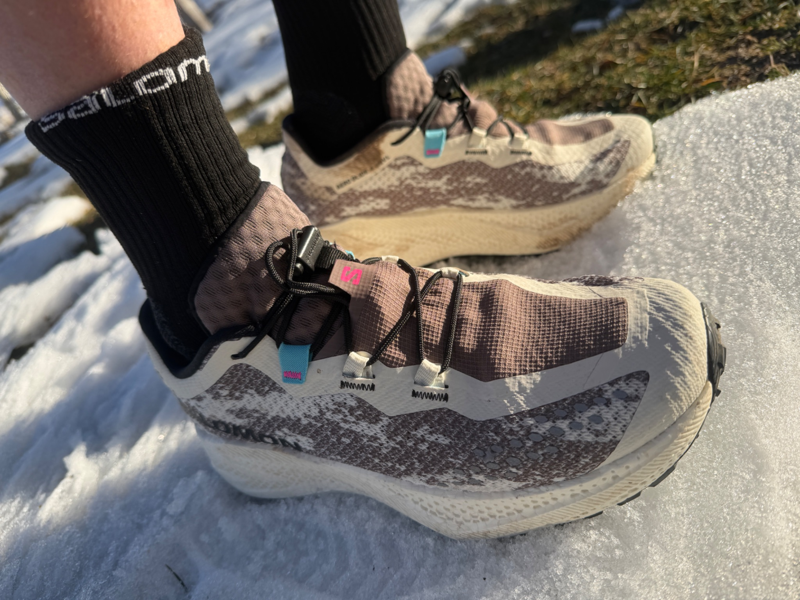

Down the center of the toe box we have a “Dynamic Vamp” of very soft very thin mesh which in addition to creating as needed toe box volume is also a garage for the new one handed pull lacing system.
The toe box is moderately broad in appearance and fit and because of the vamp very adaptable to different volume feet while remaining secure and over the toes comfortable
Salomon is well known for its QuickLace system of thin cords. Here the cords are bigger in diameter.

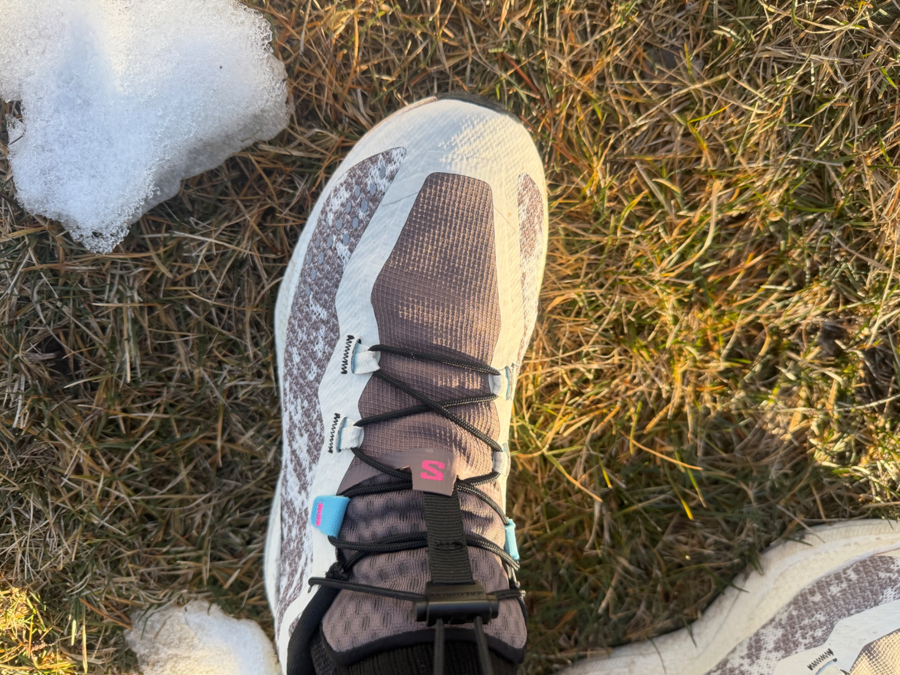

You pull towards you to tighten, first taking up slack towards the toe as you normally would do ,  moving your hand side to side to take up the slack as you pull. Then to finish slide the plastic holder (I think it could be smaller) down.

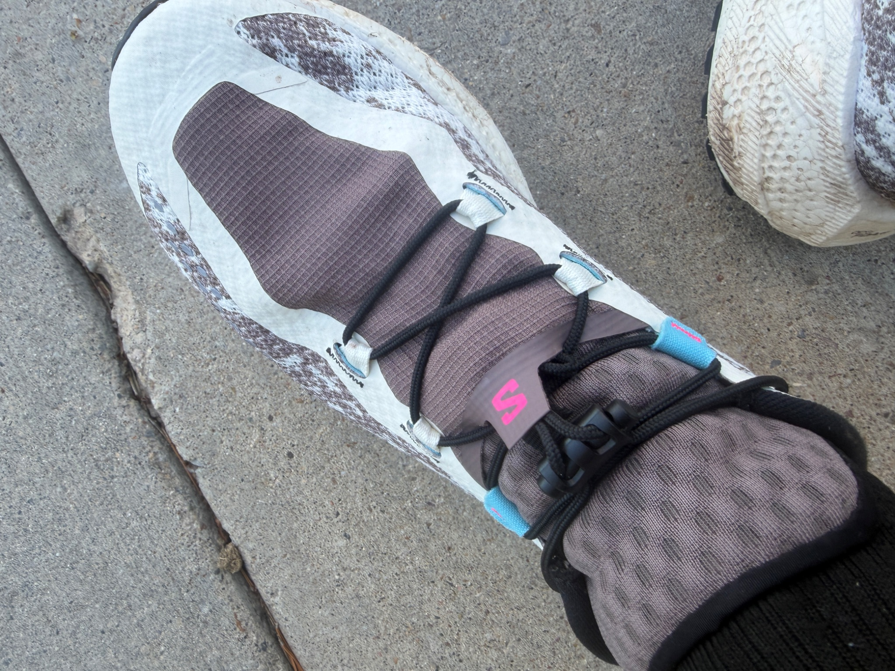

Tuck the laces into the front pocket which is an extension of the vamp To loosen press both side buttons of the clip and slide up. They are easier to take off than put on, a good sign by me that the support is solid but wish the pocket had a bit more room

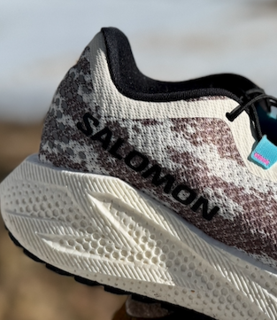

The heel counter is semi rigid with foot sitting down into the midsole side walls.

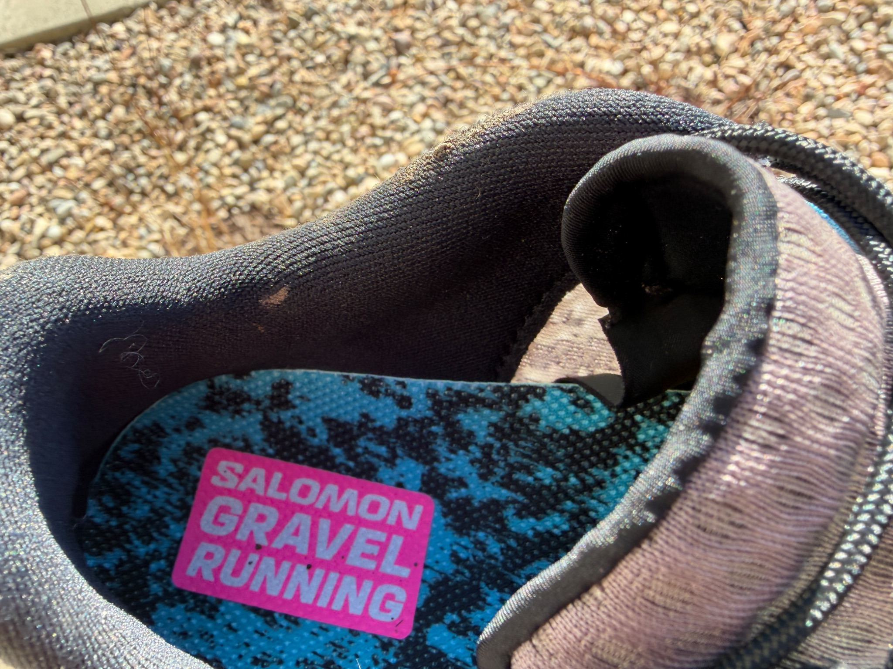

The collars are not particularly deeply padded and suitably rigid to stabilize the foot in what is a 41mm heel stack height of quite soft foam.
In combination: the cord system, the lightly padded gusset tongue, heel counter and full length overlays deliver essentially a trail shoe worthy hold and fit in a soft and pliable more road shoe like mainupper mesh.

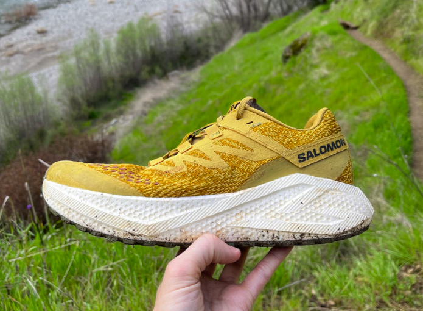

The AeroGide 3 GRVL shown above had essentially a very lightly more supportive road upper of similar material with a few minor overlays at midfoot that in combination with the high stack and soft foam made them not really trails worth for me. Here in Glide 4 we have no compromises in hold or comfort for pretty much any “terrain” except more technical trails.
Kelly: From the initial step-in, the Salomon Aeroglide 4 GRVL felt immediately comfortable and well supported, with a lightweight, energetic feel that made me eager to put in more miles. On the run, that first impression held up: the ride felt bouncy and engaging while remaining comfortable over longer, hillier efforts on non-technical terrain. A second outing—a 10-mile hill workout spanning pavement, snow, ice, and small sections of gravel—highlighted the shoe’s versatility. Even in mixed winter conditions, the Aeroglide 4 GRVL transitioned smoothly between surfaces and never felt out of place. Overall, it feels impressively light on foot and genuinely enjoyable to run in.

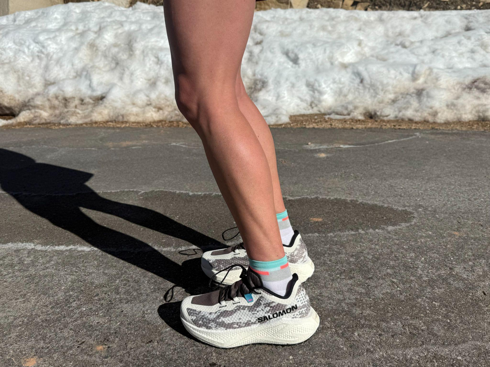

The upper is soft, highly breathable, and comfortable against the foot, while still providing enough structure for light off-road use. During early-morning runs in ~20°F temperatures, the breathability was almost too effective, allowing some chill through the upper—though this feels more like a function of testing a gravel-focused shoe in winter conditions. In warmer weather and on dry terrain, the upper should excel.
Fit through the toe box struck a balanced middle ground for my medium-width foot. It felt slightly on the wider side but remained secure and supportive, avoiding the constricted feel of narrow designs or the instability of overly wide ones. Notably, even after stepping into icy water and running with wet socks, I experienced no hot spots or blisters on longer efforts.
The upper leans more road-like in its lightweight, flexible feel, but the Quicklace system allows for easy adjustment and adds trail-style security when needed. This balance between comfort and lockdown is one of the shoe’s strengths.
This was my first experience with Salomon’s Quicklace system, and I found it intuitive and easy to use. My one point of feedback is the lace garage: because the upper mesh is so thin and breathable, the tucked lace pocket occasionally pressed on the top of my foot and required minor adjustment mid-run. Running with the laces untucked was possible but less than ideal, making proper stowage worth the extra effort.
Midfoot lockdown felt secure and confidence-inspiring, even on slick, icy stretches. Heel fit was equally solid, with no irritation or unwanted movement throughout my runs.
Overall, I felt confident moving between surfaces. That said, toe protection is moderate, so for rocky or root-heavy trails—particularly for runners like me who are prone to toe strikes—I’d opt for a shoe with more reinforcement up front.
John: I am testing a US men's size 9, which is my normal Salomon size. Right out of the box, the shoe construction feels nice and refined. At 9.6 oz, it sits right in the sweet spot for an all terrain / gravel shoe. Light enough to feel nimble on roads, substantial enough to handle trail abuse.
Kelly mentioned the updated one-handed quickLACE neo closure system feeling bulky when tucked into the front garage, preferring to run with the toggle out. I had the opposite experience. Once I figured out the sweet spot for toggle placement, it sat securely and I never thought about it during runs. The plastic cord is definitely more substantial than Salomon’s traditional laces, but I found the security and adjustability worth the trade-off. I would love to see Salomon keep iterating on this one. That said, I understand Kelly's point about it feeling present on the top of the foot. It is noticeable if you are looking for it.
The fit is excellent through the midfoot and heel with zero slippage, even on steep descents where I was really pushing pace. The inside-out construction with sensiFIT and endoFIT creates that wrapped, secure feeling Salomon promises. It is genuinely intuitive and natural rather than restrictive.
That said, this upper is fairly accommodating in volume. I have slightly narrow feet and found the fit comfortable but not particularly snug. Runners with lower-volume or especially narrow feet might find it too roomy.
The molded OrthoLite sockliner adds a noticeable layer of comfort that elevates the overall experience. After 65 miles, it is showing no compression.
On last thought…The upper is more road-focused than trail-focused in construction, but that is exactly what makes it work as a gravel shoe. I do not need a Speedcross-level upper for the type of running this shoe is designed for. Mostly roads, gravel paths, and easy to moderate trails. The 3D open mesh is genuinely breathable, maybe too breathable for Colorado winter mornings below 40*F. My feet were noticeably cold on several early dawn runs, though this same characteristic made the shoe exceptional on warmer days.

### Midsole & Platform

### 

The OptiFoam 2 midsole is made of super critical expanded TPU beads stack high at 41mm at the heel and 33mm at the forefoot so we are in max cushion territory here. The platform is suitably broad and especially at 90mm at the heel to support landings of the high stack height and soft foam.
The midsole is soft and bouncy as TPU foams usually are with a friendly lively feel. There is plenty of deep fun cushioning with more bounce than quick firmer spring as one often finds in PEBA or PEBA blends leaning closer to a supercritical EVA type foam
Shock absorption is excellent with noticeable rebound. The outsole plays a key role in also providing some response to go with the bouncy feel. The shoe has developed some snappy flex in line with the last lace loop, helpful for picking up the pace on road and for climbing on trails

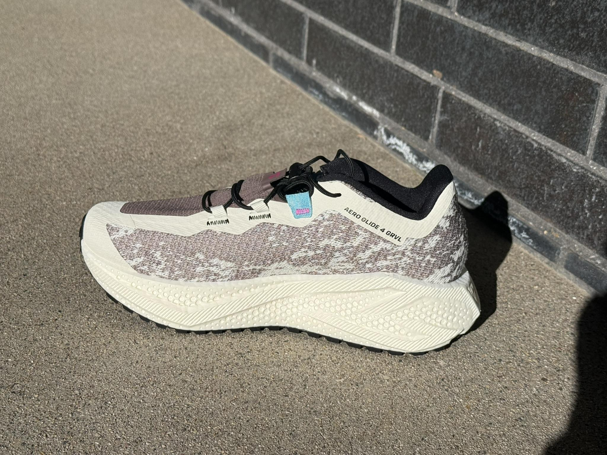

Kelly: The midsole delivers a lively, energetic feel with a noticeable but controlled bounce. Cushioning is generous and well suited for longer runs, consistently reducing fatigue over time. The shoe also handled pickups and short intervals better than expected for a max-cushioned platform, remaining responsive without feeling sluggish.
Despite the high stack height, the shoe never felt overly tall or unstable. Cushioning compresses smoothly on landing and transitions naturally into toe-off, which helps explain why the stack height felt largely unobtrusive during the run. Rather than an aggressive or propulsive sensation, the energy return is smooth and controlled, providing impact protection with a gentle rebound.
The platform feels stable and well balanced across mixed terrain, guiding foot placement without drawing attention to itself. There was no sense of fighting the shoe or compensating for instability, even on uneven surfaces.
John: Kelly called the ride "bouncy and engaging, yet comfortable over longer, hillier efforts on non-technical terrain," and felt comfortable right away. I totally agree. The optiFOAM cushioning is seriously impressive; it manages to feel both plush and responsive.
In my testing, I found the platform stable and composed for gravel and moderate trail use. The wider base and geometry kept things feeling planted. I deliberately ran off-camber sections and uneven terrain, and I never had an escaping to the sides sensation, even when cornering aggressively on gravel descents.
However, I am not claiming this is a stability shoe. Runners with significant pronation issues or those prone to ankle rolls should look elsewhere. The soft, tall stack combined with that central carveout means there is inherent instability if you are pushing into technical terrain or have biomechanical needs requiring support. But for neutral runners on gravel and moderate trails? I found it perfectly adequate.
The Reverse Camber geometry is subtle, not aggressively rockered. It promotes smooth heel-to-toe transitions without forcing an unnatural gait. I could feel it working most on flat road sections, providing a gentle propulsive sensation that made maintaining pace easier.

### Outsole

### 

The Contagrip rubber outsole combines at the front outside edges 3mm depth lugs tapering to 2mm towards the center with a center pod of tightly spaced 2mm hexagonal lugs. The heel bars are about 2.5mm in depth. A large central rear cavity has no lugs. While the upper for me can now be considered any trails worthy, the outsole clearly is “gravel”, road and light trails focused. To date, I have run them on very hard packed snow and road and the grip has been excellent.
And, very notably this outsole plays very very well on those hard surfaces with minimal slapping, only a slight sense this is a trails type outsole and a very smooth flow with no disconnect between the outsole and midsole, that over firm sensation of a trail outsole on road that is often felt.

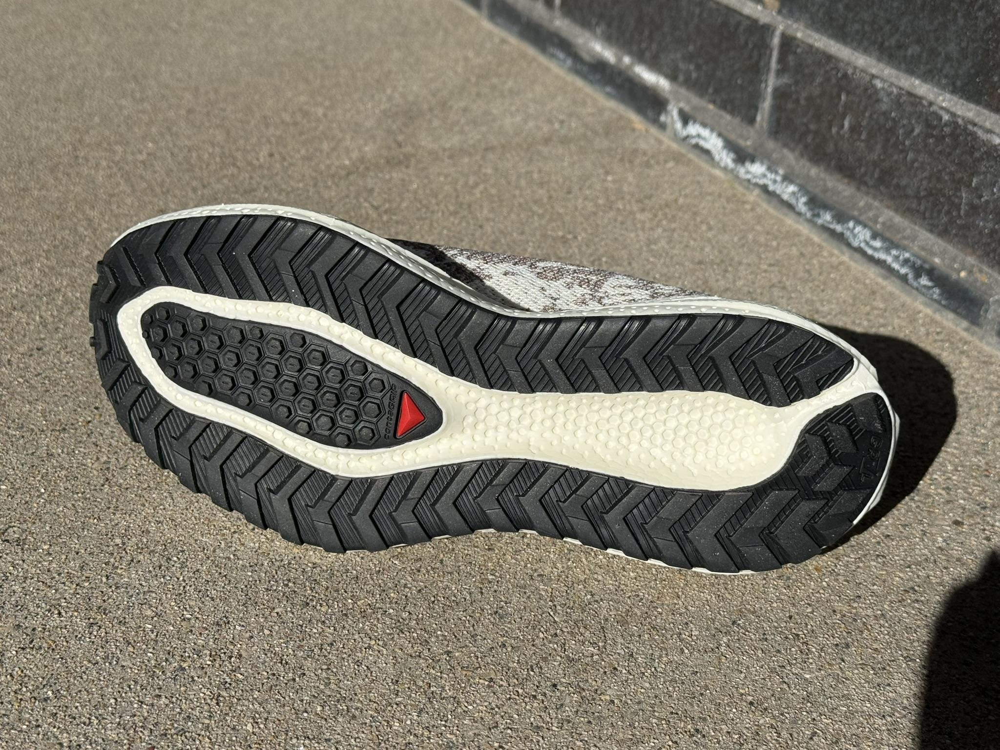

Kelly: My testing so far has been limited to packed snow, asphalt, dirt, and brief sections of gravel. Within those conditions, the outsole performed better than expected—particularly on firm, packed snow—though on ice I would personally prefer more aggressive traction. That said, this is a gravel-focused shoe rather than a winter-specific model, and expectations should reflect that.
On pavement, the outsole feels smooth and unobtrusive, avoiding the stiffness sometimes associated with trail-oriented designs. Traction is dependable rather than sticky, contributing to a predictable and controlled ride.
On the limited gravel and dirt encountered between snow patches, the shoe performed particularly well. Rocks were well muted underfoot while maintaining good control and stability. Based on this early experience, I’m especially eager to revisit the shoe once true gravel conditions return.
John: The Gravel contaGRIP with 2.5mm chevron lugs is clearly designed to bridge worlds. On roads and smooth paths, the outsole rolls surprisingly smoothly. No clunky, segmented feeling. The rubber compound is grippy enough to inspire confidence. On gravel and hard-packed dirt, the lugs bite well. I took these on dirt road routes, crushed gravel with occasional loose sections, even mellow single track, and felt totally confident. The multi-directional pattern handles off-camber running and quick direction changes without hesitation.
Where I need to acknowledge the shoe's limits: on soft, singletrack or steep, loose descents with significant rocks, the 2.5mm lugs simply do not have enough depth to provide secure footing. This is not a criticism. Sam mentioned he would “rather buy the Ultra Glide 4 and skip the Glide GRVL” if his running regularly included gravel and trails. I would agree and think that’s sound advice for runners whose gravel routes are actually moderate technical trails.
But for the use case Salomon designed this for (roads, gravel paths, hard-packed dirt, and easy to moderate trails) the outsole performs exactly as it should. The relatively minimal lug depth means the shoe runs smoothly and efficiently on hard surfaces while providing adequate grip for non-technical terrain.
After 60+ miles on mixed surfaces including abrasive concrete and rocky trails, the rubber compound shows minimal wear. The high-wear areas under heel and forefoot look nearly new, suggesting good long-term durability.

### Ride, Conclusions and Recommendations

Sam: I thought the Glide 3 GRVL had a so-so off road performance, saying in the review: “GRVL is clearly a “road” shoe, with improved traction”.  Version 4 due to its upper hold improvements clearly moves the model towards notably more versatility on a wider variety of  trail terrain beyond smooth and gravel.  At the same time the upper also improves its road performance helping tame and direct the fun and energetic foam, and there is lots of it here (as before), putting the Aero Glide 4 in max cushion category.
The new cord pull closure system helps tie the fit together and is easy to use but I do think the plastic clip and webbing strap could be slimmed down. Not easy to put on,  this is one shoe where I think a rear pull tab would be truly useful
They call it GRVL and yes the Aero Glide 4 can be just that but I see it as more. It is also a versatile pavement trainer, and  especially so in slippery conditions and it is a now better light to moderate max cushion trails option. It is the near ideal single shoe to take on a trip where you can only take one shoe for runs of all types, hikes, and casual wear

### Sam’s Score 9.11 /10 😊😊😊 1/2

- Ride (30%): 9.2 
- Fit (30%): 9.1 
- Value (10%): 9.2 
- Style (5%) 9.2 
- Traction (15%): 8.8
- Rock Protection (10%): 9

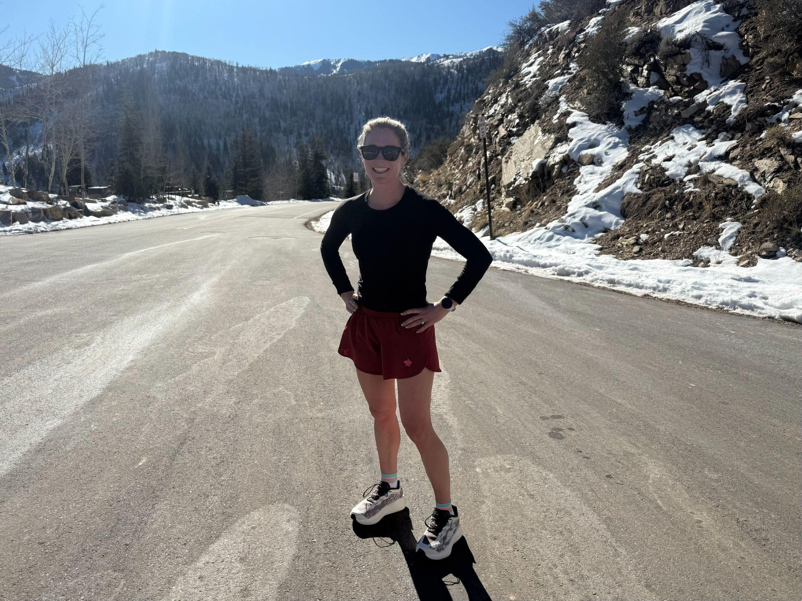

Kelly: As a complete system, the Aeroglide 4 GRVL delivers exceptionally well. It stands out as one of the most capable crossover shoes I’ve used and feels ideally suited for non-technical terrain around Park City. I would confidently run from my front door, up the road to the local trail system, through long gravel miles and some single track, and back on pavement without hesitation.
The shoe excels in comfort, support, and versatility, while still offering enough responsiveness to keep runs engaging. Aesthetically, it is a gorgeous shoe. The pair I tested has a clean mix of whites, greys, and subtle blue accents that translate well beyond running. This is a shoe I’d happily wear casually post-run.
For highly technical, rocky terrain, I’d choose something with more protection. However, for runners looking for a single shoe that can seamlessly transition between road and light off-road runs without compromise, the Aeroglide 4 GRVL stands out as one of the best options in its category.

### Kelly’s Score 9.22 /10 😊😊😊😊

- Ride (30%): 9.5 
- Fit (30%): 9.3 
- Value (10%): 9.3 
- Style (5%) 10 
- Traction (15%): 9  
- Rock Protection (10%): 8

John: The shoe performed well across different surfaces. Kelly noted smooth transitions during a hill workout that included pavement, snow, ice, and gravel, demonstrating its effectiveness in mixed conditions. Sam also praised the shoe's stability and versatility, confirming its suitability for roads, trails, and gravel. I found my own experience consistent with these positive reviews.
At easy recovery paces (9 to 10 minute miles), the optiFOAM feels forgiving and comfortable. Perfect for days when your legs need a break. Push it a little faster (7 to 7:30 minute miles), and the foam responds with enough bounce to feel capable. I even did some uphill intervals at 6:00 to 6:45 pace, and while I would not call this a racing shoe, it did not feel sluggish.
The cushioning really shines on longer runs. I did a long mixed terrain run, about 60% road, 30% gravel, 10% easy trail, and my legs felt fresh at the end. The maximal cushioning does a good job of absorbing impact over extended miles without that beat-up feeling you sometimes get from shoes prioritizing ground feel over protection.
Where the shoe finds its limits is on technical terrain with roots, rocks, and significant elevation changes. The relatively soft midsole and minimal lugs mean you need to slow down and be deliberate on those sections. For the 90% of trail running that is actually gravel roads, fire roads, and easy singletrack, the Aero Glide 4 GRVL is exceptional.

### John’s Score 8.9 /10 😊😊😊½

- Ride (30%): 9 
- Fit (30%): 9 
- Value (10%): 9 
- Style (5%) 9 
- Traction (15%): 8.5  
- Rock - Protection (10%): 8.5

### Comparisons

Roadtrailrun
Generally shoes that are similar by weight class, type of ride, purpose. As many as you see being appropriate. A short paragraph. If we have reviewed it I will include links to comparisons or you can as reading them is useful for stats etc...
Please list your size for the comparison shoe and review shoe and touch on relative fit for each. Review stats and info for each shoe to refresh your memory.
Shoes listed are suggestions. Please feel free to add as you wish

### Salomon Aero Glide 3 GRVL

Sam: As covered in the review, underfoot the same with an improved upper that better holds the foot and more securely directs the big soft and bouncy stack of eTPU foam on all terrain. Both true to size with a big less midfoot volume in v4 due to the upper changes.

### Mount to Coast H1

Sam: The current “gravel” and do-anything shoe for me,  the H1 has a somewhat firmer lower stack (35/29) more responsive ride and weighs over 40g less.. Its upper also has a pull cord system but only at the front and that  is simpler. I find the H1 more comfortable and equally as supportive. I am true to size in the GRVL and went a half size down in the H1 (a very early sample) so please check the review linked above for other testers size take.

### Brooks Ghost Trail

Sam: Very close competitors, the Ghost Trail is considerably heavier at 10.4oz / 293g US8.5 on a lower stackheight:  36.5 mm heel / 28.5  mm forefoot. Its ride is denser, more stable and protective as is its clearly trails focused upper. Both are true to size While the outsoles are similar in having bar shapes the Ghost Trail has considerably more coverage and somewhat deeper 3mm lugs. If you lean more trail than road (or gravel) in a multi surface shoe the Ghost Trail. If you want a livelier lighter ride Aero Glide 4 GRVL. I prefer the Salomon in this match up for its lighter weight and more energetic rie.

### Adizero EVO SL ATR

Sam: A variant of the popular EVO SL, the ATR features a very supportive lightly weather resistant upper, Lightstrike Pro super foam and a Continental rubber 1.5mm lug outsole. Its stack height and weight are about the same as the Salomon. The adidas leans more road and lighter trails than the Salomon and has a more precise somewhat lower volume close to true to size fit for me with my sample a half US size up and a touch roomy.

### Craft Xplor Pro
John: These two shoes occupy similar territory but take different approaches. The Craft uses Px Foam with a Vittoria-inspired outsole that looks and performs like a bike tire tread. The Xplor 2 feels slightly firmer and more responsive underfoot than the Aero Glide 4 GRVL’s softer, plusher optiFOAM. Fit is a major difference. The Xplor 2 has what Craft calls their Endurance Fit with a roomy, voluminous toe box. For my slightly narrow, lower-volume feet, I found my foot swimming in the Craft's toe box, while the Aero Glide 4 GRVL fits me much better through the forefoot. The Vittoria tread on the Craft handles loose gravel marginally better, though neither shoe is built for true technical terrain. If you prioritize plush cushioning and maximum comfort, the Aero Glide 4 GRVL is the better choice. If you want a firmer, more responsive ride with a roomier toe box, look at the Xplor 2.

### Salomon Pulsar 4

Using the same Optifoam on a lower 35/29 stack height the somewhat heavier Pulsar has more aggressive traction and a lower volume ( a half size up for me was snug in the toe box) more old school trail focused upper. The Genesis is a better trails focused option from Salomon.

### Salomon Ultra Glide 4
John: If your gravel running regularly includes moderate technical sections, go with a true trail shoe. The Ultra Glide 4 has deeper lugs, a more trail-focused upper, and a platform better suited for extended time on technical terrain. The Aero Glide 4 GRVL shines when your routes are predominantly roads and gravel with occasional easy to moderate trail sections. Think of it this way: the Ultra Glide 4 is a trail shoe that can handle roads, while the Aero Glide 4 GRVL is a road shoe that can handle some trails.