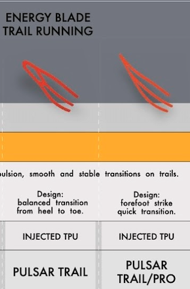
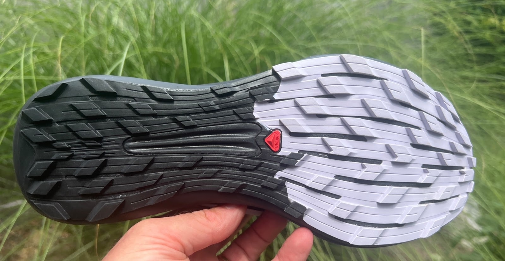
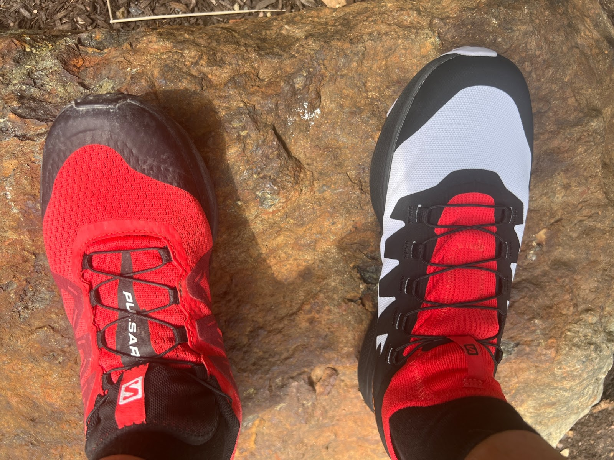
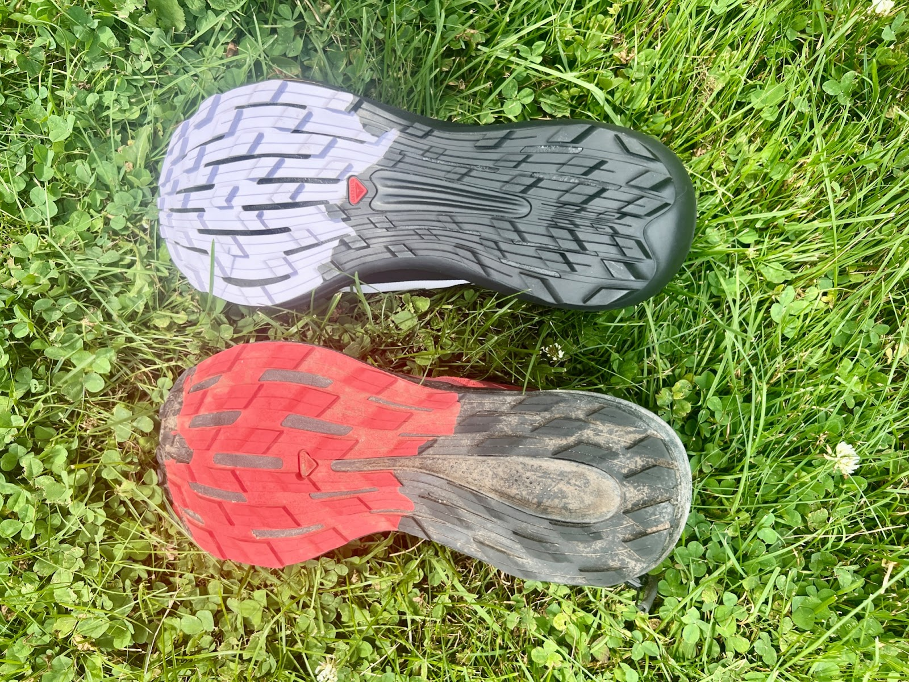
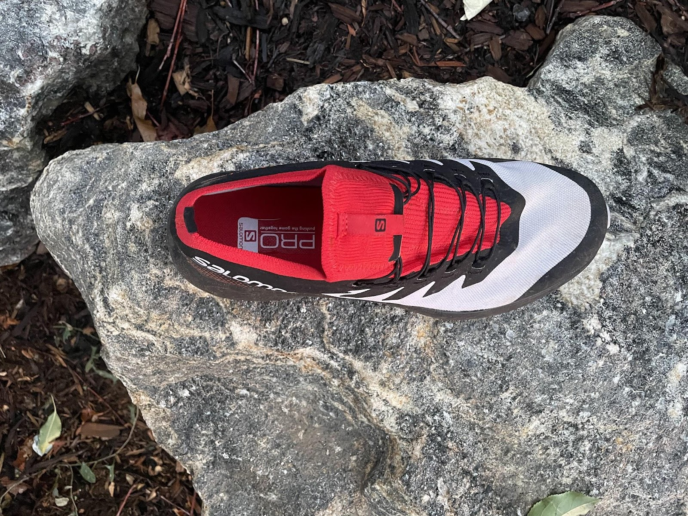
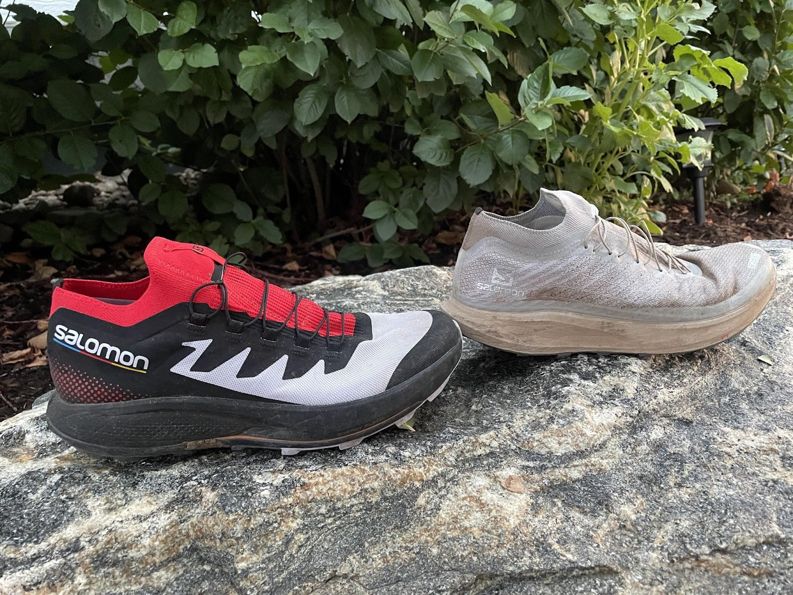
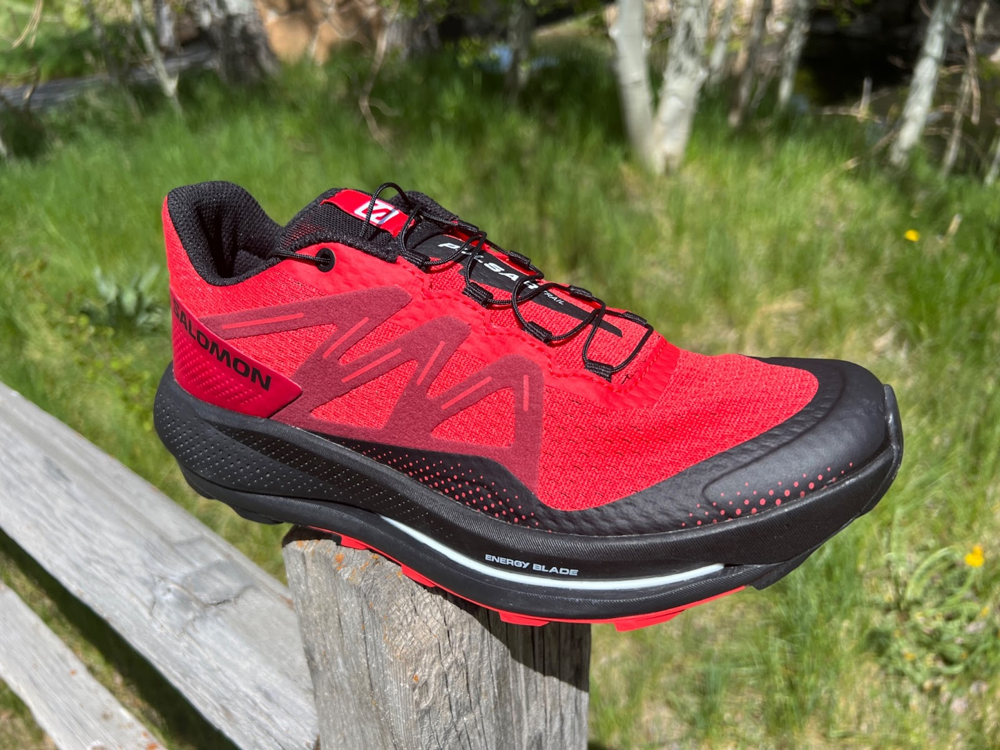
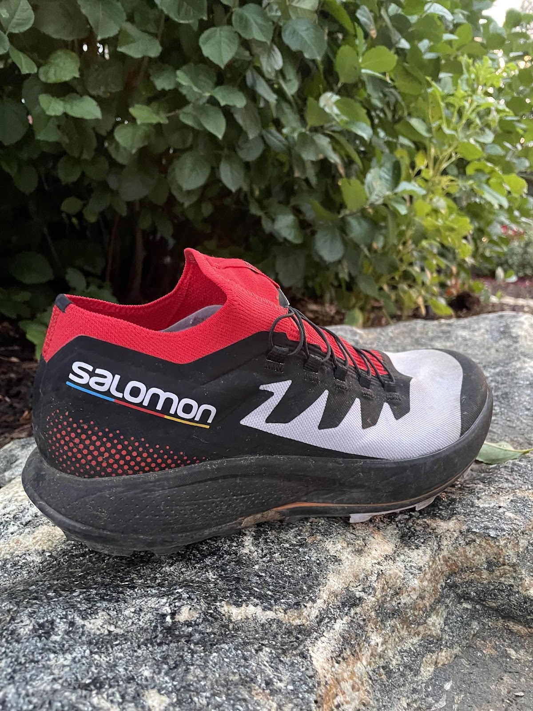

<!--more-->

Original Post on RoadTrailRun
([link](https://www.roadtrailrun.com/2022/08/salomon-pulsar-trail-pro-review.html))

<a href="https://www.roadtrailrun.com"
class="button primary button-wrapper">Read All RoadTrailRun
Reviews Here</a>

*Article by John Tribbia*

### Salomon Pulsar Trail Pro ($150)

### Introduction

The Pulsar Trail Pro is Salomon’s new mid to long range trail running
shoe that is built for moving fast, regardless of conditions. It is a
quick and nimble shoe with a rockered design and Energy Surge foam
energy-returning technology that offers enhanced forward propulsion. The
Pulsar Trail Pro also features:

- An embedded TPU Energy Blade adds underfoot stability while also
  helping to return energy to both promote forward motion and diminish
  fatigue.

- Energy Surge foam in two densities with a softer foam underfoot and a
  firmer layer above the outsole

- R-Camber geometry for a smooth roll from heel to toe off.

- Contagrip rubber with a multi trail surface 3.5mm lug array.

With a Salomon trademark Quicklace design, the Pulsar Trail Pro has a
thin mesh upper that yields a secure hold with a roomier than the
typical-Salomon-style toe box. 

In short, the Salomon Pulsar Trail Pro is a race or fast training trail
shoe with plenty of protection for mid- to longer-distance trail runs
and even races.

### Pros

> Soft cushion and forgiving ride
>
> Responsive on ascents 
>
> Versatile traction
>
> Midsole Energy Surge foam is light, soft, yet responsive
>
> Upper volume in the forefoot provides more accommodating fit 
>
> Longer laces with easy to use Quicklace garage.

### Cons

> Lack of ground feel
>
> Downhill instability due to higher stack and firmer dual foam + blade
> midsole making landings in technical sections unbalanced
>
> Difficult to dial lacing with Quick Lace, making for an unstable
> forefoot and/or heel hold 

### Tester Profile

**John Tribbia (5' 6", 130lbs)** is a former sponsored mountain/trail
runner who has run with La Sportiva, Brooks/Fleet Feet, Pearl Izumi, and
Salomon. Even though he competes less frequently these days, you can
still find John enjoying the daily grind of running on any surface,
though his favorite terrain is 30-40% grade climbs. He has won races
such as America's Uphill, Imogene Pass Run, and the US Skyrunner
Vertical Kilometer Series; and he's held several FKTs on several iconic
mountains in Boulder, Colorado and Salt Lake City, Utah. If you follow
him on [Strava](https://www.strava.com/athletes/1044838), you'll notice
he runs at varying paces between 5 minutes/mile to 12 minutes/mile
before the break of dawn almost every day.

### Stats

Sample: men’s  9.06 oz  / 257g

Stack Height: men’s 31 mm heel / 25 mm forefoot, 6mm drop

Available now. $150

### First Impressions, Fit and Upper

I’m really excited to test this shoe! I tested S/LAB Pulsar and have
watched in envy the tests of the other Pulsar versions. The shoe looks
fast, feels light, and has a soft underfoot cushion that is noticeable
as soon as you put it on. 

With the added cushioning compared to the S/LAB Pulsar 1mm more and with
a broader landing platform, the shoe feels cushy to me and yet does not
produce a dull response when doing a quick jog down the driveway. It
isn’t bouncy but still is responsive and seems like it will be a
versatile shoe for longer outings that need additional leg-saving
cushion. 

Fit is true to size and a bit wider for my slightly narrow foot compared
to other Salomons, giving it a more accommodating fit that can be locked
in using the Quicklace system. 

The toe box has ample room.

### Midsole

The Energy Surge midsole foam is lightweight and responsive due to its
dual density construction where a softer layer sits atop the injected
TPU Energy Blade with a firmer layer underneath. 

Source: Salomon

This duo provided excellent energy return, protection, and stability on
varied terrain. I ran the Pulsar Trail Pro on dry buffed out trail,
road, some technical trails, and off camber grassy hills. 

With the exception of the technical running, I found the shoe to be
predictable and stable while feeling incredibly well cushioned and
comfortable. 

In the technical sections, I felt like the Trail Pro was less stable -
i.e. too high stacked - and lacked ground feel to feel confident
navigating tight areas where an agile and nimble shoe would perform
best. In particular, there was too much distance and lower foam firmness
between my foot and the ground to feel confident in precise footsteps.
Needless to say, the dual foam and blade combination yield a leg saving
yet responsive feel when navigating any other terrain. 

### Outsole

The Contagrip rubber outsole is grippy, though the 3.5mm lugs are not
incredibly deep. I felt confident across varied terrains and the outsole
functions well in wet or dry. Even as a lightweight shoe, the rock
protection is noticeable from the lower firmer foam layer and is well
suited for navigating off camber, mellow sections of mud and potentially
snow/ice. 

### Ride

The ride is lively at any pace, but excels when the cadence is high. I
found that technical trails weren’t the Pulsar Trail Pro’s cup of tea,
but I would be fine running in them nearly everywhere else. The midsole
of Energy Surge foam + Energy Blade plate yields a responsive forefoot
action that efficiently supports faster paced running. I wouldn’t say
the shoe propels you forward like other super shoes or even the S/LAB
Pulsar, but it delivers a forward leaning ride thanks to that midsole
combination and the well shaped rocker. 

The added stack height, Blade, and firmer lower foam dampens the ground
feel quite a bit, so there isn’t much jarring and there is substantial
protection, but I felt like those characteristics  took away from the
performance somewhat. It is probably more of a preference than anything,
but I feel disconnected from the ground in the Pulsar Trail Pro, simply
because of the stack and midsole plate and foams. It’s fine for paced
running on rolling trails or dirt/paved roads, but I lacked confidence
in terrain that required precise footing. 

### Conclusions and Recommendations

The Pulsar Trail Pro is a great shoe for mid- to longer-range uptempo
runs boasting a faster running experience with responsive cushion. It is
snappy on the uphills and smooth on the downhills. I took the Trail Pro
on a variety of terrain and found it was a capable shoe and performed
really well on roads, smooth gravel track, buffed single track, and on
uphills. Although not as performant on technical trails, it provides
good ground protection and stability for the long haul. This shoe will
make you want to run faster thanks to the smooth transition and
especially if you are forefoot runner. With a subtle rocker and dual
foam / blade midsole, the Pulsar Trail Pro is a go-to shoe for the
runner where speed is not just needed, but expected.

Score: 8.33 / 10

Ride - 8 (responsive and efficient, but lackluster in technical
terrain)  
Fit - 8.5 (lacing was challenging to get dialed and my narrow foot
prefers the traditional Salomon fit)  
Value - 8.5  
Style - 8 (Colorway was okay, I really like the dramatic look of the
rocker from side view)  
Traction - 8.5 (solid traction for multiple types of terrain)  
Rock Protection - 8.5 (TPU Blade and cushion provide sufficient
protection)  
**Smiles -** 😊😊😊 out of 5

### Comparisons

Index to all RTR reviews:
[HERE](https://www.roadtrailrun.com/p/blog-page.html)

**Salomon Sense Pro 4**  ([RTR
Review](https://www.roadtrailrun.com/2020/02/salomon-sense-pro-4-multi-tester-review.html))

The Sense Pro 4 is lower stacked, more precise, and has a more stable
platform. It is a decent uphill shoe and an absolute beast on the
downhills. The Pulsar Trail Pro is lighter, more responsive, and has
more cushioning. Even though the Trail Pro is lighter by over 1 oz, the
Sense Pro 4 is one of those shoes where I forget I’m wearing one, and
especially in technical terrain.

**Salomon  S/Lab Pulsar** ([RTR
Review](https://www.roadtrailrun.com/2021/03/salomon-running-slab-pulsar-multi.html))
and **SG**  ([RTR
Review](https://www.roadtrailrun.com/2022/02/salomon-slab-pulsar-sg-multi-tester.html))

The S/Lab is superb on steep uphills and rolling terrain, efficient on
road (dirt or pavement), excellent and precise across chossy footing
with solid grip to those surfaces, and (as long as your legs are happy
enough and you are not a heel striker) an absolute beast on the
downhill. 

While the Trail Pro is reasonably capable in those situations, it seems
like the design use-case is for longer sustained paced outings where
cushion and efficiency are paramount. Not to mention, the S/Lab is
nearly 2 oz lighter than the Trail Pro, so the S/Lab is ideally kept for
race day or Strava segment PR days. 

**Pulsar Trail**  ([RTR
Review](https://www.roadtrailrun.com/2022/05/salomon-pulsar-trail-initial-review-new.html))

Editor’s Note: Sam had only one run (road) in the Pro before sending our
sole pair to John. He had several runs in the Trail and will be sending
that sole pair to John for closer comparisons.  He notes the Trail had a
more pronounced rear rocker than the Pro, so better for slower paces and
heel striking. The Trail has 1mm or so more stack height and a bit more
mellow flexing Energy Blade.  

The lower firmer Energy Surge foam, same dual layer construction as the
Pro, is a bit thicker and thus should provide a bit more protection
underfoot but likely less agility. 

Its outsole has somewhat broader surfaced less angular and more spaced
out lugs.

The key difference is weight with the Pulsar Trail 9.95 oz / 283g and
the Pro  9.06 oz  / 257g with most of that weight appearing to come from
the denser (warmer) and more protective (and supportive) upper of the
Trail, a shoe that will lean ultra a bit more than the Pro for most. 

Editor’s Note: I had only one run (road) in the Pro before sending our
sole pair to John who has initial comparison comments below. I had
several runs in the Trail and have sent that solo pair to John for
closer comparisons.  I noted the Trail had a more pronounced rear rocker
than the Pro, so better for slower paces and heel striking. The Trail
has 1mm or so more stack height and a bit more mellow flexing Energy
Blade.  

The lower firmer Energy Surge foam, same dual layer construction as the
Pro is a bit thicker and thus provides a bit more protection underfoot
but likely less agility. 

Its outsole (red above) has somewhat broader surfaced less angular and
more spaced out lugs.

The key difference is weight with the Pulsar Trail 9.95 oz / 283g and
the Pro  9.06 oz  / 257g with most of that weight appearing to come from
the denser (warmer) and more protective (and supportive) upper of the
Trail, a shoe that will lean ultra a bit more than the Pro for most. 

**John**: The Pulsar Trail reminds me of my favorite Salomon shoe of all
time, the Sense Ride 1. The Trail feels wider and more stable. I was
impressed with the outsole of the Trail and felt like it navigated mud
and loose terrain quite well. With the exaggerated rocker (compared to
the Trail Pro), it is a great shoe for shuffling and heel striking long
distances. The Trail Pro, by contrast, is leaner and more refined but
feels farther away from the ground than the Trail. The Pro has a more
race feel to it and is definitely lighter on-foot. If I could trade the
upper of the Pro and put it on the Trail, I think it would be a terrific
long distance shoe.

**Brooks Catamount**  ([RTR
Review](https://www.roadtrailrun.com/2020/07/brooks-catamount-multi-tester-review.html))

The Pulsar Trail Pro is lighter, equally responsive on runnable and
paced efforts, and has more cushion. On the other hand, I find the
Catamount to be more secure and stable, which equates to better control
and confidence at speed on trails and particularly steep and technical
trails.  Both are great choices for longer, less technical runs and
especially mixed running where any extended sections of pavement might
be involved.

**Saucony Peregrine 12**  ([RTR
Review](https://www.roadtrailrun.com/2022/01/saucony-peregrine-12-multi-tester.html))

The Saucony Peregrine 12 is nearly 1.5 oz heavier than the Pulsar Trail
Pro and is more stable, firmer and the upper has a better and lower
profile upper that has great foothold and security.  The Peregrine’s
traction profile is more aggressive while the Pulsar Trail Pro performs
really well on crossover terrain such as road and groomed paths.
Peregrine 12 is a stiffer shoe with a bit more rock protection and is
somewhat runnable on the roads, but not as enjoyable as the Pulsar Trail
Pro.

**Hoka Torrent 2** ([RTR
Review](https://www.roadtrailrun.com/2020/06/hoka-one-one-torrent-multi-tester.html))

Hoka Torrent 2 is one of my favorites. The Salomons are more sock-like
and form fitting in the upper and produce an energetic and responsive
rebound, while the Hokas provide more ground feel, more stability in the
forefoot, more protection, and a larger base to absorb the terrain. If I
am going fast and relatively long in mostly non-technical terrain, where
I need some pep in my step, I’ll go with the Pulsar Trail Pro, but I
will pull out the Torrents on for most anything else. 