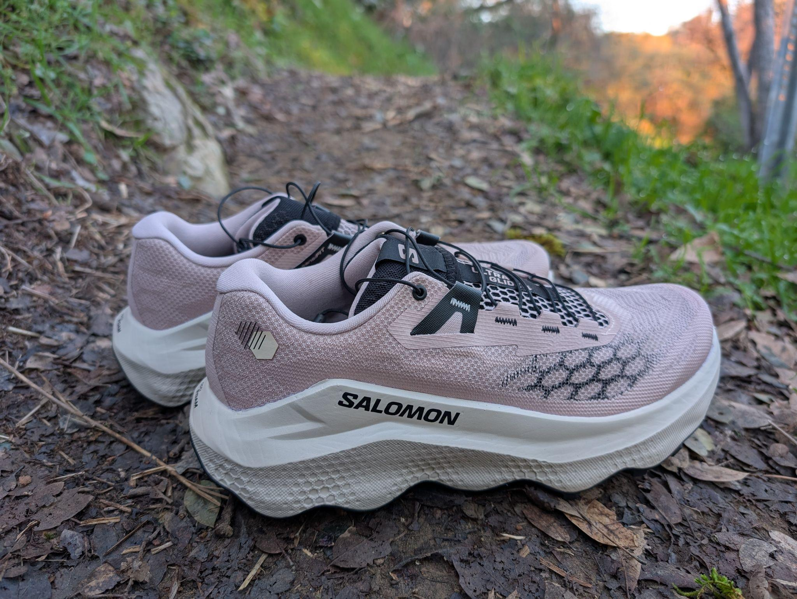
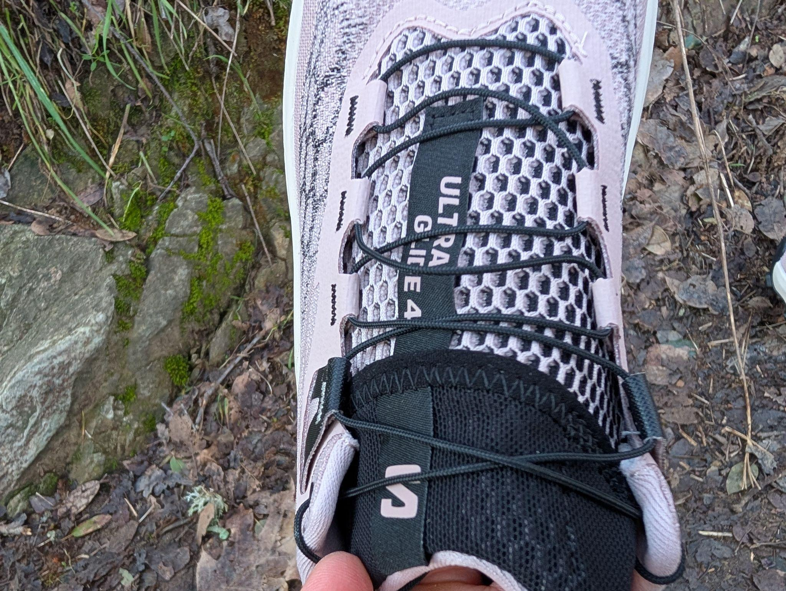
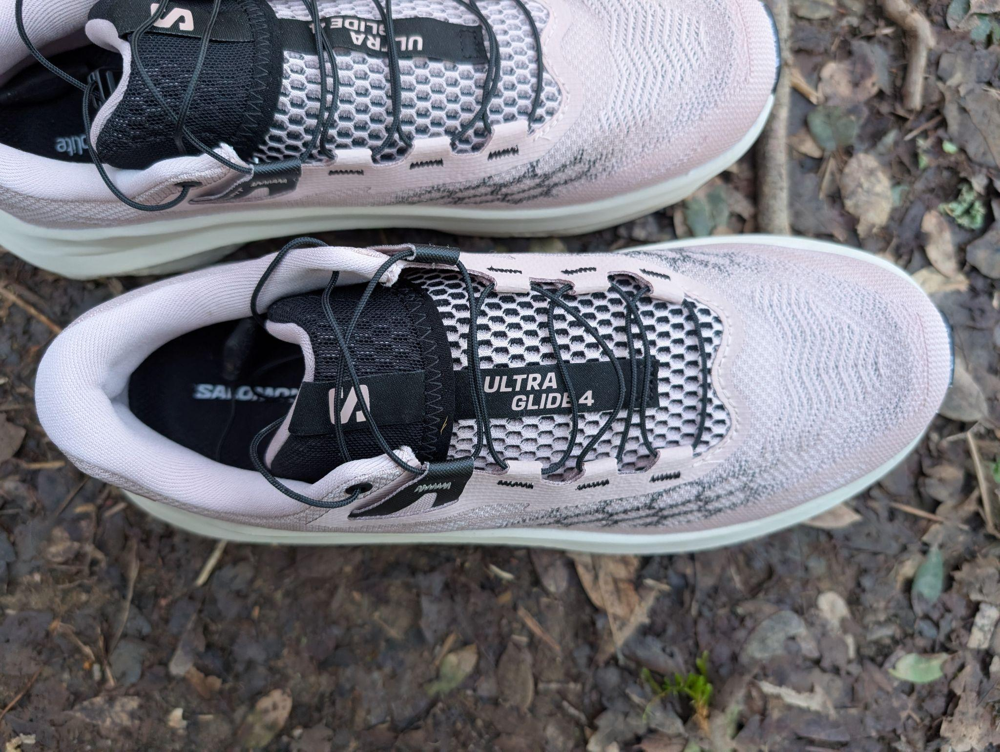
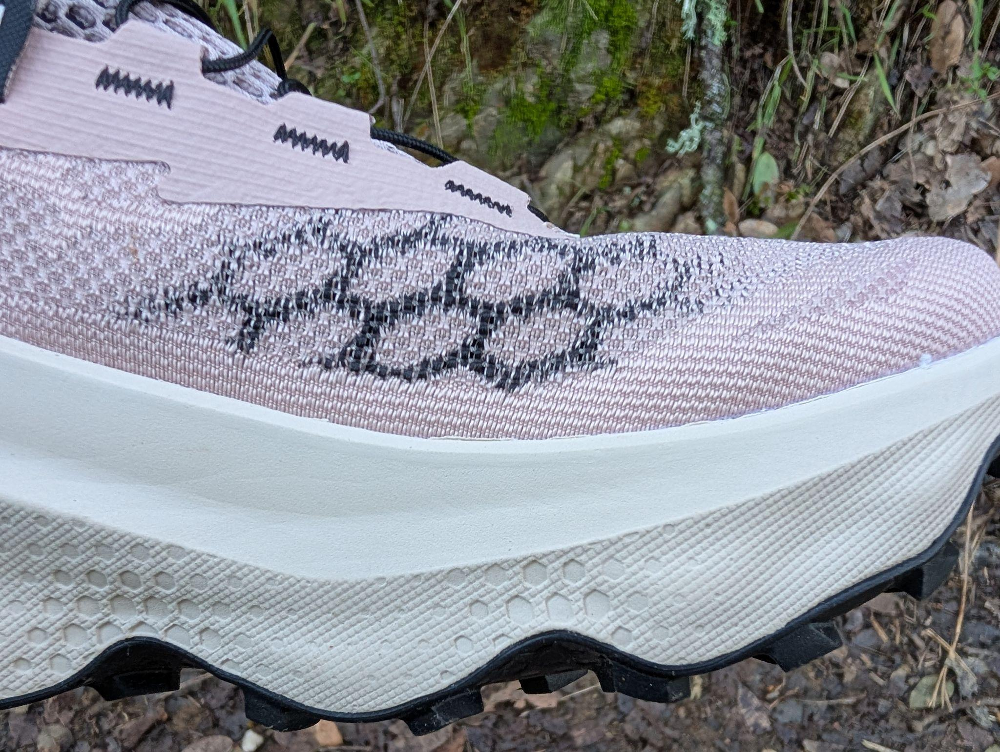
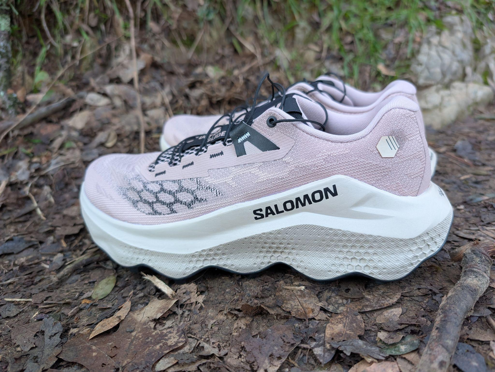
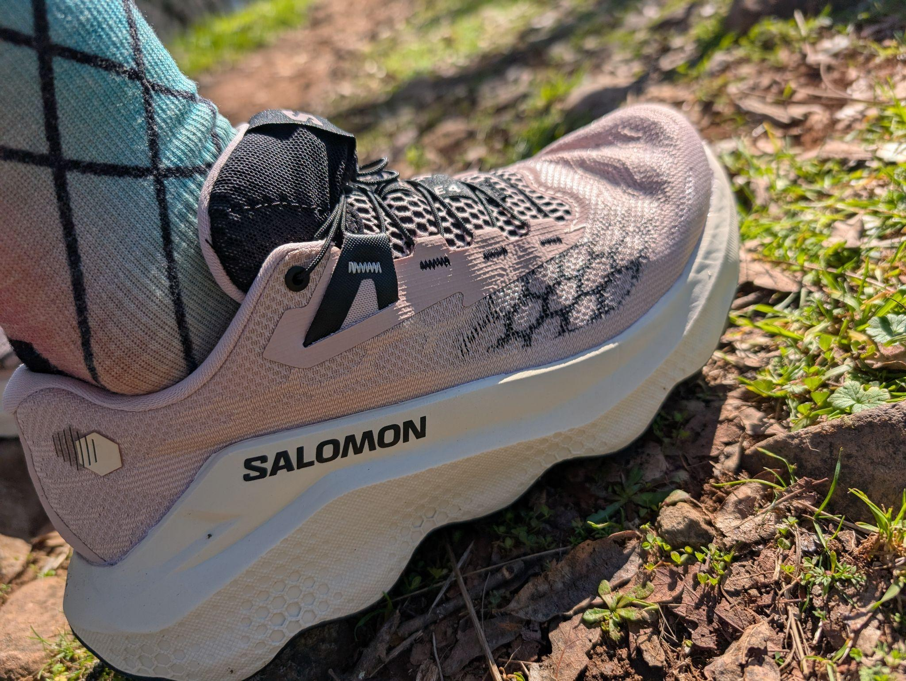
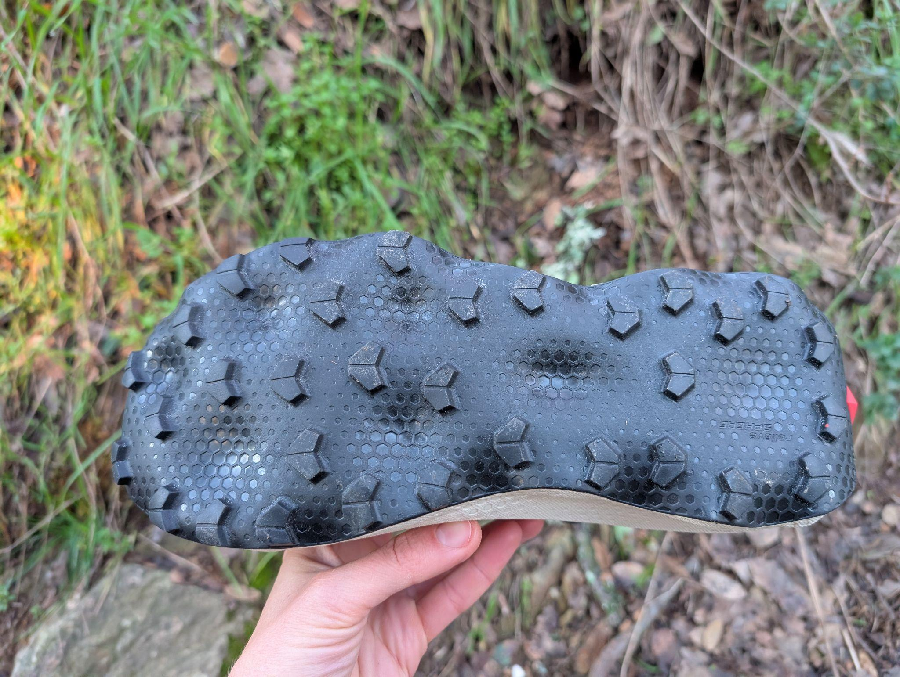
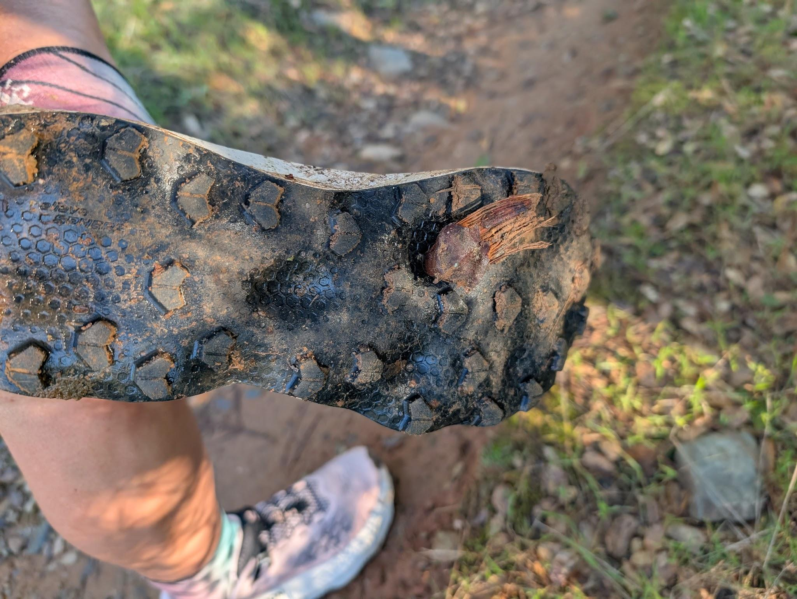
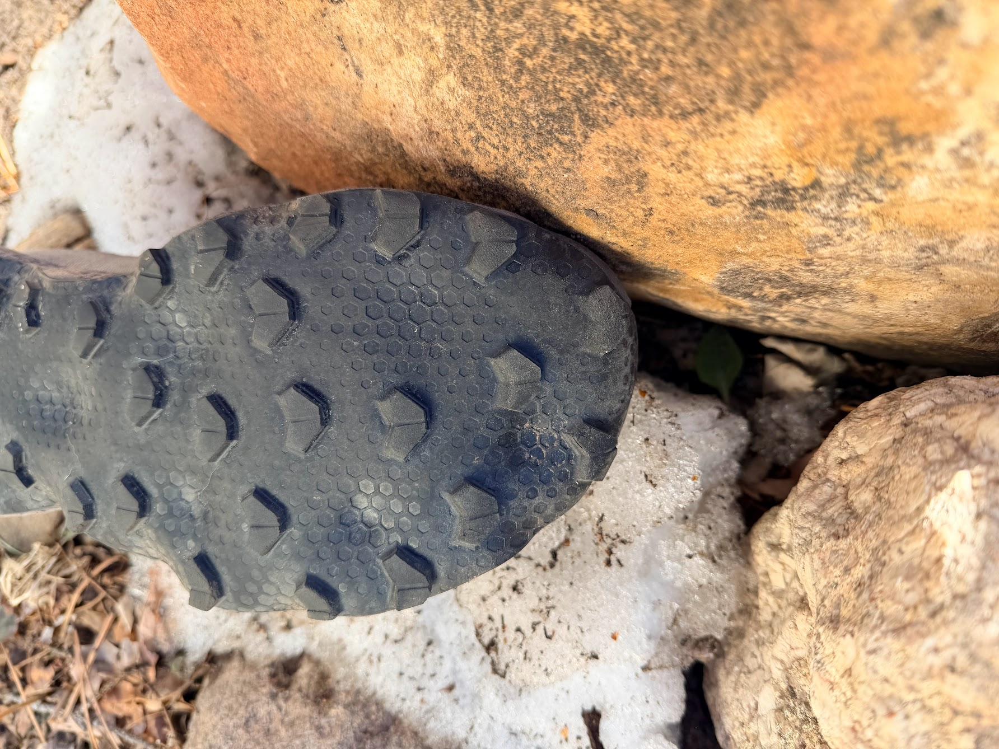

<!--more-->

Original Post from RoadTrailRun
([link](https://www.roadtrailrun.com/2026/01/salomon-ultra-glide-4-review-4.html))

<a href="https://www.roadtrailrun.com"
class="button primary button-wrapper">Read All RoadTrailRun
Reviews Here</a>

Article by Jen Schmidt and John Tribbia

### Salomon Ultra Glide 4 ($150)

### Pros:

- Extremely comfortable for long miles and recovery runs Jen/John
G- ood energy return Jen/John
- Surprisingly light for a max cushion trail shoe Jen/John
- 4.5 mm lugs and Contagrip outsole can handle varied terrain Jen/John
- Wide fit accommodates larger feet and swelling during ultras Jen/John
- Great hiking/walking shoe as well

### Cons:

- Thick upper retains some heat and moisture
- Traction isn’t 100% on wet trail/rock
- Can’t tighten down midfoot quite enough on low volume feet
- Longer than normal laces John

### Stats

- Spec. Weight: men's 285g US9.5 :: women’s  255g US6.5
- Sample Weights: women’s 9.4 oz / 264 g US8.5
- Stack Height:  41mm heel /  35mm forefoot
- Platform Width: 92 mm heel / 80 mm midfoot  / 115 mm forefoot

### First Impressions, Fit and Upper

Jen: The Ultra Glide 4 is the latest incarnation of Salomon’s max cushion trail trainer and ultra-distance racer, and it’s clear from the beginning that it’s designed for comfort. Although I’ve loved a number of Salomon shoes over the years, from the first edition of the Sense Ride through last year’s S/LAB Pulsar 4, this was my first encounter with the Ultra Glide line.
If you’re used to Salomon’s lower-volume S/LAB lasts, the Ultra Glide will feel significantly wider, but remains true to size in length. The generous volume through the midfoot and toebox will accommodate medium to wide feet as well as foot swelling during long-distance races, but was a little tough to lock down for my relatively narrow midfoot. The classic Salomon Quicklace system tucks into its usual lace garage - no surprises and no complaints here.

The upper is the only real update from the previous version, and it was revamped for increased durability, a better fit, and more breathability. With 80 miles of testing on them so far, durability does seem good: no signs of wear at all.

The upper is thickly cushioned for comfort, as is the heel collar. I found the fit to be a little better in the rear of the foot than the midfoot, with no slippage.
This version was redesigned to improve breathability, but the generous padding does still come with tradeoffs as far as airflow and drainage are concerned. My feet stayed wet for a while after creek crossings, although that didn’t lead to any hotspots or blisters.

Overlays on the previous version have been removed, leaving only support reinforcements built directly into the engineered mesh and reinforcements around the laces. Overall, the Ultra Glide 4 is comfort-forward and sturdy, ready to handle big miles.
John: Jen and I both found the fit to be true-to-size and accommodating, though our experiences with the engineered mesh differed slightly. While Jen noted the upper felt thick and retained some heat, I found the varied weave density quite breathable and lighter than expected for this category. However, Jen’s observation about the midfoot volume is a crucial check for potential buyers: I felt the lockdown was secure, but if you have lower-volume feet, you may struggle to cinch the Quicklace system tight enough - a common quirk I have come away with when using Salomon's lacing system. What’s also compelling for those with wider feet is that this shoe comes in a wide variant
The lace garage remains a functional, if slightly hard to use, staple. Once the long laces are tucked away, the upper provides a reliable, debris-free environment. The heel counter strikes a great balance - it’s structured enough for technical descents without being overly rigid, ensuring a secure lock that prevents slipping when the trail gets steep.

### Midsole & Platform

The energyFOAM EVA blend midsole is mostly unchanged, with overall weight dropping around 10 grams from the previous version.
A stack height of 41 mm/35 mm means that there’s plenty of that foam underfoot for comfort and rebound. Given the first impression of comfort and durability, I was pleasantly surprised with the energy return here. It’s not made to be a front-of-the-pack race shoe and doesn’t have the supercritical energyFOAM+ of last year’s S/LAB Ultra Glide, but it’s not going to hold you back when picking up the pace on runnable sections of trail or doing strides.
The pronounced raised sidewalls extend slightly higher than the footbed, giving the impression that the shoe is even taller than 41mm in the heel.

While I experienced some lateral movement within the shoe due to the wide midfoot, there was no lateral instability from the stack height despite a moderate 92 mm  heel width and 115 mm forefoot width.
John: The midsole uses Salomon’s OptiFoam, which feels plush and extremely energetic. While Jen highlighted the general comfort, I want to emphasize the RelieveSphere technology - the circular dimples across the bottom. Far from a gimmick, these geometries help diffuse impact forces. On technical terrain, this design distributes pressure evenly, which significantly reduced my foot fatigue during longer runs on Boulder’s mixed rocky trails.
Despite the 41mm heel stack, the shoe never feels mushy or disconnected. The 6mm drop feels natural, and the platform width provides enough stability to navigate off-camber sections without the tippy feeling often associated with high-stack shoes. It’s a rare midsole that offers both deep protection from sharp rocks and enough responsiveness to pick up the pace on fire roads. What I appreciate most is that it gives all the comfort of a thick midsole while the awareness of good ground feelThe shoe's 41mm heel stack doesn't translate to a mushy or disconnected ride. Thanks to the platform's width, the shoe remains stable, even on off-camber terrain, avoiding the "tippy" sensation often associated with high-stack footwear. The 6mm drop feels natural. The midsole is exceptional, offering deep protection from sharp objects yet retaining enough responsiveness for faster paces on fire roads. It uniquely delivers the supreme comfort of a thick midsole while still providing excellent ground feel.

### Outsole

The Contagrip rubber outsole, a compound found across most of Salomon’s trail-oriented models, handles most terrain very capably. As other testers noted in the S/LAB version, suitability for technical terrain is limited by the roomy fit rather than the outsole.
Wet rock was a challenge, but it’s a challenge for most outsoles.
The innovative relieveSphere geometry found in previous versions of the Ultra Glide is retained in v4, along with 4.5 mm lugs. Concave sections are intended to relieve pressure underfoot in high-impact areas. I experienced some pressure under the base of the big toe likely related to the relieveSphere contouring, but otherwise I didn’t notice a difference in feel underfoot relative to a traditional outsole. The pressure was enough to be noticeable during a three hour run, so I'm not sure if it would be a limiting factor in a longer race.

The Contagrip rubber is soft enough that debris can get embedded, as with the large section of pinecone above, but that’s pretty rare. The front lugs do seem to be wearing down quickly, especially under the big toe, perhaps because of that soft rubber.
Especially for a shoe designed for trail ultras, the Ultra Glide 4 feels surprisingly good on road-to-trail runs. Perhaps it’s the malleable outsole material, or perhaps just all that energyFOAM, but it’s just as comfortable on gravel or pavement as it is on softer surfaces.
John: The 4.5mm lugs and All-Terrain Contagrip provide a versatile bite. I agree with Jen that this is an exceptionally comfortable ride for long miles, though I found the traction more than adequate on wet terrain and loose dirt. The RelieveSphere cutouts aren’t just for the midsole; they allow the outsole to flex and conform to irregular surfaces. This makes the Ultra Glide 4 feel much more nimble and agile than its maximalist label suggests.
On the road-to-trail transitions, the shoe performs well also, rolling smoothly and quietly without the clunkiness of a traditional lugged shoe. It isn't a dedicated mud-claw, but for 90% of trail conditions, it provides a confidence-inspiring grip.
One concern I have is the durability of the outsole. Like Sam’s experience with the S/LAB Ultra Glide v1, I have seen some early signs of faster wear on the front toe lugs.

### Ride, Conclusions and Recommendations

### 

Long miles? Medium to wide feet? This could be your new favorite shoe. Even as a devotee of the narrower, sleeker S/LAB line, I found myself won over by the combination of max cushion yet energetic ride. It can be pretty nice not to feel all the rocks underfoot sometimes.
The Ultra Glide 4 shines as a great daily trainer for high mileage athletes and could also be a solid race day option for ultrarunners who value comfort over top speed or it can be a do-it-all hiking/running workhorse. $150 is much more reasonable than the S/LAB version ($250) and seems like a bargain if it’s as durable as it seems so far.

### 

Also a great dog walking shoe. Scotty approves!

### Jen’s score: 8.9/10 😊😊😊😊.5

- Ride (30%): 9/10
- Fit (30%): 8/10 - would fit a wider foot much better, but I couldn’t get it locked down enough through the midfoot to be stable running quickly on technical terrain
- Value (10%): 10/10
- Style (5%): 10/10 for distinctive sidewall, comes in a variety of colorways
- Traction (15%): 8.5/10
- Rock Protection (10%): 10/10

John: Hot take: the Ultra Glide 4 is better than any S/LAB in the Salomon line and their best shoe in recent memory. After spending quality time in the Ultra Glide 4 across various terrain and paces, I've come away genuinely impressed. This is a shoe that does exactly what it's designed to do - provide comfortable, cushioned miles on just about any type of trail you throw at it.
The ride quality is the highlight. It's smooth, forgiving, and confidence-inspiring whether I'm out for an easy recovery jog on buffed trails or pushing the pace on technical single track. I tested these on road sections getting to the trailhead, and they perform admirably there too - they're not as snappy as a dedicated road shoe, but they're totally functional for mixed-surface runs.
On easy to moderate trails, the Ultra Glide 4 excels. The cushioning soaks up the bumps and keeps my legs feeling fresh, even on longer efforts. I've done several longer runs in these, and my feet have felt great throughout. The comfort level is truly exceptional for a trail shoe.
On technical terrain, I was pleasantly surprised by how well the shoe performs. Yes, it's a max-cushion platform, but it doesn't feel clunky or unstable. And, my experience with the S/LAB Ultra Glide 1.5 pales in comparison as I think it is comparatively dull in performance. The moderate platform width and the RelieveSphere technology combine to give you good control and ground feel even when navigating rocky sections. I never felt like I was fighting the shoe to maintain my line.
The agility is noteworthy. Despite the high stack, the Ultra Glide 4 feels nimble and responsive. I can make quick direction changes, hop over obstacles, and dance through technical sections without feeling weighted down. The weight is on the heavier side for a trail shoe, but it doesn't feel heavy on foot.
Ground feel is present but not overwhelming. You get enough feedback to place your feet precisely on technical terrain, but you're also well-protected from sharp rocks and roots. It's a nice middle ground that makes the shoe versatile across terrain types.

### John’s Score:  9.5/10

- Ride: 9.5 (built for Marathon+ race ready, or a casual recovery jog)
- Fit: 9.5 (minor points off for long lacing)
- Value: 10 (a go-to shoe for nearly everything)
- Style: 10 (non traditional Salomon colorway hits well)
- Traction: 9.5 (RelieveSphere indentations morph to the topology)
- Rock Protection: 9 (could use some better toe protection)
- Smiles: 😊😊😊😊😊

### Salomon S/LAB Ultra Glide v1 & v1.5

I didn’t review that version, which differs primarily in the presence of supercritical foam in the midsole and a lighter upper. The S/LAB Ultra Glide is intended as a race shoe but isn’t much lighter, and RTR testers noted that $250 seemed steep. Some testers also suggested sizing half a size down in the S/LAB UG, whereas I felt that the UG4 was true-to-size lengthwise even if a little wide. Both versions are similarly capable of handling long haul miles, but without much difference in weight or a plate on the premium version, most runners could be pretty happy saving the extra $100 and opting for the UG4.
John: The S/LAB Ultra Glide 1.5 shares the Ultra Glide 4’s ultra-distance focus and RelieveSphere geometry, but in my testing, the standard Ultra Glide 4 actually outperforms its more expensive sibling. The S/LAB's dual-foam midsole feels firmer and more responsive on paper, but in practice, I found it comparatively dull and less engaging than the Ultra Glide 4's plush yet lively OptiFoam. The S/LAB's Matryx upper provides a narrower, race-focused fit that some might appreciate, but the Ultra Glide 4's engineered mesh offers better comfort and breathability for long efforts without sacrificing security. Both excel at ultra-distance events, but the Ultra Glide 4 delivers better value, superior ride quality, and more versatility. Unless you specifically need the S/LAB's tighter fit or want the premium badge, save yourself $90 and get the better shoe - the Ultra Glide 4 is Salomon's best trail offering in recent memory.

### The North Face Vectiv Enduris 4

The Enduris 4 was one of my favorite all-around trail shoes of 2025, and has a similar feel underfoot from a comfort and stability perspective. The Enduris 4 is slightly heavier at 9.3 oz vs. 8.9 oz for the UG4 in my USW8.5 and has a wider base and more rockered geometry though still 6 mm drop. While the toebox is equally roomy in the Enduris 4, the midsole is slightly narrower and fits my foot better, so the UG4 might get the edge for runners with high-volume feet.

### Saucony Xodus Ultra 4

Another great all-around shoe, the XU4 sports supercritical PWRRUN PB foam in the midsole and a full-length Vibram Megagrip outsole, but weighs in about an ounce heavier (10.0 vs. 8.9 oz in USW8.5). The upper of the UG4 feels slightly thicker and less breathable to me, but both are very comfortable. Again, both are true-to-size, but the UG4 will fit wider feet, while the XU4 feels more dialed for lower-volume feet on technical terrain. Both offer good value (XU4 $170, UG4 $150).

### Brooks Cascadia 19

Comfort and value are top of mind for both these shoes. While the latest version of the Cascadia is significantly lighter than v18, it’s still slightly heavier than the UG4 and the base is noticeably wider throughout. However, the interior footbed isn’t quite as wide as the UG4 (though the Cascadia does come in a wide version). Both are generously cushioned and favor an all-day pace, though they’re capable of picking it up nicely. These are two that I reach for frequently for daily miles.

### La Sportiva Prodigio 2

John: The Prodigio 2 is a fascinating comparison because it sits at the same price point but takes a different approach to comfort. Both shoes have similar stack heights (the Prodigio 2 is slightly lower at 34mm/28mm). The Prodigio 2 has a wider platform and more aggressive rocker that is intended to feel faster and more propulsive, especially on rolling terrain, while the Ultra Glide 4’s more traditional geometry and softer midsole should soak up impact over long distances.
While on paper the Prodigio 2 is more performant, I find the firmer ride to be harsher on my legs, leaving me with less “pop” in the ending miles or a run compared to the Ultra Glide 4. Fit-wise, the Prodigio 2 runs narrower through the midfoot despite its wider forefoot, and like most La Sportiva shoes, it requires sizing up at least a half US size, whereas the Ultra Glide 4 is true to size.

### Craft Xplor 2

John: The XPlor 2 occupies a similar road-to-trail hybrid space but leans more heavily toward road performance with its Vittoria bike tire-inspired outsole and even higher stack (38.5mm/32.5mm).
The XPlor 2's Px Foam midsole has a unique bouncy, energetic feel that's lively on pavement but can feel a bit clunky and less precise on technical trails compared to the Ultra Glide 4's more nimble ride. Both shoes handle mixed terrain well, but the Ultra Glide 4's 4.5mm lugs and Contagrip rubber provide noticeably better traction on loose dirt and technical sections, while the XPlor 2 shines on gravel roads and smoother trails where its bike tire tread really grips.