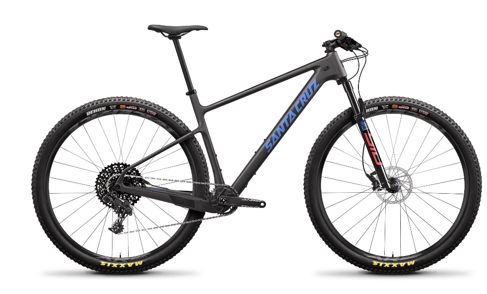
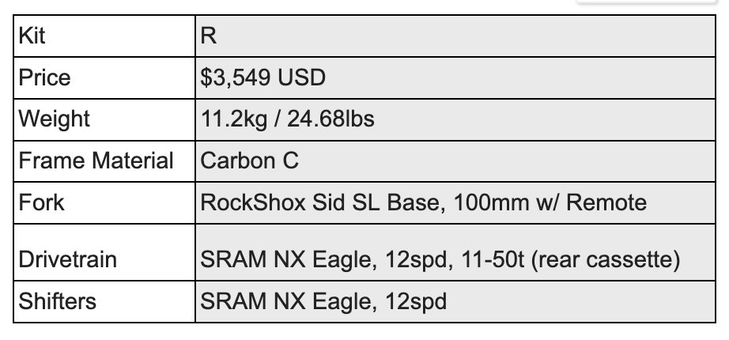

<!--more-->

Review also available on RoadTrailRun
([link](https://www.roadtrailrun.com/2022/09/roadtrailride-santa-cruz-highball-review.html))

<a href="https://www.roadtrailrun.com"
class="button primary button-wrapper">Read All RoadTrailRun
Reviews Here</a>

**Santa Cruz Highball Bike Review** ($3,549)

**Spoiler alert**: I’m a runner. But I started my endurance addiction on
my mountain bike exploring my hometown in high school. While finding
success domestically and internationally on the trails, by foot, I
frequently use bikes for cross training while injured, supplemental
training, and commuting. As a trail runner who has a proclivity for
uphills, I’ve found that riding bikes has significant crossover benefit
for improving cardiovascular fitness and endurance without all of the
pounding. And, it can help build underdeveloped muscles that can
actually improve uphill running economy. 

I recently took the [Santa Cruz
Highball](https://www.santacruzbicycles.com/en-US/bikes/highball)
hardtail mountain bike for a 20 minute test ride and found it to be
fast, stable, and versatile across multiple terrain types and distances.
I specifically sought out the Highball because, on paper and visually,
it seemed like a bike that would suit the type of riding I enjoy -
longer hill climbs, dirt and paved roads, and a small mix of single
track. While it is a capable race bike, it is also an excellent ride for
recreational enthusiasts or cross-training athletes because of the wide
gear range that makes this bike both powerful and efficient through
steep and/or technical climbs, while the long wheelbase provides expert
and novice riders with stability and control on descents. 

## Pros and Cons

**Pros**

- Immediately comfortable ride with all of the features in a hardtail to
  reduce vibration and trail bumpiness 

- The carbon frame and Rock Shox SID front suspension fork create a
  stiff, stable, responsive, and forgiving ride

- Efficient climber thanks to geometry and 1x12 gearing

- Maxxis Aspen TR tires are great on loose dirt and are a great
  all-around tire

**Cons**

- Excellent option for larger riders, but it took a few adjustments for
  my small body frame to find an optimal fit

- Might be too much bike for entry level riders, but it is really fun to
  ride and could inspire a lifelong passion for bikes if they do start
  out on it!

## First Impressions

The first thing that captures my eye on the Highball is the rear seat
stay / seat tube triangle. The compact dimension and angling would make
me think it is optimized for uphill riding. As I expected, the Highball
performs really well on the climbs and does comparably well on rolling
dirt or paved roads. The rear geometry with the seat stays joining the
seat tube below the top tube junction, according to Santa Cruz, is also
intended to keep the rear wheel closer to the ground and minimize trail
bumpiness, giving versatility to the type of terrain the Highball is
able to comfortably navigate. Even though the Highball is a hardtail, it
rides through choppy terrain with forgiveness and grounding thanks to
the rear geometry and carbon frame. Don’t get me wrong, it isn’t a
full-suspension type of forgiveness, but it brings some relief to a bike
that’s only 25 lbs.

  
Tight rear geometry, Maxxis Aspen TR tires, and wide range gearing make
the Highball a climbing machine. 

## Ride

Hardtail mountain bikes can get a bad rap because they can be harsh to
ride. But, they don’t have to be and the Santa Cruz Highball
demonstrates how and why. By dropping the seat stay / seat tube junction
by about 2 inches, the Highball produces a smoother, less bumpy ride
than the old myth suggests.

Rear seat stay / seat tube junction looks a lot like a full suspension
rear, providing excellent compliance for a hardtail.

That said, it isn’t going to prevent a harsh ride altogether, especially
in technical trail sections with tight turns or washboard dirt roads,
but it descends quite well for a hardtail regardless. What I love most
about this bike is its ability to feel good over long distances in
mellow terrain and killer climbing ability. Chalk that up to the
lightweight frame and tight geometry.  I found the Highball to perform
as good (or better) on dirt roads than many gravel bikes out there. The
gearing is perfect for steep, unrelenting climbs. 

The geometry is compact and generates a lot of pop and response on
uphills

## Fit

I’m 5’6” and have a short torso. I would not characterize the fit of the
Santa Cruz Highball as compact. In contrast to other carbon hardtails
like the Pivot LES 2 or the Specialized Epic HT, the Highball has a
longer reach. After a few minor adjustments, I was able to find the
right fit, but it  is definitely well suited for larger framed people.
Notwithstanding, the geometry of the bike puts your body over the
pedals, ensuring optimal pedal position for power and speed. 

Longer reach is great for taller riders, but was more challenging for my
short reach. 

## Specs

## Rating

The Santa Cruz Highball is a fast, stable, long distance mountain bike
that can tackle a variety of terrain. Because it performs well in chossy
technical stuff (i.e. like a “soft” hardtail) with vertical compliance
and can take on long distances (i.e. like a flat bar gravel bike) with
the long wheelbase, it is a great do-it-all bike to have in your quiver.
Moreover, the range of gears on the 1x12 drivetrain ensures no climb is
too steep. 

This bike is suited for endurance enthusiasts to weekend warriors to
serious XC racers. At $3,549 in the base model R / Carbon C, it isn’t
the most budget friendly of hardtails on the market but it comes
equipped with high quality components and (of course) a super
lightweight carbon frame!

Ride - 9/10 (fast, energetic, and compliant on the bumpy stuff)  
Fit - 8.5/10 (points off for longer reach for smaller riders like
myself)  
Specs - 9.5/10 (top quality for their entry level version)  
Fun Factor (out of 5) - 🙌 🙌 🙌 🙌 🙌

Overall Average: 9 / 10

## Tester Profile

**John Tribbia** is a regular technical reviewer for running-oriented
product testing website [RoadTrailRun](http://www.roadtrailrun.com) with
a large readership domestically and internationally. He has other
writing about NAAWK
[Sunscreen](https://naawkblog.wordpress.com/2017/01/03/dont-stow-away-the-sunscreen/),
Thule [Jogging
Strollers](http://www.backcountry.com/explore/dos-and-donts-of-baby-jogging),
Atlas [Snowshoe
Running](http://www.backcountry.com/explore/winter-fitness-snowshoe-running),
and Yuba Cargo E-Bike ([Part
I](https://yubabikes.com/how-to-adopt-the-cargo-bike-lifestyle-step-1/),
[Part
II](https://yubabikes.com/how-to-adopt-the-cargo-bike-lifestyle-step-2/),
[Part
III](https://yubabikes.com/how-to-adopt-the-cargo-bike-lifestyle-step-3/),
[Part
IV](https://yubabikes.com/how-to-adopt-the-cargo-bike-lifestyle-step-4/)). 

He dabbled in bike racing both mountain and road as a junior Cat 5 and
eventually upgraded to Expert on the mountain bike. After his brief
stint of cycling racing and once in college, John crossed over to
running and found success as a sponsored mountain/trail runner by
placing atop the podium in domestic and international races. But he
always kept his bikes nearby for cross training while injured,
supplemental training, and commuting. Given that cross-over experience
as well as 6+ years of working at [University
Bikes](https://www.ubikes.com/) in Boulder, CO and over 20 years of
competitive running, he loves the opportunity to test the latest and
greatest in both sports. 
