<!--more-->

*Article by John Tribbia*

Original Post from RoadTrailRun
([link](https://www.roadtrailrun.com/2025/12/saucony-ride-19-multi-tester-review.html))

<a href="https://www.roadtrailrun.com"
class="button primary button-wrapper">Read All RoadTrailRun
Reviews Here</a>

### Saucony Ride 19 ($140)

### Introduction

John: The Saucony Ride series has long been a workhorse in the daily trainer category, and with the Ride 19, Saucony promises their most comfortable iteration yet. According to Saucony, this “do-it-all, core neutral shoe is lighter, softer, and more responsive than ever before, making it your perfect partner for every run, every walk, and wherever the day takes you.”
After logging miles on both roads and easy trails in the Ride 19, I can confirm that Saucony has indeed delivered a solid shoe here. The reformulated PWRRUN+ foam delivers a noticeably soft ride while maintaining the responsiveness that makes this shoe versatile enough for everything from recovery jogs to uptempo efforts. At 8.9oz in my men's size 9, the Ride 19 hits a sweet spot for weight in the daily trainer category - substantial enough to handle high mileage but not feeling like a clunker.

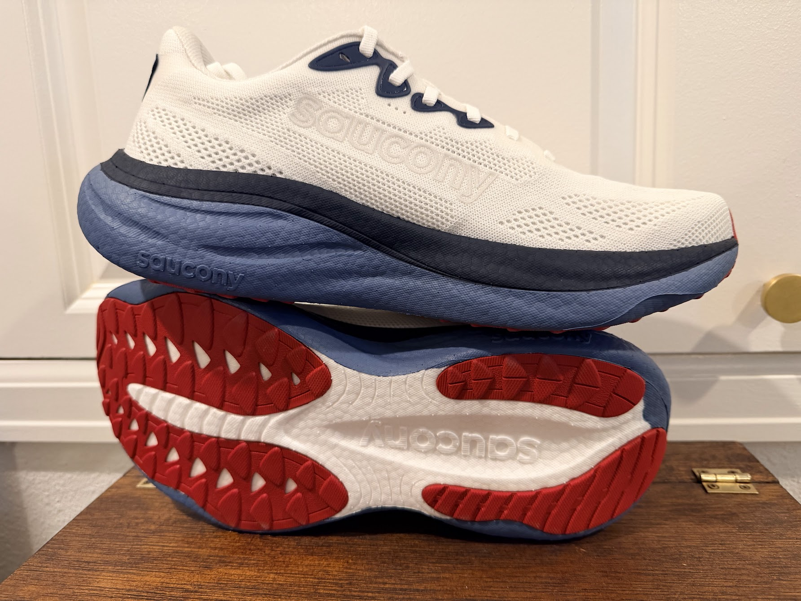

The Ride 19 sits squarely in Saucony's neutral daily trainer lineup, designed for runners who want a single shoe that can handle the variety of paces and surfaces that come with everyday training. Saucony positions this as a “core neutral” option with an 8mm offset (36mm heel/28mm forefoot), traditional SRS sockliner, and their SCF PWRRUN+ cushioning system.
The $140 MSRP puts it in competitive territory with other established daily trainers, and Saucony touts that this style is vegan and contains recycled materials for sustainability-minded runners.
Ben: The Saucony Ride arrived at my doorstep and I was eager to see where the brand was taking this reliable daily trainer.
The good news for fans of the Ride: This trusted workhorse remains exactly that: solid, comfortable, and understated.
The not-so-good news: There are so many other available daily trainers these days. Is this interesting and exciting enough to stack up against competitors? My first run went well.

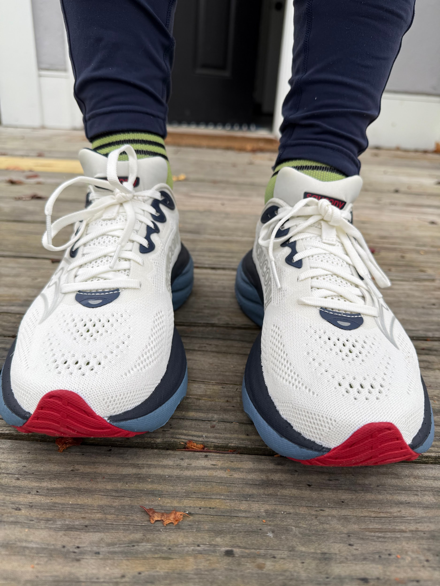

My size 9 fit well, with ample room in the toebox, possibly too much room for some. I would be tempted to size down to an 8.5 if they were to assume a regular place in my rotation. There’s significant padding around the heel, which helps with the comfort level and helps firm up its identity as a daily trainer (and thus not a speedster).

### Pros:

- Lightweight and 13g drop in weight from v18 on a broader platform (Ben / John)
- Breathable upper (Ben / John)
- Even has some light trails/gravel capabilities due to outsole (John)
- Great value at $140 (Ben / John)

### Cons:

- Not significant stack (Ben)
- No real ‘wow’ factor (Ben / John)

### Stats

- Spec. Weight: men's 8.9 oz / 255 g US9 women’s  7.7 oz / 220g US8
- Sample Weight: men’s  8.9 oz / 252g US (v18: 9.35oz / 265g US8.5)
- Stack Height:  36mm heel /  28mm forefoot
- Platform Width:
    - V19: 90mm heel /  70mm midfoot  / 120mm forefoot
    - V18: 90mm heel / 70mm midfoot / 110mm forefoot

### First Impressions, Fit and Upper

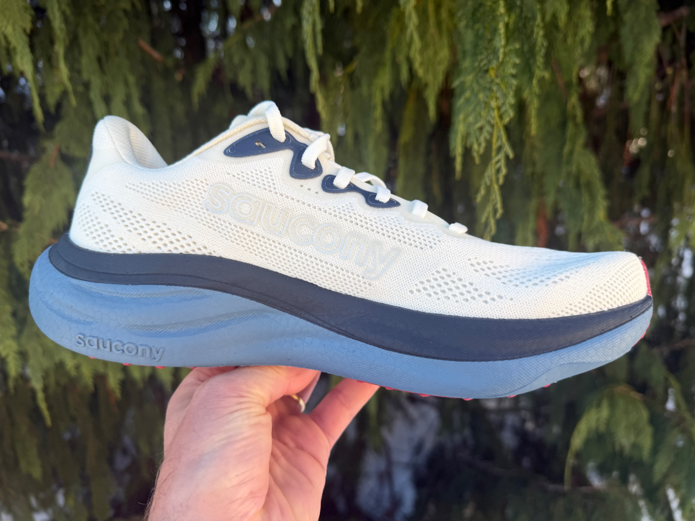

John: Right out of the box, the Ride 19 presents as a clean, modern daily trainer without unnecessary flash. The engineered mesh upper immediately caught my attention - it's substantially open and breathable. Saucony says the upper offers “enhanced breathability and stretch for a more inclusive fit,” and I'd agree with that assessment. The mesh has a soft, almost sock-like quality against the foot while still providing structure where needed.

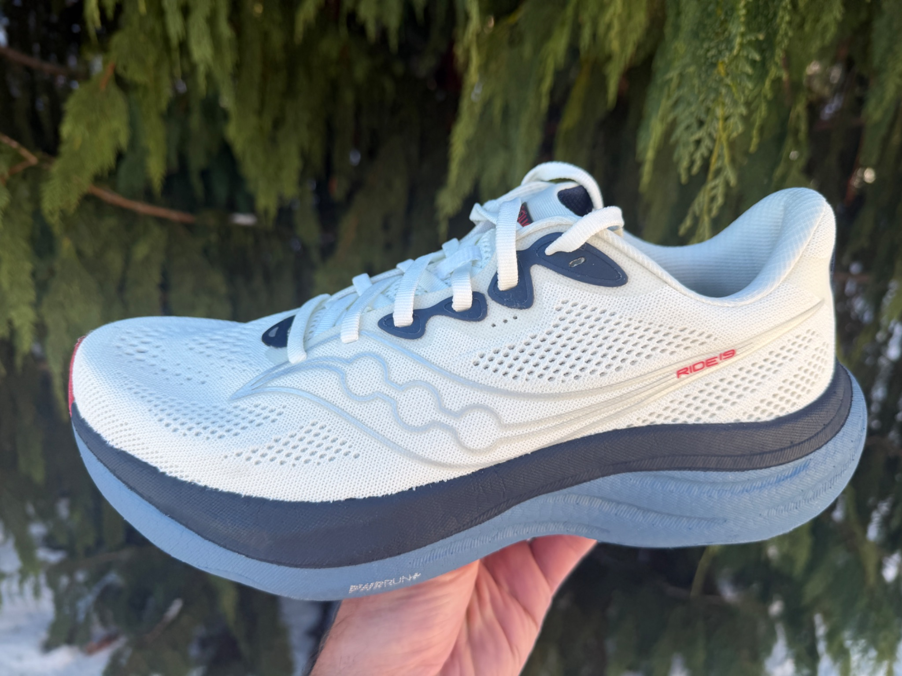

The fit runs true to size for me in my usual 9, with a comfortably snug midfoot that doesn’t feel constricting and a toe box with adequate room for splay during toe-off. The heel collar cushioning is plush without being excessive, and I appreciated the added padding here during longer runs.

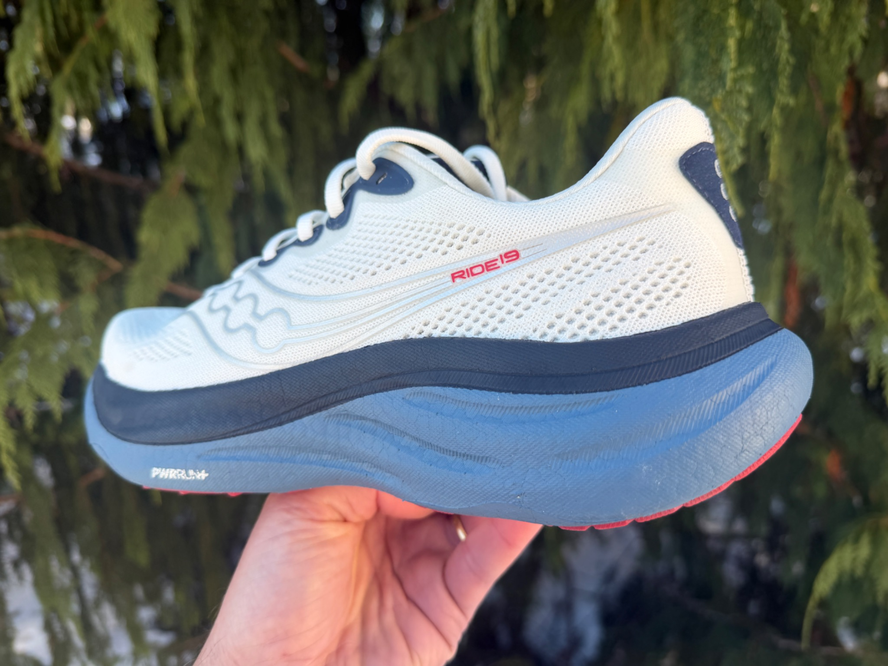

That blue wavy pattern you see running down the heel isn't just decorative - it’s part of the adaptive upper structure that provides a secure lockdown.

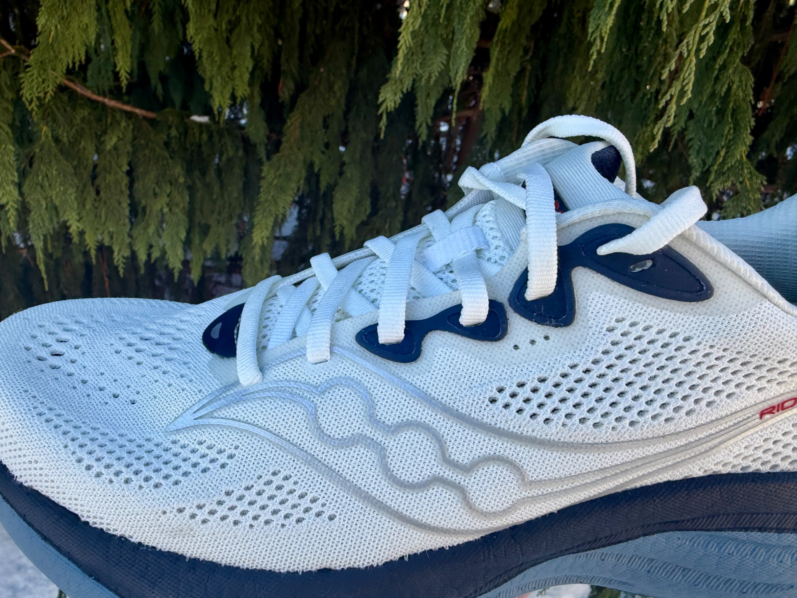

One detail worth noting: the tongue is well-padded and stays centered throughout my runs, with no migration or pressure points from the laces. The laces themselves are round and hold tension well without requiring double-knotting.
The upper’s stretch and breathability became particularly apparent during humid morning runs where my feet appreciated the airflow. On easy trail sections with light debris, the mesh proved durable enough to resist abrasion, though I wouldn’t call this a trail shoe by any means.
Ben: My first run went well enough, though certainly not spectacular or overly memorable. Then again, that’s not why you buy the Ride.

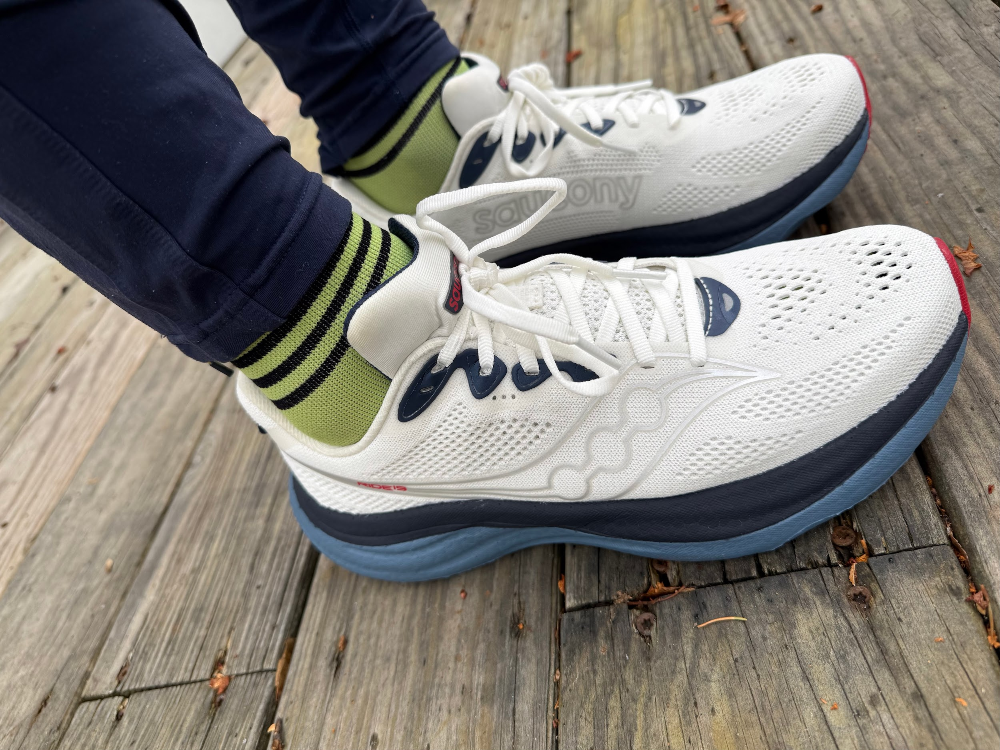

My size 9 fit well, with ample room in the toebox, possibly too much room for some. I would be tempted to size down to an 8.5 if they were to assume a regular place in my rotation. There’s significant, plush padding around the heel, which helps with the comfort level and further confirms its identity as a daily trainer (and thus not a speedster). As John notes, the upper is plenty breathable and offers good flex. The entirety of the shoe reads clean, simple and easy going.

### Midsole & Platform

John: The heart of the Ride 19 is Saucony’s reformulated PWRRUN+ foam, which the brand claims is “lighter, softer, and more responsive” with “increased energy return with every step, thanks to more foam underfoot.” as we now have a 10mm wider forefoot yet lose 13g in weight.
Having never run in previous iterations, I can’t confirm this feels like a meaningful step forward in softness, but I can vouch that the cushion is noticeable without sacrificing the peppy response.
The stack heights are substantial without being maximal - 36mm in the heel and 28mm in the forefoot create that 8mm offset. This is a comfortable middle ground that provides ample cushioning for longer efforts while maintaining enough ground feel to pick up the pace when needed. The geometry feels balanced and stable underfoot.
What impressed me most about the midsole is its versatility across paces. At an easy recovery pace (9:00-9:30/mile for me), the PWRRUN+ feels plush and forgiving, absorbing impact without feeling mushy or disconnected. Push the pace down to faster efforts (5:30-7:30/mile), and the foam firms up just enough to provide a responsive platform without bottoming out. I didn’t experience any of the “dead” feeling that some softer foams exhibit when you try to move quickly.
The platform width strikes a nice balance - not overly wide like some stability shoes, but with enough base to feel planted during footstrike with its broad 90mm heel, narrowish 70mm midfoot and very broad forefoot at 120mm, an increase up front of 10mm over the v18..
The sidewalls show good compression resistance, and I never felt like I was rolling off the platform even during slightly uneven trail sections.
Ben: The reliable PWRRUN+ foam offers some good responsiveness. The shoe has some spring to it as a result, though - by design - not as much as some other Saucony models, such as the Speed.
The increased foam here does offer increased energy return, though I am not sure it is ready to compete with the Novablast or the Vomero, let alone the Vomero Plus. The platform is wide enough and certainly stable. I felt very secure around corners and on uneven roads.
This is a cruiser that runs really nicely at moderate paces and can be brought up to greater speeds in doses. It’s a long run or easy run option that will work well for those who have been adherents of this shoe in the past.

### Outsole

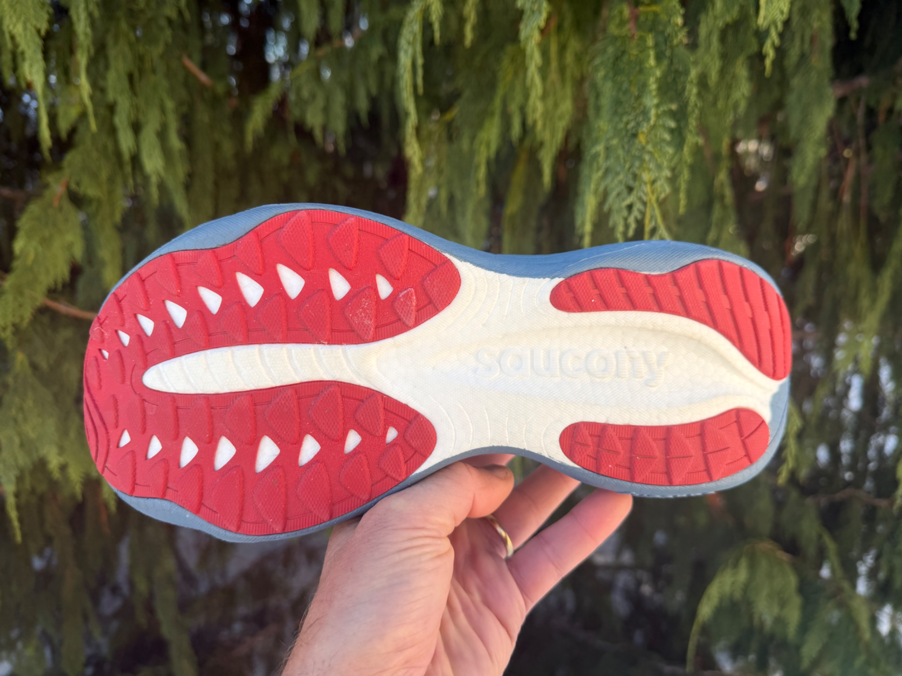

John: Based on my research, the outsole is where Saucony made some thoughtful updates that directly impact the ride quality, v18 outsole shown below.

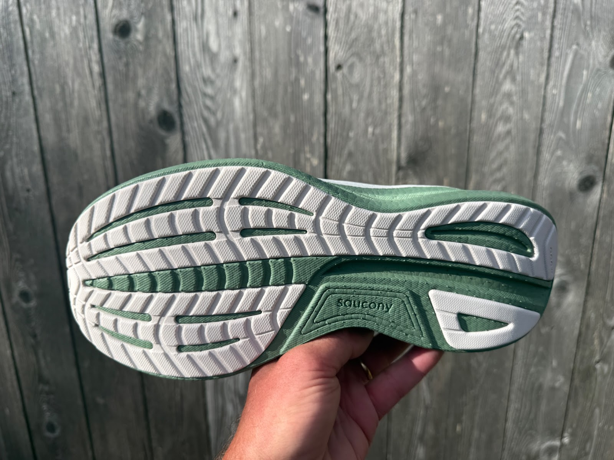

According to the brand, there's “improved durability and grip with more rubber in the forefoot and added flex grooves for smooth transitions.”.
The rubber coverage is strategic rather than full-coverage, with durable rubber concentrated in high-wear zones - particularly the lateral heel strike area and the forefoot push-off zone. The exposed midsole foam in the midfoot isn’t a durability concern in my experience; it actually allows the midsole to compress and rebound more naturally while keeping weight down.

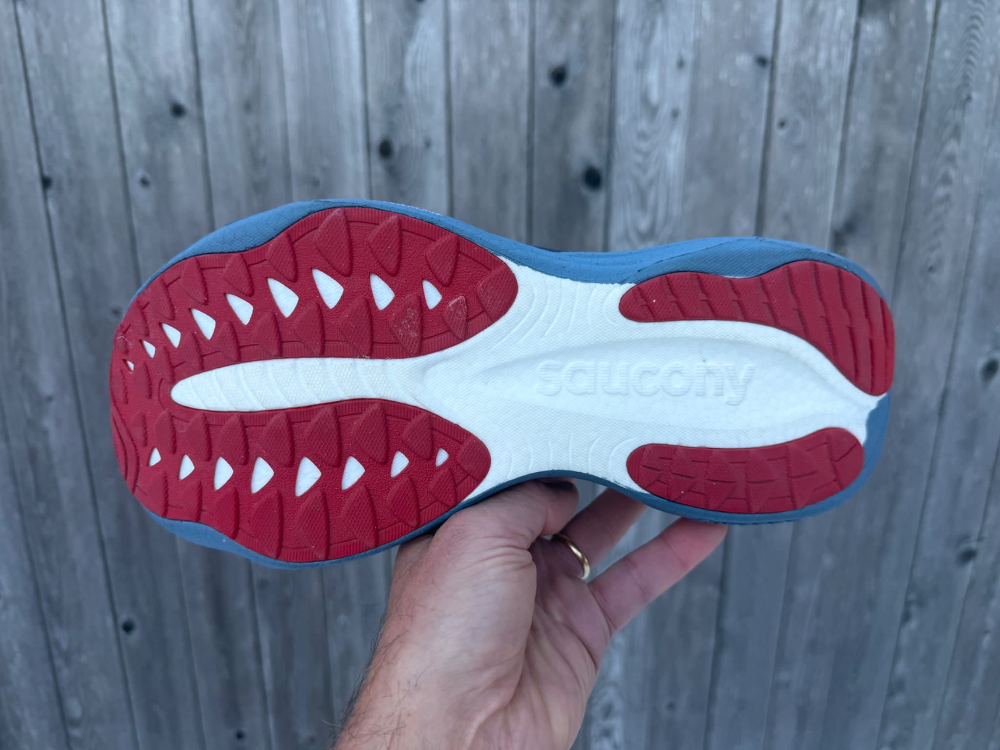

Those flex grooves Saucony mentions are positioned anatomically across the forefoot, and they genuinely enhance the transition from midstance through toe-off. The grooves allow the forefoot to articulate naturally without the stiff, clunky feeling you sometimes get with heavily cushioned trainers. Combined with the mild rocker geometry, the Ride 19 rolls through the gait cycle smoothly at any pace.
On roads, the outsole provides a confident grip on both dry and damp pavement. On the easy trail sections I tested - packed dirt, hard-packed gravel, and some small rocks - the Ride 19 handled them admirably.

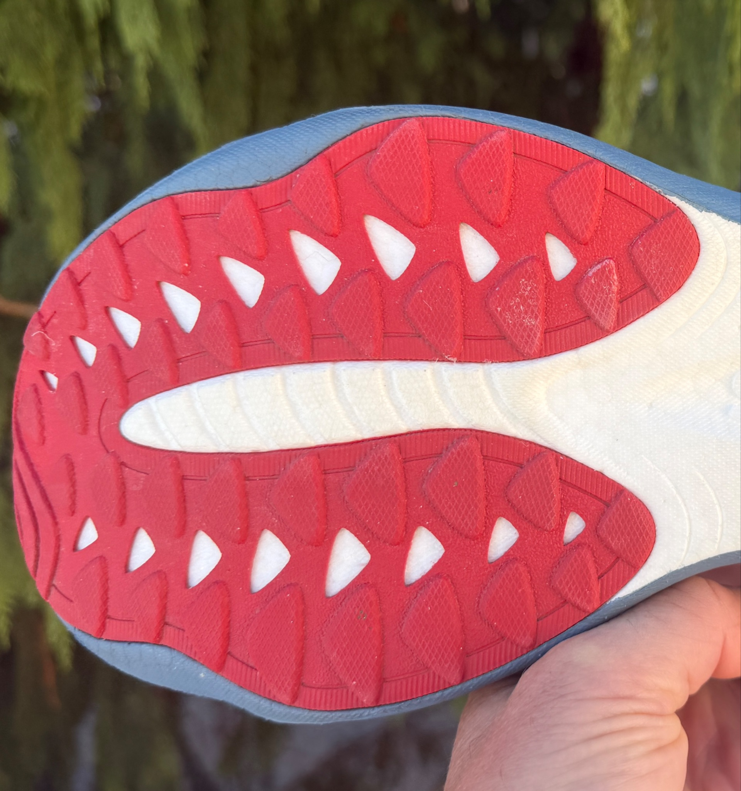

The forefoot lugs are shallow but effective enough for maintained trails. I wouldn't take these on technical terrain or muddy conditions, but for runners who mix in greenway trails or towpaths, they’re perfectly capable.
Ben: I agree with John that the outsole is one of the Ride’s highlights. The coverage is really good and highly reliable. It feels durable and adds to the simple smoothness of the shoe’s ride (the ride’s Ride, as it were). It helps with toe-off and with a rather effortless transition. I would also say that the outsole will allow the shoe to run well in the winter months when surfaces are slick, wet or less trustworthy.

### Ride, Conclusions and Recommendations

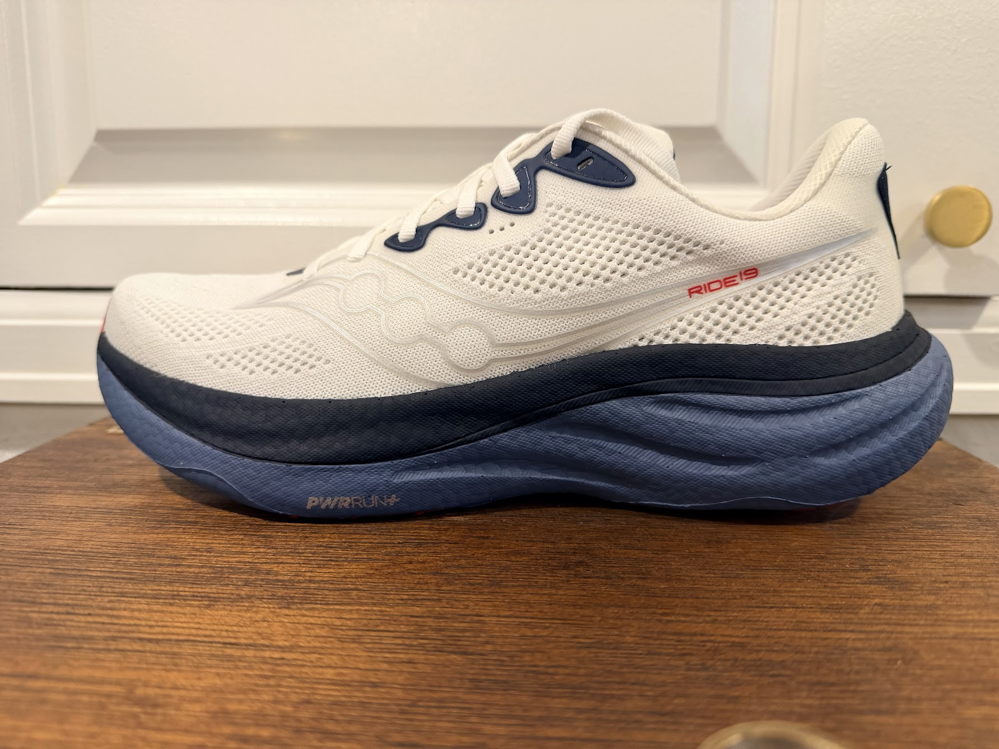

John: Out on the road, the Ride 19 delivers exactly what Saucony promises: a comfortable, versatile daily trainer that adapts to whatever you throw at it. The ride character is balanced. It is neither overly soft and protective nor firm and aggressive.
The PWRRUN+ foam is the star. It provides a soft landing while maintaining enough responsiveness to handle faster paces without protest. The energy return isn’t explosive like a carbon-plated racer, but there’s a subtle bounce that keeps your legs feeling fresh deeper into runs. Whether I’m shuffling through an easy recovery run or clicking off faster miles, the shoe never fights me, it just rolls forward efficiently.
On easy trail excursions, the Ride 19 proved more capable than I expected. The outsole grip handled packed surfaces well, and the midsole cushioning absorbed trail chatter from small rocks and roots. The upper's structure provided enough support to handle slightly uneven terrain without feeling floppy. That said, this is still fundamentally a road shoe, and I wouldn't recommend it as a primary trail option.
At $140, the Ride 19 delivers solid value in the crowded daily trainer category. The soft foam, thoughtful and versatile outsole, and comfortable upper combine to create a package that just works for the miles that make up the bulk of most training plans. For runners seeking a reliable, comfortable workhorse that can handle whatever the training week brings, the Ride 19 deserves serious consideration.

### John's Score 8.5 / 10

- Ride: 8.5 - Smooth, responsive, versatile daily workhorse
- Fit: 8.5 - True size, secure, breathable upper
- Value: 8.5 - Quality materials, solid mileage durability
- Style: 8.5 - Clean classic look, great colorway
- Smiles: 😊😊😊😊

Ben: The Ride is a reliable, straightforward daily trainer that will hold up for miles and miles of easy runs. This will work for beginner runners and those with more experience on the roads.
While not flashy, it is light and relatively responsive, all in an affordable package.
The outsole is stellar and will work well in almost any weather.
Those who have relied on the Ride in the past will embrace this model, while others may want to give it a try.

### Ben’s Score: 8.8/10

Smiles: 😊😊😊😊

### 5 Comparisons

### ASICS NovaBlast 5

Ben: The ASICS daily trainer is more lively and responsive, with great lockdown. At a mere $10 more and slightly lighter, it would be hard to argue that it’s not the better shoe all around.

### Nike Vomero 18

Ben: The new Vomero is much livelier than the Ride 19 but also considerably heavier. That said, the Vomero is likely the more versatile shoe, ready to pick up the pace more willingly than the Ride. It’s also portends to be quite durable, like the Ride. This will be all about preference, but the Vomero likely offers better value.

### Hoka Clifton 10 

Ben: Like the Vomero 18, the Clifton 10 is a versatile shoe when compared to the Ride, both ready to go long, ready for a recovery day and/or ready to pick up the pace in doses. The Clifton, like the Vomero, is both heavier and more expensive than the Ride. As above, my feeling is that the Hoka offers better value in the long run.

### Mizuno Wave Rider 29

John: The Ride 19 and Wave Rider 29 occupy similar territory as versatile daily trainers, but deliver distinctly different ride characters. The Rider 29's Enerzy NXT foam provides a firmer, more energetic platform with a snappier toe-off, while the Ride 19's PWRRUN+ leans softer and more forgiving - making the Saucony the better choice for recovery miles and the Mizuno more engaging for uptempo work.

### Brooks Adrenaline GTS 25

John:  While the Ride 19 is a neutral trainer, the Adrenaline GTS 25 is Brooks’ go-to stability shoe with GuideRails technology to combat overpronation - making this an apples-to-oranges comparison for most runners. That said, neutral runners considering the Adrenaline for its plush ride should know the Ride 19 delivers comparable softness and comfort at a lighter weight without the structured support features. If you’re a neutral runner who doesn’t need stability intervention, the Ride 19 offers a more nimble, responsive ride at a similar price point.