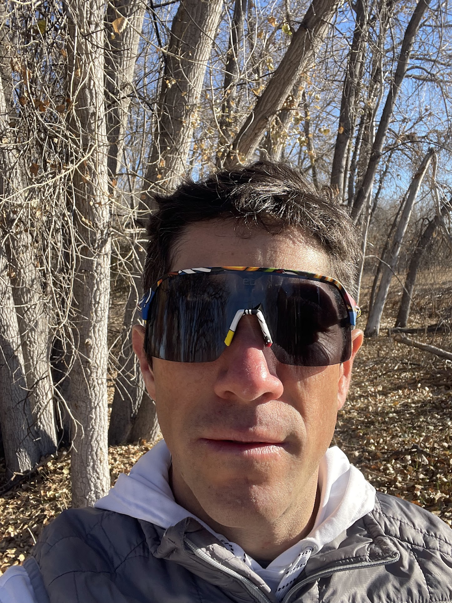
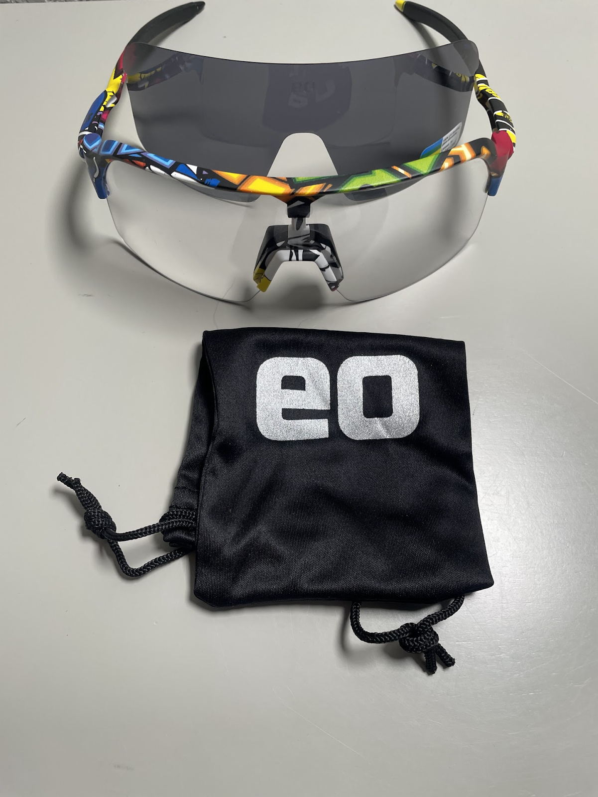
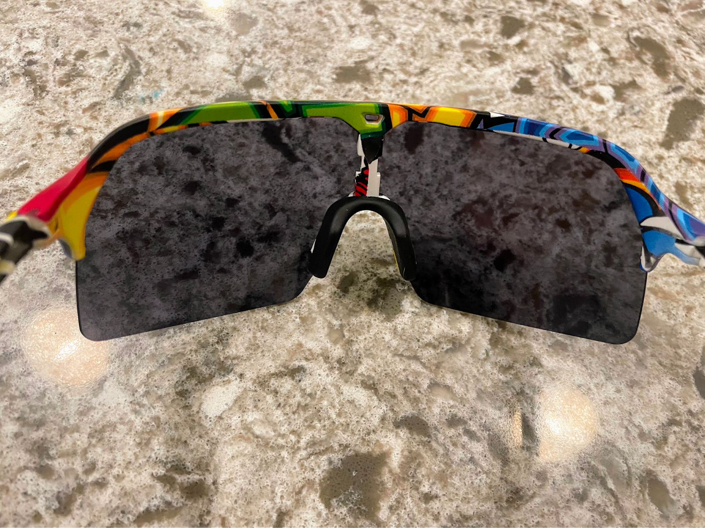

<!--more-->

For those of us who can't decide between sunrise trail runs and midday
cycling sprints, finding the right pair of sunglasses can feel like a
never-ending quest. And that's exactly why I was eager to test out the
[Eastern Outer Short Fuse with Photochromic
Lens](https://easternouter.com/collections/bike-and-run-performance-sunglasses/products/short-fuse-photochromic-light-adaptive-lens)
($65). After weeks of running and biking with these adaptable shades,
here's what I discovered.

## Adaptive All-Star

The star of the show is undoubtedly the photochromic lens. Starting my
runs in the pre-dawn gray, I was initially skeptical of the slightly
tinted lens. However, as the sun began to become more intense, the magic
unfolded. The lens seamlessly transitioned to a darker shade, keeping my
eyes comfortable without any need to switch out lenses. This
adaptability continued throughout the day, offering optimal clarity
under the midday sun and adjusting back to a lighter tint as dusk
approached.

Thanks for reading Boulder Gear Lab! Subscribe for free to receive new
posts and support my work.

## Lightweight Champion

When it comes to athletic sunglasses, comfort and weight are crucial.
The Short Fuse frame is incredibly lightweight, almost disappearing on
my face. The barely-there feeling remained consistent even during long
sweaty rides, with no pressure points or slippage.

## Vision and Ventilation

Eastern Outer's signature wide frame design offered a clear,
unobstructed view of the path ahead, while the side vents ensured
excellent airflow, preventing any lens fogging despite my energetic
efforts.

## Grippy and Secure

The grippy rubber nose pads and temple tips prevented any unwanted
sliding, even when I was pushing my limits on rough terrain. The
sunglasses stayed securely in place, allowing me to focus on the task at
hand.

## Subtle Style

While the Short Fuse prioritizes functionality, it doesn't compromise on
style. The minimalist design is sleek and understated, offering a touch
of sophistication to any outdoor adventure. As an added bonus, the color
pattern is unique to each frame meaning no two Short Fuse's are the
same!

## Final Verdict

The Eastern Outer Short Fuse with Photochromic Lens excels at being the
ultimate adaptable companion. It seamlessly transitions through changing
light conditions, offering optimal clarity and comfort throughout the
day. Its lightweight design, ventilation, and secure fit make it a joy
to wear for both running and cycling. Not to mention, I love that the
glasses come with interchangeable clear and photochromic lenses. So, if
you're searching for one pair of sunglasses to conquer your diverse
outdoor pursuits, the Short Fuse is a clear winner.

Thanks for reading Boulder Gear Lab! Subscribe for free to receive new
posts and support my work.
